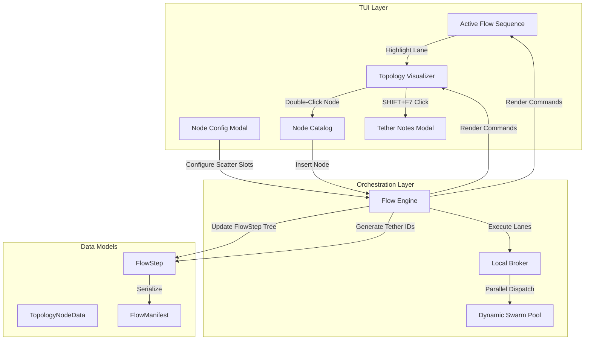
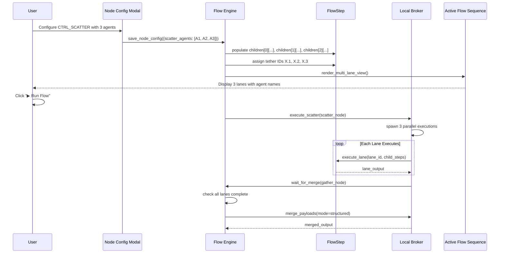
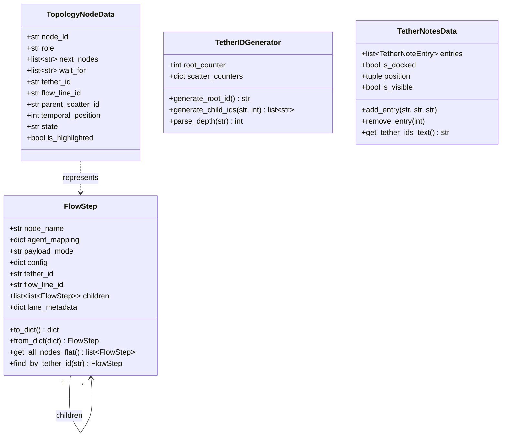
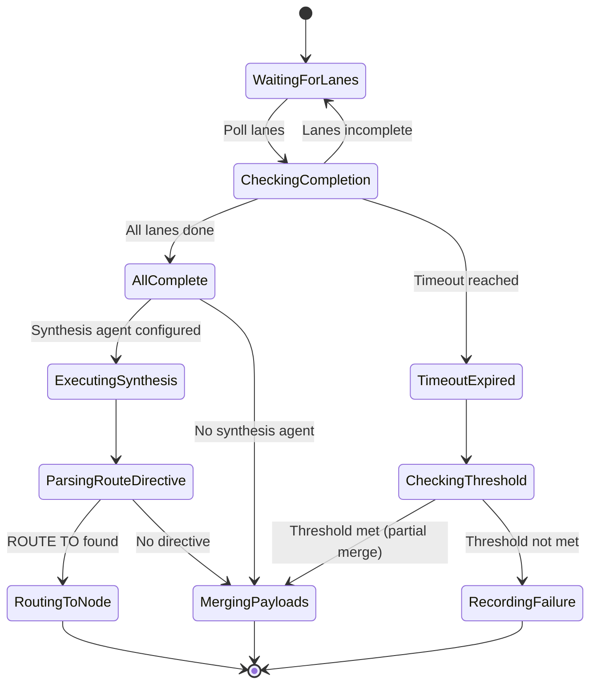

# Technical Design Document: Phase 6.13 — Multi-Flow-Lane Authoring & Visualization

## Overview

Phase 6.13 extends MACCRE's parallel scatter execution (Phase 6.12) with multi-lane topology authoring, visualization, and referencing capabilities. This design enables users to author heterogeneous per-lane topologies where each CTRL_SCATTER branch executes different node sequences, visualize parallel lanes with varying temporal lengths, and reference nodes across lanes via hierarchical tether IDs.

### Key Design Goals

1. **Heterogeneous Lane Authoring**: Enable per-lane node insertion between CTRL_SCATTER and gather nodes
2. **Hierarchical Tether IDs**: Implement `X → X.1, X.2, X.3` naming scheme for flow line identification
3. **Multi-Lane Visualization**: Expand Active Flow Sequence vertically to show all parallel lanes
4. **Temporal Alignment**: Display dashed fillers for heterogeneous lane lengths
5. **Wait-All Merge Logic**: Enhance gather nodes to wait for all upstream lanes with timeout/fallback
6. **Nested Scatter Support**: Allow scatter-within-scatter until system limits (depth 3, max 64 lanes)
7. **Backward Compatibility**: Support pre-6.13 flows without tether IDs or child lane structures

---

## Architecture

### Component Interaction Overview



### Data Flow: CTRL_SCATTER Configuration to Multi-Lane Execution



---

## Data Models

### Enhanced FlowStep

**File**: `maccre_core/orchestration/flow_engine.py`

```python
@dataclass
class FlowStep:
    """Represents one step in a flow execution, potentially with child lanes."""
    
    # Existing fields (Phase 6.12 and earlier)
    node_name: str
    agent_mapping: dict[str, str]  # {role: agent_name}
    payload_mode: str  # "structured" | "concat"
    config: dict  # Node-specific configuration
    tether_id: str | None = None  # NEW: Hierarchical identifier
    flow_line_id: str | None = None  # NEW: Which flow line this step belongs to
    
    # NEW: Multi-lane support
    children: list[list["FlowStep"]] = field(default_factory=list)
    lane_metadata: dict[int, dict] = field(default_factory=dict)
    # lane_metadata structure: {
    #   0: {"agent_name": "ResearchAgent", "custom_name": "Research.X.1", "tether_id": "X.1"},
    #   1: {"agent_name": "AnalysisAgent", "custom_name": "Analysis.X.2", "tether_id": "X.2"},
    # }
    
    def to_dict(self) -> dict:
        """Serialize FlowStep to JSON, including child lanes."""
        result = {
            "node_name": self.node_name,
            "agent_mapping": self.agent_mapping,
            "payload_mode": self.payload_mode,
            "config": self.config,
            "tether_id": self.tether_id,
            "flow_line_id": self.flow_line_id,
            "lane_metadata": self.lane_metadata,
        }
        
        if self.children:
            result["children"] = [
                [step.to_dict() for step in lane]
                for lane in self.children
            ]
        
        return result
    
    @classmethod
    def from_dict(cls, data: dict) -> "FlowStep":
        """Deserialize FlowStep from JSON, including child lanes."""
        children_data = data.get("children", [])
        children = [
            [cls.from_dict(step_data) for step_data in lane]
            for lane in children_data
        ]
        
        return cls(
            node_name=data["node_name"],
            agent_mapping=data["agent_mapping"],
            payload_mode=data["payload_mode"],
            config=data["config"],
            tether_id=data.get("tether_id"),
            flow_line_id=data.get("flow_line_id"),
            children=children,
            lane_metadata=data.get("lane_metadata", {}),
        )
    
    def get_all_nodes_flat(self) -> list["FlowStep"]:
        """Return all nodes in this subtree as a flat list (DFS traversal)."""
        result = [self]
        for lane in self.children:
            for step in lane:
                result.extend(step.get_all_nodes_flat())
        return result
    
    def find_by_tether_id(self, tether_id: str) -> "FlowStep | None":
        """Find a FlowStep by its tether ID (recursive search)."""
        if self.tether_id == tether_id:
            return self
        for lane in self.children:
            for step in lane:
                found = step.find_by_tether_id(tether_id)
                if found:
                    return found
        return None
```

### Enhanced TopologyNodeData

**File**: `maccre_core/orchestration/flow_engine.py`

```python
@dataclass
class TopologyNodeData:
    """Represents one node in the topology visualization."""
    
    node_id: str
    role: str  # MacroNode type (e.g., "DET_REVIEW", "CTRL_SCATTER")
    next_nodes: list[str]  # List of node IDs this node can route to
    wait_for: list[str]  # NEW: List of tether IDs this node waits for (gather nodes)
    tether_id: str | None = None  # NEW: Hierarchical flow line identifier
    flow_line_id: str | None = None  # NEW: Which flow line this belongs to
    parent_scatter_id: str | None = None  # NEW: Tether ID of parent CTRL_SCATTER
    temporal_position: int | None = None  # NEW: Sequential position within flow line
    
    # Visualization metadata
    state: str = "PENDING"  # "PENDING" | "ACTIVE" | "COMPLETE" | "FAILED"
    is_highlighted: bool = False  # NEW: For double-click selection
```

### TetherNotesData

**File**: `maccre_tui/models/tether_notes.py` (NEW)

```python
@dataclass
class TetherNoteEntry:
    """One entry in the tether notes modal."""
    node_name: str
    tether_id: str
    flow_line_id: str
    timestamp: float
    
@dataclass
class TetherNotesData:
    """State for the floating tether notes modal."""
    entries: list[TetherNoteEntry] = field(default_factory=list)
    is_docked: bool = False
    position: tuple[int, int] = (10, 10)  # (x, y) in terminal cells
    is_visible: bool = False
    
    def add_entry(self, node_name: str, tether_id: str, flow_line_id: str):
        """Add a new note entry."""
        self.entries.append(TetherNoteEntry(
            node_name=node_name,
            tether_id=tether_id,
            flow_line_id=flow_line_id,
            timestamp=time.time(),
        ))
    
    def remove_entry(self, index: int):
        """Remove a note entry by index."""
        if 0 <= index < len(self.entries):
            self.entries.pop(index)
    
    def get_tether_ids_text(self) -> str:
        """Get all tether IDs as newline-separated text for clipboard."""
        return "\n".join(entry.tether_id for entry in self.entries)
```

---

## Algorithms

### Tether ID Generation Algorithm

**File**: `maccre_core/orchestration/flow_engine.py`

```python
class TetherIDGenerator:
    """Generates hierarchical tether IDs for flow lines."""
    
    def __init__(self):
        self.root_counter = 0
        self.scatter_counters: dict[str, int] = {}
    
    def generate_root_id(self) -> str:
        """Generate a root tether ID (e.g., 'X', 'Y', 'Z')."""
        tether_id = chr(ord('X') + self.root_counter)
        self.root_counter += 1
        return tether_id
    
    def generate_child_ids(self, parent_tether_id: str, count: int) -> list[str]:
        """Generate child tether IDs for scatter lanes.
        
        Args:
            parent_tether_id: The tether ID of the CTRL_SCATTER node (e.g., 'X')
            count: Number of scatter lanes
            
        Returns:
            List of child tether IDs (e.g., ['X.1', 'X.2', 'X.3'])
        """
        if parent_tether_id not in self.scatter_counters:
            self.scatter_counters[parent_tether_id] = 0
        
        child_ids = []
        for i in range(count):
            child_id = f"{parent_tether_id}.{i + 1}"
            child_ids.append(child_id)
        
        return child_ids
    
    def parse_depth(self, tether_id: str) -> int:
        """Calculate nesting depth from tether ID.
        
        Examples:
            'X' -> 0
            'X.1' -> 1
            'X.1.2' -> 2
        """
        return tether_id.count('.')
```

### Wait-All Merge Algorithm with Fallback

**File**: `maccre_core/orchestration/local_broker.py`

```python
class GatherNodeExecutor:
    """Handles execution logic for gather nodes (MERGE, CONCAT, BRANCH)."""
    
    async def execute_gather(
        self,
        gather_node: FlowStep,
        upstream_lanes: list[str],  # List of tether IDs feeding into this gather
        timeout_seconds: float | None = None,
        partial_threshold: float = 1.0,  # Default 100% = wait-all
    ) -> dict:
        """Execute a gather node with wait-all and fallback logic.
        
        Args:
            gather_node: The CTRL_MERGE/CONCAT/BRANCH node
            upstream_lanes: Tether IDs of lanes that must complete before merge
            timeout_seconds: Optional timeout (None = wait indefinitely)
            partial_threshold: % of lanes required (0.0-1.0, 1.0 = all lanes)
            
        Returns:
            Merged payload dict
        """
        start_time = time.time()
        completed_lanes = set()
        lane_outputs = {}
        
        # Wait for lanes to complete
        while True:
            # Check completion status
            for lane_id in upstream_lanes:
                if lane_id not in completed_lanes:
                    lane_state = await self.check_lane_state(lane_id)
                    if lane_state.status == "COMPLETE":
                        completed_lanes.add(lane_id)
                        lane_outputs[lane_id] = lane_state.output
                    elif lane_state.status == "FAILED":
                        logger.warning(f"Lane {lane_id} failed during gather")
                        completed_lanes.add(lane_id)  # Count as "done"
                        lane_outputs[lane_id] = {"error": lane_state.error}
            
            # Check completion conditions
            completion_ratio = len(completed_lanes) / len(upstream_lanes)
            
            if completion_ratio >= partial_threshold:
                # Sufficient lanes completed
                logger.info(
                    f"Gather node {gather_node.tether_id}: "
                    f"{len(completed_lanes)}/{len(upstream_lanes)} lanes complete"
                )
                break
            
            # Check timeout
            if timeout_seconds is not None:
                elapsed = time.time() - start_time
                if elapsed >= timeout_seconds:
                    logger.warning(
                        f"Gather node {gather_node.tether_id} timed out after {elapsed:.1f}s. "
                        f"Proceeding with {len(completed_lanes)}/{len(upstream_lanes)} lanes."
                    )
                    # Record telemetry
                    await self.record_gather_timeout(
                        gather_node.tether_id,
                        completed_lanes,
                        set(upstream_lanes) - completed_lanes,
                        elapsed,
                    )
                    break
            
            # Brief sleep to avoid busy-waiting
            await asyncio.sleep(0.1)
        
        # Merge outputs based on merge mode
        merge_mode = gather_node.config.get("merge_mode", "structured")
        if merge_mode == "structured":
            return self.merge_structured(lane_outputs, upstream_lanes)
        elif merge_mode == "concat":
            delimiter = gather_node.config.get("delimiter", "\n---\n")
            return self.merge_concat(lane_outputs, upstream_lanes, delimiter)
        else:
            raise ValueError(f"Unknown merge mode: {merge_mode}")
    
    def merge_structured(
        self,
        lane_outputs: dict[str, dict],
        expected_lanes: list[str],
    ) -> dict:
        """Merge lane outputs as structured JSON."""
        merged = {}
        for lane_id in expected_lanes:
            if lane_id in lane_outputs:
                merged[lane_id] = lane_outputs[lane_id]
            else:
                # Lane did not complete
                merged[lane_id] = {"status": "incomplete"}
        return merged
    
    def merge_concat(
        self,
        lane_outputs: dict[str, dict],
        expected_lanes: list[str],
        delimiter: str,
    ) -> dict:
        """Merge lane outputs as concatenated text."""
        parts = []
        for lane_id in expected_lanes:
            if lane_id in lane_outputs:
                output = lane_outputs[lane_id]
                # Extract text content (assume 'response' or 'output' key)
                text = output.get("response", output.get("output", str(output)))
                parts.append(text)
        
        return {"merged_output": delimiter.join(parts)}
```

### Per-Lane Node Insertion Algorithm

**File**: `maccre_core/orchestration/flow_engine.py`

```python
class FlowEngine:
    """Core flow orchestration engine with multi-lane support."""
    
    def insert_node_after_highlighted(
        self,
        target_tether_id: str,
        new_node_name: str,
        new_node_config: dict,
    ) -> FlowStep:
        """Insert a new node immediately after the highlighted node.
        
        Args:
            target_tether_id: Tether ID of the highlighted node
            new_node_name: MacroNode type to insert
            new_node_config: Configuration for the new node
            
        Returns:
            The newly created FlowStep
            
        Raises:
            ValueError: If target node is outside scatter→merge boundaries
        """
        # Find the target node
        target_node = self.root_step.find_by_tether_id(target_tether_id)
        if target_node is None:
            raise ValueError(f"Node with tether ID {target_tether_id} not found")
        
        # Validate insertion context
        if not self._is_within_scatter_merge_boundary(target_node):
            raise ValueError(
                "Cannot insert outside scatter→merge boundaries. "
                f"Node {target_tether_id} is not between CTRL_SCATTER and gather node."
            )
        
        # Determine flow line and lane index
        flow_line_id = target_node.flow_line_id
        parent_scatter = self._find_parent_scatter(target_node)
        if parent_scatter is None:
            raise ValueError(f"Could not find parent CTRL_SCATTER for {target_tether_id}")
        
        lane_index = self._get_lane_index(parent_scatter, target_node)
        
        # Create new FlowStep with inherited tether ID
        new_step = FlowStep(
            node_name=new_node_name,
            agent_mapping=new_node_config.get("agent_mapping", {}),
            payload_mode=new_node_config.get("payload_mode", "structured"),
            config=new_node_config,
            tether_id=flow_line_id,  # Inherit parent lane's tether
            flow_line_id=flow_line_id,
        )
        
        # Insert into the lane's child list
        lane_steps = parent_scatter.children[lane_index]
        target_index = lane_steps.index(target_node)
        lane_steps.insert(target_index + 1, new_step)
        
        # Update temporal positions
        self._recalculate_temporal_positions(parent_scatter)
        
        logger.info(
            f"Inserted {new_node_name} after {target_tether_id} "
            f"on lane {lane_index} (flow line {flow_line_id})"
        )
        
        return new_step
    
    def _is_within_scatter_merge_boundary(self, node: FlowStep) -> bool:
        """Check if node is between a CTRL_SCATTER and its corresponding gather."""
        # Walk up to find parent scatter
        parent_scatter = self._find_parent_scatter(node)
        if parent_scatter is None:
            return False  # Not in a scatter context
        
        # Walk down to find corresponding gather
        gather_node = self._find_corresponding_gather(parent_scatter)
        if gather_node is None:
            return False  # No gather found (invalid topology)
        
        return True
    
    def _find_parent_scatter(self, node: FlowStep) -> FlowStep | None:
        """Find the CTRL_SCATTER node that spawned this node's lane."""
        # Implementation: Walk up the tree using flow_line_id hierarchy
        # E.g., node with tether X.2.3 has parent X.2, which has parent X
        pass
    
    def _find_corresponding_gather(self, scatter_node: FlowStep) -> FlowStep | None:
        """Find the CTRL_MERGE/CONCAT/BRANCH that gathers this scatter."""
        # Implementation: DFS search for next gather node with matching wait_for
        pass
    
    def _get_lane_index(self, scatter_node: FlowStep, node: FlowStep) -> int:
        """Determine which lane (index in children list) contains this node."""
        for i, lane in enumerate(scatter_node.children):
            if node in lane:
                return i
        raise ValueError(f"Node {node.tether_id} not found in scatter children")
    
    def _recalculate_temporal_positions(self, scatter_node: FlowStep):
        """Recalculate temporal_position for all nodes in scatter lanes."""
        for lane_index, lane in enumerate(scatter_node.children):
            for pos, step in enumerate(lane):
                step.temporal_position = pos
```

---

## UI Component Designs

### Active Flow Sequence Multi-Lane Rendering

**File**: `maccre_tui/widgets/active_flow_sequence.py`

```python
class ActiveFlowSequence(Widget):
    """Displays the linear/multi-lane flow sequence with expand/collapse controls."""
    
    def __init__(self):
        super().__init__()
        self.expanded = False
        self.collapsed_lanes: set[int] = set()
        self.flow_steps: list[FlowStep] = []
    
    def render_multi_lane_view(self) -> RenderableType:
        """Render expanded multi-lane view with heterogeneous lengths."""
        if not self.expanded:
            return self.render_single_lane_view()
        
        # Extract all scatter nodes and their lanes
        lane_groups = self._extract_lane_groups()
        
        if not lane_groups:
            return self.render_single_lane_view()
        
        # Calculate max lane length for temporal alignment
        max_length = max(
            len(lane["steps"])
            for group in lane_groups
            for lane in group["lanes"]
        )
        
        # Render each lane as a horizontal row
        rows = []
        for group in lane_groups:
            for lane_index, lane in enumerate(group["lanes"]):
                if lane_index in self.collapsed_lanes:
                    # Collapsed lane: show summary
                    row = self._render_collapsed_lane(lane)
                else:
                    # Expanded lane: show all nodes + fillers
                    row = self._render_expanded_lane(lane, max_length)
                rows.append(row)
        
        return Panel(
            Group(*rows),
            title="🔀 Multi-Lane Flow",
            border_style="cyan",
        )
    
    def _render_expanded_lane(
        self,
        lane: dict,
        max_length: int,
    ) -> RenderableType:
        """Render one expanded lane with dashed fillers."""
        # Lane label
        lane_label = Text(
            f"{lane['custom_name']} ({lane['tether_id']})",
            style="bold cyan",
        )
        
        # Node boxes
        node_boxes = []
        for step in lane["steps"]:
            box = self._render_node_box(step)
            node_boxes.append(box)
        
        # Dashed fillers for heterogeneous lengths
        filler_count = max_length - len(lane["steps"])
        for _ in range(filler_count):
            filler = Text("┈┈┈┈", style="dim white")
            node_boxes.append(filler)
        
        return Columns([lane_label, *node_boxes], padding=1)
    
    def _render_collapsed_lane(self, lane: dict) -> RenderableType:
        """Render collapsed lane as a summary."""
        lane_label = Text(
            f"{lane['custom_name']} ({lane['tether_id']})",
            style="bold dim cyan",
        )
        node_count = Text(f"[{len(lane['steps'])} nodes]", style="dim white")
        return Columns([lane_label, node_count], padding=1)
    
    def _render_node_box(self, step: FlowStep) -> RenderableType:
        """Render a single node as a colored box."""
        node_text = f"{step.node_name}\n({step.tether_id})"
        return Panel(
            node_text,
            border_style=self._get_node_color(step),
            width=20,
        )
    
    def _get_node_color(self, step: FlowStep) -> str:
        """Determine border color based on node state."""
        # Placeholder: In real implementation, check execution state
        return "green"
    
    def _extract_lane_groups(self) -> list[dict]:
        """Extract scatter groups from flow steps.
        
        Returns list of dicts:
        [
            {
                "scatter_tether_id": "X",
                "lanes": [
                    {
                        "custom_name": "ResearchAgent.X.1",
                        "tether_id": "X.1",
                        "steps": [FlowStep, FlowStep, ...]
                    },
                    ...
                ]
            },
            ...
        ]
        """
        groups = []
        for step in self.flow_steps:
            if step.node_name == "CTRL_SCATTER" and step.children:
                lanes = []
                for lane_index, lane_steps in enumerate(step.children):
                    metadata = step.lane_metadata.get(lane_index, {})
                    lanes.append({
                        "custom_name": metadata.get("custom_name", f"Lane {lane_index}"),
                        "tether_id": metadata.get("tether_id", f"{step.tether_id}.{lane_index + 1}"),
                        "steps": lane_steps,
                    })
                groups.append({
                    "scatter_tether_id": step.tether_id,
                    "lanes": lanes,
                })
        return groups
```

### Topology Visualizer with Tether IDs

**File**: `maccre_tui/widgets/topology_visualizer.py`

```python
class TopologyVisualizer(Widget):
    """Renders the flow topology as a tree with tether IDs and highlighting."""
    
    def __init__(self):
        super().__init__()
        self.highlighted_node: str | None = None
        self.topology_nodes: list[TopologyNodeData] = []
    
    def render(self) -> RenderableType:
        """Render topology tree with hierarchical tether IDs."""
        tree = Tree("📊 Flow Topology", style="bold white")
        
        # Build tree structure
        root_nodes = [n for n in self.topology_nodes if n.parent_scatter_id is None]
        for root_node in root_nodes:
            self._add_node_to_tree(tree, root_node)
        
        return Panel(tree, border_style="blue")
    
    def _add_node_to_tree(self, parent: Tree, node: TopologyNodeData):
        """Recursively add node and its children to tree."""
        # Format label with tether ID
        label_text = f"{node.role}"
        if node.tether_id:
            label_text += f" [dim]({node.tether_id})[/dim]"
        
        # Apply highlight styling
        if node.tether_id == self.highlighted_node:
            label_text = f"[cyan bold]{label_text}[/cyan bold]"
        
        # Apply state-based styling
        if node.state == "ACTIVE":
            label_text = f"[yellow]{label_text}[/yellow]"
        elif node.state == "COMPLETE":
            label_text = f"[green]{label_text}[/green]"
        elif node.state == "FAILED":
            label_text = f"[red]{label_text}[/red]"
        
        branch = parent.add(Text.from_markup(label_text))
        
        # Add child lanes if this is a scatter node
        if node.role == "CTRL_SCATTER":
            child_nodes = [
                n for n in self.topology_nodes
                if n.parent_scatter_id == node.tether_id
            ]
            for child_node in child_nodes:
                self._add_node_to_tree(branch, child_node)
        
        # Add next nodes (non-scatter children)
        for next_id in node.next_nodes:
            next_node = self._find_node_by_id(next_id)
            if next_node and next_node.parent_scatter_id != node.tether_id:
                self._add_node_to_tree(branch, next_node)
    
    def _find_node_by_id(self, node_id: str) -> TopologyNodeData | None:
        """Find node by ID."""
        return next((n for n in self.topology_nodes if n.node_id == node_id), None)
    
    def on_double_click(self, node_id: str):
        """Handle double-click event to highlight node."""
        node = self._find_node_by_id(node_id)
        if node:
            self.highlighted_node = node.tether_id
            # Notify Node Catalog to apply matching highlight
            self.post_message(NodeHighlighted(node.tether_id))
```

### Node Config Modal Reactive Rendering

**File**: `maccre_tui/modals/node_config_modal.py`

```python
class NodeConfigModal(ModalScreen):
    """Modal for configuring MacroNode instances with reactive scatter slots."""
    
    def __init__(self, node: FlowStep):
        super().__init__()
        self.node = node
        self.scatter_agents: list[str] = node.config.get("scatter_agents", [])
        self.MAX_SCATTER_AGENTS = 8
    
    def compose(self) -> ComposeResult:
        """Build modal UI."""
        yield Static("Configure Node", classes="modal-title")
        
        if self.node.node_name == "CTRL_SCATTER":
            yield self._render_scatter_config()
        elif self.node.node_name in ("CTRL_MERGE", "CTRL_CONCAT", "CTRL_BRANCH"):
            yield self._render_gather_config()
        else:
            yield self._render_standard_config()
        
        yield Button("Save", id="save")
        yield Button("Cancel", id="cancel")
    
    def _render_scatter_config(self) -> ComposeResult:
        """Render CTRL_SCATTER configuration with reactive agent slots."""
        yield Static(f"Scatter Agents ({len(self.scatter_agents)}/{self.MAX_SCATTER_AGENTS})")
        
        # Render each agent slot
        for i, agent_name in enumerate(self.scatter_agents):
            yield self._render_agent_slot(i, agent_name)
        
        # Add Agent button
        add_btn = Button("+ Add Agent", id="add_agent")
        if len(self.scatter_agents) >= self.MAX_SCATTER_AGENTS:
            add_btn.disabled = True
        yield add_btn
    
    def _render_agent_slot(self, index: int, agent_name: str) -> ComposeResult:
        """Render one scatter agent slot with overrides and remove buttons."""
        slot_container = Horizontal(id=f"slot_{index}")
        slot_container.mount(Static(f"{index + 1}. {agent_name}"))
        slot_container.mount(Button("⚙ Overrides", id=f"overrides_{index}"))
        slot_container.mount(Button("✕", id=f"remove_{index}"))
        yield slot_container
    
    async def on_button_pressed(self, event: Button.Pressed):
        """Handle button clicks with reactive re-rendering."""
        if event.button.id == "add_agent":
            await self._add_agent_slot()
        elif event.button.id.startswith("remove_"):
            index = int(event.button.id.split("_")[1])
            await self._remove_agent_slot(index)
        elif event.button.id.startswith("overrides_"):
            index = int(event.button.id.split("_")[1])
            await self._open_overrides_dialog(index)
    
    async def _add_agent_slot(self):
        """Add a new scatter agent slot and re-render."""
        # Open agent selection dialog
        agent_name = await self._show_agent_picker()
        if agent_name:
            self.scatter_agents.append(agent_name)
            # Re-render scatter config section
            await self.refresh()
    
    async def _remove_agent_slot(self, index: int):
        """Remove scatter agent slot and re-render."""
        if 0 <= index < len(self.scatter_agents):
            self.scatter_agents.pop(index)
            await self.refresh()
    
    def _render_gather_config(self) -> ComposeResult:
        """Render gather node configuration with wait-all options."""
        yield Static("Gather Configuration")
        
        # Timeout field
        yield Label("Timeout (seconds, 0 = wait indefinitely)")
        yield Input(
            value=str(self.node.config.get("timeout_seconds", 0)),
            id="timeout_seconds",
        )
        
        # Partial merge threshold
        yield Label("Partial Merge Threshold (%, 100 = wait-all)")
        yield Input(
            value=str(self.node.config.get("partial_threshold", 100)),
            id="partial_threshold",
        )
        
        # Synthesis agent (optional)
        yield Label("Synthesis Agent (optional)")
        yield Select(
            options=[("None", None)] + [(a, a) for a in self._get_roster_agents()],
            value=self.node.config.get("synthesis_agent"),
            id="synthesis_agent",
        )
        
        # Merge mode
        yield Label("Merge Mode")
        yield Select(
            options=[("Structured", "structured"), ("Concat", "concat")],
            value=self.node.config.get("merge_mode", "structured"),
            id="merge_mode",
        )
```

### Tether Notes Modal

**File**: `maccre_tui/modals/tether_notes_modal.py` (NEW)

```python
class TetherNotesModal(ModalScreen):
    """Floating, draggable modal for tracking tether IDs."""
    
    def __init__(self, tether_data: TetherNotesData):
        super().__init__()
        self.data = tether_data
    
    def compose(self) -> ComposeResult:
        """Build modal UI."""
        yield Static(f"📌 Tether Notes ({len(self.data.entries)})", classes="modal-title")
        
        # Note entries list
        for i, entry in enumerate(self.data.entries):
            yield self._render_note_entry(i, entry)
        
        # Action buttons
        yield Button("📋 Copy All Tether IDs", id="copy_all")
        yield Button("⬆ Dock", id="dock")
        yield Button("✕ Close", id="close")
    
    def _render_note_entry(self, index: int, entry: TetherNoteEntry) -> ComposeResult:
        """Render one note entry."""
        entry_row = Horizontal(id=f"entry_{index}")
        entry_row.mount(Static(f"{entry.node_name} ({entry.tether_id})"))
        entry_row.mount(Button("✕", id=f"remove_{index}"))
        yield entry_row
    
    async def on_button_pressed(self, event: Button.Pressed):
        """Handle button clicks."""
        if event.button.id == "copy_all":
            await self._copy_tether_ids_to_clipboard()
        elif event.button.id == "dock":
            await self._dock_to_header()
        elif event.button.id == "close":
            await self.dismiss()
        elif event.button.id.startswith("remove_"):
            index = int(event.button.id.split("_")[1])
            self.data.remove_entry(index)
            await self.refresh()
    
    async def _copy_tether_ids_to_clipboard(self):
        """Copy all tether IDs to system clipboard."""
        text = self.data.get_tether_ids_text()
        # Use pyperclip or platform-specific clipboard API
        await clipboard.copy(text)
        self.notify("Tether IDs copied to clipboard")
    
    async def _dock_to_header(self):
        """Collapse modal to docked icon in TUI header."""
        self.data.is_docked = True
        await self.dismiss()
        # Post message to TUI header to show docked icon
        self.post_message(TetherNotesDocked(len(self.data.entries)))
```

---

## Migration and Backward Compatibility

### Legacy Flow Support

**File**: `maccre_core/orchestration/flow_engine.py`

```python
class FlowEngine:
    """Core flow orchestration engine."""
    
    def load_flow(self, flow_data: dict) -> FlowStep:
        """Load a flow from JSON with backward compatibility."""
        # Check schema version
        schema_version = flow_data.get("schema_version", "1.0")
        
        if schema_version == "1.0":
            # Pre-6.13 flow without tether IDs or children
            logger.warning(
                "Loading legacy flow (schema 1.0). "
                "Tether IDs and multi-lane features will be unavailable. "
                "Re-save the flow to enable Phase 6.13 features."
            )
            root_step = FlowStep.from_dict(flow_data["root_step"])
            # Assign default tether IDs
            self._assign_legacy_tether_ids(root_step)
            return root_step
        
        elif schema_version >= "2.0":
            # Phase 6.13+ flow with full multi-lane support
            return FlowStep.from_dict(flow_data["root_step"])
        
        else:
            raise ValueError(f"Unknown schema version: {schema_version}")
    
    def _assign_legacy_tether_ids(self, root_step: FlowStep):
        """Assign default tether IDs to legacy flows."""
        tether_gen = TetherIDGenerator()
        root_id = tether_gen.generate_root_id()
        
        # Assign root ID to all steps (no multi-lane support)
        for step in root_step.get_all_nodes_flat():
            step.tether_id = root_id
            step.flow_line_id = root_id
```

---

## Validation and Error Handling

### Multi-Lane Topology Validator

**File**: `maccre_core/orchestration/topology_validator.py`

```python
class TopologyValidator:
    """Validates multi-lane topology structures before execution."""
    
    def validate(self, root_step: FlowStep) -> list[str]:
        """Validate topology and return list of error messages.
        
        Returns:
            List of error messages (empty if valid)
        """
        errors = []
        
        # Rule 1: Every CTRL_SCATTER must have a reachable gather
        scatter_nodes = [
            step for step in root_step.get_all_nodes_flat()
            if step.node_name == "CTRL_SCATTER"
        ]
        for scatter in scatter_nodes:
            if not self._has_reachable_gather(scatter):
                errors.append(
                    f"CTRL_SCATTER at tether {scatter.tether_id} has no merge point"
                )
        
        # Rule 2: All gather wait-for dependencies must reference existing tethers
        gather_nodes = [
            step for step in root_step.get_all_nodes_flat()
            if step.node_name in ("CTRL_MERGE", "CTRL_CONCAT", "CTRL_BRANCH")
        ]
        all_tether_ids = {step.tether_id for step in root_step.get_all_nodes_flat()}
        for gather in gather_nodes:
            wait_for = gather.config.get("wait_for", [])
            for tether_id in wait_for:
                if tether_id not in all_tether_ids:
                    errors.append(
                        f"Gather node {gather.tether_id} references "
                        f"invalid tether ID {tether_id}"
                    )
        
        # Rule 3: Nested scatter depth <= 3
        for scatter in scatter_nodes:
            depth = self._calculate_scatter_depth(scatter)
            if depth > 3:
                errors.append(
                    f"Nested scatter at {scatter.tether_id} exceeds max depth 3 "
                    f"(current depth: {depth})"
                )
        
        # Rule 4: Total concurrent lanes <= 64
        max_concurrent = self._calculate_max_concurrent_lanes(root_step)
        if max_concurrent > 64:
            errors.append(
                f"Flow exceeds maximum concurrent lane limit "
                f"(64 lanes, found {max_concurrent})"
            )
        
        return errors
    
    def _has_reachable_gather(self, scatter_node: FlowStep) -> bool:
        """Check if scatter node has a reachable gather node."""
        # DFS search for CTRL_MERGE/CONCAT/BRANCH downstream
        visited = set()
        stack = [scatter_node]
        
        while stack:
            current = stack.pop()
            if current.tether_id in visited:
                continue
            visited.add(current.tether_id)
            
            if current.node_name in ("CTRL_MERGE", "CTRL_CONCAT", "CTRL_BRANCH"):
                # Check if this gather waits for our scatter's lanes
                wait_for = current.config.get("wait_for", [])
                for lane in scatter_node.children:
                    if lane and lane[0].tether_id in wait_for:
                        return True
            
            # Add downstream nodes to stack
            for next_node_id in current.config.get("next_nodes", []):
                next_node = self._find_node_by_id(next_node_id)
                if next_node:
                    stack.append(next_node)
        
        return False
    
    def _calculate_scatter_depth(self, scatter_node: FlowStep) -> int:
        """Calculate nesting depth of this scatter node."""
        depth = 0
        tether_parts = scatter_node.tether_id.split('.')
        # Count dots: X = 0, X.1 = 1, X.1.2 = 2
        return len(tether_parts) - 1
    
    def _calculate_max_concurrent_lanes(self, root_step: FlowStep) -> int:
        """Calculate maximum concurrent lanes in the flow."""
        # Find all scatter nodes
        scatter_nodes = [
            step for step in root_step.get_all_nodes_flat()
            if step.node_name == "CTRL_SCATTER"
        ]
        
        # Calculate product of nested scatter fan-outs
        max_concurrent = 1
        for scatter in scatter_nodes:
            lane_count = len(scatter.children)
            max_concurrent *= lane_count
        
        return max_concurrent
```

---

## Telemetry and Observability

### Multi-Lane Execution Events

**File**: `maccre_core/telemetry/event_schema.py`

```python
@dataclass
class ScatterExecutionEvent:
    """Telemetry event for CTRL_SCATTER execution."""
    event_type: str = "scatter_execution"
    scatter_tether_id: str
    lane_count: int
    agent_names: list[str]
    timestamp: float
    flow_id: str
    nesting_depth: int
    
@dataclass
class GatherWaitEvent:
    """Telemetry event for gather node wait behavior."""
    event_type: str = "gather_wait"
    gather_tether_id: str
    upstream_lanes: list[str]
    wait_duration_ms: float
    completed_lanes: list[str]
    incomplete_lanes: list[str]
    fallback_applied: bool
    fallback_reason: str | None
    timestamp: float
    flow_id: str
    
@dataclass
class LaneTopologySnapshot:
    """Snapshot of flow line hierarchy for telemetry."""
    event_type: str = "lane_topology_snapshot"
    flow_id: str
    timestamp: float
    topology: dict  # Nested dict: {tether_id: {parent, children, node_name}}
```

---

## Testing Strategy

### Unit Tests

**File**: `tests/unit/test_flow_step_multi_lane.py`

```python
def test_flow_step_serialization_with_children():
    """Test FlowStep.to_dict() preserves child lane structure."""
    root = FlowStep(
        node_name="CTRL_SCATTER",
        tether_id="X",
        children=[
            [FlowStep(node_name="DET_REVIEW", tether_id="X.1")],
            [FlowStep(node_name="DET_ANALYZE", tether_id="X.2")],
        ],
    )
    
    serialized = root.to_dict()
    assert "children" in serialized
    assert len(serialized["children"]) == 2
    assert serialized["children"][0][0]["node_name"] == "DET_REVIEW"
    
    # Round-trip test
    deserialized = FlowStep.from_dict(serialized)
    assert len(deserialized.children) == 2
    assert deserialized.children[0][0].node_name == "DET_REVIEW"

def test_tether_id_generation():
    """Test hierarchical tether ID generation."""
    gen = TetherIDGenerator()
    root_id = gen.generate_root_id()
    assert root_id == "X"
    
    child_ids = gen.generate_child_ids(root_id, 3)
    assert child_ids == ["X.1", "X.2", "X.3"]
    
    grandchild_ids = gen.generate_child_ids("X.1", 2)
    assert grandchild_ids == ["X.1.1", "X.1.2"]

def test_per_lane_node_insertion():
    """Test inserting node on specific lane."""
    scatter = FlowStep(
        node_name="CTRL_SCATTER",
        tether_id="X",
        children=[
            [FlowStep(node_name="A", tether_id="X.1")],
            [FlowStep(node_name="B", tether_id="X.2")],
        ],
    )
    
    engine = FlowEngine()
    engine.root_step = scatter
    
    # Insert after node on lane 1
    new_node = engine.insert_node_after_highlighted(
        target_tether_id="X.2",
        new_node_name="C",
        new_node_config={},
    )
    
    assert new_node.tether_id == "X.2"
    assert len(scatter.children[1]) == 2
    assert scatter.children[1][1].node_name == "C"
```

### Integration Tests

**File**: `tests/integration/test_multi_lane_execution.py`

```python
async def test_scatter_merge_wait_all():
    """Test that CTRL_MERGE waits for all lanes to complete."""
    # Build topology: SCATTER(3 lanes) → MERGE
    scatter = FlowStep(
        node_name="CTRL_SCATTER",
        tether_id="X",
        children=[
            [FlowStep(node_name="AGENT_A", tether_id="X.1")],
            [FlowStep(node_name="AGENT_B", tether_id="X.2")],
            [FlowStep(node_name="AGENT_C", tether_id="X.3")],
        ],
    )
    merge = FlowStep(
        node_name="CTRL_MERGE",
        tether_id="Y",
        config={"wait_for": ["X.1", "X.2", "X.3"]},
    )
    
    broker = LocalBroker()
    
    # Execute scatter (simulated delay on lane 2)
    async def execute_lane_with_delay(lane_id, delay):
        await asyncio.sleep(delay)
        return {"lane_id": lane_id, "status": "complete"}
    
    # Start lanes
    tasks = [
        execute_lane_with_delay("X.1", 0.1),
        execute_lane_with_delay("X.2", 0.5),  # Slowest
        execute_lane_with_delay("X.3", 0.2),
    ]
    
    # Execute gather
    start = time.time()
    result = await broker.execute_gather(merge, ["X.1", "X.2", "X.3"])
    duration = time.time() - start
    
    # Should wait for slowest lane (0.5s)
    assert duration >= 0.5
    assert len(result) == 3

async def test_gather_timeout_fallback():
    """Test gather node timeout with partial merge."""
    merge = FlowStep(
        node_name="CTRL_MERGE",
        tether_id="Y",
        config={
            "wait_for": ["X.1", "X.2", "X.3"],
            "timeout_seconds": 1.0,
            "partial_threshold": 0.66,  # 2 out of 3 lanes
        },
    )
    
    broker = LocalBroker()
    
    # Lane 3 will timeout
    async def execute_lane_with_delay(lane_id, delay):
        await asyncio.sleep(delay)
        return {"lane_id": lane_id, "status": "complete"}
    
    tasks = [
        execute_lane_with_delay("X.1", 0.2),
        execute_lane_with_delay("X.2", 0.3),
        execute_lane_with_delay("X.3", 10.0),  # Will timeout
    ]
    
    result = await broker.execute_gather(merge, ["X.1", "X.2", "X.3"])
    
    # Should proceed with 2 lanes (meets 66% threshold)
    assert "X.1" in result
    assert "X.2" in result
    assert result["X.3"]["status"] == "incomplete"
```

---

## File Impact Analysis

### Files to Modify

1. **`maccre_core/orchestration/flow_engine.py`**
   - Enhance `FlowStep` dataclass with `children`, `lane_metadata`, `tether_id`, `flow_line_id`
   - Add `TetherIDGenerator` class
   - Add `insert_node_after_highlighted()` method
   - Add `_assign_legacy_tether_ids()` for migration

2. **`maccre_core/orchestration/local_broker.py`**
   - Add `GatherNodeExecutor` class with `execute_gather()` method
   - Implement wait-all, timeout, and partial merge logic
   - Add telemetry recording for gather events

3. **`maccre_core/orchestration/topology_validator.py`** (NEW)
   - Implement `TopologyValidator` class
   - Add validation rules for scatter→gather pairing, tether references, nesting depth, concurrent lanes

4. **`maccre_tui/widgets/active_flow_sequence.py`**
   - Add `expanded` state flag
   - Implement `render_multi_lane_view()` with lane rows and dashed fillers
   - Add expand/collapse toggle button
   - Enhance CSS for dynamic vertical scaling

5. **`maccre_tui/widgets/topology_visualizer.py`**
   - Add `highlighted_node` state
   - Implement tether ID display in tree labels
   - Add double-click handler for node highlighting
   - Enhance CSS for dynamic vertical scaling

6. **`maccre_tui/modals/node_config_modal.py`**
   - Implement reactive scatter slot rendering
   - Add agent reordering via drag-and-drop
   - Add gather node config fields (timeout, partial_threshold, synthesis_agent)

7. **`maccre_tui/modals/tether_notes_modal.py`** (NEW)
   - Implement `TetherNotesModal` class with draggable UI
   - Add clipboard copy functionality
   - Add dock/undock to header

8. **`maccre_tui/models/tether_notes.py`** (NEW)
   - Implement `TetherNoteEntry` and `TetherNotesData` dataclasses

9. **`maccre_core/telemetry/event_schema.py`**
   - Add `ScatterExecutionEvent`, `GatherWaitEvent`, `LaneTopologySnapshot` dataclasses

10. **`maccre_tui/nexus_plex.py`**
    - Add SHIFT+F7 keyboard binding for tether note mode
    - Add docked tether notes icon to header
    - Wire up multi-lane expand/collapse toggle

---

## Deployment and Rollout

### Phase 1: Data Model Foundation (Week 1)
- Enhance `FlowStep` with `children`, `tether_id`, `lane_metadata`
- Implement `TetherIDGenerator`
- Add serialization/deserialization tests
- Deploy behind feature flag `ENABLE_MULTI_LANE_ALPHA`

### Phase 2: Per-Lane Node Insertion (Week 2)
- Implement `insert_node_after_highlighted()` in `FlowEngine`
- Add double-click highlighting in `TopologyVisualizer`
- Wire up Node Catalog to insert on highlighted lane
- Integration tests for per-lane insertion

### Phase 3: Multi-Lane Visualization (Week 3-4)
- Implement `render_multi_lane_view()` in `ActiveFlowSequence`
- Add expand/collapse toggle
- Implement dashed filler rendering for heterogeneous lengths
- CSS fixes for dynamic vertical scaling

### Phase 4: Wait-All Merge Logic (Week 5)
- Implement `GatherNodeExecutor` with wait-all logic
- Add timeout and partial merge fallback
- Telemetry recording for gather events
- Integration tests for gather behavior

### Phase 5: Advanced Features (Week 6-7)
- Implement `TetherNotesModal` with SHIFT+F7 binding
- Add synthesis agent slot to gather nodes
- Implement NodeAppendix structured argument (ALL and Scoped modes)
- Add tether ID grouping to node selection dropdowns

### Phase 6: Validation and Polish (Week 8)
- Implement `TopologyValidator`
- Add nested scatter depth warnings
- Migration logic for pre-6.13 flows
- Documentation and user guide

---

## Open Questions and Risks

### Risk 1: Performance Degradation with Deep Nesting
**Concern**: Nested scatter (depth 3) with 8 lanes each = 512 concurrent agents, may overwhelm `DynamicSwarmPool`.

**Mitigation**:
- Hard cap at 64 total concurrent lanes (validator rejects exceeding topologies)
- Add telemetry for pool saturation monitoring
- Document recommended scatter fan-out (2-4 lanes per level)

### Risk 2: UI Clutter with Many Lanes
**Concern**: 8 lanes × 10 nodes each = 80 boxes in expanded view, may exceed terminal height.

**Mitigation**:
- Implement vertical scrolling for `ActiveFlowSequence`
- Default to collapsed mode, require explicit user expansion
- Add "Focus Lane" mode to show only one lane at a time

### Risk 3: Tether ID Collisions in Concurrent Flows
**Concern**: Multiple flows executing simultaneously may generate overlapping tether IDs.

**Mitigation**:
- Prefix tether IDs with `flow_id` (e.g., `flow_abc123_X.1`)
- Store `TetherIDGenerator` state per flow instance, not globally
- Add uniqueness assertion in `TopologyValidator`

### Open Question 1: Custom Lane Names vs. Auto-Generated
**Decision Required**: Should users be forced to name lanes manually, or is auto-generation sufficient?

**Recommendation**: Auto-generate by default, allow optional user override (already in design).

### Open Question 2: Synthesis Agent Output Format
**Decision Required**: Should synthesis agent responses use a strict JSON schema or freeform text with directive parsing?

**Recommendation**: Start with directive parsing (`ROUTE TO: $TetherID` in freeform response), upgrade to JSON schema in Phase 6.14 if users request structured routing logic.

---

## Success Metrics

1. **Authoring Efficiency**: Users can create heterogeneous 4-lane topologies in < 5 minutes (measured via telemetry)
2. **Visualization Clarity**: Users successfully identify which lane a node belongs to in < 10 seconds (user testing)
3. **Merge Reliability**: 99% of gather nodes complete within expected time bounds without manual intervention (telemetry)
4. **Migration Success**: 100% of pre-6.13 flows load and execute without errors (automated test suite)
5. **Performance**: Scatter execution overhead < 50ms per lane (telemetry)

---

## Appendix: Mermaid Diagrams

### Data Model Class Diagram



### State Machine: Gather Node Execution



---

## Document Metadata

**Feature Name:** phase-6-13-multi-flow-lane  
**Workflow Type:** requirements-first  
**Spec Type:** feature  
**Author:** Kiro AI Agent  
**Created:** 2025-01-24  
**Status:** Initial Draft — Awaiting User Review
