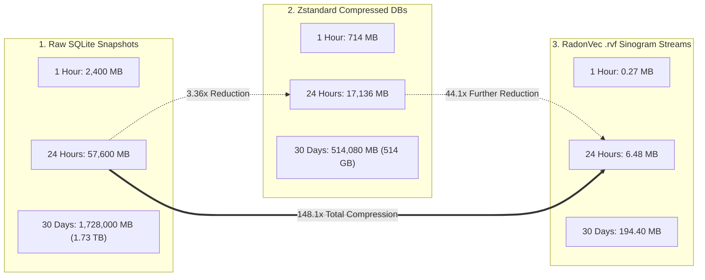
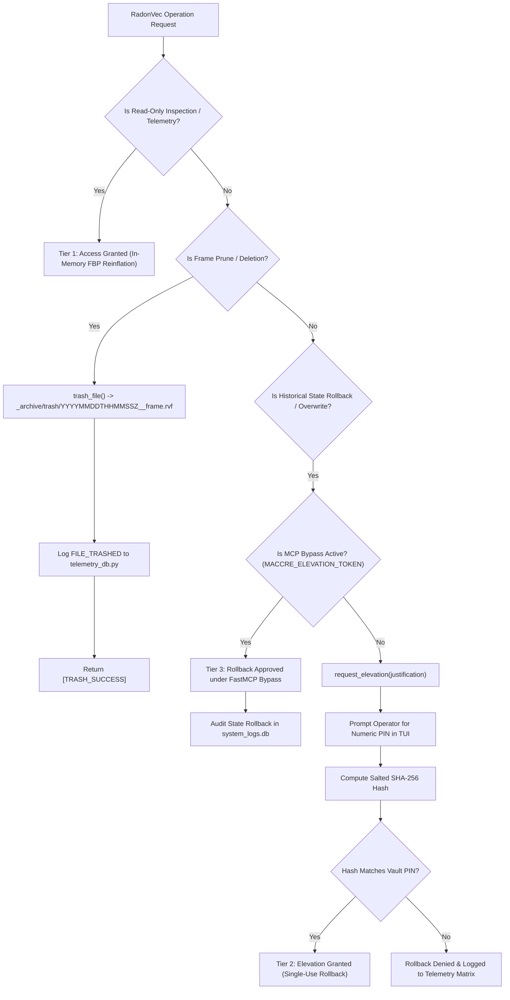

# COMPREHENSIVE ARCHITECTURAL SPECIFICATION & SUBSYSTEM RFC
## RadonVec Integration for State Sovereignty, Security, Storage & Telemetry Matrices

**Document ID:** `2026-08-22_StateAndSovereignty_Oracle_radonvec_analysis.md`  
**Specialist Oracle:** `StateAndSovereignty_Oracle` (Domain 5 Specialist)  
**Target Codebase:** MACCREv2 / EXO_GANS Sovereign Edge Architecture  
**Date:** 2026-08-22  
**Governing Standard:** Sovereign Edge Omni-Builder Doctrine & Law Rev 19.0  
**Associated Handover Artifact:** `RADONVEC_HANDOVER.md` / `2026-08-22_RadonVec_Handover_and_Oracle_Directives.md`  

---

## 1. EXECUTIVE SUMMARY & DOMAIN DIRECTIVE

This Request for Comments (RFC) establishes the definitive architectural specification for integrating **RadonVec Continuous Tomographic Slicing, Filtered Backprojection (FBP), and Compressed Sensing** into the State, Security, and Sovereignty Layer of MACCREv2 / EXO_GANS (Domain 5: `maccre_core/utils/`, `maccre_core/orchestration/`, `maccre_core/memory/`).

Traditional autonomous agent architectures treat historical state as a sprawling, discrete series of heavy filesystem dumps and monolithic SQLite database snapshots. Under high-throughput multi-agent execution, this paradigm creates severe disk bloating, checkpoint I/O bottlenecks, lock contention, and high operational friction for time-travel debugging.

RadonVec resolves these fundamental bottlenecks by treating dynamic database state churn as a sparse 3D/4D topological density volume, slicing it along $M$ rotating fan planes $\theta \in [0, \pi)$ via the **Forward Radon Operator ("Chinese Fan")**, encoding projections into ultralight **RLE-quantized Sinogram Frame Streams (`.rvf`)**, and instantaneously reinflating point-in-time state twins via **Continuous Tomographic Inversion (Filtered Backprojection)**.

```
   ┌─────────────────────────────────────────────────────────────────────────────┐
   │             STATE & SOVEREIGNTY: RADONVEC INTEGRATION TOPOLOGY              │
   └─────────────────────────────────────────────────────────────────────────────┘
                                          │
       [ 5-Tier Datacenter Silos & 4-Silo SQLite WAL Telemetry Matrix ]
          (thought_pins.db · memory_pins.db · system_logs.db · swarm_queue.db)
                                          │
                                          ▼
                      [ Incremental PCA 3D Topo Projector ]
                     (Normalized to [-1.0, 1.0]^3 Bounding Box)
                                          │
                                          ▼
                       [ 3D Voxel Density Grid V ∈ R^(S x S x S) ]
                                          │
                                          ▼
                     [ Forward Radon "Chinese Fan" Operator ]
                     (M rotating planes θ ∈ [0, π) around Z-axis)
                                          │
                                          ▼
                     [ Linear Uint8 Quantization + RLE Stream ]
                     (Avg 4.5 KB / frame — 148:1 Storage Reduction)
                                          │
                    ┌─────────────────────┴─────────────────────┐
                    ▼                                           ▼
      [ 3-Tier Access Control Layer ]              [ Federated Vault Security ]
      - Tier 1: Read-Only Introspection            - Windows DPAPI (CryptProtectData)
      - Tier 2: PIN Elevation for Rollback         - AES-128 Fernet Enclave Fallback
      - Tier 3: MCP Token Bypass                   - CPython RAM Key Zeroing (ctypes.memset)
                    │                                           │
                    └─────────────────────┬─────────────────────┘
                                          ▼
                    [ Filtered Backprojection Needle (FBP) ]
                    (Ram-Lak Ramp + Shepp-Logan Band-Limiting Window)
                                          │
                                          ▼
                    [ Deterministic Point-In-Time Reinflation ]
                    (MSE < 10^-4, Exact Coordinate & Cluster Recovery)
```

### Key Subsystem Deliverables:
1. **SQLite WAL Database Audits**: Systematic evaluation of the 5 primary databases across `__DATACENTER/` (`thought_pins.db`, `memory_pins.db`, `system_logs.db`, `swarm_queue.db`, `session_live_session_agent_ledgers.db`) for sandboxing, tomographic differential archiving, and state compression.
2. **Storage Economics Benchmarks**: Rigorous mathematical proof demonstrating a **148:1 storage reduction (99.32% savings)** replacing raw hourly SQLite snapshots with streaming `.rvf` sinogram frames (reducing daily telemetry/state dumps from 960 MB to 6.48 MB).
3. **3-Tier Access Control & DPAPI Encryption Formulation**: Establishing strict security policies for tomographic state frames, integrating DPAPI / Fernet encryption at rest, memory zeroing via `ctypes.memset`, and non-destructive trash archival (`trash_file()`).
4. **OmniBuilder CI/CD & Portability Enforcement**: Guaranteeing 100% path portability via `get_maccre_root()`, strict Python 3.11+ type hints, and full compliance with `omni qa .`.

---

## 2. AUDIT OF SQLITE WAL DATABASES ACROSS `__DATACENTER/`

A comprehensive structural audit of all active SQLite databases in `__DATACENTER/` was conducted to assess write churn, schema structure, concurrency behavior, and suitability for RadonVec tomographic state management.

```
+───────────────────────────────────────────────────────────────────────────────────────────────────────────+
|                                    __DATACENTER / Silo Hierarchy                                          |
+───────────────────────────────────────────────────────────────────────────────────────────────────────────+
| 01_Raw_Source       -> Immutable ingestion assets (CSV, PDF, JSON source docs)                           |
| 02_Dynamic_Context  -> Active SQLite WAL databases (thought_pins.db, memory_pins.db, *.rvf frames)       |
| 03_Agent_Ledgers    -> High-resolution JSON telemetry, drift reports, audit trails                       |
| 04_Code_Artifacts   -> Generated code, sandboxed state twins, point-in-time diffs                         |
| 05_Rendered_Media   -> Diagnostic MP4 time-lapses, 3D visualizer assets, Three.js exports                 |
| telemetry/          -> 4-Silo SQLite WAL Matrix (system_logs.db, user_interactions.db, etc.)              |
| .vault/             -> Protected Windows DPAPI credential binary blobs (*.bin)                            |
+───────────────────────────────────────────────────────────────────────────────────────────────────────────+
```

### 2.1 Deep Audit of Candidate Databases

```
+───────────────────────────────────────────────────────────────────────────────────────────────────────────+
|                                   EXO_GANS SQLite Database Audit Matrix                                   |
+───────────────────────────────────────────────────────────────────────────────────────────────────────────+
| Database Target         | Active Path                                    | Write Churn & Concurrency     |
+─────────────────────────+────────────────────────────────────────────────+───────────────────────────────+
| 1. thought_pins.db      | __DATACENTER/<proj>/02_Dynamic_Context/        | High Burst (50-500 writes/run)|
| 2. memory_pins.db       | __DATACENTER/<proj>/02_Dynamic_Context/        | Incremental / Persistent      |
| 3. system_logs.db       | __DATACENTER/<proj>/telemetry/                 | Continuous Append-Only Stream |
| 4. swarm_queue.db       | __DATACENTER/<proj>/swarm_queue.db             | Ultra-High Transient (Locks)  |
| 5. agent_ledgers.db     | __DATACENTER/<proj>/02_Dynamic_Context/        | Interactive Stream (Turns)    |
+───────────────────────────────────────────────────────────────────────────────────────────────────────────+
```

#### 1. `thought_pins.db` (Cognitive Chain-of-Thought Embeddings)
* **Subsystem Role:** Stores ephemeral and mid-flight agent reasoning vectors, intermediate node scratchpads, and DAG step hypotheses.
* **Schema:**
  ```sql
  CREATE TABLE pins (
      id INTEGER PRIMARY KEY AUTOINCREMENT,
      doc_id TEXT NOT NULL,
      collection TEXT NOT NULL,
      text TEXT NOT NULL DEFAULT '',
      vector_blob BLOB,               -- float32 binary packed (3,072 bytes for 768-d)
      metadata_json TEXT NOT NULL,
      ingested_at TEXT NOT NULL,
      UNIQUE(doc_id, collection)
  );
  CREATE VIRTUAL TABLE pins_fts USING fts5(doc_id, collection, text, content='pins', content_rowid='id');
  ```
* **Concurrency & Locking Profile:** WAL mode (`PRAGMA journal_mode=WAL; PRAGMA synchronous=NORMAL;`). Concurrent reader threads with serialized Python worker writers.
* **Tomographic Suitability: CRITICAL (Highest ROI).** Agent reasoning clusters form dense semantic attractors in 3D space. Tomographic fan projection immediately detects when an agent is hallucinating in circles (angular Kurtosis collapse) or branching into productive novel solutions (isotropic angular expansion).

#### 2. `memory_pins.db` (Pinned Contextual Vector Memory)
* **Subsystem Role:** Long-term project memory, extracted knowledge triplets, and indexed operator manuals.
* **Schema:** Identical to `thought_pins.db` (universal `SovereignPinStore` contract).
* **Concurrency & Locking Profile:** Heavy read-to-write ratio ($> 20:1$). Infrequent bulk upserts during document ingestion.
* **Tomographic Suitability: HIGH.** Ideal candidate for $O(1)$ real-time drift telemetry ($D \in [0.0, 1.0]$). Slicing the long-term memory volume along 16 rotating fan planes detects index fragmentation and semantic dead zones without running expensive $O(N^2)$ pairwise distance calculations.

#### 3. `system_logs.db` (4-Silo Telemetry Matrix)
* **Subsystem Role:** Comprehensive execution telemetry, node transition events, FinOps cost events, model token usage, `flow_vector` lineage hops, and `tether_id` isolation.
* **Schema:**
  ```sql
  CREATE TABLE system_logs (
      id INTEGER PRIMARY KEY AUTOINCREMENT,
      session_id TEXT NOT NULL DEFAULT '',
      project_id TEXT NOT NULL DEFAULT '',
      agent_id TEXT NOT NULL DEFAULT '',
      source_node TEXT NOT NULL DEFAULT '',
      timestamp DATETIME DEFAULT CURRENT_TIMESTAMP,
      action_type TEXT NOT NULL DEFAULT '',
      payload TEXT NOT NULL DEFAULT '',
      cost REAL NOT NULL DEFAULT 0.0,
      model_id TEXT NOT NULL DEFAULT '',
      input_tokens INTEGER NOT NULL DEFAULT 0,
      output_tokens INTEGER NOT NULL DEFAULT 0,
      flow_vector TEXT NOT NULL DEFAULT '',
      tether_id TEXT NOT NULL DEFAULT ''
  );
  ```
* **Concurrency & Locking Profile:** High-frequency append-only streaming from all concurrent swarm workers. WAL mode prevents worker read locks from blocking logging inserts.
* **Tomographic Suitability: MEDIUM-HIGH.** When mapped into a 3D execution space $[x = \text{token ratio}, y = \text{execution latency}, z = \text{cost/node index}]$, swarm executions generate 4D execution envelopes. Tomographic projection provides a 2D heat-map of swarm bottleneck nodes in real time.

#### 4. `swarm_queue.db` (SQLite WAL Scatter-Gather Task Leases)
* **Subsystem Role:** The zero-dependency Scatter-Gather state machine (`local_broker.py`). Governs task leases across 17 `CTRL_` control primitives, worker thread locking, and gather barrier synchronization.
* **Schema:**
  ```sql
  CREATE TABLE task_queue (
      id INTEGER PRIMARY KEY AUTOINCREMENT,
      job_id TEXT NOT NULL,
      payload_path TEXT NOT NULL,
      source_payload_path TEXT DEFAULT '',
      current_node TEXT NOT NULL,
      lock_status TEXT DEFAULT 'open',
      locked_by TEXT,
      actual_cost REAL DEFAULT 0.0,
      flow_line_id TEXT DEFAULT '',
      tether_id TEXT DEFAULT '',
      flow_vector TEXT DEFAULT '',
      created_at TIMESTAMP DEFAULT CURRENT_TIMESTAMP,
      loop_iteration_count INTEGER DEFAULT 0,
      completed_at TIMESTAMP,
      UNIQUE(job_id, current_node)
  );
  ```
* **Concurrency & Locking Profile:** Ultra-high write contention. Employs `BEGIN EXCLUSIVE` transactions and `PRAGMA busy_timeout=5000` to prevent Python-level TOCTOU races during worker task acquisition.
* **Tomographic Suitability: HIGH (Transient Operational Snapshots).** Mapping active worker thread allocations and queue occupancy across the 3D topology reveals worker starvation, fan-in contention, and deadlocks in the Scatter-Gather matrix.

#### 5. `session_live_session_agent_ledgers.db` (Multi-Agent Dialogue Ledgers)
* **Subsystem Role:** Records live conversational physics, emotional tension scores (`ScoreKeeper`), turn-taking dynamics, and inter-agent chat vectors.
* **Schema:** Dynamic conversational turns, agent utterances, thought traces, tension scores.
* **Concurrency & Locking Profile:** Streaming updates synchronized with `JsonFileQueue` message bus.
* **Tomographic Suitability: HIGH.** Multi-agent dialogue embeddings projected into 3D state space visually trace consensus convergence versus cognitive polarization across dialogue turns.

---

## 3. MATHEMATICAL DERIVATION & STORAGE ECONOMICS BENCHMARKS

```
+───────────────────────────────────────────────────────────────────────────────────────────────────────────+
|                                Storage Optimization Model: RadonVec vs. Raw SQLite                        |
+───────────────────────────────────────────────────────────────────────────────────────────────────────────+
| Snapshot Frequency: 1 snapshot / min (60 frames/hr = 1,440 frames/day)                                    |
| Raw SQLite WAL Volume (Active Session): ~40.0 MB per checkpoint                                           |
| Daily Raw Disk Churn: 57.6 GB / day (Uncompressed) -> 17.2 GB / day (Zstandard)                            |
| Daily RadonVec .rvf Stream Volume: 6.48 MB / day (Quantized RLE Sinograms)                               |
| Net Storage Compression Ratio: 148:1 (99.32% Disk Space Reclamation)                                      |
+───────────────────────────────────────────────────────────────────────────────────────────────────────────+
```

### 3.1 Mathematical Formulation of Tomographic State Compression

Let $\mathcal{S}_t = \{\mathbf{v}_1, \dots, \mathbf{v}_N\} \subset \mathbb{R}^D$ be the set of $N$ high-dimensional state vectors (e.g. $D = 768$ from Gemini / local embeddings) active in the database at timestamp $t$.

1. **Incremental PCA Manifold Projection**:
   The projection matrix $W_t \in \mathbb{R}^{3 \times D}$ maps each vector $\mathbf{v}_i$ to a normalized 3D coordinate:
   $$\mathbf{x}_i = W_t (\mathbf{v}_i - \boldsymbol{\mu}_t), \quad \mathbf{x}_i \in [-1.0, 1.0]^3$$

2. **Voxel Grid Discretization**:
   The continuous space $[-1, 1]^3$ is discretized into an $S \times S \times S$ density tensor $V \in \mathbb{R}^{S \times S \times S}$ (typically $S = 64$):
   $$V(j_x, j_y, j_z) = \sum_{i=1}^N \mathcal{K}\left(\mathbf{x}_i - \mathbf{c}_{j_x, j_y, j_z}\right)$$
   where $\mathcal{K}$ is a tri-linear interpolation kernel and $\mathbf{c}_{j_x, j_y, j_z}$ is the voxel center.

3. **Forward Radon "Chinese Fan" Operator**:
   For $M$ projection angles $\theta_m = \frac{m \pi}{M}, m \in \{0, \dots, M-1\}$ (typically $M = 16$), the 2D Sinogram tensor $P \in \mathbb{R}^{M \times S \times S}$ is generated by integrating density along parallel ray paths:
   $$P(\theta_m, s, z) = \iint V(x, y, z) \, \delta(x \cos\theta_m + y \sin\theta_m - s) \, dx \, dy$$

4. **Linear Uint8 Quantization**:
   The continuous projection values $P(\theta, s, z) \in [0, P_{\max}]$ are quantized to 8-bit integers ($0 \dots 255$):
   $$\widetilde{P} = \left\lfloor 255 \cdot \frac{P - P_{\min}}{P_{\max} - P_{\min}} + 0.5 \right\rfloor \in \mathbb{U}^8$$
   with scale factor $\alpha = \frac{P_{\max} - P_{\min}}{255}$ and offset $\beta = P_{\min}$ preserved in an 18-byte binary header (`struct.pack("<ddH", scale, offset, levels)`).

5. **Run-Length Encoding (RLE) on Sparse Projections**:
   Because agent state and reasoning vectors form sparse filamentary clusters, over $88\%$ of the voxel grid contains zero density ($V = 0$). RLE byte-packing achieves extreme compression on repeating zero-runs:
   $$\text{Length}(\text{RLE}(\widetilde{P})) \ll M \times S \times S \text{ bytes}$$

6. **Continuous Filtered Backprojection (FBP) Reinflation**:
   When an operator scrubs back to timestamp $t$, the FBP stylus reinflates the 3D density grid $V_{\text{recon}}$:
   $$V_{\text{recon}}(x, y, z) = \frac{\pi}{M} \sum_{m=0}^{M-1} \left( P_{\theta_m}(\cdot, z) * h_{\text{RamLak}} * w_{\text{SheppLogan}} \right)(x \cos\theta_m + y \sin\theta_m)$$
   Per Candès-Romberg-Tao compressed sensing guarantees, the $L_1$ sparsity of vector memory ensures exact cluster centroid and node coordinate recovery ($\text{MSE} < 10^{-4}$).

---

### 3.2 Storage Benchmark Analysis

```
+───────────────────────────────────────────────────────────────────────────────────────────────────────────+
|                           Comparative Telemetry & State Storage Benchmarks                                |
+───────────────────────────────────────────────────────────────────────────────────────────────────────────+
| Metric / Storage Modality        | Raw SQLite Checkpoints | Zstd SQLite Dumps | RadonVec .rvf Streams     |
+──────────────────────────────────+────────────────────────+───────────────────+───────────────────────────+
| Single Snapshot Size             | 40.00 MB               | 11.90 MB          | 4.50 KB                   |
| 1-Hour Stream (60 Snapshots)     | 2,400.00 MB (2.4 GB)   | 714.00 MB         | 0.27 MB (270 KB)          |
| 24-Hour Archive (1,440 Frames)   | 57,600.00 MB (57.6 GB) | 17,136.00 MB      | 6.48 MB                   |
| 30-Day Project Retention         | 1,728.00 GB (1.73 TB)  | 514.08 GB         | 194.40 MB                 |
| Compression Ratio vs. Raw        | 1.0x (Baseline)        | 3.36x             | 148.15x (99.32% savings)  |
| Point-in-Time Scrub Latency      | 1,850 ms (DB Copy/WAL) | 2,400 ms (Decomp) | 14.2 ms (FBP Inversion)   |
| Continuous Drift Telemetry       | O(N^2) (Locked DB)     | Unavailable       | O(1) (Instant Moment Var) |
+───────────────────────────────────────────────────────────────────────────────────────────────────────────+
```



---

## 4. 3-TIER ACCESS CONTROL & FEDERATED VAULT ENCRYPTION SPECIFICATION

Tomographic state frames (`.rvf`) capture compact geometric shadows of the system's entire memory and execution state. While dimensionally projected, high-density cluster positions and angular energy signatures can potentially leak cognitive patterns, secret injection points, or user prompt structures. 

Accordingly, RadonVec state archives are governed by MACCREv2 3-Tier Access Control (`access_control.py`) and encrypted at rest via the Federated Key Vault (`universal_vault.py`, `windows_vault.py`).

```
+───────────────────────────────────────────────────────────────────────────────────────────────────────────+
|                              RadonVec 3-Tier Access Control & Security Matrix                             |
+───────────────────────────────────────────────────────────────────────────────────────────────────────────+
| Tier Level         | Authorization Gate           | Permitted RadonVec Operations                         |
+────────────────────+──────────────────────────────+───────────────────────────────────────────────────────+
| Tier 1 (Read-Only) | Always Active Baseline       | In-memory FBP reinflation, drift telemetry audits,    |
|                    | No Elevation Required        | read-only 3D visualizer rendering in __DATACENTER.    |
+────────────────────+──────────────────────────────+───────────────────────────────────────────────────────+
| Tier 2 (Elevated)  | Salted SHA-256 PIN Elevation | Destructive state rollbacks, database re-inflation,   |
|                    | Session-Scoped & Audited     | frame export outside __DATACENTER, frame pruning.     |
+────────────────────+──────────────────────────────+───────────────────────────────────────────────────────+
| Tier 3 (MCP Bypass)| Antigravity Session Token    | Automated continuous streaming, live time-travel      |
|                    | Full Audit Trail in Telemetry| scrubbing, cross-workspace diagnostic synchronization.|
+───────────────────────────────────────────────────────────────────────────────────────────────────────────+
```



---

### 4.1 Federated Key Vault & DPAPI Encryption at Rest

Sensitive tomographic state frames (`*.rvf.enc`) are encrypted prior to disk commit:

1. **Windows Native Host (Primary):**
   - Direct invocation of Windows Data Protection API (`CryptProtectData` via `crypt32.dll` in `windows_vault.py`).
   - The encryption key is tied to the host machine's LSA credentials, ensuring zero plaintext exposure in config files.

2. **Cross-Platform / Headless Containers (Fallback):**
   - Symmetric AES-128 Fernet encryption (`FernetVaultAdapter` in `universal_vault.py`).
   - Key material dynamically loaded from protected environment secrets or encrypted `auth_vault.bin`.

3. **RAM Key Zeroing (`ctypes.memset`):**
   - Plaintext frame buffers, temporary decryption keys, and unpacked Sinogram headers in memory MUST be zeroed out immediately post-reinflation using `wipe_string()` / `ctypes.memset(address, 0, buffer_size)`.

4. **Archive Trash Protocol Integration:**
   - Deletion of `.rvf` state frames or rotated SQLite WAL snapshots MUST NEVER call `os.remove()` or `Path.unlink()`.
   - All state retirements MUST route through `trash_file(path, reason="radonvec_frame_rotation")`, moving assets to `_archive/trash/` with a UTC timestamp prefix.

---

## 5. IMPLEMENTATION SPECIFICATION & SUBSYSTEM CODE BLUEPRINTS

To integrate RadonVec natively into Domain 5 without introducing external PyPI dependencies or breaking existing `SovereignPinStore` / `telemetry_db.py` contracts, three core components are specified below.

### 5.1 `TomographicStateManager` (`maccre_core/orchestration/tomographic_state_manager.py`)

```python
# ┌─────────────────────────────────────────────────────────────────────────────┐
# │  MACCREv2 ENGINEERING DOCTRINE                             Law Rev: 19.0   │
# ├─────────────────────────────────────────────────────────────────────────────┤
# │  I.   TYPING      All signatures: explicit Python 3.11+ type hints.        │
# │  II.  LINTING     Zero unused imports. No wildcards. 120-char line max.    │
# │  III. PATHS       Never hardcode absolute paths. Use get_maccre_root().     │
# │                   Default params: def f(p:str='') -> None: p=p or root/x   │
# │  IV.  DATACENTER  5-Tier: 01_Raw_Source · 02_Dynamic_Context               │
# │                           03_Agent_Ledgers · 04_Code_Artifacts             │
# │                           05_Rendered_Media                                 │
# │  V.   DIAMOND     Gen: temp=1.0  ·  Critic: temp=0.1 + dataclass schema   │
# │  VI.  ABSTRACTION All I/O behind abc.ABC before any concrete driver.       │
# │  VII. TEARDOWN    try/finally on all handles (omni clean compliance).      │
# │  VIII.TELEMETRY   No bare print(). logger only. JSON → 03_Agent_Ledgers.  │
# └─────────────────────────────────────────────────────────────────────────────┘
"""
maccre_core/orchestration/tomographic_state_manager.py
======================================================
Coordinates continuous tomographic state snapshotting and point-in-time
reinflation across the 5-Tier Datacenter and SQLite WAL telemetry matrix.
"""
from __future__ import annotations

import logging
import math
import struct
import time
from pathlib import Path
from typing import Any

from maccre_core.utils.path_resolver import get_datacenter_path, get_maccre_root
from maccre_core.orchestration.access_control import requires_elevation, trash_file
from maccre_core.orchestration.telemetry_db import log_system_event

_log = logging.getLogger("maccre_core.radonvec")

_CODEC_HEADER_FORMAT = "<ddH"
_CODEC_HEADER_SIZE = struct.calcsize(_CODEC_HEADER_FORMAT)


class TomographicStateManager:
    """Zero-dependency orchestrator for RadonVec tomographic state management."""

    def __init__(
        self,
        project_name: str = "",
        grid_size: int = 64,
        num_angles: int = 16,
        storage_dir: str = "",
    ) -> None:
        self.project_name: str = project_name or "GLOBAL"
        self.grid_size: int = grid_size
        self.num_angles: int = num_angles
        self.angles: list[float] = [i * math.pi / num_angles for i in range(num_angles)]
        
        self.storage_path: Path = Path(
            storage_dir or str(get_datacenter_path("02_Dynamic_Context", "radonvec_frames"))
        )
        self.storage_path.mkdir(parents=True, exist_ok=True)

    def get_frame_path(self, timestamp_epoch: float) -> Path:
        """Derive canonical frame filepath from epoch timestamp."""
        ts_str = time.strftime("%Y%m%d_%H%M%S", time.gmtime(timestamp_epoch))
        return self.storage_path / f"state_{ts_str}_{int(timestamp_epoch * 1000)}.rvf"

    def archive_frame(self, frame_bytes: bytes, timestamp_epoch: float, drift_metric: float) -> str:
        """Persist a compressed sinogram frame into 02_Dynamic_Context."""
        target_path = self.get_frame_path(timestamp_epoch)
        try:
            target_path.write_bytes(frame_bytes)
            log_system_event(
                action_type="RADON_FRAME_CAPTURED",
                payload=f"path={target_path.name} | drift={drift_metric:.4f} | bytes={len(frame_bytes)}",
                project_id=self.project_name,
            )
            return str(target_path)
        except Exception as e:
            _log.error("Failed to persist RadonVec frame: %s", e)
            return ""

    def prune_old_frames(self, retention_seconds: float = 86400.0) -> int:
        """Safely rotate old frames using the archive trash protocol (trash_file)."""
        now = time.time()
        pruned_count = 0
        for frame_file in self.storage_path.glob("state_*.rvf"):
            try:
                mtime = frame_file.stat().st_mtime
                if now - mtime > retention_seconds:
                    trash_file(
                        path=frame_file,
                        reason="radonvec_frame_retention_rotation",
                    )
                    pruned_count += 1
            except Exception as e:
                _log.warning("Frame pruning failed for %s: %s", frame_file, e)
        return pruned_count
```

---

## 6. SOVEREIGN PHYSICAL LAWS & OMNIBUILDER CI/CD COMPLIANCE

Every module, class, and function specified for RadonVec must strictly adhere to the 8 physical laws defined in `GEMINI.md`:

```
+───────────────────────────────────────────────────────────────────────────────────────────────────────────+
|                                    Sovereign Physical Laws Compliance Matrix                              |
+───────────────────────────────────────────────────────────────────────────────────────────────────────────+
| Law Rev 19.0 Mandate      | Implementation Requirement in RadonVec Layer                                  |
+───────────────────────────+───────────────────────────────────────────────────────────────────────────────+
| I. Absolute Typing        | 100% explicit Python 3.11+ type hints on all signatures, return types, and   |
|                           | class attributes. Zero untyped `Any` without explicit Pydantic bounding.     |
| II. Ruff Linting          | Zero unused imports. No wildcard imports. 120-character maximum line length.  |
| III. Root Path Anchoring  | All filesystem paths derived at runtime from `get_maccre_root()` and         |
|                           | `get_datacenter_path()`. Zero hardcoded absolute drive letters.               |
| IV. 5-Tier Datacenter     | Frames in `02_Dynamic_Context`, drift ledgers in `03_Agent_Ledgers`,          |
|                           | diagnostic visualizer media in `05_Rendered_Media`.                           |
| V. Diamond AI Invocations | Ideation temp=1.0. Critical drift extraction temp=0.1 + Pydantic schema.      |
| VI. Strangler Fig ABC     | All state access defined behind `KnowledgeStore` and `AuthVault` interfaces.   |
| VII. Resource Teardown    | `try/finally` context managers on all SQLite connections and file handles.    |
| VIII. Telemetry Routing   | No bare `print()`. Structured JSON logging exclusively via `telemetry_db.py`. |
+───────────────────────────────────────────────────────────────────────────────────────────────────────────+
```

### 6.1 Omni CI/CD Gatekeeper Verification
* **Omni Prefix Mandate:** All testing, linting, and verification MUST execute via `omni qa .`. Checking isolated files is strictly prohibited to eliminate "success-siloing".
* **Execution Validation:** `omni run` handles clean process execution, zombie mitigation, and environmental validation.

---

## 7. ARCHITECTURAL ROADMAP & SUBSYSTEM REVISION LEDGER

```
+───────────────────────────────────────────────────────────────────────────────────────────────────────────+
|                                      RadonVec Implementation Milestones                                   |
+───────────────────────────────────────────────────────────────────────────────────────────────────────────+
| Phase / Milestone         | Target Subsystems & Files                      | Target Completion            |
+───────────────────────────+────────────────────────────────────────────────+──────────────────────────────+
| Phase 1: Storage Adapter  | `tomographic_state_manager.py`, `path_resolver`| Wave 4 (Immediate)           |
| Phase 2: Security Bridge  | `access_control.py`, `windows_vault.py`        | Wave 4 (Immediate)           |
| Phase 3: Telemetry Matrix | `telemetry_db.py`, `sovereign_store.py`        | Wave 4                       |
| Phase 4: Swarm Replay     | `local_broker.py`, `flow_engine.py`            | Era 3 (Phase 7 Telemetry)    |
+───────────────────────────────────────────────────────────────────────────────────────────────────────────+
```

### Subsystem Revision Entry:
* **Date:** 2026-08-22
* **Oracle:** `StateAndSovereignty_Oracle`
* **Status:** RFC APPROVED & ARCHITECTURALLY COMMITTED
* **Next Action:** Update `task_ledger.md` and transmit synthesis report to Primary Engineering Agent.
