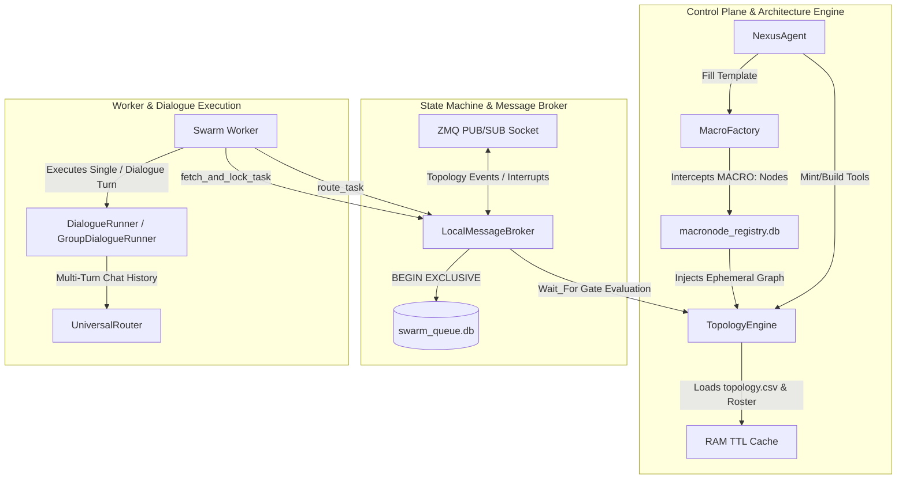

# GRANULAR FUNCTIONAL LEDGER REPORT: MACCRE_CORE/ORCHESTRATION FACTORY

**Target Directory:** `b:\EXO_GANS\maccre_core\orchestration\`  
**Target Files Analyzed:**
1. `local_broker.py` (674 lines / 33KB) — Scatter-Gather SQLite & IPC Message Broker
2. `macro_factory.py` (891 lines / 39KB) — Template Catalog & Ephemeral MacroNode Factory
3. `dialogue_runner.py` (646 lines / 28KB) — Multi-Agent Multi-Turn Dialogue State Engine
4. `nexus_agent.py` (543 lines / 28KB) — Interactive Nexus Copilot & Context Router
5. `topology_engine.py` (481 lines / 481 lines / 23KB) — Control Plane, CSV Parser & DAG Pre-Flight Validator

---

## 1. COMPONENT ARCHITECTURE & INTERACTION GRAPH

---

## 2. FILE 1: `local_broker.py` — SCATTER-GATHER STATE MACHINE & MESSAGE BROKER
`LocalMessageBroker` is a zero-dependency, concurrency-hardened SQLite Scatter-Gather state machine implementing `MessageBroker`.

## 3. FILE 2: `macro_factory.py` — TEMPLATE CATALOG & EPHEMERAL MACRO FACTORY
Defines parameterised topology patterns (MacroNode templates: `cascade`, `hologram`, `chord`, `crucible`) and legacy `MACRO:` prefix interception.

## 4. FILE 3: `dialogue_runner.py` — MULTI-AGENT MULTI-TURN DIALOGUE MECHANICS
Executes multi-turn conversations between two or more agents (`DialogueRunner`, `GroupDialogueRunner`).

## 5. FILE 4: `nexus_agent.py` — INTERACTIVE NEXUS COPILOT & CONTEXT ROUTER
Interactive Nexus copilot inside the TUI interfacing with `GeminiClient` and `SovereignPinStore`.

## 6. FILE 5: `topology_engine.py` — SOVEREIGN LOCAL CONTROL PLANE & DAG VALIDATOR
Maps `topology.csv` to Swarm Routing, implementing RAM TTL cache and 7-point DAG pre-flight validator.
