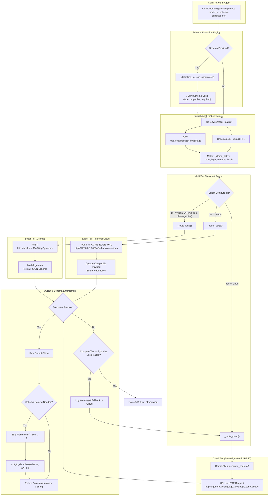
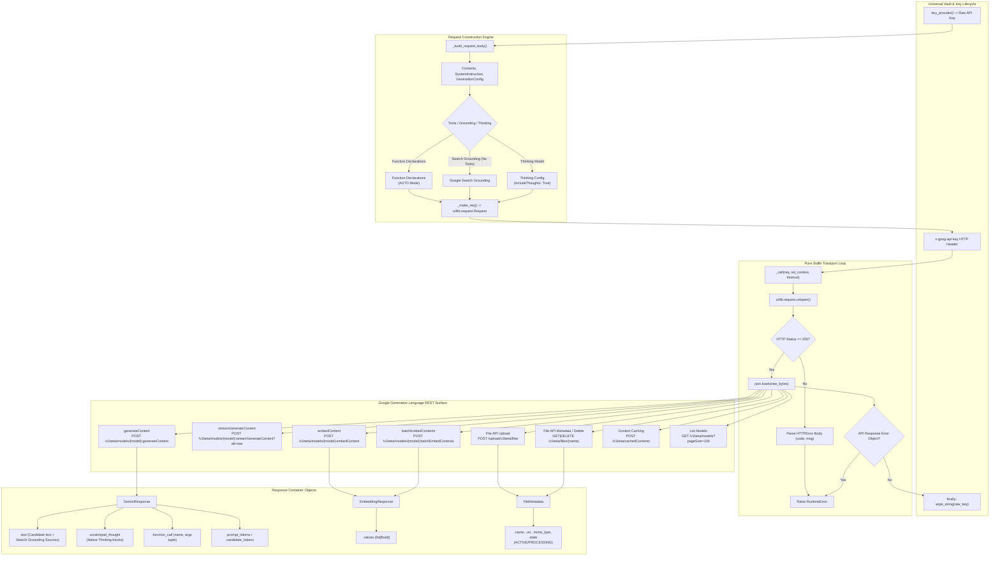
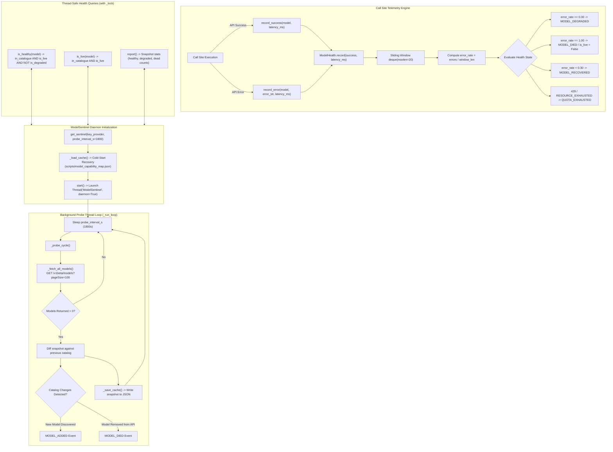
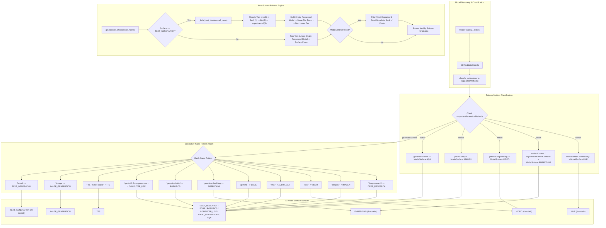
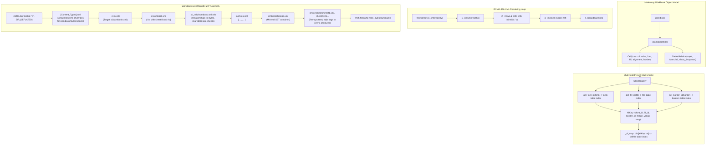

# Wave 2 Architecture Analysis: Net & Client Subsystem (`maccre_core._net`)

**Target Output File Path:** `B:\EXO_GANS\Analysis\Wave2\flowchart_01_net_client.md`  
**Source Subsystem:** `B:\EXO_GANS\maccre_core\_net\`  
**Reference Ledger:** `B:\EXO_GANS\Analysis\Wave1\01_net_subsystem_ledger.md`  
**Status:** Deep Architectural Synthesis & Modular Flowchart Report Complete  

---

## 1. EXECUTIVE SUMMARY & SUBSYSTEM ARCHITECTURAL OVERVIEW

The `maccre_core._net` subsystem constitutes the zero-dependency networking, inference orchestration, hardware probing, model health sentinel, capability surface classification, and native document generation engine of the MACCREv2 sovereign edge architecture.

---

## 2. MASTER SUBSYSTEM ARCHITECTURE & TRANSPORT LOOP

---

## 3. GEMINI REST API ENDPOINTS & REQUEST ARCHITECTURE

---

## 4. MODEL SENTINEL ACTIVE HEALTH PROBING & TELEMETRY

---

## 5. MODEL SURFACE CLASSIFICATION & CAPABILITY FAILOVER

---

## 6. SOVEREIGN OOXML WORKBOOK ZIP PACKAGING ENGINE

