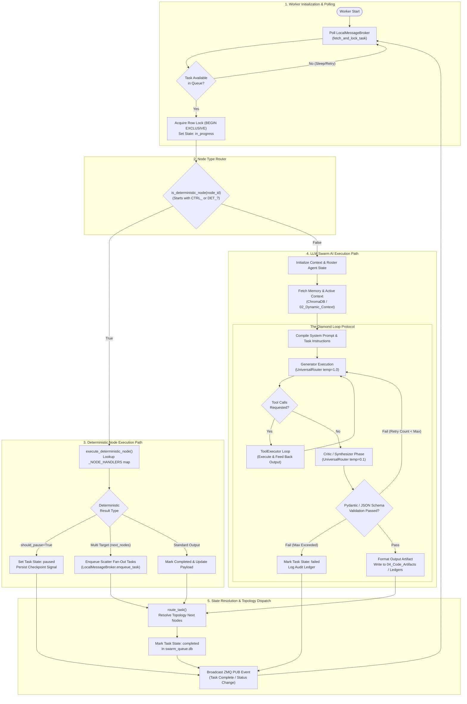

# Technical Architecture & Flowchart Report: MACCREv2 Orchestration Subsystem

**Target File:** `B:\EXO_GANS\Analysis\Wave2\flowchart_02_orchestration_engine.md`  
**Law Rev:** 19.0 Compliance Verified  

---

# EXECUTIVE SUMMARY

The MACCREv2 Orchestration Subsystem (`maccre_core/orchestration/`) is the sovereign control plane and execution engine governing multi-agent swarm flows, deterministic structural primitives, DAG graph routing, and local concurrency queues.

---

# SECTION 1: SWARM WORKER CYCLE STATE MACHINE (`UniversalSwarmWorker`)



---

# SECTION 2: FLOW ENGINE PRE-FLIGHT VALIDATION & CYCLE EXECUTION

```mermaid
flowchart TD
    subgraph PreFlight ["1. Pre-Flight Validation Pipeline (TopologyEngine & FlowEngine)"]
        INIT_FLOW([initiate_flow_cycle]) --> LOAD_CSV["Load Topology CSV\n(RAM TTL Cache Check - 5s TTL)"]
        LOAD_CSV --> V1{"1. File & Header Valid?\n(NODE_ID, ACTION, etc.)"}
        V1 -- "No" --> ERR_PRE["Raise PreFlightValidationError"]
        V1 -- "Yes" --> V2{"2. Entry Point Present?\n(CTRL_ANCHOR / NODE_01)"}
        V2 -- "No" --> ERR_PRE
        V2 -- "Yes" --> V3{"3. Ephemeral Macro Nodes?\n(MACRO: Prefix Check)"}
        V3 -- "Yes" --> EXP_MACRO["Expand Macro Templates\n(MacroFactory DB Ingestion)"]
        V3 -- "No" --> V4
        EXP_MACRO --> V4{"4. Cycle / Deadlock Free?\n(DFS Traversal Graph Check)"}
        V4 -- "No" --> ERR_PRE
        V4 -- "Yes" --> V5{"5. Unreachable Nodes?"}
        V5 -- "Yes" --> WARN_UNREACH["Log Warning / Prune Node"]
        V5 -- "No" --> V6
        WARN_UNREACH --> V6{"6. WAIT_FOR Dependencies Valid?"}
        V6 -- "No" --> ERR_PRE
        V6 -- "Yes" --> V7{"7. Dynamic Route Targets Exist?"}
        V7 -- "No" --> ERR_PRE
        V7 -- "Yes" --> PRE_PASS["Pre-Flight Validation PASSED"]
    end

    subgraph CycleInit ["2. Cycle Initialization & Graph Hydration"]
        PRE_PASS --> GEN_JOB["Generate Unique Job_ID & Cycle_ID"]
        GEN_JOB --> PERSIST_STATE["Persist Initial State to\n02_Dynamic_Context/flow_state.json"]
        PERSIST_STATE --> SEED_QUEUE["Enqueue Entry Task (CTRL_ANCHOR)\nto LocalMessageBroker"]
    end

    subgraph CycleExecution ["3. Supervisor Execution Loop"]
        SEED_QUEUE --> MON_LOOP["Monitor Active Tasks in SQLite Broker"]
        MON_LOOP --> WORKER_POOL{"Active Swarm Workers\nProcessing Queue?"}
        WORKER_POOL -->|Workers Fetch Tasks| CHECK_CYCLE{"Cycle Completion Status"}
        CHECK_CYCLE -- "Tasks Pending/In-Progress" --> SLEEP_MON["Poll Cycle Status (100ms interval)"]
        SLEEP_MON --> MON_LOOP
        CHECK_CYCLE -- "Paused Task Encountered" --> HALT_CYCLE["Transition Flow State: PAUSED\nPersist Resume Checkpoint"]
        CHECK_CYCLE -- "Task Failure (No Retries)" --> ABORT_CYCLE["Transition Flow State: FAILED\nLog Forensic Telemetry"]
        CHECK_CYCLE -- "All Terminal Nodes (CTRL_END) Completed" --> COMPLETE_CYCLE["Transition Flow State: COMPLETED"]
    end

    subgraph ResumeAggregation ["4. Resume & Session Aggregation"]
        HALT_CYCLE --> RESUME_REQ["resume_flow_cycle(job_id)"]
        RESUME_REQ --> LOAD_CHK["Load flow_state.json Snapshot"]
        LOAD_CHK --> REENQUEUE["Re-enqueue Paused/Pending Tasks"]
        REENQUEUE --> MON_LOOP

        COMPLETE_CYCLE --> AGG_LEDGER["Synthesize Session Ledger"]
        AGG_LEDGER --> WRITE_DATACENTER["Write Telemetry & Output Matrix to\n03_Agent_Ledgers / 05_Rendered_Media"]
        WRITE_DATACENTER --> FLOW_END([Flow Cycle End])
    end
```



---

# SECTION 3: DETERMINISTIC NODE EXECUTION MATRIX (`deterministic_nodes.py`)

```mermaid
flowchart TD
    subgraph Dispatch ["1. Interception & Dispatch Mechanics"]
        IN_NODE([Task Dispatched to Deterministic Engine]) --> MATCH_PREFIX["Normalize & Match Prefix\n(is_deterministic_node)"]
        MATCH_PREFIX --> RESOLVE_ENUM["_resolve_node_type()\nLongest Prefix Enum Match"]
        RESOLVE_ENUM --> SWITCH_NODE{"DeterministicNodeType"}
    end

    subgraph ControlGroup ["2. Control & Structural Primitives"]
        SWITCH_NODE -- "CTRL_ANCHOR" --> H_ANCHOR["Pass Payload Unchanged\nReturn Standard Next Node"]
        SWITCH_NODE -- "CTRL_RECURSION" --> H_REC["Evaluate Counter vs Limit\nBranch Loop Back or Exit Path"]
        SWITCH_NODE -- "CTRL_PAUSE" --> H_PAUSE["Set should_pause = True\nSignal Worker Task Hold"]
        SWITCH_NODE -- "CTRL_CHECKPOINT" --> H_CHK["Copy Current Payload to\n03_Agent_Ledgers Checkpoint"]
        SWITCH_NODE -- "CTRL_DELAY" --> H_DELAY["Sleep(seconds)\nPass Payload Unchanged"]
        SWITCH_NODE -- "CTRL_END" --> H_END["Mark Flow Termination\nReturn next_node = None"]
    end

    subgraph DataScatterGather ["3. Scatter-Gather & Payload Operations"]
        SWITCH_NODE -- "CTRL_SCATTER" --> H_SCATTER["Partition Payload by Rules/Chunks\nReturn next_nodes Array (Fan-Out)"]
        SWITCH_NODE -- "CTRL_MERGE" --> H_MERGE["Read Predecessor Payloads\nAggregate into Unified JSON/Markdown"]
        SWITCH_NODE -- "CTRL_CONCAT" --> H_CONCAT["Join Upstream Payloads Flatly\nDelimiter Ingestion"]
        SWITCH_NODE -- "CTRL_PAYLOAD_INJECT" --> H_INJECT["Write Configured Static Text\nas Output Payload"]
    end

    subgraph LogicRouting ["4. Dynamic Logic & Sanitization Primitives"]
        SWITCH_NODE -- "CTRL_GATE" --> H_GATE["Verify Prerequisite Completion\nBlock if Pending else Release"]
        SWITCH_NODE -- "CTRL_BRANCH" --> H_BRANCH["Scan Payload for Keywords\nSelect Matching Next Node"]
        SWITCH_NODE -- "CTRL_FILTER" --> H_FILTER["Apply Regex / Stripping Rules\nClean Output File"]
        SWITCH_NODE -- "CTRL_CLEANUP" --> H_CLEAN["Purge Temporary Files\nMatching Glob Patterns"]
        SWITCH_NODE -- "CTRL_CONDITIONAL_ROUTE" --> H_COND["4-Vector Fallback Evaluation:\n1. Structured Payload Map\n2. Keyword Predicates\n3. Confidence Score Threshold\n4. Fuzzy String Matcher"]
    end

    subgraph ResultPacking ["5. Result Standardization"]
        H_ANCHOR --> PACK_RES
        H_REC --> PACK_RES
        H_PAUSE --> PACK_RES
        H_CHK --> PACK_RES
        H_DELAY --> PACK_RES
        H_END --> PACK_RES
        H_SCATTER --> PACK_RES
        H_MERGE --> PACK_RES
        H_CONCAT --> PACK_RES
        H_INJECT --> PACK_RES
        H_GATE --> PACK_RES
        H_BRANCH --> PACK_RES
        H_FILTER --> PACK_RES
        H_CLEAN --> PACK_RES
        H_COND --> PACK_RES

        PACK_RES["Construct DeterministicNodeResult\n(output_payload_path, next_node, next_nodes, should_pause, artifact)"] --> OUT_RES([Return to Swarm Worker])
    end
```



---

# SECTION 4: LOCAL BROKER SQLITE SCATTER-GATHER TASK QUEUES (`local_broker.py`)

```mermaid
flowchart TD
    subgraph BrokerInit ["1. Storage & Concurrency Architecture"]
        BROKER_START([LocalMessageBroker Instance]) --> OPEN_DB["Connect swarm_queue.db\nEnable SQLite WAL Mode (journal_mode=WAL)"]
        OPEN_DB --> ENSURE_SCHEMA["Verify Schema:\ntasks (task_id, job_id, node_id, status, payload_path, wait_for, created_at, updated_at)\ntask_deps (task_id, depends_on_node)"]
    end

    subgraph TaskIngestion ["2. Task Ingestion & Scatter Operations"]
        ENQ_REQ["enqueue_task() / enqueue_scatter_tasks()"] --> LOCK_TRANS["Begin SQLite Transaction\n(BEGIN EXCLUSIVE)"]
        LOCK_TRANS --> CHECK_WAIT{"Has WAIT_FOR\nPrerequisites?"}
        CHECK_WAIT -- "Yes" --> REG_DEPS["Insert Task Row (status='pending')\nInsert Dependency Rows into task_deps"]
        CHECK_WAIT -- "No" --> REG_READY["Insert Task Row (status='pending')"]
        REG_DEPS --> COMMIT_ENQ["COMMIT Transaction"]
        REG_READY --> COMMIT_ENQ
        COMMIT_ENQ --> BROADCAST_ENQ["Broadcast ZMQ PUB Event:\nTASK_ENQUEUED"]
    end

    subgraph WorkerPolling ["3. Deterministic Task Locking & Fetching"]
        FETCH_REQ["Worker Request: fetch_and_lock_task(worker_id)"] --> LOCK_FETCH["Begin Transaction (BEGIN EXCLUSIVE)"]
        LOCK_FETCH --> QUERY_READY["Query Candidate Task:\nWHERE status='pending'\nAND (wait_for IS NULL OR all task_deps status='completed')\nORDER BY created_at ASC LIMIT 1"]
        CANDIDATE_AVAIL{"Candidate Found?"} <-- QUERY_READY
        CANDIDATE_AVAIL -- "No" --> ROLLBACK_FETCH["ROLLBACK Transaction\nReturn None to Worker"]
        CANDIDATE_AVAIL -- "Yes" --> LOCK_ROW["UPDATE tasks\nSET status='in_progress', worker_id=?, updated_at=NOW()\nWHERE task_id=?"]
        LOCK_ROW --> COMMIT_FETCH["COMMIT Transaction"]
        COMMIT_FETCH --> RETURN_TASK["Return Task Data to Worker"]
    end

    subgraph StateGathering ["4. Gather Dependency Resolution & State Transition"]
        UPDATE_REQ["route_task() / update_task_status()"] --> LOCK_STATE["Begin Transaction (BEGIN EXCLUSIVE)"]
        LOCK_STATE --> SET_STATE["UPDATE tasks SET status=new_status, payload_path=?\nWHERE task_id=?"]
        SET_STATE --> CHECK_COMPLETION{"Is status == 'completed'?"}
        CHECK_COMPLETION -- "Yes" --> RESOLVE_DEPS["Query Pending Tasks Dependent on Completed Node\nCheck if ALL Prerequisites for Downstream Tasks are Met"]
        RESOLVE_DEPS --> NOTIFY_READY["Mark Dependent Tasks Ready for Polling"]
        CHECK_COMPLETION -- "No" --> COMMIT_STATE
        NOTIFY_READY --> COMMIT_STATE["COMMIT Transaction"]
        COMMIT_STATE --> BROADCAST_STATE["Broadcast ZMQ PUB Event:\nTASK_STATUS_CHANGED / GATHER_COMPLETE"]
    end
```
