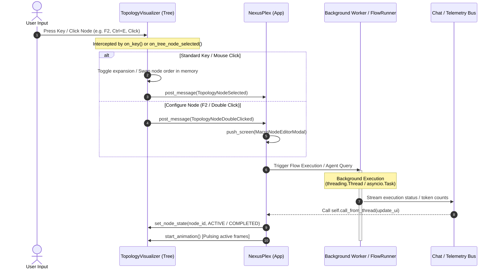
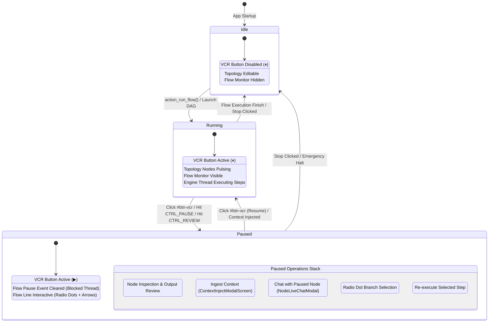

# ARCHITECTURAL FLOWCHART: TEXTUAL NEXUSPLEX TUI INTERFACE (`maccre_tui`)

## 1. TEXTUAL NEXUSPLEX SCREEN LAYOUT HIERARCHY

```mermaid
graph TD
    subgraph APP ["NexusPlex App (App[None])"]
        CH ["CustomHeader (id='custom-header')"]
        FT ["Footer (id='footer')"]
        
        subgraph MAIN ["Horizontal (id='main-layout')"]
            subgraph LEFT ["Vertical (id='left-pane')"]
                IP ["InformationPanel"]
                IP_P1 ["InfoPane: Overview"]
                IP_P2 ["InfoPane: Flow Controls"]
                IP_P3 ["InfoPane: MacroNode Builder"]
                IP_P4 ["InfoPane: FinOps & Budget"]
                IP_P5 ["InfoPane: Knowledge Ingestion"]
                IP_P6 ["InfoPane: System Telemetry"]
                
                FMO ["FlowMonitorOverlay (id='flow-monitor-overlay')<br/>[Toggles Visible / Hidden]"]
                
                NC ["NexusChat"]
                NC_LOG ["RichLog (id='nexus-chat-log')"]
                NC_INP ["Input (id='nexus-chat-input')"]
                NC_BTNS ["Horizontal Controls: Send, Clear, Inject"]
            end
            
            subgraph RIGHT ["Vertical (id='right-pane')"]
                subgraph AM ["Horizontal (id='agent-manager')"]
                    ABP ["AgentBuilderPanel / MacroNodeBuilderPanel"]
                    
                    subgraph MNW ["MacroNodeWorkshop"]
                        NCAT ["NodeCatalog (Tabbed Browser: Nodes, Agents, Control)"]
                        TV ["TopologyVisualizer (Rich Tree DAG View)"]
                        VCR ["VCR Control Toolbar (#btn-vcr, #btn-stop, #btn-step)"]
                    end
                end
            end
        end
    end

    APP --> CH
    APP --> MAIN
    APP --> FT

    MAIN --> LEFT
    MAIN --> RIGHT

    LEFT --> IP
    IP --> IP_P1
    IP --> IP_P2
    IP --> IP_P3
    IP --> IP_P4
    IP --> IP_P5
    IP --> IP_P6

    LEFT --> FMO
    LEFT --> NC
    NC --> NC_LOG
    NC --> NC_INP
    NC --> NC_BTNS

    RIGHT --> AM
    AM --> ABP
    AM --> MNW
    MNW --> NCAT
    MNW --> TV
    MNW --> VCR
```

---

## 2. EVENT PROPAGATION ARCHITECTURE



---

## 3. INTERACTIVE VCR TRANSPORT STATE MACHINE



### Detailed Paused Mode Action Flow

```mermaid
graph TD
    P_START ["Flow Enters PAUSED State"] --> P_OPTS {"User Selects Action in Paused UI"}

    P_OPTS --> |Inject Context| MOD_INJ ["Open ContextInjectModalScreen"]
    MOD_INJ --> INJ_SAVE ["Save Text to _injected_context"]
    INJ_SAVE --> RESUME ["Resume Flow (Unblock Worker Thread)"]

    P_OPTS --> |Live Chat with Node| MOD_CHAT ["Open NodeLiveChatModal"]
    MOD_CHAT --> CHAT_LOOP ["Interactive Chat Loop with Node State"]
    CHAT_LOOP --> CHAT_CLOSE ["Close Modal & Update Node Context"]

    P_OPTS --> |Time-Travel Branching| RADIO_SEL ["Click Radio Dot on Completed Step"]
    RADIO_SEL --> SET_BRANCH ["Set _paused_selected_node & Branch Target"]
    SET_BRANCH --> RERUN ["Rerun Step / Branch Flow"]

    RESUME --> RUNNING ["Flow Re-enters RUNNING State"]
    CHAT_CLOSE --> PAUSED_HOLD ["Remain in PAUSED State"]
    RERUN --> RUNNING
```

---

## 4. AGENT STUDIO 3-PANEL CHAT ARENA (`AgentStudioChatScreen`)

```mermaid
graph LR
    subgraph ASCS ["AgentStudioChatScreen (ModalScreen)"]
        subgraph PANEL1 ["ChatDashboardPane (Left)"]
            P1_PROJ ["Project Selector<br/>(#studio-project-select)"]
            P1_HIST ["Session History List<br/>(#studio-history-list)"]
            P1_ROSTER ["Agent Roster SelectionList<br/>(#studio-select-agents)"]
            P1_NEW ["New Session Controls"]
        end

        subgraph PANEL2 ["ChatArenaPane (Middle)"]
            P2_LOG ["RichLog Chat Arena<br/>(#chat-arena-log)"]
            P2_TYP ["Typing Indicator Label"]
            P2_INP ["TextArea Input<br/>(#chat-arena-input)"]
            P2_BTNS ["Control Buttons:<br/>Expand, Paste, Send, Send to Nexus"]
            P2_KB ["Notebook SelectionList<br/>(KnowledgeStore Grounding)"]
        end

        subgraph PANEL3 ["ChatBuilderPane (Right)"]
            P3_AGENT ["Agent / Dict Selector"]
            P3_SYS ["System Instructions Override"]
            P3_MODEL ["LLM Model Selector<br/>(#studio-model)"]
            P3_PARAM ["FinOps & Hyperparameters"]
            P3_COMP ["Session Bridge Compiler<br/>(Compile to Flow Sequence)"]
        end
    end

    PANEL1 --> |Load Active Roster & Session History| PANEL2
    PANEL3 --> |Apply System Prompts & Temperature| PANEL2
    PANEL2 --> |Export Chat Sequence| P3_COMP
```

---

## 5. MODAL DIALOGUE STACK ARCHITECTURE

```mermaid
graph TD
    subgraph STACK ["NexusPlex Modal Stack Layer"]
        BOOT ["BootSplashModal / LoadingSplashModal"]
        PROJ ["SelectProjectModal / NewProjectModal"]
        SYS ["SystemInstructionsModal"]
        STUDIO ["AgentStudioChatScreen (3-Panel Arena)"]
        EDITOR ["MacroNodeEditorModal (Fullscreen Node Builder)"]
        SESS ["SessionManagerModal / MacroNodeNameModal"]
        CANON ["ProjectCanonModal (Knowledge Graph & Ledgers)"]
        CABINET ["FileCabinetModalScreen (5-Tier Ingestion)"]
        ONION ["OnionBookModal (FinOps Ledger & Buddy)"]
        FINOPS ["FinOps Modals:<br/>BudgetProposalModal & BudgetWarningModal"]
        INJECT ["ContextInjectModalScreen (Paused Mid-Flow Ingestion)"]
        CHAT_MOD ["NodeLiveChatModal (Node-Level Stepping Chat)"]
        HIST ["FlowHistoryModalScreen (Duplicate-Run Guard)"]
    end

    subgraph TRIGGERS ["Trigger Dispatchers"]
        T_START ["App Startup / Project Switch"] --> BOOT
        T_START --> PROJ
        T_HEADER ["Header Toolbar / Key Shortcuts"] --> SYS
        T_HEADER --> STUDIO
        T_HEADER --> CANON
        T_HEADER --> CABINET
        T_HEADER --> ONION
        T_TOPO ["Topology Visualizer (F2 / Double Click)"] --> EDITOR
        T_VCR ["VCR Pause Controls"] --> INJECT
        T_VCR --> CHAT_MOD
        T_FLOW ["FlowRunner Pre-Flight Check"] --> HIST
        T_CTRL ["CTRL_REVIEW / CTRL_PAUSE Node"] --> FINOPS
        T_SESS ["Session Controls"] --> SESS
    end
```

---

## 6. TOPOLOGY VISUALIZER TREE RENDERING ENGINE

```mermaid
graph TD
    START ["load_topology(steps)"] --> PARSE ["Parse Steps & Extract Metadata:<br/>Node_ID, Next_Node, Wait_For, flow_line_id, tether_id, inner_steps"]
    
    PARSE --> ROOT_FIND ["Identify Root Nodes<br/>(Nodes not listed in any Next_Node)"]
    
    ROOT_FIND --> BUILD_TREE ["_rebuild_tree()<br/>Recursively call _add_subtree()"]
    
    subgraph RENDER ["_render_label() Pipeline"]
        R1 ["1. Resolve Base Color (_resolve_node_color)"]
        R2 ["2. Apply State Symbol (_STATE_SYMBOLS)"]
        R3 ["3. Check Flow Line Prefix & Nesting Indent (Task 35)"]
        R4 ["4. Format MacroNode indicator: [+] or [-] (Task 37)"]
        R5 ["5. Append Tether Badge: [tether:id] (Task 36)"]
        R6 ["6. Format Targets & Recursion Iterations"]
    end

    BUILD_TREE --> RENDER
    RENDER --> TREE_OUT ["Rendered Rich Tree Node"]

    subgraph ANIM ["Pulse Animation Loop (0.2s Interval)"]
        A1 ["_tick_animation() Called"] --> A2 {"Is Node State ACTIVE?"}
        A2 -->|Yes| A3 ["Advance _PULSE_FRAMES: ● -> ◉ -> ○ -> ◉"]
        A3 --> A4 ["Re-render Active Node Label with Amber Pulse"]
        A2 -->|No| A5 ["Maintain Static State Symbol"]
    end

    TREE_OUT --> ANIM

    subgraph KEYBOARD ["Keyboard Event Intercept (on_key)"]
        K_E ["Ctrl+E: action_toggle_expand()"]
        K_UP ["Ctrl+Up: action_move_node_up()"]
        K_DOWN ["Ctrl+Down: action_move_node_down()"]
        K_F2 ["F2: action_open_config()"]
    end

    TREE_OUT --> KEYBOARD
```
