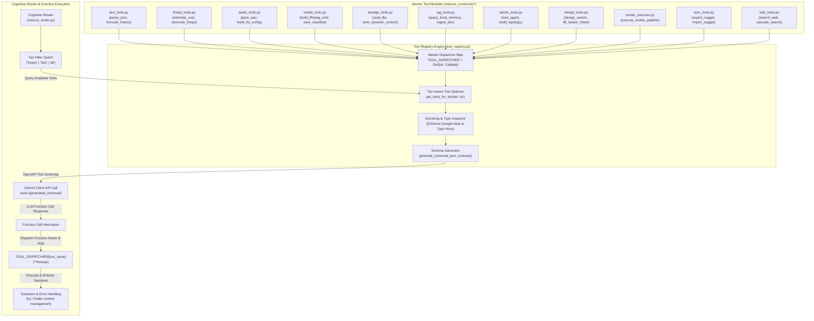
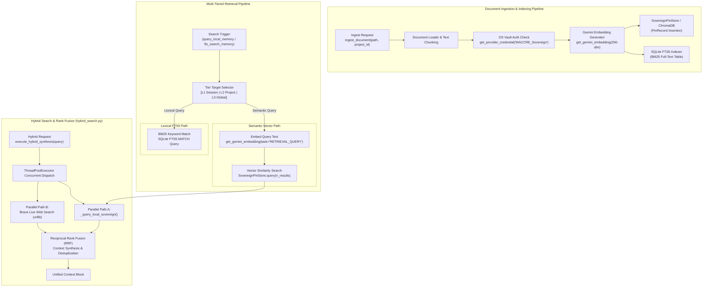
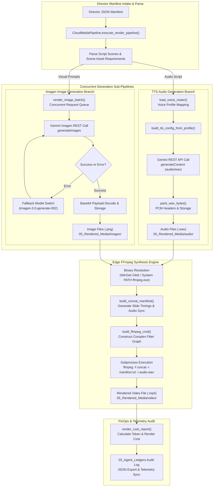
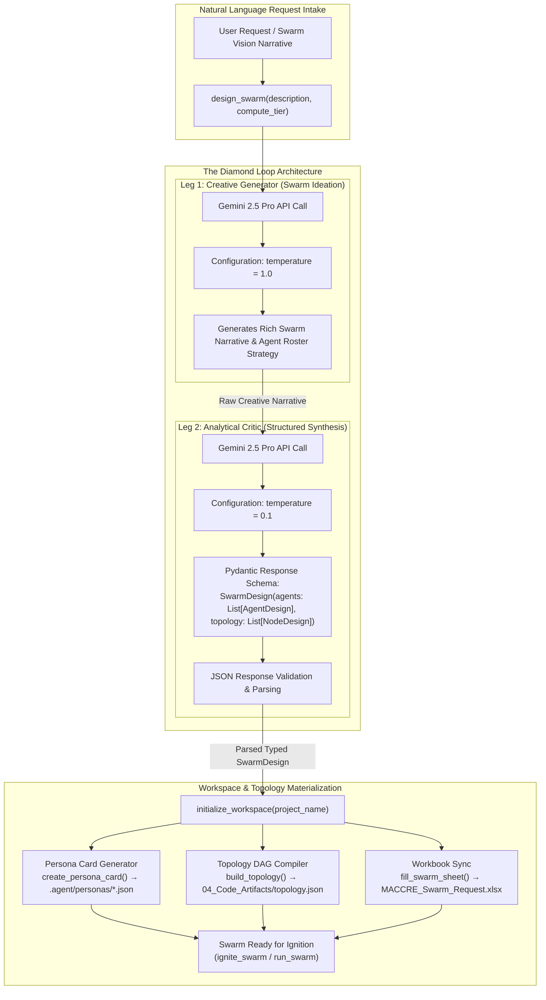
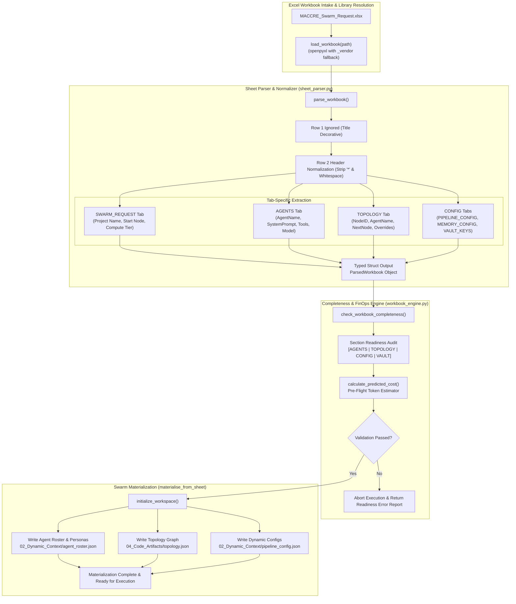

# GRANULAR ARCHITECTURAL FLOWCHARTS: TOOL EXECUTION SUITE, SOVEREIGN RAG & MEDIA ENGINE

**Target Document:** `B:\EXO_GANS\Analysis\Wave2\flowchart_04_tools_rag.md`  
**System Architecture:** MACCREv2 / EXO_GANS Sovereign Edge Framework  
**Law Revision:** 19.0 Compliance  

---

## SECTION 1: TOOL MANIFEST REGISTRATION & DISPATCH PIPELINE (`tool_registry.py`)

---

## SECTION 2: SOVEREIGN RAG VECTOR & FTS SEARCH PIPELINE (`rag_tools.py`, `hybrid_search.py`)

---

## SECTION 3: DUAL-PIPELINE MEDIA RENDER EXECUTOR (`render_executor.py`)

---

## SECTION 4: SWARM DESIGN ENGINE & DIAMOND LOOP ARCHITECTURE (`design_tools.py`)

---

## SECTION 5: EXCEL WORKBOOK SHEET PARSING & MATERIALIZATION PIPELINE (`sheet_parser.py`, `workbook_engine.py`)

