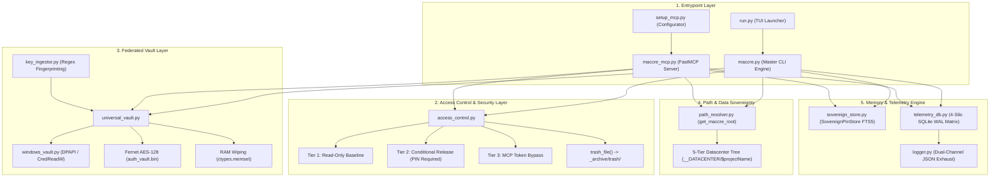
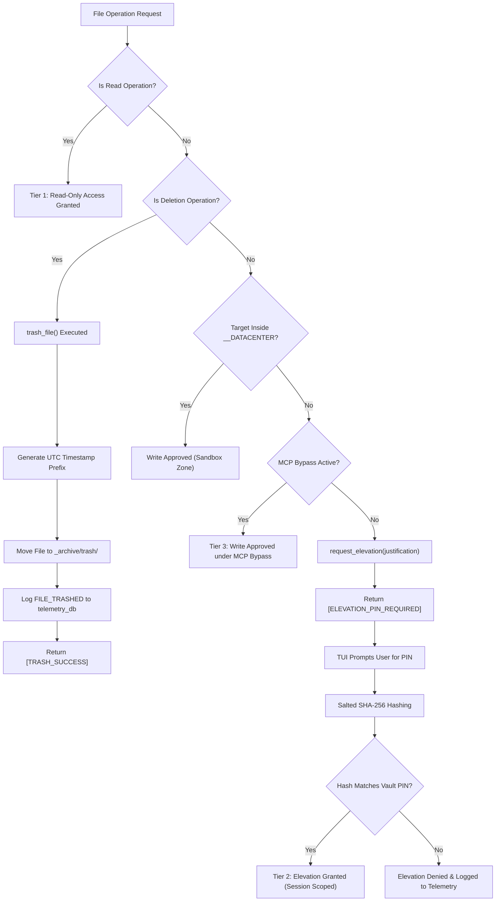
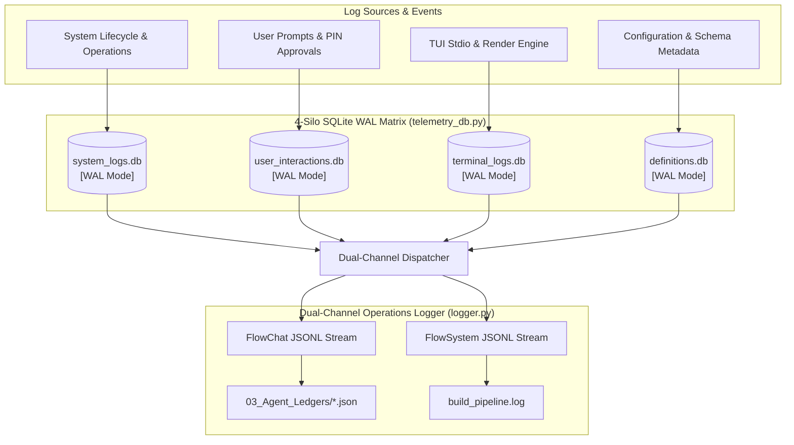
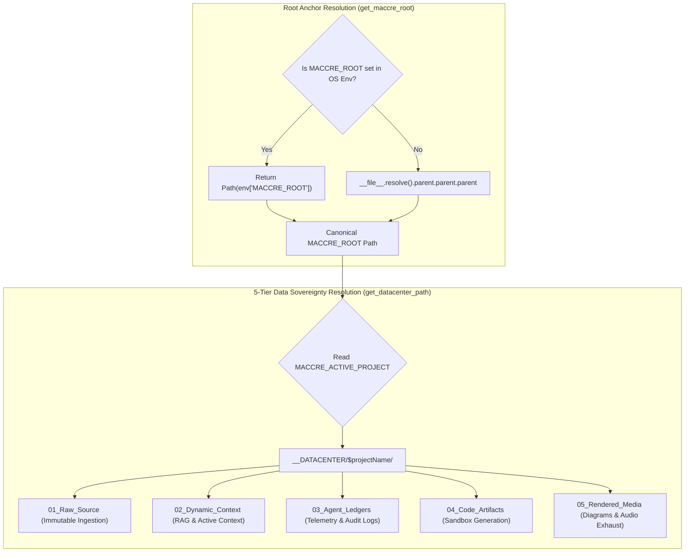
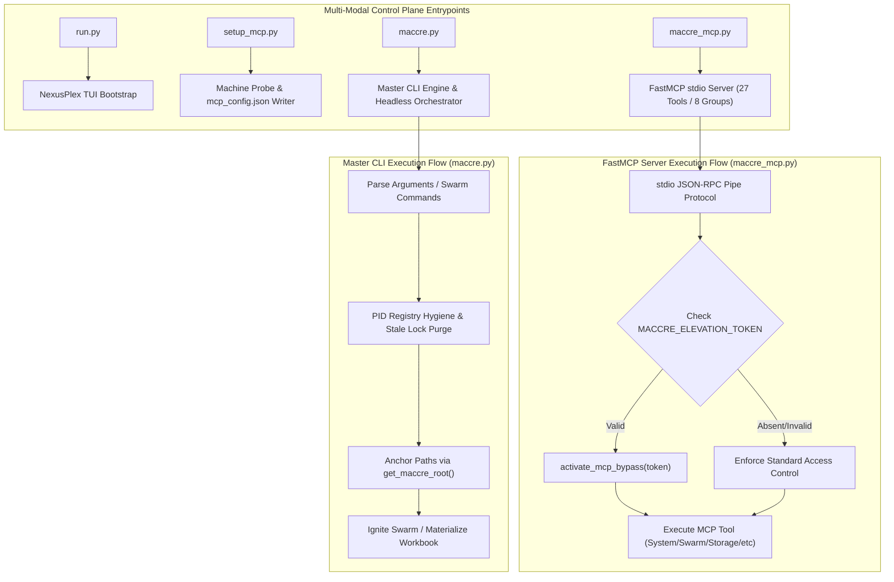

# Comprehensive Architecture Report: MACCREv2 State Sovereignty, Security & Storage Topology

**Engineering Standard**: MACCREv2 Doctrine (Law Rev 19.0)  
**Scope**: 3-Tier Access Control, Federated Vault, 4-Silo SQLite WAL Telemetry Matrix, SovereignPinStore FTS5 Memory, Root Path Resolution, and CLI/MCP Entrypoint Orchestration.

---

## 1. Master System Control Plane Architecture

---

## 2. Subsystem 1: 3-Tier Access Control & Deletion Safety Protocol

---

## 3. Subsystem 2: Federated OS / Fernet Vault & Key Ingestion

```mermaid
flowchart TD
    subgraph KeyIngestion ["Key Ingestion Pipeline (key_ingestor.py)"]
        RawInput["Raw Input / Clipboard Monitor"] --> RegexEngine{"Regex Vendor Pattern Match"}
        RegexEngine -- "Matched (Gemini/Claude/OpenAI/etc)" --> StoreVault["Store API Key in Vault"]
        StoreVault --> WipeClip["Sanitize Clipboard / Input Buffer"]
    end

    subgraph Retrieval ["Credential Retrieval Flow (universal_vault.py)"]
        ReqKey["Request Key: get_provider_credential(service)"] --> CheckKeyring{"Keyring / Windows DPAPI Available?"}
        
        CheckKeyring -- Yes --> CallDPAPI["CredReadW / CryptUnprotectData"]
        CheckKeyring -- No --> LoadFernet["Load auth_vault.bin"]
        LoadFernet --> DecryptFernet["Decrypt via AES-128 Fernet Key"]
        
        CallDPAPI --> ReturnBuffer["Return Plaintext Key Buffer"]
        DecryptFernet --> ReturnBuffer

        ReturnBuffer --> UseKey["Execute Provider API Call"]
        UseKey --> PurgeRAM["ctypes.memset(buffer, 0, len)"]
        PurgeRAM --> EndKey["Zero-Leak Memory State Restored"]
    end
```

---

## 4. Subsystem 3: 4-Silo SQLite WAL Telemetry & Operations Logging Matrix

---

## 5. Subsystem 4: Zero-Dependency Vector Memory & FTS5 Store (`SovereignPinStore`)

```mermaid
flowchart TD
    subgraph Ingestion ["Ingestion & Indexing"]
        Document["Document / Memory Triplet"] --> Vectorize["Generate Embedding Vector"]
        Vectorize --> SlotStruct["Instantiate PinRecord Dataclass"]
        SlotStruct --> VecBlob["_vec_to_blob(vector) -> BLOB"]
        VecBlob --> SQLiteStore[("SQLite SQLite WAL\nFTS5 Table (memory_pins.db)")]
    end

    subgraph Query ["Query Execution Pipeline"]
        SearchQuery["Search Query (Text + Query Vector)"] --> DirectFTS{"Query Type"}
        
        DirectFTS -- FTS Keyword Search --> FTSMatch["SQLite FTS5 MATCH Query"]
        DirectFTS -- Vector Hybrid Search --> FetchBlobs["Fetch Stored Vector BLOBs"]
        
        FetchBlobs --> BlobVec["_blob_to_vec(blob) -> float list"]
        BlobVec --> CosineCalc["_cosine_distance(q_vec, d_vec)"]
        
        FTSMatch --> Combine["Combine & Rank Results"]
        CosineCalc --> Combine
        Combine --> TopK["Return Top-K PinRecords"]
    end
```

---

## 6. Subsystem 5: Datacenter Root Anchoring & 5-Tier Path Resolution

---

## 7. Subsystem 6: CLI, MCP Server & Entrypoint Execution Flows

