# Comprehensive Master System Architecture: MACCREv2 / EXO_GANS Framework

**Target Output File Path:** `B:\EXO_GANS\Analysis\Wave3\MASTER_FLOWCHART.md`  
**Source Subsystems:** `maccre_core._net`, `maccre_core.orchestration`, `maccre_tui`, `maccre_core.tools`, `maccre_core.security`, `maccre_core.storage`  
**Reference Ledgers:** Wave 2 Flowchart Reports (01 through 05)  
**Law Revision:** 19.0 Compliance Verified  

---

## 1. EXECUTIVE SUMMARY & SUBSYSTEM INTEGRATION MATRIX

The MACCREv2 / EXO_GANS architecture is a zero-dependency, sovereign edge framework engineered for deterministic multi-agent swarm orchestration, multi-tier LLM inference, local vector/lexical retrieval, and zero-leak state sovereignty.

The framework operates across **6 Interconnected Control Planes**:
1. **Entrypoint & CLI Control Plane**: Bootstraps TUI (`run.py`), CLI orchestrator (`maccre.py`), FastMCP server (`maccre_mcp.py`), and setup tools (`setup_mcp.py`).
2. **Textual NexusPlex TUI Interface Subsystem (`maccre_tui`)**: Houses the 3-panel UI, interactive VCR transport controls, Agent Studio Arena, modal dialog stack, and dynamic TopologyVisualizer tree rendering.
3. **Orchestration Subsystem (`maccre_core/orchestration/`)**: Governs pre-flight DAG topology validation (`TopologyEngine`), deterministic control primitives (`deterministic_nodes.py`), the Swarm State Machine (`UniversalSwarmWorker`), and SQLite WAL concurrency queues (`LocalMessageBroker`).
4. **Tool Execution, RAG & Media Engine (`maccre_core/tools/`)**: Dispatches 11 atomic tool suites (`tool_registry.py`), dual-vector & BM25 lexical RAG (`rag_tools.py`, `SovereignPinStore`), Diamond Loop swarm design (`design_tools.py`), and FFmpeg video render pipeline (`render_executor.py`).
5. **Net & Client Transport Subsystem (`maccre_core/_net/`)**: Manages multi-tier compute routing (Ollama local, edge server, Gemini REST cloud via stdlib `urllib`), active model health sentinels (`ModelSentinel`), model surface classification (13 surfaces), failover chains, and native OOXML workbook packaging.
6. **State Sovereignty, Security & Vault Subsystem (`maccre_core/security/`, `storage/`)**: Enforces 3-Tier Access Control (`access_control.py`), federated DPAPI/Fernet key vault (`universal_vault.py`), root path anchoring (`path_resolver.py`), 5-Tier Datacenter isolation (`__DATACENTER/`), and 4-silo SQLite WAL telemetry matrix (`telemetry_db.py`).

---

## 2. MASTER SYSTEM ARCHITECTURE MERMAID DIAGRAM

```mermaid
flowchart TD
    subgraph Layer_1_Entrypoints["1. Entrypoints & Control Plane Layer"]
        E1["run.py (TUI Launcher)"]
        E2["maccre.py (Master CLI Orchestrator)"]
        E3["maccre_mcp.py (FastMCP stdio Server)"]
        E4["setup_mcp.py (MCP Configurator)"]
    end

    subgraph Layer_2_TUI["2. Textual NexusPlex TUI Interface Subsystem (maccre_tui)"]
        TUI_APP["NexusPlex App"]
        TUI_PANELS["3-Pane Layout: InfoPanel | NexusChat | MacroNodeWorkshop"]
        TUI_TREE["TopologyVisualizer (Rich Tree Node Renderer & Pulse Animation)"]
        
        subgraph VCR_State_Machine["VCR Transport Control State Machine"]
            VCR_IDLE["State: IDLE (Editable Topology)"]
            VCR_RUN["State: RUNNING (Pulsing Nodes, Engine Thread Active)"]
            VCR_PAUSED["State: PAUSED (Blocked Worker Thread)"]
            
            VCR_ACTIONS{"Paused Ops Stack"}
            VCR_INJECT["ContextInjectModalScreen (Ingest Context)"]
            VCR_CHAT["NodeLiveChatModal (Interactive Node Chat)"]
            VCR_TIME["Time-Travel Branching (Radio Dots)"]
        end

        TUI_STUDIO["AgentStudioChatScreen (3-Panel Arena: History | Arena | Builder)"]
        TUI_MODALS["Modal Stack Layer (Boot, Project, FinOps, FileCabinet, OnionBook)"]
    end

    subgraph Layer_3_Orchestration["3. Orchestration Subsystem (maccre_core/orchestration)"]
        FE_ENGINE["FlowEngine & TopologyEngine"]
        FE_PREFLIGHT{"Pre-Flight Validation Pipeline"}
        FE_CHECKS["1. CSV Header | 2. Entrypoint | 3. Macro Expansion\n4. DFS Cycle Check | 5. Unreachable Prune | 6. Dependencies"]

        BROKER["LocalMessageBroker (swarm_queue.db SQLite WAL)"]
        BROKER_ENQ["enqueue_task() / Scatter Operations"]
        BROKER_FETCH["fetch_and_lock_task() (BEGIN EXCLUSIVE)"]

        SWARM_WORKER["UniversalSwarmWorker Cycle Loop"]
        NODE_ROUTER{"is_deterministic_node(node_id)?"}

        subgraph Deterministic_Engine["Deterministic Node Execution Matrix"]
            DET_CTRL["Control Primitives: CTRL_ANCHOR, CTRL_RECURSION, CTRL_PAUSE, CTRL_CHECKPOINT, CTRL_END"]
            DET_DATA["Data Primitives: CTRL_SCATTER, CTRL_MERGE, CTRL_CONCAT, CTRL_PAYLOAD_INJECT"]
            DET_LOGIC["Logic Primitives: CTRL_GATE, CTRL_BRANCH, CTRL_FILTER, CTRL_CLEANUP"]
            DET_COND["CTRL_CONDITIONAL_ROUTE (4-Vector Matcher: Payload, Keyword, Confidence, Fuzzy)"]
        end

        subgraph Diamond_Loop_Protocol["The Diamond Loop Protocol"]
            DL_GEN["1. Creative Generator (temp=1.0)"]
            DL_TOOL_CHECK{"Tool Call Requested?"}
            DL_TOOL_EXEC["Execute Tool via Registry"]
            DL_CRITIC["2. Analytical Critic (temp=0.1)"]
            DL_VAL{"Pydantic / Schema Validation Passed?"}
        end
    end

    subgraph Layer_4_Tools["4. Tool Execution, RAG & Media Subsystem (maccre_core/tools)"]
        TOOL_REGISTRY["ToolRegistry (Master Dispatcher Map: TOOL_DISPATCHER)"]
        TOOL_MODULES["11 Atomic Tool Modules:\ntext, finops, audio, media, storage, rag, admin, design, render, sync, web"]
        
        subgraph RAG_Pipeline["Sovereign RAG Search Engine (hybrid_search.py)"]
            RAG_INTAKE["Ingest Document / Memory Triplet"]
            RAG_VEC["Gemini Embedding Generator (256-dim)"]
            RAG_FTS["SQLite FTS5 BM25 Lexical Indexer"]
            RAG_RRF["Reciprocal Rank Fusion (RRF) Context Synthesizer"]
            RAG_WEB["Brave Live Web Search Engine"]
        end

        subgraph Media_Render_Engine["Dual-Pipeline Media Render Executor (render_executor.py)"]
            MEDIA_MANIFEST["Director JSON Manifest Intake"]
            MEDIA_TTS["Gemini REST TTS WAV Audio Branch"]
            MEDIA_IMG["Imagen 3 Image Batch Branch (with Failover Switch)"]
            MEDIA_FFMPEG["Edge FFmpeg Complex Filter Graph Video Stitcher"]
        end

        subgraph Swarm_Design_Engine["Swarm Design & Excel Engine"]
            SWARM_DESIGN["design_swarm() → Diamond Loop Ideation & Synthesis"]
            SHEET_PARSER["sheet_parser.py (MACCRE_Swarm_Request.xlsx Ingestion)"]
            WORKBOOK_ENGINE["workbook_engine.py (Completeness & FinOps Estimator)"]
        end
    end

    subgraph Layer_5_Net["5. Net Transport & Model Sentinel Subsystem (maccre_core/_net)"]
        OMNI_DAEMON["OmniDaemon.generate(prompt, schema, tier)"]
        SCHEMA_EXTRACT["Dataclass-to-JSON Schema Extraction Engine"]
        ENV_PROBE["get_environment_matrix() (Ollama Probe & CPU Count Check)"]

        subgraph Transport_Router["Multi-Tier Transport Router"]
            ROUTE_LOCAL["Local Tier: Ollama (gemma, localhost:11434)"]
            ROUTE_EDGE["Edge Tier: Personal Cloud (OpenAI API Compatible)"]
            ROUTE_CLOUD["Cloud Tier: GeminiClient (urllib.request REST API)"]
        end

        subgraph Gemini_REST_Client["GeminiClient REST Surface Engine"]
            REST_ENDPOINTS["POST generateContent | streamGenerateContent\embedContent | File API | cachedContents"]
            REST_HEADER["x-goog-api-key Ingestion & RAM Purge"]
        end

        subgraph Model_Sentinel["ModelSentinel Health Daemon & Surface Classifier"]
            SENTINEL_PROBE["Background Catalog Diffing Thread (1800s interval)"]
            SENTINEL_TELEMETRY["Call-Site Sliding Window Error Rate Tracker (maxlen=20)"]
            SENTINEL_STATES["Health States: HEALTHY | DEGRADED (≥30%) | DIED (100%) | QUOTA_EXHAUSTED"]
            SURFACE_CLASSIFIER["13 Model Surface Surfaces (TEXT, TTS, IMAGE, LIVE, EMBEDDING, VEO, etc.)"]
            FAILOVER_ENGINE["get_failover_chain() (Tier & Health Aware Failover Chains)"]
        end

        OOXML_ENGINE["Sovereign OOXML Zip Packaging Engine (Workbook, Worksheet, StyleRegistry xf Map)"]
    end

    subgraph Layer_6_State["6. State Sovereignty, Security & Vault Subsystem"]
        subgraph Access_Control_System["3-Tier Access Control (access_control.py)"]
            AC_T1["Tier 1: Read-Only Access Baseline"]
            AC_T2["Tier 2: Conditional Elevation (Salted SHA-256 PIN Verification)"]
            AC_T3["Tier 3: MCP Token Bypass (MACCRE_ELEVATION_TOKEN)"]
            AC_TRASH["trash_file() Protocol → _archive/trash/ (UTC Timestamp Prefix)"]
        end

        subgraph Federated_Vault_System["Federated Key Vault (universal_vault.py & key_ingestor.py)"]
            KEY_INGEST["key_ingestor.py (Regex Pattern Matching & Clipboard Sanitization)"]
            VAULT_DPAPI["Windows DPAPI (CredReadW / CryptUnprotectData)"]
            VAULT_FERNET["Fernet AES-128 Encrypted Backup (auth_vault.bin)"]
            VAULT_RAM["RAM Zero-Leak Protocol (ctypes.memset)"]
        end

        subgraph Path_And_Datacenter["Path Anchor & 5-Tier Datacenter"]
            PATH_RESOLVER["path_resolver.py → get_maccre_root() (OS Env & Traversal Anchor)"]
            DC_TIER1["01_Raw_Source (Immutable File Storage)"]
            DC_TIER2["02_Dynamic_Context (RAG Vectors, Roster JSON, Flow State)"]
            DC_TIER3["03_Agent_Ledgers (Telemetry JSON ledgers, Audit Logs, Checkpoints)"]
            DC_TIER4["04_Code_Artifacts (Generated Python Scripts & Topologies)"]
            DC_TIER5["05_Rendered_Media (Stitching Artifacts, MP4, WAV, PNG)"]
        end

        subgraph Memory_And_Telemetry["Memory Engine & Telemetry Matrix"]
            PIN_STORE["SovereignPinStore (SQLite WAL & FTS5 memory_pins.db)"]
            TELEMETRY_MATRIX["4-Silo SQLite WAL Matrix (system_logs, user_interactions, terminal_logs, definitions)"]
            DUAL_LOGGER["Dual-Channel JSON Exhaust Logger (logger.py → FlowChat & FlowSystem)"]
        end
    end

    %% =================================================================
    %% INTER-SUBSYSTEM FLOW CONNECTIONS
    %% =================================================================

    %% 1. Entrypoints Connections
    E1 -->|Bootstrap TUI| TUI_APP
    E2 -->|Direct Execution| FE_ENGINE
    E3 -->|JSON-RPC Stdio| AC_T3
    E3 -->|Dispatch Tools| TOOL_REGISTRY
    E4 -->|Generate Config| E3

    %% 2. TUI Connections
    TUI_APP --> TUI_PANELS
    TUI_PANELS --> TUI_TREE
    TUI_APP --> VCR_State_Machine
    TUI_APP --> TUI_STUDIO
    TUI_APP --> TUI_MODALS

    VCR_PAUSED --> VCR_ACTIONS
    VCR_INJECT -->|Write Injected Context| DC_TIER2
    VCR_CHAT -->|Live Chat Step| OMNI_DAEMON
    VCR_IDLE & VCR_RUN <-->|Control DAG Flow| FE_ENGINE

    %% 3. Orchestration Engine Connections
    FE_ENGINE --> FE_PREFLIGHT --> FE_CHECKS
    FE_PREFLIGHT -- "Passed" --> BROKER
    BROKER --> BROKER_ENQ & BROKER_FETCH
    BROKER_FETCH --> SWARM_WORKER
    SWARM_WORKER --> NODE_ROUTER

    NODE_ROUTER -- "True (CTRL_/DET_)" --> Deterministic_Engine
    NODE_ROUTER -- "False (AI Agent)" --> Diamond_Loop_Protocol

    Deterministic_Engine -->|Update Payload & Status| BROKER
    Deterministic_Engine -- "CTRL_PAUSE" --> VCR_PAUSED
    Deterministic_Engine -- "CTRL_CHECKPOINT" --> DC_TIER3

    DL_GEN -->|Request Model Generation| OMNI_DAEMON
    DL_GEN --> DL_TOOL_CHECK
    DL_TOOL_CHECK -- "Yes" --> DL_TOOL_EXEC --> TOOL_REGISTRY
    DL_TOOL_EXEC --> DL_GEN
    DL_TOOL_CHECK -- "No" --> DL_CRITIC --> OMNI_DAEMON
    DL_CRITIC --> DL_VAL
    DL_VAL -- "Pass" --> DC_TIER4 & BROKER
    DL_VAL -- "Fail (Retry Exceeded)" --> TELEMETRY_MATRIX

    %% 4. Tools & RAG Connections
    TOOL_REGISTRY --> TOOL_MODULES
    TOOL_MODULES -- "rag_tools" --> RAG_Pipeline
    TOOL_MODULES -- "render_executor" --> Media_Render_Engine
    TOOL_MODULES -- "design_tools" --> Swarm_Design_Engine

    RAG_INTAKE --> RAG_VEC & RAG_FTS
    RAG_VEC --> PIN_STORE
    RAG_FTS --> PIN_STORE
    RAG_Pipeline --> RAG_RRF <--> RAG_WEB

    MEDIA_MANIFEST --> MEDIA_TTS & MEDIA_IMG
    MEDIA_TTS --> OMNI_DAEMON
    MEDIA_IMG --> OMNI_DAEMON
    MEDIA_TTS & MEDIA_IMG --> MEDIA_FFMPEG --> DC_TIER5

    SWARM_DESIGN --> SHEET_PARSER --> WORKBOOK_ENGINE
    WORKBOOK_ENGINE --> OOXML_ENGINE

    %% 5. Net Layer Connections
    OMNI_DAEMON --> SCHEMA_EXTRACT --> ENV_PROBE --> Transport_Router
    Transport_Router --> ROUTE_LOCAL & ROUTE_EDGE & ROUTE_CLOUD
    ROUTE_CLOUD --> Gemini_REST_Client
    Gemini_REST_Client --> REST_ENDPOINTS & REST_HEADER
    REST_HEADER --> VAULT_RAM

    Model_Sentinel --> SENTINEL_PROBE & SENTINEL_TELEMETRY --> SENTINEL_STATES
    SENTINEL_STATES --> SURFACE_CLASSIFIER --> FAILOVER_ENGINE
    FAILOVER_ENGINE --> Transport_Router

    %% 6. Security, Storage & Telemetry Connections
    AC_T1 & AC_T2 & AC_T3 --> PATH_RESOLVER
    AC_TRASH --> DC_TIER3
    KEY_INGEST --> VAULT_DPAPI & VAULT_FERNET
    VAULT_DPAPI & VAULT_FERNET --> REST_HEADER
    PATH_RESOLVER --> DC_TIER1 & DC_TIER2 & DC_TIER3 & DC_TIER4 & DC_TIER5

    BROKER & SWARM_WORKER & OMNI_DAEMON & TOOL_REGISTRY --> DUAL_LOGGER
    DUAL_LOGGER --> TELEMETRY_MATRIX
    TELEMETRY_MATRIX --> DC_TIER3
```

---

## 3. CROSS-SUBSYSTEM INTERFACING CONTRACTS

1. **Entrypoint to Security & Control Plane (`maccre.py` / `maccre_mcp.py` → `access_control.py`)**: Checks `access_control.verify_permission()`. Hard deletions route to `trash_file()`, moving artifacts into `_archive/trash/` with UTC timestamp prefixes.
2. **TUI Interface to Orchestration Engine (`maccre_tui` → `maccre_core/orchestration`)**: Listens to ZMQ PUB notifications from `LocalMessageBroker`. Animates `TopologyVisualizer` tree nodes. Pauses worker threads on `CTRL_PAUSE`/`CTRL_REVIEW` nodes for context injection or live node chat.
3. **Swarm Worker to Tool Execution & The Diamond Loop (`UniversalSwarmWorker` → `tool_registry.py` / `maccre_router.py`)**: Intercepts `CTRL_` nodes for pure Python execution. AI nodes execute Generator (temp=1.0) + Critic (temp=0.1 + schema) Diamond Loop.
4. **Tool Execution to Sovereign RAG & Media Engine (`tool_registry.py` → `rag_tools.py` / `render_executor.py`)**: Executes RAG vector (256-dim) + BM25 FTS5 hybrid search with RRF rank fusion. Render executor generates TTS audio and Imagen images concurrently, stitching video via edge FFmpeg.
5. **Orchestration to Net Transport & Model Sentinel (`maccre_core/orchestration` → `maccre_core/_net`)**: Probes host capabilities to route local (Ollama), edge (personal cloud), or cloud (Gemini REST via standard library `urllib`). Sentinel tracks live error rates to route around degraded/dead models.
6. **System-Wide Telemetry & Vault Security**: Credentials fetched on demand from DPAPI/Fernet, zeroed out in RAM post-call via `ctypes.memset`. Telemetry streams to 4-silo SQLite WAL matrix and dual-channel JSONL ledgers.
