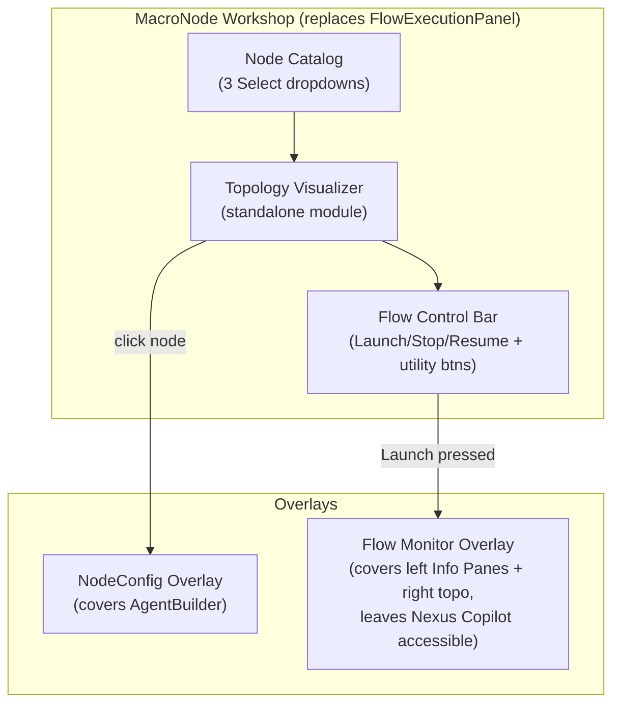

# NexusPlex v2 — Topology-First Architecture Refactor

**Git Rollback Point:** `950996f` — `PRE-REFACTOR ROLLBACK POINT`
**Commit Artifact:** [TUI_REFACTOR_PLAN.md](file:///B:/EXO_GANS/TUI_REFACTOR_PLAN.md)

---

## Current TUI Layout → New TUI Layout

````carousel
```
CURRENT LAYOUT (NexusPlex v1)
┌──────────────────────────────────────────────────────────────┐
│ CustomHeader (project btns, FinOpsBuddy, OnionBook)          │
├──────────────┬───────────────────────────────────────────────┤
│ LEFT PANE    │ RIGHT PANE                                    │
│              │                                               │
│ MacroNode    │  ┌─ AgentBuilder ──┬─ FlowExecution ────────┐ │
│ Builder      │  │ Model/Tools/    │ [Macro▼] [Agent▼] [Spc▼]│ │
│ Panel        │  │ Search Config   │  + Detail Panels        │ │
│ (648 lines)  │  │                 │ ──────────────────────  │ │
│              │  │                 │ Flow Line (horizontal)  │ │
│ ─────────── │  │                 │ ──────────────────────  │ │
│              │  │                 │ Flow Monitor + VCR      │ │
│ Nexus        │  │                 │ Stage Readout + Log     │ │
│ Copilot      │  │                 │ ──────────────────────  │ │
│ (collapsible)│  │                 │ [Launch][Stop][Resume]   │ │
│              │  └─────────────────┴────────────────────────┘ │
├──────────────┴───────────────────────────────────────────────┤
│ Footer                                                       │
└──────────────────────────────────────────────────────────────┘
```
<!-- slide -->
```
NEW LAYOUT (NexusPlex v2 — Topology-First)
┌──────────────────────────────────────────────────────────────┐
│ CustomHeader (unchanged)                                     │
├──────────────┬───────────────────────────────────────────────┤
│ LEFT PANE    │ RIGHT PANE                                    │
│              │                                               │
│ Information  │  ┌─ AgentBuilder ──┬─ MacroNode Workshop ───┐ │
│ Panes        │  │ (unchanged)     │ [MacroNode▼] [Agent▼]  │ │
│ ┌─ MacroNode │  │                 │ [ControlNode▼]          │ │
│ │  Details   │  │                 │ ──────────────────────  │ │
│ ├─ Agent     │  │ NodeConfig      │ Topology Visualizer     │ │
│ │  Details   │  │ Overlay         │ (vertical DAG tree)     │ │
│ ├─ Control   │  │ (covers Agent   │ [click nodes to config] │ │
│ │  Node Dtls │  │  Builder when   │ ──────────────────────  │ │
│ ├─ Instruct. │  │  node clicked)  │ [Launch][Stop][Resume]   │ │
│ ├─ Config    │  │                 │ + Session/Chat/File btns│ │
│ └─ As-Wrapped│  │ Flow Monitor    │                         │ │
│ ─────────── │  │ Overlay         │                         │ │
│ Nexus        │  │ (covers Info    │                         │ │
│ Copilot      │  │  Panes when     │                         │ │
│ (unchanged)  │  │  flow running)  │                         │ │
│              │  └─────────────────┴────────────────────────┘ │
├──────────────┴───────────────────────────────────────────────┤
│ Footer                                                       │
└──────────────────────────────────────────────────────────────┘
```
````

---

## Surface Audit Summary

### Inventory (31 Textual Classes)

| Category | Count | Files |
|----------|-------|-------|
| Modal Screens | 21 | nexus_plex.py (14), widgets/ (7) |
| Inline Panels/Widgets | 10 | nexus_plex.py (7), widgets/ (3) |
| **Orphaned (dead)** | **3** | EditAgentModal, AgentChatInputModalScreen, PhysicsMonitor |
| **Bugs Found** | **3** | `_finish_flow_execution` (should be `_finish_flow`), `_refresh_flow_line` (should be `_refresh_active_flow_sequence`), `update_app_title` (doesn't exist) |

### Surface Migration Map

| Current Surface | Fate | New Home |
|----------------|------|----------|
| `MacroNodeBuilderPanel` (left pane) | **RETIRED** — logic preserved as reference | Topology Visualizer + Node Catalog absorb its function |
| `FlowExecutionPanel` (right pane) | **RETIRED** — logic migrated | MacroNode Workshop (same position) |
| `FlowRegistryModalScreen` | **DELETED** | — |
| `NodeConfigModal` | **PRESERVED** → becomes overlay on Agent Builder | Same modal, overlay positioning |
| `NexusChat` | **UNCHANGED** | Left pane bottom |
| `AgentBuilderPanel` | **UNCHANGED** | Right pane left column |
| `CustomHeader` | **UNCHANGED** | Top |
| `AgentStudioChatScreen` | **UNCHANGED** | Full-screen modal |
| `SessionManagerModal` | **MODIFIED** — "Save to Registry" becomes "Save as MacroNode Template" | Same modal, rewired button |
| `BudgetProposalModal` | **MODIFIED** — "DET_REVIEW" label → "CTRL_REVIEW" | Same modal, label change |
| `MacroNodeEditorModal` | **RETIRED** — absorbed into Topology Visualizer | Node click → NodeConfig overlay |
| Detail Panels (#macro-info-body, #agent-info-body, #special-info-body) | **MIGRATED** → left pane Information Panes | New collapsible panes |
| `EditAgentModal` | **DELETED** (orphaned) | — |
| `AgentChatInputModalScreen` | **DELETED** (orphaned) | — |
| `PhysicsMonitor` | **DELETED** (orphaned) | — |

---

## DET_ → CTRL_ Rename Surgery

### Impact Assessment (10 files, ~80 lines)

| File | Refs | Category | Change Type |
|------|------|----------|-------------|
| [deterministic_nodes.py](file:///B:/EXO_GANS/maccre_core/orchestration/deterministic_nodes.py) | 40 | Core logic | `DET_PREFIX = "CTRL_"`, enum values, log messages, docstrings |
| [flow_engine.py](file:///B:/EXO_GANS/maccre_core/orchestration/flow_engine.py) | 8 | Dispatch | `"DET_REVIEW"` → `"CTRL_REVIEW"`, special_nodes set |
| [local_broker.py](file:///B:/EXO_GANS/maccre_core/orchestration/local_broker.py) | 2 | Intercept | `"DET_REVIEW"` and `"DET_PAUSE"` string matches |
| [swarm_worker.py](file:///B:/EXO_GANS/maccre_core/orchestration/swarm_worker.py) | 1 | Dispatch | `"DET_REVIEW"` string match in group chat |
| [nexus_plex.py](file:///B:/EXO_GANS/maccre_tui/nexus_plex.py) | 20 | UI strings | Hardcoded lists, description maps, comment refs |
| [macronode_builder_panel.py](file:///B:/EXO_GANS/maccre_tui/widgets/macronode_builder_panel.py) | 8 | UI strings | special_nodes list |
| [finops_modals.py](file:///B:/EXO_GANS/maccre_tui/widgets/finops_modals.py) | 1 | UI label | `"DET_REVIEW: Budget Proposal"` |
| [_finop_daemon_.py](file:///B:/EXO_GANS/maccre_core/finops/_finop_daemon_.py) | 1 | Comment | Docstring reference |
| [ledger_interface.py](file:///B:/EXO_GANS/maccre_core/finops/ledger_interface.py) | 1 | Comment | Docstring reference |
| [macro_editor_modal.py](file:///B:/EXO_GANS/maccre_tui/macro_editor_modal.py) | 5 | UI strings | special_nodes list |

### Migration Strategy: Dual-Prefix Support

```python
# deterministic_nodes.py — Phase 0 change
CTRL_PREFIX = "CTRL_"
DET_PREFIX = "DET_"  # Backward compat

def is_control_node(node_id: str) -> bool:
    upper = node_id.strip().upper()
    return upper.startswith(CTRL_PREFIX) or upper.startswith(DET_PREFIX)
```

> [!WARNING]
> **Data Migration Required:** Any saved MacroNode templates in `macronode_registry.db` that reference `DET_*` node names in their `topology_rows` will need a one-time migration. Also, any running topologies in `swarm_queue.db` with `DET_*` current_node values must work during the transition. Dual-prefix support ensures backward compatibility.

**No CSS changes needed** — DET_ never appeared in CSS selectors.

### Markdown/Doc Files to Update (Non-Breaking)

These are documentation updates that can happen at any time:
- `Era2_architectural_roadmap.md`, `FeatureRequests.md`, `MacroNode_System-Comprehensive Analysis Report.md`
- `architectural_roadmap.md`, `architectural_roadmap-report.md`, `oracle_review.md`
- `DETplanning.md`, `DETplanning-TUI Refactor.md`

---

## Flow Registry Deprecation

### Removal Checklist (15 items, 3 files + 1 DB)

| # | File | Action | Lines |
|---|------|--------|-------|
| 1 | `maccre_core/flow_registry.py` | **DELETE** entire file | 1-99 |
| 2 | `nexus_plex.py` | **DELETE** `FlowRegistryModalScreen` | L1717-1793 |
| 3 | `nexus_plex.py` | **DELETE** `#main-flow-load-select` widget | L2044 |
| 4 | `nexus_plex.py` | **DELETE** `_populate_flow_registry_dropdown()` call | L2230 |
| 5 | `nexus_plex.py` | **DELETE** `_populate_flow_registry_dropdown()` method | L3074-3084 |
| 6 | `nexus_plex.py` | **DELETE** `on_main_flow_load()` handler | L3086-3121 |
| 7 | `nexus_plex.py` | **MODIFY** canonize block — remove flow save | L3183-3188 |
| 8 | `nexus_plex.py` | **DELETE** `elif action == "save_registry"` block | L3196-3210 |
| 9 | `nexus_plex.py` | **DELETE** `action_flow_registry()` (already orphaned) | L3229-3267 |
| 10 | `local_broker.py` | **DELETE** `rename_flow()` try/except | L249-255 |
| 11 | `session_manager_modal.py` | **MODIFY** button → "Save as MacroNode Template" | L93 |
| 12 | `session_manager_modal.py` | **MODIFY** enable/disable logic | L195, 226 |
| 13 | `session_manager_modal.py` | **REWIRE** handler to save topology as MacroNode template | L275-287 |
| 14 | `__DATACENTER/GLOBAL/GLOBAL/flow_registry.db` | **DELETE** file | — |
| 15 | All `FlowRegistryStore` imports | **REMOVE** | 4 import sites |

> [!NOTE]
> **`autosave_flow.json` is INDEPENDENT** — it's the design-time save/restore system and must be preserved. `save_flow_history` in `session_manager.py` is also independent (execution history).

### "Save as MacroNode Template" Rewire

When user clicks "Save as MacroNode Template" in Session Manager:
1. Load completed session's topology from `swarm_queue.db`
2. Strip agent assignments → keep only structural topology (node roles, Wait_For, Next_Node)
3. Auto-detect template type from topology shape (or default to "custom")
4. Call `get_macronode_store().save(name, description, template_type, topology_rows, {})`
5. The saved template becomes available in the Node Catalog for slotting agents into

---

## controlnode_registry.db — Schema & Seeding

### Schema

```sql
CREATE TABLE IF NOT EXISTS controlnode_registry (
    name            TEXT PRIMARY KEY,
    category        TEXT NOT NULL,
    description     TEXT DEFAULT '',
    config_schema   TEXT DEFAULT '{}',
    handler_module  TEXT NOT NULL,
    handler_func    TEXT NOT NULL,
    is_builtin      INTEGER DEFAULT 1,
    deprecated      INTEGER DEFAULT 0,
    status          TEXT DEFAULT 'active',
    created_at      TEXT NOT NULL,
    updated_at      TEXT NOT NULL
);
```

### Seed Data (23 entries)

| Name | Category | Status | Handler |
|------|----------|--------|---------|
| **CTRL_ANCHOR** | Flow Control | `active` | `_handle_anchor` |
| **CTRL_PAUSE** | Flow Control | `active` | `_handle_pause` |
| **CTRL_REVIEW** | HITL | `active` | (broker intercept) |
| **CTRL_GATE** | Flow Control | `active` | `_handle_gate` |
| **CTRL_CHECKPOINT** | State Mgmt | `active` | `_handle_checkpoint` |
| **CTRL_DELAY** | Flow Control | `active` | `_handle_delay` |
| **CTRL_TRANSFORM** | Data Flow | `active` | `_handle_transform` |
| **CTRL_RECURSION** | Loop Control | `active` | `_handle_recursion` |
| **CTRL_MERGE** | Data Flow | `{ComingSoon}` | — |
| **CTRL_CONCAT** | Data Flow | `{ComingSoon}` | — |
| **CTRL_SCATTER** | Data Flow | `{ComingSoon}` | — |
| **CTRL_BRANCH** | Routing | `{ComingSoon}` | — |
| **CTRL_CONDITIONAL_ROUTE** | Routing | `{ComingSoon}` | — |
| **CTRL_DIALOG** | Orchestration | `{ComingSoon}` | — |
| **CTRL_MEDIA_PROBE** | Media | `{ComingSoon}` | — |
| **CTRL_RENDER_STITCH** | Media | `{ComingSoon}` | — |
| **CTRL_MANIFEST** | Media | `{ComingSoon}` | — |
| **CTRL_USER_REVIEW** | HITL | `{ComingSoon}` | — |
| **CTRL_FILTER** | Data Flow | `{ComingSoon}` | — |
| **CTRL_EXTRACT** | Data Flow | `{ComingSoon}` | — |
| **CTRL_WEBHOOK** | External | `{ComingSoon}` | — |
| **CTRL_CLEANUP** | State Mgmt | `{ComingSoon}` | — |
| **CTRL_CHAT** | Orchestration | `{ComingSoon}` | — |

---

## Left Pane: Information Panes Design

### Existing Info Logic to Migrate

| Source | Data Shown | New Pane |
|--------|-----------|----------|
| `#macro-info-body` (RichLog, nexus_plex L2982-3025) | MacroNode description, agent slots, models, tools, system prompts | **MacroNode Details** |
| `#agent-info-body` (RichLog, nexus_plex L3027-3049) | Agent name, model, temperature, system prompt | **Agent Details** |
| `#special-info-body` (Static, nexus_plex L3051-3066) | DET node description from hardcoded `desc_map` | **Control Node Details** |
| `#me-info-body` (RichLog, macronode_builder_panel) | Selected agent profile in MacroNode builder | → merge into **Agent Details** |
| `#augment_preview` (macronode_builder_panel) | Structural augment preview text | **As-Wrapped** |

### Collapse/Expand Behavior

Existing pattern: Nexus Copilot uses `#btn-toggle-nexus` to toggle `-expanded` CSS class on `NexusChat`. The Information Panes will replicate this pattern:

```python
class InfoPane(Vertical):
    """Collapsible information pane matching NexusChat height."""
    def __init__(self, title: str, default_expanded: bool = False) -> None:
        ...
    
    def compose(self) -> ComposeResult:
        with Horizontal(classes="info-pane-header"):
            yield Label(f"[bold]{self.title}[/]")
            yield Button("▼" if self.default_expanded else "▶", 
                        classes="info-toggle-btn")
        yield VerticalScroll(classes="info-pane-body")
```

**Default states:**
- **Expanded:** MacroNode Details, Agent Details, Control Node Details
- **Collapsed:** Instructions, Configuration, As-Wrapped

**Context-sensitive behavior:**
When user clicks a node → NodeConfig overlay appears → Details panes collapse, Instructional/Config panes expand. User can manually override any pane state at any time.

---

## Right Pane: MacroNode Workshop

### Component Architecture



### Migrated Button Inventory

All buttons from FlowExecutionPanel migrate to MacroNode Workshop flow control bar:

| Button | ID | Current Handler | Migration |
|--------|----|----|------------|
| Launch Flow | `#btn-launch-flow` | L3555-3608 | **PRESERVE** handler logic |
| Stop Flow | `#btn-stop-flow` | L3655-3675 | **PRESERVE** |
| Resume Flow | `#btn-resume-flow` | L3897-3940 | **PRESERVE** |
| Rewind Flow | `#btn-rewind-flow` | L3823-3827 | **PRESERVE** |
| Create Payload | `#btn-create-payload` | L2743 | **PRESERVE** |
| Session Manager | `#btn-session-manager` | L3218 | **PRESERVE** |
| Chat Studio | `#btn-agent-chat` | L2326 | **PRESERVE** |
| File Cabinet | `#btn-file-cabinet` | L3962 | **PRESERVE** |
| Remove Last Node | `#btn-remove-last` | L3068 | **PRESERVE** |
| Clear Flow | `#btn-clear-flow` | L3123 | **PRESERVE** |
| VCR Button | `#btn-vcr` | L2772-2800 | **PRESERVE** |

### Topology Visualizer Features

| Feature | Design-Time (idle) | Execution-Time (running/paused) |
|---------|-------------------|-------------------------------|
| Canvas | Vertical DAG tree, editable | Same tree, read-only with highlights |
| Node interaction | Click → NodeConfig overlay | Click → view node status/output |
| Animation | None | Active node pulses, completed nodes dimmed |
| Arrows | Static gold | Animated flow direction indicators |
| VCR controls | Hidden | Visible (pause/resume/rewind) |

### Flow Monitor Overlay

- **Trigger:** Appears when Launch Flow is pressed
- **Coverage:** Covers the left pane Information Panes + right pane (but NOT Nexus Copilot)
- **Contains:** Flow Stage Readout, Flow Execution Log (`#flow-execution-log`), Pre-flight override
- **Dismiss:** Auto-dismisses when flow completes; manual dismiss via close button
- **Nexus Copilot remains accessible** — user can ask Copilot questions during execution

---

## Phased Implementation Plan

### Phase 0: Foundation (No UI Changes)

| Task | File | Change |
|------|------|--------|
| Create `ControlNodeStore` ABC | `maccre_core/controlnode_registry.py` | [NEW] ABC + SQLite impl |
| Create `controlnode_registry.db` | — | Seed with 23 entries |
| Add dual-prefix support | `deterministic_nodes.py` | `CTRL_PREFIX` + `DET_PREFIX` both recognized |
| Add `deprecated` column | `macronode_registry.py` | `ALTER TABLE` migration |
| Fix save handler bug | `nexus_plex.py` L2342 | Use keyword args on `store.save()` |
| Fix 3 bugs from audit | `nexus_plex.py` | `_finish_flow_execution` → `_finish_flow`, etc. |

### Phase 1: Deprecation & Cleanup

| Task | File | Change |
|------|------|--------|
| Delete `flow_registry.py` | `maccre_core/flow_registry.py` | [DELETE] |
| Delete `FlowRegistryModalScreen` | `nexus_plex.py` L1717-1793 | [DELETE] |
| Remove all Flow Registry consumers | `nexus_plex.py` (6 sites) | [DELETE/MODIFY] |
| Rewire Session Manager button | `session_manager_modal.py` | "Save as MacroNode Template" |
| Remove Flow Registry from broker | `local_broker.py` L249-255 | [DELETE] |
| Delete orphaned surfaces | `nexus_plex.py` | EditAgentModal, AgentChatInputModalScreen |
| Delete PhysicsMonitor | `widgets/physics_monitor.py` | [DELETE] |
| Delete `flow_registry.db` | `__DATACENTER/GLOBAL/GLOBAL/` | [DELETE] file |

### Phase 2: Left Pane Transformation

| Task | File | Change |
|------|------|--------|
| Create `InfoPane` widget | `maccre_tui/widgets/info_panes.py` | [NEW] Collapsible pane component |
| Create `InformationPanel` container | `maccre_tui/widgets/info_panes.py` | [NEW] Stack of InfoPanes |
| Migrate info panel population logic | From nexus_plex.py L2982-3066 | Move handlers to new panes |
| Replace MacroNodeBuilderPanel | `nexus_plex.py` compose() | InformationPanel in left pane |
| Context-sensitive collapse | `nexus_plex.py` | NodeConfig overlay triggers pane state changes |
| CSS for collapsible panes | `nexus_plex.css` | Match NexusChat expand/collapse pattern |

### Phase 3: MacroNode Workshop + Topology Visualizer

| Task | File | Change |
|------|------|--------|
| Create `TopologyVisualizer` widget | `maccre_tui/widgets/topology_visualizer.py` | [NEW] Standalone DAG tree component |
| Create `NodeCatalog` widget | `maccre_tui/widgets/node_catalog.py` | [NEW] Unified 3-registry browser |
| Create `MacroNodeWorkshop` panel | `maccre_tui/widgets/macronode_workshop.py` | [NEW] Catalog + Visualizer + Controls |
| Migrate flow control buttons | From nexus_plex.py L2068-2086 | Into MacroNode Workshop |
| Migrate all button handlers | From nexus_plex.py (~30 handlers) | Preserve all logic |
| VCR state machine | From nexus_plex.py L2772-2852 | Into Workshop |
| NodeConfig as overlay | `nexus_plex.py` / new positioning | Overlay on Agent Builder |

### Phase 4: Integration & Polish

| Task | File | Change |
|------|------|--------|
| Replace FlowExecutionPanel | `nexus_plex.py` compose() | MacroNodeWorkshop in right pane |
| Flow Monitor overlay | `maccre_tui/widgets/flow_monitor_overlay.py` | [NEW] overlay during execution |
| Live topology highlighting | `topology_visualizer.py` | Active node animation |
| Full DET_ → CTRL_ rename | 10 files, ~80 lines | Replace all string literals |
| DB migration script | `maccre_core/utils/migrate_det_to_ctrl.py` | [NEW] One-time migration |
| Update all documentation | 8+ markdown files | DET_ → CTRL_ / Control Nodes |

### Phase 5: Evolution

| Task | Priority |
|------|----------|
| Implement CTRL_MERGE | High — enables hologram fan-in as typed primitive |
| Implement CTRL_SCATTER | High — enables explicit fan-out |
| Implement CTRL_CONDITIONAL_ROUTE | High — replaces ROUTE_TO regex side-channel |
| Implement CTRL_BRANCH | Medium — post-acceptance variation routing |
| Implement CTRL_DIALOG | Medium — typed group dialog dispatch |
| Refactor Crucible builder to use CTRL_RECURSION | Medium — fix unused primitive |
| Implement CTRL_CONCAT | Medium — render pipeline ordered merge |
| Implement CTRL_MEDIA_PROBE | Low — render pipeline metadata |
| Nexus Copilot sandbox integration | Low — depends on antigravity-preview availability |
| Custom MacroNode composition from Node Catalog | Low — advanced user feature |

---

## Open Questions

### 1. Topology Visualizer Rendering Engine

Textual doesn't have a native graph/tree canvas. Options:
- **Rich Tree widget** — Textual's built-in `Tree` with custom renderables for nodes/edges
- **Static text rendering** — Pre-compute ASCII/Unicode art tree and display in a `Static` or `RichLog`
- **Custom Canvas widget** — Build a pixel-level canvas (most flexible, most work)

Recommendation: Start with **Rich Tree** for Phase 3, evolve to custom canvas in Phase 5 if needed.

### 2. Execution Highlighting Animation

Textual supports `set_timer` and CSS transitions for animations. The active node could:
- Pulse its border color (cyan → yellow → cyan) via CSS class cycling
- Show a spinner character next to its name
- Dim completed nodes (reduce opacity or change color to grey)

### 3. NexusPlex Monolith Decomposition

The current `nexus_plex.py` is 4100 lines with 22 classes inline. The refactor will naturally extract:
- `MacroNodeWorkshop` → `widgets/macronode_workshop.py`
- `TopologyVisualizer` → `widgets/topology_visualizer.py`
- `NodeCatalog` → `widgets/node_catalog.py`
- `InformationPanel` → `widgets/info_panes.py`
- `FlowMonitorOverlay` → `widgets/flow_monitor_overlay.py`

This should reduce `nexus_plex.py` from ~4100 lines to ~2500 lines.

### 4. autosave_flow.json Format Evolution

Currently stores a flat list of `FlowStep` dicts. The Topology Visualizer will need a richer format:
```json
{
  "version": 2,
  "nodes": [...],
  "edges": [...],
  "layout_positions": {...}
}
```

Backward compatibility: detect `version` field; if missing, treat as v1 flat list.

---

## Subagent Reports

Each research agent's full report is available in its conversation transcript:

| Agent | Report | Conversation |
|-------|--------|-------------|
| Widget Surface Mapper | 31 classes, 100+ CSS IDs, 3 orphans, 3 bugs | [Transcript](file:///C:/Users/<username>/.gemini/antigravity/brain/11653d1b-cf3f-4d6a-af41-28239f699a86/.system_generated/logs/transcript.jsonl) |
| Flow Registry Assessor | 15-item removal checklist, 3 files | [Transcript](file:///C:/Users/<username>/.gemini/antigravity/brain/ede2fdec-d9d1-4b16-aa3d-2c3bc9e44d20/.system_generated/logs/transcript.jsonl) |
| DET_ Rename Impact | 10 files, ~80 lines, dual-prefix strategy | (Done by primary agent — data in this plan) |
| Info Panel & Layout Mapper | Collapse patterns, Nexus CSS, detail panel logic | [Transcript](file:///C:/Users/<username>/.gemini/antigravity/brain/02ccbbc3-9ed0-4919-821c-6cff86ebdced/.system_generated/logs/transcript.jsonl) |
