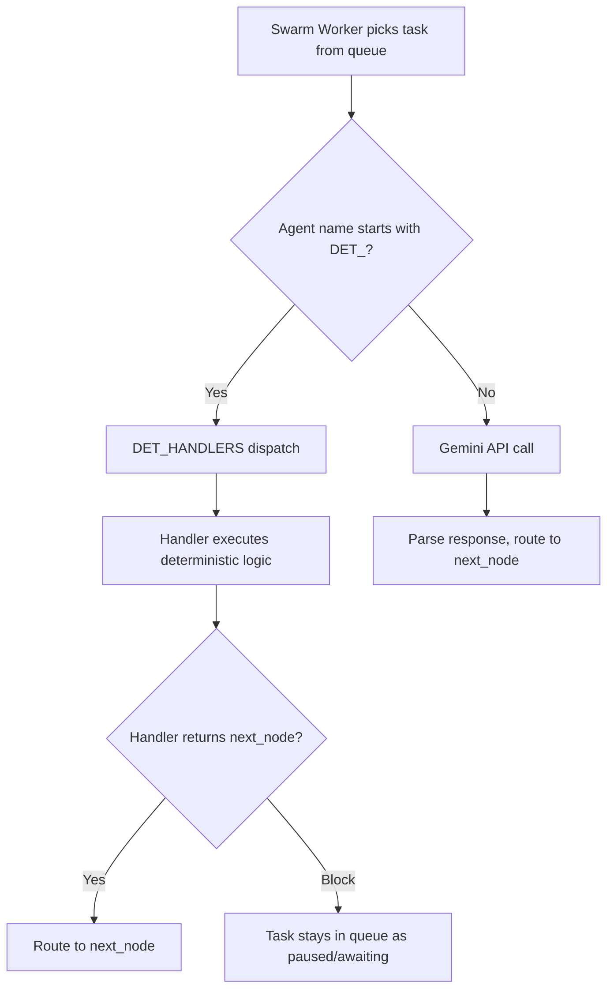

# DET Node Assessment & Manage MacroNodes Blueprint Direction

## 1. Where DET Nodes Live — Code-Defined, Not DB-Stored

You were right — DET nodes are **purely code-defined** in [deterministic_nodes.py](file:///B:/EXO_GANS/maccre_core/orchestration/deterministic_nodes.py). They are NOT stored in any database. They exist as a dispatch table of handler functions registered in a `DET_HANDLERS` dict.

The GLOBAL datacenter stores:
- `agent_library.db` → Agent profiles (global resource)
- `macronode_registry.db` → Saved MacroNode templates (global resource)
- `swarm_queue.db` → Runtime task queue

DET nodes are **runtime primitives** — they intercept task execution at the swarm worker level and perform deterministic (non-AI) operations. They never touch the API.

---

## 2. Current DET Node Inventory

### Dispatch Architecture

```python
# In deterministic_nodes.py
DET_HANDLERS: dict[str, Callable] = {
    "DET_ANCHOR": handle_anchor,
    "DET_PAUSE": handle_pause,
    "DET_REVIEW": handle_review,
    "DET_GATE": handle_gate,
    "DET_CHECKPOINT": handle_checkpoint,
    "DET_DELAY": handle_delay,
    "DET_TRANSFORM": handle_transform,
    "DET_RECURSION": handle_recursion,
}
```

The swarm worker checks `if agent_name.startswith("DET_")` → routes to `DET_HANDLERS[agent_name]` instead of calling the Gemini API.

### Each Node's Function

| Node | Handler | What It Does | Config | Routing |
|------|---------|--------------|--------|---------|
| **DET_ANCHOR** | `handle_anchor` | **Passthrough** — copies input payload to output unchanged. Entry point marker. | None | Always routes to `next_node` |
| **DET_PAUSE** | `handle_pause` | **Halts execution** — sets task status to `paused`. Requires manual resume via HITL. | None | Blocks until manually resumed |
| **DET_REVIEW** | `handle_review` | **HITL intercept** — sets task to `awaiting_orders`. Shows payload for human review. User can approve/reject/modify. | None | Blocks until human decision |
| **DET_GATE** | `handle_gate` | **Prerequisite gate** — blocks until ALL nodes in `Wait_For` have completed successfully. | `Wait_For` (CSV node IDs) | Routes to `next_node` after all deps clear |
| **DET_CHECKPOINT** | `handle_checkpoint` | **State snapshot** — serializes current payload + task metadata to a checkpoint JSON file in `03_Agent_Ledgers`. | `checkpoint_name` (optional) | Always routes to `next_node` |
| **DET_DELAY** | `handle_delay` | **Sleep timer** — pauses execution for N seconds. | `delay_seconds` (int, from node config) | Routes to `next_node` after delay |
| **DET_TRANSFORM** | `handle_transform` | **Static text injection** — wraps/transforms the payload using a template string. No AI involved. | `transform_template` (str with `{payload}` token) | Routes to `next_node` |
| **DET_RECURSION** | `handle_recursion` | **Loop controller** — tracks iteration count. If under `max_iterations`, routes back to `loop_target`. If at limit, routes to `next_node` (exit). | `max_iterations` (int), `loop_target` (node ID) | Conditional: loop back OR exit |

### What's NOT a DET Node

> [!NOTE]
> `DET_MANUAL` was mentioned in your Phase 4/5 riff but does **not** currently exist in the codebase. The closest equivalent is `DET_REVIEW` (HITL intercept with `awaiting_orders` status). Your plan to expand `DET_MANUAL` into `DET_USER_REVIEW` with FinOps gating would be a new node type.

---

## 3. How DET Nodes Integrate with Execution



**Key integration points:**
- **swarm_worker.py**: Checks `agent_name.startswith("DET_")` before API dispatch
- **topology_engine.py**: DET nodes are loaded into the graph just like AI nodes — they have `Node_ID`, `Next_Node`, `Wait_For`, etc.
- **topology.csv**: DET nodes appear as regular rows with `Agent_Name = "DET_REVIEW"` etc.
- **No roster lookup**: DET nodes skip the agent library — they have no model, system prompt, or temperature

---

## 4. Template Logic That DET Nodes Could Replace

This is where it gets architecturally interesting. The research revealed that template-specific behaviors are scattered across **three layers** — and some have unexpected implications.

### 4a. Conditional Routing — Crucible's ROUTE_TO

**Today this is implemented across THREE layers, all hard-wired:**

| Layer | Location | What It Does |
|-------|----------|--------------|
| **Template Factory** | `macro_factory.py:627` | Injects `_conditional_routing: True` flag on judge node — **vestigial, never consumed** |
| **System Prompt** | `_CRUCIBLE_JUDGE_AUGMENT` | Instructs the LLM to output `ROUTE_TO:AgentName` or `ROUTE_TO:ACCEPTED` |
| **Swarm Worker** | `swarm_worker.py:1259-1320` | Regex scans model output for `ROUTE_TO:` pattern and overrides next_node |

> [!WARNING]
> **The ROUTE_TO regex fires on EVERY node execution — not just judges.** Any LLM's output could accidentally (or intentionally) hijack routing by including `ROUTE_TO:` in its response. There is zero enforcement that only designated nodes can route. A `DET_CONDITIONAL_ROUTE` node would make this explicit and safe.

### 4b. Fan-Out / Fan-In — No Explicit Primitives

**Fan-Out (Scatter):** Multiple nodes with the same `Next_Node` → broker's `route_task()` splits comma/pipe-separated targets and inserts one task per target. This is generic and works fine.

**Fan-In (Gather):** Currently **half-structural, half-imperative**:
- `Wait_For` column in topology tells the broker which predecessors must complete
- Swarm worker at execution time reads predecessor artifacts and injects them as `[GATHERED ARTIFACT: NODE_ID]` blocks into the payload
- The broker's SQL `INSERT OR IGNORE + ON CONFLICT DO UPDATE` provides idempotent convergence — but there is **no explicit barrier/gather DET node**

### 4c. Recursion — Three Separate Mechanisms Coexist

| Mechanism | Location | Used By |
|-----------|----------|---------|
| **A) ROUTE_TO loop-back** | swarm_worker regex → broker re-queue | Crucible GAN loop, monitor_watch pattern |
| **B) DET_RECURSION** | deterministic_nodes.py — explicit counter + loop_target | **NOTHING.** Exists but is unused by any template |
| **C) Broker safety net** | local_broker.py:449-465 — `loop_iteration_count` tracker | All loops (safety bound) |

> [!IMPORTANT]
> **DET_RECURSION is the clean, structural loop primitive — but the Crucible template bypasses it entirely.** Crucible uses the LLM regex approach (Mechanism A), bounded by the broker counter (Mechanism C). This is a classic case of the right primitive existing but the consumer not using it. The new template system should wire through DET_RECURSION.

### 4d. Group Dialog — Column-Triggered, Not Graph-Structured

The swarm worker checks `Dialogue_Partner` and `Dialogue_Rounds` columns on **every** node. If both are set:
- 1 partner → `DialogueRunner` (pair mode)
- \>1 partner → `GroupDialogueRunner` (group mode)

This is dispatched via if/elif branching in the worker — no DET node involved. The `DialogueRunner` and `GroupDialogueRunner` classes are well-encapsulated, but the dispatch is implicit.

### 4e. Summary: What's Hard-Wired vs. What DET Nodes Could Own

| Behavior | Currently Lives In | Hard-Wired? | DET Primitive |
|----------|-------------------|-------------|---------------|
| Conditional Routing | swarm_worker regex (ALL nodes) | **YES** — no opt-in | `DET_CONDITIONAL_ROUTE` |
| Fan-Out (Scatter) | broker route_task() | No — generic | Not needed |
| Fan-In (Gather) | swarm_worker artifact injection | **YES** — inline | `DET_MERGE` |
| Recursion Loop | ROUTE_TO regex + broker counter | **YES** — prompt-driven | `DET_RECURSION` (exists, unused!) |
| Group Dialog | swarm_worker column detection | **YES** — if/elif dispatch | `DET_DIALOG` |
| Post-Acceptance Branch | Hard-coded in builder function | **YES** | `DET_BRANCH` |

### Proposed New DET Primitives

| Primitive | Purpose | Replaces |
|-----------|---------|----------|
| **DET_CONDITIONAL_ROUTE** | Parses structured output from previous node, validates targets against allowed list, overrides next_node. **Only fires on designated nodes** (unlike current regex-on-everything). | Crucible's ROUTE_TO regex |
| **DET_BRANCH** | Routes to one of N configured paths based on a config flag or input condition | Crucible's post-acceptance variation routing |
| **DET_MERGE** | Explicit fan-in barrier — collects outputs from N predecessors, structures them into a single payload | Hologram's implicit fan-in at synthesizer |
| **DET_DIALOG** | Typed node that delegates to DialogueRunner/GroupDialogueRunner based on participant count | Chord/Cascade/Crucible group dialog dispatch |
| **DET_USER_REVIEW** | Enhanced DET_REVIEW with FinOps cost display and approval gate | Phase 4/5 riff |

### The Vision: Templates as DET Compositions

Instead of each template having a custom `_build_*_topology()` function, templates become **compositions of DET primitives + AI nodes**:

```
# Crucible as DET composition:
DET_ANCHOR (entry)
  → [AI] Advocate_1, Advocate_2, ... (parallel fan-out)
  → DET_MERGE (wait for all advocates, structure outputs)
  → [AI] Judge (evaluates — NO regex needed, output goes to next node)
  → DET_CONDITIONAL_ROUTE (parses ROUTE_TO from judge output, validates targets)
    → DET_RECURSION (counter check: loop back to advocates OR exit)
  → DET_BRANCH (synthesis | debate | panel)
    → [AI or DET_DIALOG] post-acceptance phase
```

> [!IMPORTANT]
> This doesn't mean we delete the template builders immediately. Existing builders produce correct topologies. But new templates could be authored as DET compositions, and existing templates could be gradually refactored. The key win: **the ROUTE_TO regex side-channel becomes an explicit, opt-in, validated DET node** — fixing the implicit-routing-on-all-nodes concern.

---

## 5. Clarifications on Your Questions

### GLOBAL Datacenter — You're Right

You're correct about the GLOBAL datacenter. `__DATACENTER/GLOBAL/` is the **project-agnostic resource center**. The `_db_path()` function intentionally routes to GLOBAL for both `agent_library.db` and `macronode_registry.db`. My earlier report flagged it as a "bug" — it's not a bug, it's by design. Agents and MacroNodes are global resources. The `project_id` parameter exists as a future hook if per-project isolation is ever needed.

### DET Node Storage — Code-Only

Confirmed: DET nodes are purely defined in `deterministic_nodes.py` as a `DET_HANDLERS` dispatch dict. They are not stored in any database. They are registered by name and invoked at runtime when the swarm worker encounters an `Agent_Name` starting with `DET_`.

### Deprecation Approach — "Remove and Archive"

The `macronode_registry` table currently has no `deprecated` column. The implementation would be:

1. Add column: `ALTER TABLE macronode_registry ADD COLUMN deprecated INTEGER DEFAULT 0`
2. "Remove and Archive" button → `UPDATE macronode_registry SET deprecated = 1 WHERE name = ?`
3. `list_all()` → `SELECT ... WHERE deprecated = 0 ORDER BY last_used DESC`
4. Optional "Show Archived" toggle → includes `deprecated = 1` entries

This is clean and reversible — no data is deleted, just flagged.

---

## 6. Info Overlay Design — The Sliding Panel

Based on your description, here's the layout:

```
┌──────────────────────────────────────────────────────────────┐
│ Header                                                       │
├──────────────┬──────────────┬────────────────────────────────┤
│              │              │                                │
│  Manage      │  Agent       │  ◀═══ INFO OVERLAY ═══▶       │
│  MacroNodes  │  Builder     │                                │
│              │              │  ┌─ User Instructions ──────┐  │
│  [Info btn]──┼──────────────┼──▶  Scrollable              │  │
│              │              │  └──────────────────────────┘  │
│              │              │  ┌─ Terminology Rubric ─────┐  │
│              │              │  │  Scrollable              │  │
│              │              │  └──────────────────────────┘  │
│              │              │  ┌─ Selected Agent Details ──┐  │
│              │              │  │  Scrollable              │  │
│              │              │  └──────────────────────────┘  │
│              │              │  ┌─ Tool Instructions ──────┐  │
│              │              │  │  Scrollable              │  │
│              │              │  └──────────────────────────┘  │
│              │              │  ┌─ Topology Visualizer ────┐  │
│              │              │  │  Dynamic tree view       │  │
│              │              │  │  Updates live on edits   │  │
│              │              │  └──────────────────────────┘  │
│              │              │                                │
├──────────────┴──────────────┴────────────────────────────────┤
│ Footer                                                       │
└──────────────────────────────────────────────────────────────┘
```

**Implementation approach:**
- A `Vertical` widget mounted as a child of the app (or `#right-pane`)
- `display: none` by default, toggled to `display: block` on button press
- Positioned to cover the FlowExecution/FlowMonitor area (the right ~40% of `#right-pane`)
- Agent Builder remains visible and usable
- MacroNode panel remains fully interactive
- Each section is a collapsible `VerticalScroll` pane with a title bar

**The Topology Visualizer** is the most interesting piece — it would need to:
1. Read the current template type + agent assignments from the panel
2. Call `build_from_template()` in preview mode (or build a simplified mock)
3. Render a tree/graph showing nodes and connections
4. Update reactively as the user changes template/agents/config

---

## 7. Save Flow — Simplified

You're right, the current flow is overly complicated:

| Current (Rube Goldberg) | Proposed (Direct) |
|------------------------|-------------------|
| Panel builds dict | Panel builds dict |
| Panel posts `MacroSaved` message | Panel calls `store.save()` directly |
| NexusPlex handler catches message | — |
| Handler calls `store.save()` (with the bug) | — |
| Handler calls `panel.refresh_data()` | Panel calls `self.refresh_data()` |

The new panel should import `get_macronode_store` and save directly. No message passing, no handler, no bug.

---

## 8. Discussion Points

### A) DET Node Evolution Path

The current 8 DET nodes are solid **flow-control primitives**. The gap is in **data-flow primitives** (merging, branching, conditional routing). If we add 3-4 new DET types (CONDITIONAL_ROUTE, BRANCH, MERGE, DIALOG), the template system transforms from "pick a preset pattern" to "compose a workflow from building blocks."

**Question for you:** Do you see the Topology Visualizer in the info overlay as the eventual place where users would drag-and-drop DET nodes to compose custom workflows? Or should template-based composition remain the primary UX, with DET nodes as invisible infrastructure?

### B) Template Deprecation vs. DET Composition

Two evolutionary paths:

1. **Templates remain primary** — DET nodes are internal plumbing that templates use. Users pick "crucible" and the builder generates the DET-based topology. Templates get simpler internally but the user experience stays the same.

2. **Templates become suggestions** — Users start with a template but can see/edit the DET composition in the Topology Visualizer. Advanced users build custom workflows entirely from DET primitives + AI agents.

Path 1 is safer and faster. Path 2 is more powerful but requires significant TUI work.

### C) Naming

- "Special Nodes" in the TUI → should this become "Flow Control Nodes" or "Deterministic Nodes" in the new panel? "Special" is vague.
- "Manage MacroNodes" → final name? Or "MacroNode Workshop" / "MacroNode Editor"?
