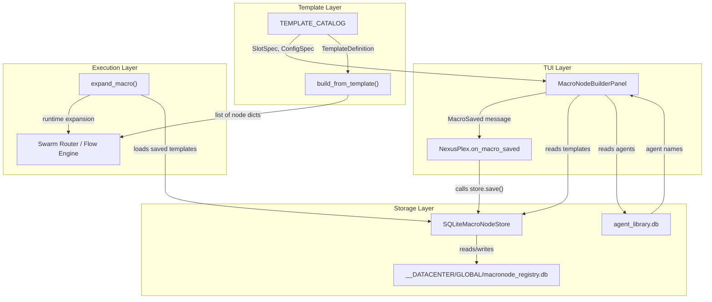
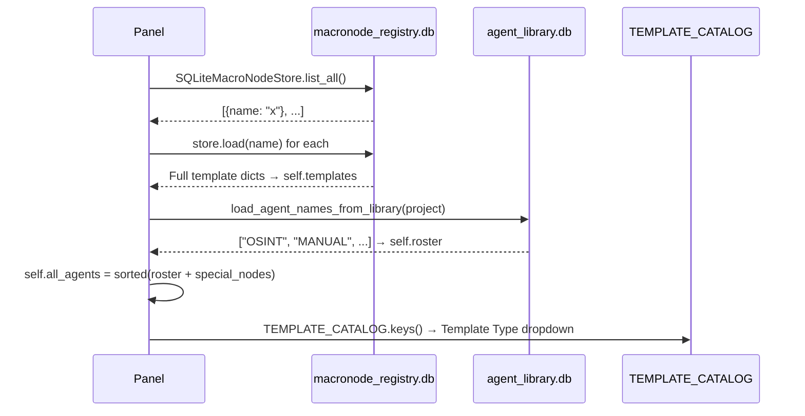
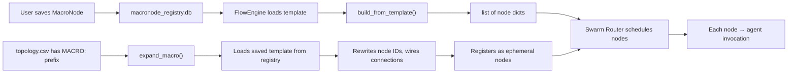

# MacroNode System — Comprehensive Analysis Report

## 1. Architecture Overview



---

## 2. Storage: macronode_registry.py

[Source: macronode_registry.py](file:///B:/EXO_GANS/maccre_core/macronode_registry.py) — 335 lines

### Database Path Resolution

```python
def _db_path(project_id: str = "") -> Path:
    """Return the macronode_registry.db path (now strictly GLOBAL)."""
    return get_maccre_root() / "__DATACENTER" / "GLOBAL" / "macronode_registry.db"
```

> [!WARNING]
> The `project_id` parameter is **completely ignored**. All projects share a single GLOBAL registry. The file docstring still mentions per-project paths — that's stale. This means `get_macronode_store("my_project")` and `get_macronode_store("GLOBAL")` return stores pointing to the exact same DB.

### Schema — Two Tables

#### Table: `macronode_registry`

| Column | Type | Constraint | Content |
|--------|------|------------|---------|
| `name` | TEXT | PRIMARY KEY | Unique MacroNode name |
| `description` | TEXT | DEFAULT '' | User-entered description |
| `is_template` | INTEGER | DEFAULT 0 | Boolean — requires agent hydration at runtime |
| `agent_slots` | TEXT | DEFAULT '[]' | JSON array of agent names (legacy flat list) |
| `topology_json` | TEXT | NOT NULL | JSON array of node dicts |
| `roster_json` | TEXT | nullable | JSON array of roster snapshots |
| `template_type` | TEXT | DEFAULT NULL | "cascade", "hologram", "chord", "crucible" |
| `template_config` | TEXT | DEFAULT NULL | JSON dict of config values + `_agent_mapping` + `slot_tools` |
| `created_at` | TEXT | NOT NULL | ISO 8601 UTC timestamp |
| `last_used` | TEXT | NOT NULL | ISO 8601 UTC timestamp (updated on every `.load()`) |

#### Table: `ephemeral_nodes`

| Column | Type | Constraint | Content |
|--------|------|------------|---------|
| `node_id` | TEXT | PRIMARY KEY | Runtime-generated node ID |
| `config_json` | TEXT | NOT NULL | JSON dict of node configuration |
| `job_id` | TEXT | DEFAULT '' | Execution job ID |
| `created_at` | TEXT | NOT NULL | ISO 8601 UTC timestamp |

### ABC Interface + SQLite Implementation

The store follows Strangler Fig: `MacroNodeStore(abc.ABC)` → `SQLiteMacroNodeStore`.

| Method | Signature | What It Does |
|--------|-----------|--------------|
| `save` | `(name, topology_rows, roster_rows?, description?, is_template?, agent_slots?, template_type?, template_config?)` | `INSERT ... ON CONFLICT DO UPDATE` — serializes all to JSON |
| `load` | `(name: str) -> dict` | SELECT by name, deserializes JSON, calls `_touch()` to update `last_used` |
| `list_all` | `() -> list[dict]` | Summary dicts (no topology data) ordered by `last_used DESC` |
| `delete` | `(name: str)` | DELETE by name, raises `KeyError` if not found |
| `save_ephemeral_nodes` | `(nodes: dict, job_id?)` | Upserts runtime nodes for topology merging |
| `load_ephemeral_graph` | `() -> dict[str, dict]` | Returns all ephemeral nodes as flat dict |
| `clear_ephemeral` | `(job_id?)` | Deletes ephemeral nodes (scoped or all) |

### What the Panel Actually Saves (the `macro_data` dict)

When the user clicks Save, the panel assembles this dict:

```python
{
    "name": "crucible_alpha",
    "description": "My custom crucible",
    "template_type": "crucible",
    "agent_slots": ["OSINT", "MANUAL", "CRITIC"],  # Legacy flat list
    "template_config": {
        "_agent_mapping": {               # Slot → agent list
            "advocates": ["OSINT", "MANUAL"],
            "judge": ["CRITIC"]
        },
        "slot_tools": {                   # Per-agent tool assignments
            "advocates_OSINT": "google_search,search_web",
            "advocates_MANUAL": "",
            "judge_CRITIC": "read_url_content"
        },
        "max_recursion": "3",             # Config values
        "variation": "synthesis",
        "structural_augment": "..."
    }
}
```

This is then passed to the NexusPlex handler which calls `store.save()` with it.

### Store Consumers Across Codebase

| File | Usage |
|------|-------|
| [macronode_builder_panel.py](file:///B:/EXO_GANS/maccre_tui/widgets/macronode_builder_panel.py) | `refresh_data()` reads, panel assembles save dict |
| [nexus_plex.py](file:///B:/EXO_GANS/maccre_tui/nexus_plex.py) L2340, L2375 | `on_macro_saved()` handler calls `store.save()`, `refresh_data()` |
| [flow_engine.py](file:///B:/EXO_GANS/maccre_core/orchestration/flow_engine.py) L31, L107 | Creates project + global stores, loads templates for execution |
| [macro_factory.py](file:///B:/EXO_GANS/maccre_core/orchestration/macro_factory.py) L786 | `expand_macro()` writes ephemeral nodes; loads macros from GLOBAL |
| [swarm_worker.py](file:///B:/EXO_GANS/maccre_core/orchestration/swarm_worker.py) L1284 | Loads ephemeral graph during swarm execution |
| [topology_engine.py](file:///B:/EXO_GANS/maccre_core/orchestration/topology_engine.py) L229 | Loads ephemeral graph for topology merging |
| [macro_nodes.py (tools)](file:///B:/EXO_GANS/maccre_core/tools/macro_nodes.py) L72-213 | AI-callable tool functions for save/load/list/delete |

---

## 3. Template Catalog: macro_factory.py

[Source: macro_factory.py](file:///B:/EXO_GANS/maccre_core/orchestration/macro_factory.py) — 891 lines

### Core Dataclasses

#### SlotSpec (L41-48)
```python
@dataclass
class SlotSpec:
    name: str           # "advocates", "judge", "participants", "facets"
    description: str    # Shown in UI
    min_agents: int     # Minimum agents required for this slot
    max_agents: int     # Maximum (1 = single-Select, >1 = comma-separated Input)
```

#### ConfigSpec (L51-61)
```python
@dataclass
class ConfigSpec:
    name: str           # "max_recursion", "variation", "structural_augment"
    param_type: str     # "int", "choice", "str"
    description: str
    default: Any
    min_val: int | None = None
    max_val: int | None = None
    choices: list[str] | None = None
```

> [!NOTE]
> The actual class is named `TemplateDefinition` in the code, not `MacroTemplateDef`. It was referenced as `MacroTemplateDef` in earlier session notes, but the source uses `TemplateDefinition`.

#### TemplateDefinition (L64-99)
```python
@dataclass
class TemplateDefinition:
    name: str
    description: str
    slots: list[SlotSpec]
    config: list[ConfigSpec]
    
    def to_dict(self) -> dict[str, Any]:  # Serializes for Nexus display
```

### All 4 Templates

| Template | Slots | Config | Topology Pattern |
|----------|-------|--------|-----------------|
| **cascade** | `agents` (2-3) | `loop_count` (int 1-20), `end_agent` (str), `agent_order` (str), `exclusionary_search` (int 1-5), `structural_augment` | Sequential chain: GroupDialogRunner with host + partners |
| **hologram** | `facets` (2-10), `synthesizer` (1) | `structural_augment` | Parallel fan-out → synthesis merge |
| **chord** | `participants` (2-10), `host` (1) | `loop_count` (int 1-20), `structural_augment` | GroupDialogRunner round-table discussion |
| **crucible** | `advocates` (2-10), `judge` (1) | `max_recursion` (int 1-10), `variation` (choice: synthesis/synthesis-blind/debate/panel), `structural_augment` | GAN loop with conditional routing |

### Structural Augment Tokens

Each template has a default augment string with substitution tokens:

| Token | Replaced With | Used In |
|-------|--------------|---------|
| `{macro_id}` | Unique execution ID | All |
| `{agents}` | Comma-separated agent list | hologram, chord, crucible |
| `{host}` | Host/judge/synthesizer agent name | hologram, chord |
| `{max_recursion}` | Retry/round limit | chord, crucible |
| `{node_ids}` | Valid route target node IDs | crucible |
| `{exclusionary_search}` | Max cascade search loops | cascade |

The default augment for crucible (`_CRUCIBLE_JUDGE_AUGMENT`) includes a full routing protocol with `ROUTE_TO:` commands that the judge must output to drive the GAN loop.

### Topology Builders

#### `_build_cascade_topology` (L325-401)
→ 1 GroupDialogRunner node. Host = first agent gets `cascade_search` tool + augment. Partners = remaining agents.

#### `_build_hologram_topology` (L404-480)
→ N facet nodes (parallel) + 1 synthesizer node. Synth has `Wait_For` = all facet IDs. Synth forced to temp=0.3, model=`gemini-2.5-pro`.

#### `_build_chord_topology` (L483-535)
→ 1 GroupDialogRunner node. Host is central, participants are pipe-joined as `Dialogue_Partner`.

#### `_build_crucible_topology` (L538-684)
→ Most complex. Three phases:
1. **Advocate nodes** (parallel fan-out) → judge
2. **Judge node** (conditional gate, temp=0.2, model=`gemini-2.5-pro`, `_conditional_routing: True`)
3. **Post-acceptance** varies by `variation`:
   - `synthesis` → Judge IS the final node
   - `synthesis-blind` → Same but advocates use `Targeted Filter` payload mode
   - `debate` → GroupDialogRunner: judge + advocates, 2 rounds
   - `panel` → Full round-table, 2 rounds

### The `build_from_template()` Entry Point (L697-776)

```python
def build_from_template(
    template_type: str,
    agent_mapping: dict[str, list[str]],
    config: dict[str, Any],
    roster: dict[str, dict[str, Any]],
) -> list[dict[str, Any]]:
```

1. Routes to correct builder via `_BUILDERS` dict
2. **Validates all slots** — checks min/max agent counts, verifies agents exist in roster
3. **Validates all config** — checks required values, int range bounds, choice membership
4. Calls `builder(agent_mapping, config, roster)` → topology rows
5. **Applies `slot_tools` overrides** — if config has `slot_tools`, overrides `Tools_Allowed` on matching rows. Supports both per-slot (`"facets"`) and per-agent-in-slot (`"facets_AgentName"`) granularity

### Legacy Bridge: `expand_macro()` (L791-882)

Intercepts `MACRO:` prefix in topology.csv at runtime:
1. Loads macro from `macronode_registry.db`
2. Rewrites all Node_IDs with unique `_{macro_id}` suffixes to prevent collisions
3. Wires internal `END` references to the downstream `next_node`
4. Registers ephemeral nodes via `save_ephemeral_nodes()`
5. Routes broker to first nodes

---

## 4. Agent Loading Pipeline

### load_agent_names_from_library()

[In nexus_plex.py](file:///B:/EXO_GANS/maccre_tui/nexus_plex.py):

```python
def load_agent_names_from_library(project: str = "") -> list[str]:
    db = _agent_library_db_path(project)
    conn = sqlite3.connect(db)
    try:
        rows = conn.execute("SELECT name FROM agents").fetchall()
        return [r[0] for r in rows]
    finally:
        conn.close()
```

Reads from `01_Raw_Source/<project>/agent_library.db` → table `agents` → column `name`.

### load_agent_from_roster()

[Source: roster_loader.py](file:///B:/EXO_GANS/maccre_core/orchestration/roster_loader.py)

Returns full agent profile dict: `name`, `model`, `tools_allowed`, `description`, `system_prompt`, `temperature`, `thinking_level`, `safety_settings`, etc. Used by `update_agent_details_panel()` to show agent profiles in the info box.

### Special (Deterministic) Nodes

8 non-AI nodes hardcoded in the panel:

| Node | Purpose |
|------|---------|
| `DET_REVIEW` | Pauses task in `awaiting_orders` for manual resume |
| `DET_ANCHOR` | Entry marker — passes payload through unchanged |
| `DET_RECURSION` | Loop-back control with counter tracking |
| `DET_PAUSE` | Halts execution, sets task to `paused` |
| `DET_GATE` | Conditional gate — blocks unless prerequisites complete |
| `DET_CHECKPOINT` | Snapshots current payload to a checkpoint file |
| `DET_DELAY` | Sleeps for configurable seconds |
| `DET_TRANSFORM` | Applies a static text wrapper/template to payload |

---

## 5. Panel Business Logic — Complete Map

### 5a. Data Loading: `refresh_data()` (Lines 102-129)



Also updates the Select MacroNode dropdown in-place if the panel is already mounted.

### 5b. Edit vs Create: `on_macro_select()` (Lines 164-210)

When user selects an existing MacroNode from the dropdown:
1. Loads the template dict from `self.templates`
2. Fills `#me-name`, `#me-desc` inputs
3. Sets `self._pending_template = template` (the deferred fill mechanism)
4. Programmatically sets `#me-type-select` value → triggers `on_type_select`

When user selects "*** Create New... ***":
1. Clears all inputs
2. Clears `#me-dynamic-container`
3. Resets `self._pending_template = None`

### 5c. Dynamic UI Generation: `on_type_select()` (Lines 212-275)

The core template-driven UI builder:

1. **Reads `TEMPLATE_CATALOG[selected_type]`** → gets `TemplateDefinition` with slots + config
2. **Clears** `#me-dynamic-container` children
3. **Resets** `self.current_slots`, `self.current_configs`, `self.temp_tools`
4. **For each slot in `tpl_def.slots`:**
   - If `max_agents == 1` → creates a `Select` dropdown (single agent)
   - If `max_agents > 1` → creates an `Input` field (comma-separated agents)
   - Creates a `tools_container` `Vertical` below each slot
   - Schedules `update_slot_tools_ui(slot_name)` via `set_timer(0.1, ...)`
5. **For each config in `tpl_def.config`:**
   - `structural_augment` → `TextArea`
   - `param_type == "choice"` → `Select` with choices
   - Otherwise → `Input`
6. **Checks `self._pending_template`** → if set, defers `_populate_existing()` for 0.1s

### 5d. Deferred Value Fill: `_populate_existing()` (Lines 290-330)

This is the second phase of the two-phase edit mechanism:

1. Extracts `_agent_mapping` from `template_config`
2. For each slot: sets the widget value (Select or comma-joined Input)
3. For each config: sets the widget value
4. Handles **legacy fallback**: if `_agent_mapping` is empty but `agent_slots` exists, uses the flat list for single-slot templates
5. Loads saved `slot_tools` into `self.temp_tools` cache

> [!IMPORTANT]
> **The `_pending_template` two-phase pattern is critical.** Widgets don't exist until `on_type_select()` mounts them. `_populate_existing()` must run AFTER the mount completes. This is why it uses `set_timer(0.1, ...)` — to ensure the event loop has processed the mount before attempting to set values.

### 5e. Saving: `save()` (Lines 335-388)

Assembles the complete `macro_data` dict:

1. **Reads** name, description, template_type from inputs
2. **Builds `agent_mapping`** — iterates `self.current_slots`, reads each slot widget:
   - `Select` → single agent value
   - `Input` → split by comma, strip whitespace
3. **Builds flat `agent_slots`** — all agents from all slots (legacy compat)
4. **Builds `template_config`** dict:
   - `_agent_mapping` → the slot→agents mapping
   - `slot_tools` → copied from `self.temp_tools` cache
   - Each config widget value → `config[cfg_name] = value`
5. **Posts `MacroSaved(result)` message** to parent (NexusPlex)

### 5f. Tool Assignment System (Lines 450-540)

This is the most complex piece of UI logic:

#### `update_slot_tools_ui(slot_name)` (Lines 450-490)

Triggered when agents change in a slot:

1. Clears the tools container `#tools_container_{slot_name}`
2. Gets the list of agents currently in that slot
3. For each agent, creates a row with:
   - `Select` dropdown populated from `TOOL_REGISTRY`
   - "Add" `Button`
   - `Input` showing current tools (comma-separated)
4. **Pre-populates** from `self.temp_tools["{slot_name}_{agent_name}"]` if cached
5. **UUID suffixes** are appended to widget IDs to prevent `DuplicateIds` errors when rebuilding

#### `on_tool_input_changed()` — Input handler

When the tool Input changes, updates `self.temp_tools[key]` with the new value.

#### `on_add_tool_pressed()` — Button handler

When "Add" is clicked:
1. Finds the associated Select (tool picker) and Input (tool list)
2. Appends the selected tool to the Input's comma-separated list
3. Updates `self.temp_tools[key]`

#### The `temp_tools` Cache

```python
self.temp_tools: dict[str, str] = {}
# Key: "{slot_name}_{agent_name}" → e.g. "advocates_OSINT"
# Value: "google_search,search_web"
```

> [!IMPORTANT]
> On save, `slot_tools` are pulled from `self.temp_tools` cache — NOT from querying widget values. This is because UUID suffixes make widget IDs unpredictable, so the cache is the source of truth.

### 5g. Info Panel Updates (Lines 390-446, 542-600)

#### `update_agent_details_panel()` (Lines 390-446)

1. Iterates all slots, collects assigned agents
2. For each agent: loads profile via `load_agent_from_roster(name)`
3. Builds rich text with model, tools, description, system instructions
4. Updates the `#me-info-body` Static widget

#### `update_augment_preview()` (Lines 542-600)

1. Reads the `#cfg_structural_augment` TextArea text
2. Gathers agents/host from slots
3. Performs token substitution (`{agents}`, `{host}`, etc.)
4. Updates `#augment_preview` Static widget

### 5h. MacroSaved Handler in NexusPlex (L2334-2380)

```python
@on(MacroNodeBuilderPanel.MacroSaved)
def handle_macro_saved(self, event) -> None:
    result = event.macro_data
    if not result:
        return
    store = SQLiteMacroNodeStore(_db_path(self.active_project))
    store.save(result["name"], result)  # ← BUG: 'result' passed as 'topology_rows'
```

> [!CAUTION]
> **Critical Bug Found:** Line 2342 of `nexus_plex.py` calls `store.save(result["name"], result)` — passing the **entire result dict** as the `topology_rows` parameter (2nd positional arg). The `store.save()` signature expects `topology_rows: list[dict]` as the 2nd arg, with `description`, `is_template`, `agent_slots`, `template_type`, `template_config` as separate keyword args. This means:
> - `template_type`, `template_config`, `agent_slots` are all saved as empty/None
> - The entire macro_data dict gets JSON-serialized into the `topology_json` column
> - On reload, `_populate_existing()` can't find `template_config` or `_agent_mapping` — tools and configs may be lost
> 
> **This must be fixed in the new panel's save handler.**

> [!NOTE]
> `topology_rows` is saved as `[]` (empty). The actual topology is built at execution time by `build_from_template()`. The saved template is a recipe, not pre-built topology.

---

## 6. Downstream: How MacroNodes Execute



### Two Execution Paths

1. **Template-based (new):** `FlowExecutionPanel` → `store.load(name)` → `build_from_template()` → node list → execute
2. **Legacy MACRO: prefix:** `expand_macro()` intercepts `MACRO:` in topology.csv → loads from registry → rewrites IDs → registers ephemeral nodes → routes to swarm

---

## 7. Complete Logic Inventory for New Panel

### Must Preserve (Critical Business Logic)

| # | Logic | Current Location | Purpose |
|---|-------|-----------------|---------|
| 1 | `refresh_data()` | L102-129 | Loads templates from DB + agent roster from library |
| 2 | `on_macro_select()` | L164-210 | Edit vs create mode, two-phase pending mechanism |
| 3 | `on_type_select()` | L212-275 | Template-driven dynamic slot/config UI generation |
| 4 | `_populate_existing()` | L290-330 | Deferred value fill + legacy agent_slots fallback |
| 5 | `save()` | L335-388 | Assembles macro_data dict with agent_mapping + slot_tools + config |
| 6 | `update_slot_tools_ui()` | L450-490 | Per-agent tool rows with UUID collision prevention |
| 7 | `temp_tools` cache | L99, L495-540 | Source of truth for tool assignments across rebuilds |
| 8 | Tool add/change handlers | L495-540 | Wires Select + Button + Input for tool assignment |
| 9 | `_pending_template` | L198-210, L270-275 | Required because widgets mount async |
| 10 | `MacroSaved` message | L11-14, nexus_plex L2334 | Communication between panel and app |

### Can Be Reimplemented (UI-Only)

| # | Logic | Notes |
|---|-------|-------|
| 11 | `update_agent_details_panel()` | Moving to overlay/modal |
| 12 | `update_augment_preview()` | Moving to overlay/modal |
| 13 | `_recalc_virtual_size()` | Won't be needed if layout is clean |
| 14 | `special_nodes` list | Can be loaded from a config |

### State Variables to Track

| Variable | Type | Purpose |
|----------|------|---------|
| `self.templates` | `list[dict]` | All saved MacroNodes from DB |
| `self.roster` | `list[str]` | Agent names from agent_library.db |
| `self.all_agents` | `list[str]` | roster + special_nodes (sorted) |
| `self.current_slots` | `list[str]` | Active slot names for current template |
| `self.current_configs` | `list[str]` | Active config names for current template |
| `self.temp_tools` | `dict[str, str]` | Tool assignments: `"slot_agent" → "tool1,tool2"` |
| `self._pending_template` | `dict \| None` | Deferred template data for two-phase fill |
| `self.active_project` | `str` | Current project name |

---

## 8. Open Questions for New Panel Blueprint

> [!IMPORTANT]
> These need your input before we design the new "Manage MacroNodes" panel.

1. **"Manage" scope** — Should the new panel support Delete and Duplicate operations in addition to Create/Edit? The current panel only does Create/Edit.

2. **Dynamic UI strategy** — The current approach (dynamic `mount()` into a container) caused all our layout issues. Options:
   - **A)** Full `recompose()` on template change — rebuild entire widget tree
   - **B)** Pre-build all possible slot/config widgets, show/hide them
   - **C)** Keep dynamic mount but use a simpler container strategy

3. **Tool assignment UI** — The current inline approach (Select + Button + Input per agent per slot) creates massive widget explosion. Options:
   - **A)** Keep inline (proven logic, just fix layout)
   - **B)** Move to a sub-modal/overlay (cleaner panel, more clicks)
   - **C)** Simplified: just a single multi-line Input per agent

4. **Info overlay** — You mentioned wanting Agent Details + Augment Preview on the right pane as a non-modal overlay. Should this be:
   - **A)** A floating widget toggled by an "Info" button
   - **B)** A dedicated right-pane tab/section
   - **C)** A separate Screen (non-modal)

5. **Project isolation** — The registry currently ignores project_id (everything is GLOBAL). Should the new panel surface this fact, or should we eventually fix the isolation?

6. **Save flow** — Currently panel → `MacroSaved` message → NexusPlex handler → `store.save()`. Should the new panel save directly to the store?
