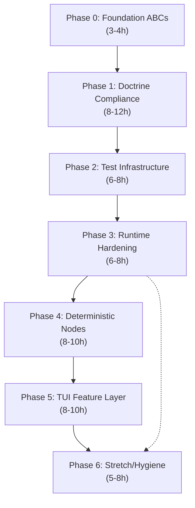

# MACCREv2 Hardening & Feature Roadmap

**Co-authored by:** Antigravity Primary Agent + Alphabet Oracle (Principal Architect)
**Date:** 2026-06-19
**Scope:** 19 code review findings + 6 feature requests → 7 dependency-ordered phases
**Total Estimated Effort:** 45–65 hours

---

## Dependency Graph



---

## Phase 0: Foundation ABCs (Strangler Fig Contracts)

**Estimated effort: 3–4 hours**
**Addresses: P0-#1, P2-#12**

> [!IMPORTANT]
> The doctrine header on every file says *"VI. ABSTRACTION: All I/O behind abc.ABC before any concrete driver"* — yet the three most critical I/O components have no interface contracts. This MUST be first because every subsequent phase's tests will type against these ABCs, not concrete implementations.

The pattern is already established: `KnowledgeStore(abc.ABC)` in [knowledge_store.py](file:///B:/EXO_GANS/maccre_core/memory/knowledge_store.py), `MessageQueue(abc.ABC)` in [queues.py](file:///B:/EXO_GANS/maccre_core/orchestration/queues.py). We replicate this exact pattern.

### 0A. `MessageBroker` ABC (~1.5h)

#### [NEW] [broker_interface.py](file:///B:/EXO_GANS/maccre_core/orchestration/broker_interface.py)

```python
class MessageBroker(abc.ABC):
    @abc.abstractmethod
    def fetch_and_lock_task(self, agent_id: str, topology_engine: Any) -> dict[str, Any] | None: ...
    @abc.abstractmethod
    def route_task(self, row_id: int, job_id: str, next_node_str: str,
                   new_payload_path: str, actual_cost: float = 0.0,
                   source_payload_path: str = "", max_recursion: int = 3) -> None: ...
    @abc.abstractmethod
    def release_task(self, row_id: int) -> None: ...
    @abc.abstractmethod
    def inject_interrupt(self, job_id: str, override_text: str) -> None: ...
    @abc.abstractmethod
    def consume_pending_interrupts(self, job_id: str) -> list[str]: ...
    @abc.abstractmethod
    def inject_task(self, job_id: str, payload_path: str, starting_node: str) -> None: ...
    @abc.abstractmethod
    def broadcast_topology_event(self, event_type: str, payload: dict[str, str]) -> None: ...
```

Make `LocalMessageBroker(MessageBroker)`. Update type hints in [swarm_worker.py](file:///B:/EXO_GANS/maccre_core/orchestration/swarm_worker.py), [flow_engine.py](file:///B:/EXO_GANS/maccre_core/orchestration/flow_engine.py), [admin_tools.py](file:///B:/EXO_GANS/maccre_core/tools/admin_tools.py).

### 0B. `InferenceClient` ABC (~1h)

#### [NEW] [client_interface.py](file:///B:/EXO_GANS/maccre_core/_net/client_interface.py)

Extract public surface of `GeminiClient`: `generate_content()`, `stream_generate_content()`, `embed_content()`, `batch_embed_contents()`. Make `GeminiClient(InferenceClient)`. Positions future `OllamaClient` as drop-in.

### 0C. `TopologyProvider` ABC (~30min)

#### [NEW] [topology_interface.py](file:///B:/EXO_GANS/maccre_core/orchestration/topology_interface.py)

Methods: `get_topology()`, `get_node_config()`, `flush_cache()`, `validate()`. Make `TopologyEngine(TopologyProvider)`.

### 0D. `ToolDispatcher` ABC (~30min)

Extract `ToolExecutor` interface from tool_registry.py. Mechanical.

### Verification
- `omni qa .` passes (Pyright validates ABC inheritance)
- `isinstance(LocalMessageBroker(), MessageBroker)` → `True`
- Zero runtime behavior change

---

## Phase 1: Doctrine Compliance (06_Memory_Pins Merge + Logging)

**Estimated effort: 8–12 hours**
**Addresses: P0-#2 (bare prints), P2-#9 (06_Memory_Pins), P2-#19 (roster path)**

### 1A. Merge `06_Memory_Pins` → `02_Dynamic_Context/memory_pins/` (~5–6h)

> [!IMPORTANT]
> **User directive.** All references to `06_Memory_Pins` become `02_Dynamic_Context/memory_pins/`. The sub-directory preserves semantic separation within the 5-tier model — dropping ~hundreds of `pin_*.json` flat alongside `topology.csv` and persona cards would cause namespace collision chaos.

**15 files require path updates:**

| # | File | Change |
|---|------|--------|
| 1 | [admin_tools.py](file:///B:/EXO_GANS/maccre_core/tools/admin_tools.py) `:263` | Remove `(base / "06_Memory_Pins").mkdir(...)` from `initialize_workspace()` |
| 2 | [memory_engine.py](file:///B:/EXO_GANS/maccre_core/orchestration/memory_engine.py) `:60` | Default dir → `02_Dynamic_Context/memory_pins` |
| 3 | [swarm_worker.py](file:///B:/EXO_GANS/maccre_core/orchestration/swarm_worker.py) `:96` | `_load_memory_pins()` reads from new path |
| 4 | [nexus_agent.py](file:///B:/EXO_GANS/maccre_core/orchestration/nexus_agent.py) `:324` | Remove from `create_datacenter_project` list |
| 5 | [rag_tools.py](file:///B:/EXO_GANS/maccre_core/tools/rag_tools.py) `:406,793` | `ingest_global_archive()` + `canonize_session()` |
| 6 | [telemetry_tools.py](file:///B:/EXO_GANS/maccre_core/tools/telemetry_tools.py) `:52` | `_get_thoughts_export_dir()` |
| 7 | [notebook_ingest.py](file:///B:/EXO_GANS/maccre_core/tools/notebook_ingest.py) `:167` | `execute_archive_ingestion()` |
| 8 | [antigravity_ingest.py](file:///B:/EXO_GANS/maccre_core/tools/antigravity_ingest.py) `:176` | `execute_epoch_ingestion()` |
| 9 | [factory_reset.py](file:///B:/EXO_GANS/maccre_core/tools/factory_reset.py) `:43,86` | Nuke dirs and archive lists |
| 10 | [main.py](file:///B:/EXO_GANS/maccre_dashboard/backend/main.py) `:203` | `reserved_folders` set |
| 11 | [_panel_content.py](file:///B:/EXO_GANS/scripts/_panel_content.py) `:15,21` | Doc strings |
| 12 | [_reset_exo_test.py](file:///B:/EXO_GANS/scripts/_reset_exo_test.py) `:68` | Cleanup script |
| 13 | [build_omni_podcast.py](file:///B:/EXO_GANS/scripts/build_omni_podcast.py) `:45` | Ignore list |
| 14 | [.gitignore](file:///B:/EXO_GANS/.gitignore) `:21` | Ignore pattern |

**Doctrine headers to fix** (3 files still say "6-Tier"):
- `memory_engine.py:8-10`, `design_tools.py:8-10`, `sheet_parser.py:8-10`

#### [NEW] [migrate_memory_pins.py](file:///B:/EXO_GANS/scripts/migrate_memory_pins.py)

Migration utility that moves existing `06_Memory_Pins/` data into `02_Dynamic_Context/memory_pins/` for all project directories.

### 1B. Convert bare `print()` to `logger` (~3–4h, mechanical)

> [!CAUTION]
> `swarm_worker.py` alone has **~50+ bare `print()` calls**. The logger infrastructure already exists: `from maccre_core.logger import logger, ops_log`.

| Pattern | Replacement |
|---------|-------------|
| `print(f"[{AGENT_ID}] ...")` | `logger.info(...)` |
| `print(f"[{AGENT_ID}] WARNING: ...")` | `logger.warning(...)` |
| `print(f"[{AGENT_ID}] ERROR ...")` | `logger.error(...)` |
| `print(f"[TopologyEngine] ...")` | `logger.warning(...)` |

**Highest-density files:** `swarm_worker.py` (~30+), `flow_engine.py` (~10), `topology_engine.py` (2), `memory_engine.py` (2)

### 1C. Roster path — False Positive (No change)

> [!NOTE]
> Oracle confirmed: `roster_loader.py` already uses `get_maccre_root()`. It intentionally avoids `get_datacenter_path()` because the roster is GLOBAL-scoped. Using the datacenter helper would inject the active project path. **No change needed.**

### Verification
- `omni qa .` passes
- `grep -rn "06_Memory_Pins" maccre_core/` → zero hits
- `grep -rn 'print(' maccre_core/ --include='*.py' | grep -v _vendor` → near zero
- Migration script successfully moves existing pin data

---

## Phase 2: Test Infrastructure

**Estimated effort: 6–8 hours**
**Addresses: P2-#10 (no test suite)**

> [!IMPORTANT]
> Tests come BEFORE hardening fixes (Phase 3). Write the test that proves the bug first, then fix the bug. TDD-adjacent.

### 2A. `conftest.py` + Mock Clients (~3h)

#### [NEW] `tests/conftest.py`
Pytest fixtures: temp datacenter, mock broker, mock topology, mock LLM

#### [NEW] `tests/mocks/mock_inference.py`
`MockInferenceClient(InferenceClient)` — returns canned responses. Possible **because Phase 0 created ABCs**.

#### [NEW] `tests/mocks/mock_broker.py`
`MockMessageBroker(MessageBroker)` — backed by in-memory dict. Possible **because Phase 0 created ABCs**.

### 2B. Integration Tests (~3–5h)

| Test | Validates |
|------|-----------|
| `test_broker_inject_and_fetch` | inject_task → fetch_and_lock_task returns the task |
| `test_broker_route_task` | route_task marks completed, creates successor |
| `test_broker_recursion_guard` | max_recursion limit triggers FAILED routing |
| `test_broker_scatter_gather` | Fan-out to 3 nodes, wait_for gate blocks until all complete |
| `test_topology_engine_parse` | Loads test CSV, validates node config extraction |
| `test_topology_validate` | Detects missing nodes, circular wait_for, temp range |
| `test_flow_engine_linear` | 2-step flow with mock worker — sequential execution |
| `test_flow_engine_stop_event` | Stop event halts flow mid-execution (validates Phase 3 fix) |
| `test_memory_pins_path` | Pins go to `02_Dynamic_Context/memory_pins/` |
| `test_deterministic_node_pause` | PAUSE creates sentinel, resumes on delete (validates Phase 4) |

### 2C. `pyproject.toml` test config

Add pytest config with coverage reporting.

### Verification
- `pytest tests/ -v` passes
- Zero API calls during tests (mock only)
- `omni qa .` still passes

---

## Phase 3: Runtime Hardening

**Estimated effort: 6–8 hours**
**Addresses: P1-#3, P1-#6, P1-#8, P2-#14, P2-#15, P2-#16, P2-#17, P2-#18**

### 3A. Fix `action_stop_flow` cancellation (~2h)

1. Add `self._stop_event = threading.Event()` to `NexusPlex.__init__`
2. Pass into `FlowRunner.execute_flow(steps, stop_event=self._stop_event)`
3. `FlowRunner` checks `stop_event.is_set()` between steps AND passes to `worker.execute_cycle()`
4. `action_stop_flow()` calls `self._stop_event.set()` BEFORE `_finish_flow()`

### 3B. Initialize `active_flow_steps` properly (~15min)

Add `self.active_flow_steps: list[FlowStep] = []` to `__init__`. Remove all `hasattr` guards.

### 3C. Fix clipboard paste stub (~30min)

Replace stub with `pyperclip.paste()` + try/except fallback.

### 3D. Roster loader caching (~1h)

Add `_roster_cache` with `_cache_mtime` invalidation. Re-read only if file changed.

### 3E. Hoist `_FileTee` to module level (~15min)

Move inner class from inside `execute_cycle()` to module scope. Currently re-defined every call.

### 3F. SQLite connection pooling in broker (~1.5h)

Hold persistent `self._conn` with WAL mode. Add `close()` + `atexit.register()`.

### 3G. ZMQ `atexit` instead of `__del__` (~30min)

Replace unreliable `__del__` at `local_broker.py:64-72` with `atexit.register(self._cleanup_zmq)`.

### 3H. Add FlowExecutionPanel CSS (~30min)

Add missing CSS for `#flow-execution-top`, `#flow-monitor-section`, `#flow-execution-log`, `#fe-input`.

### Verification
- Stop button actually halts flow execution
- No `hasattr` calls for `active_flow_steps`
- Clipboard works or shows clear fallback
- Phase 2 tests pass with fixes applied
- `omni qa .` passes

---

## Phase 4: Deterministic Node Library

**Estimated effort: 8–10 hours**
**Addresses: P1-#4, Feature B-#4, B-#5, B-#6**

### 4A. Node Type System (~1h)

#### [NEW] [deterministic_nodes.py](file:///B:/EXO_GANS/maccre_core/orchestration/deterministic_nodes.py)

```python
DET_PREFIX: str = "DET:"  # Module constant, not magic string

@dataclass
class DeterministicNodeConfig:
    node_type: str
    params: dict[str, Any]

def is_deterministic(node_id: str) -> bool:
    return node_id.startswith(DET_PREFIX)

def execute_deterministic(
    node_id: str,
    config: DeterministicNodeConfig,
    context: FlowContext,
) -> DeterministicResult: ...
```

### 4B. Implement Node Types (~4h)

| Node | Behavior | Key Decision |
|------|----------|-------------|
| **ANCHOR** | No-op pass-through, marks loop start | Routes to next_node |
| **RECURSION** | Loop counter, routes back to paired ANCHOR N times | Counter persists to broker's `loop_iteration_count` column — survives worker restart |
| **PAUSE** | Creates sentinel, blocks until deleted or timeout | Sentinel at `02_Dynamic_Context/.pause_{job_id}`. Auto-resume after 30 min. |
| **GATE** | Keyword match on previous output | `ACCEPTED`/`REJECTED` — zero LLM cost |
| **CHECKPOINT** | Snapshot payload state to disk | JSON dump to `03_Agent_Ledgers/` |
| **DELAY** | Sleep N seconds | Respects `stop_event` for cancellation |
| **TRANSFORM** | String template substitution | Uses `string.Template("$PAYLOAD")` — safe from `str.format()` attribute access exploit |

### 4C. Wire into FlowRunner (~1.5h)

Before calling `worker.execute_cycle()`, check `is_deterministic(node_id)` → dispatch to `execute_deterministic()`. Zero API calls for DET nodes.

### 4D. PAUSE Resume Button (~1h)

"Resume Flow" button in FlowExecutionPanel deletes sentinel file. Best-effort ding sound via `winsound.MessageBeep()` / terminal bell.

### 4E. Select-a-Node Dropdown (~1h)

Third `Select` in `LinearFlowEditorModal` alongside MacroNode and Agent. **Mini config modal** pops for nodes needing parameters (DELAY seconds, GATE keywords, RECURSION count) — not inline fields.

### Verification
- `DET:PAUSE` blocks until sentinel deleted or 30min timeout
- `DET:GATE` routes on keyword, zero API cost
- `DET:RECURSION` counter survives worker restart
- `DET:DELAY` respects stop_event
- All DET nodes testable via Phase 2 mock harness

---

## Phase 5: TUI Feature Layer (Flow Line UX + Context Injection + Payload)

**Estimated effort: 8–10 hours**
**Addresses: P1-#5, P1-#7, Feature B-#1, B-#2, B-#3**

### 5A. Create Payload Modal (~2h)

`CreatePayloadModal(ModalScreen)` with TextArea + file path Input + Switches + clipboard. Saves to `01_Raw_Source/payload_{timestamp}.md`. Returns path for flow ignition.

### 5B. Interactive Flow Line with per-node ✕ (~2h)

- Each node box gets a `✕` button for targeted removal
- Same `✕` in active flow sequence on main panel
- `→` arrows become clickable `Button` widgets

### 5C. Inter-Node Context Injection (~3h)

Clicking a `→` opens `InterNodeInjectModal` with `step_index`.
Stores text as `steps[step_index + 1].injection_before`.
`FlowRunner` calls `broker.inject_interrupt(job_id, step.injection_before)` before each step.
Arrow changes to `→💉` when injection configured.

### 5D. Fix agent mapping always empty (~1h)

Pop a mapping modal for MacroNodes with agent slots. Currently `flow_steps.append((name, {}, "macro"))` always passes empty mapping.

### Verification
- Payload creates file in `01_Raw_Source/`
- Per-node `✕` removes correct node
- Injected context appears in agent prompt at correct boundary
- Agent mapping modal populates slot→agent mappings
- `omni qa .` passes

---

## Phase 6: Stretch / Hygiene

**Estimated effort: 5–8 hours**
**Addresses: P2-#11, P2-#13**

### 6A. Migrate `ephemeral_macros.json` → SQLite (~2h)

Move ephemeral nodes to `ephemeral_macros` table in `swarm_queue.db`. Use SQLite atomicity to prevent race conditions on concurrent macro expansion.

### 6B. Audit `google-genai` SDK Imports (~1h)

Three files import `google.genai`:
1. `_net/live_client.py:7` — **EXEMPT**: Live API WebSocket has no REST equivalent
2. `swarm_worker.py:122` — Same Live API dependency. **EXEMPT**
3. `tests/test_mega_pipeline.py:30` — Test file. Acceptable.

> [!NOTE]
> **Oracle ruling:** These are conscious sovereignty exceptions. The Live API WebSocket protocol has no REST equivalent. Flag it with `# SOVEREIGNTY EXCEPTION` comments. Don't fight it — this is pragmatic Strangler Fig.

### 6C. Minor Cleanup

- Remaining `hasattr` guards
- Any stale doctrine headers

### Verification
- `ephemeral_macros` table in `swarm_queue.db`
- Concurrent macro expansion safe
- `omni qa .` passes

---

## Summary Table

| Phase | Items Addressed | New Files | Modified Files | Effort |
|-------|----------------|-----------|----------------|--------|
| **0 — ABCs** | P0-#1, P2-#12 | 3 | 6 | 3-4h |
| **1 — Doctrine** | P0-#2, P2-#9, ~~P2-#19~~ | 1 (migration) | 15+ | 8-12h |
| **2 — Tests** | P2-#10 | 4+ | 1 | 6-8h |
| **3 — Hardening** | P1-#3,#6,#8, P2-#14,#15,#16,#17,#18 | 0 | 6 | 6-8h |
| **4 — DET Nodes** | P1-#4, B-#4,#5,#6 | 1 | 3 | 8-10h |
| **5 — TUI Features** | P1-#5,#7, B-#1,#2,#3 | 0 | 2 | 8-10h |
| **6 — Hygiene** | P2-#11, P2-#13 | 0 | 4 | 5-8h |
| **TOTAL** | **25 items** | **~9** | **~30+** | **45-65h** |

---

## Oracle's Key Design Decisions

> [!TIP]
> **Why Phase 1 before Phase 2?** The 06_Memory_Pins merge changes path constants. If we write tests first against old paths, we'd rewrite them all after the merge.

> [!TIP]
> **Why `02_Dynamic_Context/memory_pins/` sub-directory?** Dropping hundreds of `pin_*.json` flat alongside `topology.csv` and persona cards = namespace collision chaos.

> [!TIP]
> **Why `string.Template` not `str.format()`?** `str.format()` allows `{0.__class__.__subclasses__()}` — arbitrary attribute access. `string.Template` only substitutes `$NAME`. This is a security boundary.

> [!TIP]
> **Why roster_loader #19 is a false positive:** The file already uses `get_maccre_root()`. It avoids `get_datacenter_path()` because the roster is intentionally GLOBAL-scoped. Using the datacenter helper would inject the active project path and break it.

> [!TIP]
> **Why `google-genai` imports are sovereignty exceptions:** The Live API WebSocket protocol has no REST equivalent. This is pragmatic Strangler Fig — document the exception, don't fight it.
