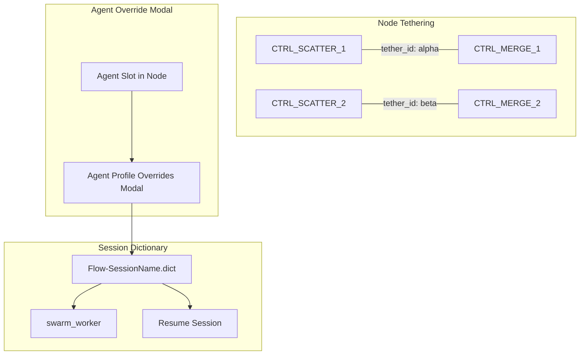

# Phase 5 Revised: Control Node Evolution + Tethering + Session Dictionary

> [!NOTE]
> This revision **preserves all items** from the previous plan. New sections are marked with 🆕. Changed sections are marked with 🔄.

---

## Architecture Overview: The Three New Systems



---

## 🆕 System 1: Node Tethering

### The Problem

In a complex topology with nested parallel branches, multiple CTRL_SCATTER/CTRL_MERGE pairs can exist simultaneously. Without explicit tethering, the broker cannot distinguish which MERGE collects from which SCATTER's downstream agents:

```
                ┌─→ Agent_A ──→ Agent_D ─────┐
Payload → S1 ──┤                              ├─→ M1 → Output
                └─→ Agent_B ──┐               │
                               ├─→ S2 ──┐     │
                               │         ├─→ Agent_E ──→ M2 ──┘
                               └─→      └─→ Agent_F ──┘
```

Without tethering, M2 might try to merge Agent_A's output (which belongs to S1→M1).

### Tether ID System

Every CTRL_ node that participates in a fan-out/fan-in pair gets a `tether_id` — a deterministic identifier that links paired nodes:

| Node Type | Tether Role | Tether Partners |
|-----------|-------------|-----------------|
| `CTRL_SCATTER` | **Source** — creates the tether | `CTRL_MERGE`, `CTRL_CONCAT` |
| `CTRL_MERGE` | **Sink** — closes the tether | `CTRL_SCATTER` |
| `CTRL_CONCAT` | **Sink** — closes the tether | `CTRL_SCATTER` |
| `CTRL_BRANCH` | **Source** — routes to tethered targets | `CTRL_MERGE`, `CTRL_CONDITIONAL_ROUTE` |
| `CTRL_CONDITIONAL_ROUTE` | **Sink** (optional) — receives from tethered upstream | `CTRL_BRANCH`, agent nodes |

### Tether Config in NodeConfig Modal

When CTRL_SCATTER is added to the topology:
1. A `tether_id` is auto-generated (e.g., `"tether_alpha"`)
2. When CTRL_MERGE is subsequently added, it auto-tethers to the most recent untethered SCATTER
3. The user can manually change tether assignments in the NodeConfig Modal

```
┌─ Configure Node: CTRL_SCATTER_1 ─────────────────┐
│                                                     │
│  Custom Node Name: [CTRL_SCATTER_1             ]    │
│                                                     │
│  ── Tether ─────────────────────────────────────    │
│  Tether ID:    tether_alpha                         │
│  Paired With:  CTRL_MERGE_1                         │
│                                                     │
│  ── Scatter Targets ────────────────────────────    │
│  [Select Agent… ▼]  [+ Add]                         │
│                                                     │
│  Slotted Targets:                                   │
│    1. OSINT_Analyst        [⚙ Overrides] [✕]       │
│    2. Regular_Joe          [⚙ Overrides] [✕]       │
│    3. Devil_Advocate       [⚙ Overrides] [✕]       │
│                                                     │
│  ── Scatter Mode ───────────────────────────────    │
│  Payload Distribution:  [Full Copy ▼]               │
│    • Full Copy — each target gets complete payload  │
│    • Chunk Split — payload split by ## headers      │
│                                                     │
│  [Cancel]                            [Save]         │
└─────────────────────────────────────────────────────┘
```

And the paired MERGE:

```
┌─ Configure Node: CTRL_MERGE_1 ───────────────────┐
│                                                    │
│  Custom Node Name: [CTRL_MERGE_1              ]    │
│                                                    │
│  ── Tether ────────────────────────────────────    │
│  Tether ID:    tether_alpha                        │
│  Paired With:  CTRL_SCATTER_1                      │
│  Source Nodes: OSINT_Analyst, Regular_Joe,          │
│                Devil_Advocate                       │
│  (auto-populated from scatter's slotted targets)    │
│                                                    │
│  ── Merge Mode ────────────────────────────────    │
│  Output Format:  [Structured ▼]                    │
│    • Structured — ## Source: {node_id} sections    │
│    • Concatenate — flat join with delimiter        │
│                                                    │
│  Custom Delimiter: [---                        ]   │
│  (only shown when Concatenate selected)             │
│                                                    │
│  [Cancel]                           [Save]         │
└────────────────────────────────────────────────────┘
```

### Implementation: Tether Storage

Tethers are stored in the **topology row** for each node as a new field:

```python
{
    "Node_ID": "CTRL_SCATTER_1",
    "tether_id": "tether_alpha",
    "tether_role": "source",        # "source" | "sink"
    "tether_partner": "CTRL_MERGE_1",
    "scatter_targets": ["OSINT_Analyst_s1", "Regular_Joe_s1", "Devil_Advocate_s1"],
    "scatter_mode": "full_copy",     # "full_copy" | "chunk_split"
    "Next_Node": "OSINT_Analyst_s1|Regular_Joe_s1|Devil_Advocate_s1",
    ...
}
```

The broker's `route_task()` uses `tether_id` to scope Wait_For resolution — CTRL_MERGE only collects from nodes that share its `tether_id`.

---

## 🆕 System 2: Session Dictionary (Flow .dict)

### Existing Pattern: Chat Studio

Chat Studio already builds a `.dict` file at:
```
$Project/02_Dynamic_Context/ChatStudioSessions/$ChatName-Chat/ChatStudio-$ChatName.dict
```

Format — JSON keyed by agent name:
```json
{
    "OSINT_Analyst": {
        "agent_name": "OSINT_Analyst",
        "system_prompt": "You are an OSINT analyst...",
        "model": "gemini-2.5-flash",
        "temperature": 0.7,
        "tools_allowed": "google_search,search_web",
        "ai_studio_options": {
            "thinking_level": "high",
            "grounding_google_search": true,
            "grounding_brave_search": true,
            "code_execution": false,
            "structured_output": false,
            "media_resolution": "default"
        }
    },
    "Regular_Joe": { ... }
}
```

swarm_worker loads it via `MACCRE_CUSTOM_DICT` env var at [swarm_worker.py:194-224](file:///B:/EXO_GANS/maccre_core/orchestration/swarm_worker.py#L194-L224).

### 🆕 Flow Dictionary Extension

For Flow sessions, the dict needs additional structure beyond agent profiles:

```json
{
    "_flow_meta": {
        "session_name": "MyResearchFlow",
        "created_at": "2026-07-12T21:00:00Z",
        "tethers": {
            "tether_alpha": {
                "source": "CTRL_SCATTER_1",
                "sink": "CTRL_MERGE_1",
                "targets": ["OSINT_s1", "RegJoe_s1", "DevAdv_s1"]
            }
        },
        "node_configs": {
            "CTRL_SCATTER_1": {
                "scatter_mode": "full_copy",
                "tether_id": "tether_alpha"
            },
            "CTRL_MERGE_1": {
                "merge_mode": "structured",
                "tether_id": "tether_alpha"
            },
            "CTRL_BRANCH_1": {
                "keyword_map": {"accepted": "SYNTH_1", "default": "REVIEWER_1"},
                "tether_id": "tether_beta"
            }
        }
    },
    "OSINT_Analyst": {
        "system_prompt": "...",
        "model": "gemini-2.5-flash",
        "temperature": 0.7,
        "tools_allowed": "google_search",
        "ai_studio_options": { ... }
    },
    "Regular_Joe": { ... }
}
```

### Dictionary Lifecycle

```
1. User adds nodes to topology via Workshop
   → Each node addition creates/updates a dict entry in memory buffer
   
2. User clicks agent slot → [⚙ Overrides] button
   → Agent Profile Overrides Modal opens
   → User configures model, temp, tools, system prompt, etc.
   → Apply saves to the in-memory dict buffer

3. Dict buffer is displayed live in InformationPanel
   → "As-Wrapped Preview" InfoPane shows the current dict JSON
   → Updates in real-time as nodes are added/configured

4. User presses "Launch Flow"
   → Dict is written to: $Project/02_Dynamic_Context/$SessionName/Flow-$SessionName.dict
   → swarm_worker launched with MACCRE_CUSTOM_DICT=$dict_path

5. User presses "Resume Session" in Session Manager
   → Dict is loaded from the session's 02_Dynamic_Context directory
   → Remaining nodes use the dict for agent configuration
```

### 🔄 swarm_worker Changes

Currently, `MACCRE_CUSTOM_DICT` is only loaded in the **Chat Studio** code path (the interactive listener loop at L194). For Flow execution, the dict loading needs to be extended to `execute_cycle()` — specifically, the `_load_agent_cfg()` function should check for a flow dict before falling back to `agent_library.db`.

**Load precedence:**
1. Flow Dict (`Flow-$session.dict`) → session-specific overrides
2. Topology CSV → `Model_Override`, `System_Instruction`, `Tools_Allowed` columns
3. Agent Library DB → base profile from `agent_library.db`

---

## 🆕 System 3: Agent Profile Overrides Modal

### Where It's Spawned

From the **NodeConfig Modal** — each slotted agent gets an `[⚙ Overrides]` button next to it. Clicking it opens the **Agent Profile Overrides Modal** for that specific agent.

### Modal Layout

Mirrors the Chat Studio's ChatBuilderPane agent config section ([nexus_plex.py:514-584](file:///B:/EXO_GANS/maccre_tui/nexus_plex.py#L514-L584)), but as a modal:

```
┌─ Agent Profile Overrides: OSINT_Analyst ─────────────────┐
│                                                            │
│  Base Profile: OSINT_Analyst (agent_library.db)            │
│  Changes here are SESSION-SPECIFIC — base profile          │
│  is NOT modified.                                          │
│                                                            │
│  ── Model ──────────────────────────────────────────────   │
│  Model:        [gemini-2.5-flash ▼]                        │
│  Temperature:  [0.7              ]                         │
│  Thinking:     [High ▼]                                    │
│                                                            │
│  ── System Instructions ────────────────────────────────   │
│  [Edit System Instructions]  (opens text editor modal)     │
│                                                            │
│  ── Tool Assignments ───────────────────────────────────   │
│  ☑ Google Search                                           │
│  ☑ Brave Search                                            │
│  ☐ Local Memory                                            │
│  ☐ FinOps Ledger                                           │
│  ☐ Code Execution                                          │
│  ☐ Google Maps                                             │
│  ☐ URL Context                                             │
│  ☐ Structured Outputs                                      │
│  ☐ Exclusionary Search                                     │
│  ☐ Funnel Search                                           │
│  ☐ read_file                                               │
│  ☐ write_file                                              │
│  ☐ list_dir                                                │
│  ☐ web_search                                              │
│  ☐ hybrid_search                                           │
│  ☐ execute_sql                                             │
│  ☐ execute_terminal                                        │
│                                                            │
│  ── Advanced ───────────────────────────────────────────   │
│  Output Length: [65536            ]                         │
│  Top P:         [0.95             ]                         │
│  Media Res:     [Default ▼]                                │
│                                                            │
│  [Cancel]                          [Apply Overrides]       │
└────────────────────────────────────────────────────────────┘
```

### How It Connects

```
NodeConfig Modal (per-node)
  └─ Agent Slot: OSINT_Analyst  [⚙ Overrides]
       └─ Agent Profile Overrides Modal
            └─ Apply Overrides → updates dict buffer → dict["OSINT_Analyst"] = {...}
```

### MacroNode Pre-Configuration (1b)

When a **MacroNode** is added to the flow from the Node Catalog:
- If the MacroNode was saved as **fully configured** (agents + tools already slotted):
  - Dict entries are created for every agent in the MacroNode's saved topology
  - User can still open NodeConfig → Overrides to modify
- If the MacroNode was saved as a **blank template** (no agents slotted):
  - Dict entries are empty shells
  - User MUST configure agents via NodeConfig before launching

> [!IMPORTANT]
> **MacroNode save modes**: The MacroNode registry needs a `"save_mode"` field: `"configured"` vs `"template"`. Configured MacroNodes include agent assignments and tool configs. Template MacroNodes define the topology pattern with empty agent slots.

---

## 🔄 Track A: Control Node Implementations (Updated with Tethering)

### A1. The 7 Priority Nodes (Updated)

| Node | Behavior | Config Fields |
|------|----------|---------------|
| **CTRL_MERGE** | Reads outputs from tethered upstream nodes. Assembles structured doc or flat concat based on `merge_mode`. | `tether_id`, `merge_mode` (structured/concat), `delimiter` |
| **CTRL_SCATTER** | Creates downstream tasks for each slotted agent. Sets `tether_id` on created tasks for scoped fan-in. | `tether_id`, `scatter_targets[]`, `scatter_mode` (full_copy/chunk_split) |
| **CTRL_CONCAT** | Like MERGE but always flat concat. Respects `tether_id` for scoped collection. | `tether_id`, `delimiter` |
| **CTRL_BRANCH** | Deterministic keyword router with tether-aware target resolution. | `keyword_map` JSON, optional `tether_id` |
| **CTRL_CONDITIONAL_ROUTE** | Probabilistic router — extracts routing signal from upstream output. **See Section 5 for multi-vector approach.** | `routing_vectors[]`, `fallback_target` |
| **CTRL_FILTER** | Strips payload sections by predicate rules. | `filter_rules` JSON |
| **CTRL_CLEANUP** | Deletes temp files matching glob patterns. | `glob_patterns` |

### 🔄 A2. Architecture Change for Tethering

The `execute_deterministic_node()` signature needs an additional parameter — access to the broker or a scoped query function for tether-based predecessor resolution:

```python
def execute_deterministic_node(
    node_id: str,
    task: dict[str, Any],
    topology_config: dict[str, Any] | None = None,
    predecessor_payloads: list[dict[str, str]] | None = None,  # 🆕 injected by swarm_worker
) -> DeterministicNodeResult:
```

The swarm_worker pre-collects predecessor payloads (already does this at L762-819 for AI nodes). For CTRL_ nodes, extend this collection to be **tether-scoped**: only collect from nodes sharing the same `tether_id`.

---

## 🆕 System 5: Conditional Routing — Multi-Vector Approach

### The Reliability Problem

`ROUTE_TO:` is a text-scraping pattern — it requires the LLM to output a specific string at the bottom of its response. Problems:

1. **Agents forget** — even with `***CRITICAL FINAL INSTRUCTION***`, agents sometimes write the critique but forget the ROUTE_TO tag
2. **Agents format it wrong** — `Route to: Agent_A` instead of `ROUTE_TO:Agent_A`, or embed it mid-paragraph
3. **Agents hallucinate targets** — route to agent names that don't exist

### Multi-Vector Conditional Routing for CTRL_CONDITIONAL_ROUTE

Instead of relying on a single text-scraping vector, CTRL_CONDITIONAL_ROUTE should support **multiple routing vectors** that are tried in priority order:

| Vector | Type | How It Works | Reliability |
|--------|------|-------------|-------------|
| **1. Structured Output** | Deterministic | Force the upstream agent to use `response_schema` with a Pydantic model that includes a `route_to` field. The response is guaranteed to contain the field. | ★★★★★ |
| **2. Keyword Gate** | Deterministic | Scan payload for configurable keywords: `"ACCEPTED"`, `"REJECTED"`, `"NEEDS_REVISION"`. Map each to a target node. No LLM parsing needed. | ★★★★☆ |
| **3. Sentiment/Score Threshold** | Deterministic | If the upstream agent includes a numeric score (e.g., `Score: 8/10`), route based on threshold: `score >= 7 → ACCEPTED`, else → loop back. Regex extracts the number. | ★★★★☆ |
| **4. ROUTE_TO Tag** | Probabilistic | Existing `ROUTE_TO:` regex scraping. Enhanced with fuzzy matching (Levenshtein distance) for near-miss agent names. | ★★★☆☆ |
| **5. LLM Classifier** | Probabilistic | If all other vectors fail, make a cheap secondary LLM call (Flash, temp=0.1) with the payload + a classification prompt: "Given this output, should we route to A or B?" | ★★★☆☆ |

### Proposed Config for CTRL_CONDITIONAL_ROUTE

```
┌─ Configure Node: CTRL_CONDITIONAL_ROUTE_1 ──────────────┐
│                                                           │
│  ── Routing Vectors (tried in order) ─────────────────   │
│                                                           │
│  ☑ 1. Structured Output Schema                           │
│     └─ Forces upstream agent to use response_schema       │
│        with route_to field. Most reliable.                │
│                                                           │
│  ☑ 2. Keyword Gate                                        │
│     └─ Keywords: ACCEPTED→Synth_1, REJECTED→Advocate_1   │
│        [Edit Keyword Map]                                 │
│                                                           │
│  ☑ 3. Score Threshold                                     │
│     └─ Regex: Score:\s*(\d+)/10                           │
│        Threshold: >= [7]  → Synth_1                       │
│        Below threshold    → Advocate_1                    │
│                                                           │
│  ☑ 4. ROUTE_TO Tag (legacy, fuzzy match enabled)         │
│                                                           │
│  ☐ 5. LLM Classifier Fallback                            │
│     └─ Model: gemini-2.5-flash, temp=0.1                 │
│        Cost: ~$0.001 per classification                   │
│                                                           │
│  ── Fallback Target ────────────────────────────────────  │
│  If ALL vectors fail: [END ▼]                             │
│                                                           │
│  ── Tether ─────────────────────────────────────────────  │
│  Tether ID:    [tether_gamma]  (optional)                 │
│  Paired With:  [CTRL_BRANCH_1 ▼]                         │
│                                                           │
│  [Cancel]                              [Save]             │
└───────────────────────────────────────────────────────────┘
```

### Vector 1 Deep Dive: Structured Output for Routing

This is the **most reliable** vector. The upstream agent's response is forced into a schema:

```python
class RoutingDecision(BaseModel):
    """Judge's routing decision — guaranteed to contain route_to field."""
    evaluation_summary: str
    route_to: Literal["ACCEPTED", "Agent_A", "Agent_B"]
    confidence: float = Field(ge=0.0, le=1.0)
    critique: str = ""
```

When CTRL_CONDITIONAL_ROUTE is configured with Vector 1, it injects this schema into the **upstream agent's** `response_schema` field in the flow dict. The agent's output is then guaranteed JSON with a `route_to` field — no text scraping needed.

> [!IMPORTANT]
> **Trade-off**: Structured output constrains the agent's response format. The judge can't write a free-form evaluation followed by a ROUTE_TO tag — it must produce JSON. This may reduce the quality of the critique. Consider combining Vector 1 (for routing decision) with a `critique` field in the schema (for the detailed feedback).

### Vector 2 + 3: Deterministic Keyword/Score Extraction

These are pure regex + threshold operations — zero LLM dependency:

```python
# Vector 2: Keyword Gate
keyword_map = {"ACCEPTED": "SYNTH_1", "NEEDS_REVISION": "ADVOCATE_1", "REJECTED": "FAILED"}
for keyword, target in keyword_map.items():
    if keyword.upper() in payload_text.upper():
        return target

# Vector 3: Score Threshold
score_match = re.search(r"Score:\s*(\d+(?:\.\d+)?)\s*/\s*10", payload_text)
if score_match:
    score = float(score_match.group(1))
    if score >= threshold:
        return accept_target
    return reject_target
```

### Vector 4 Enhancement: Fuzzy ROUTE_TO Matching

Current regex: `ROUTE_TO:\s*([A-Za-z0-9_,\s\[\]{}]+)`

**Enhanced with fuzzy matching:**
- If exact match fails, compute Levenshtein distance against all valid targets
- Accept if distance ≤ 2 (e.g., `ROUTE_TO:OSINT_Analist` → matches `OSINT_Analyst`)
- Log the fuzzy correction for audit trail

---

## 🔄 Track B: Template System Evolution (Updated)

### B3. Save-from-Session — Template Naming Modal (unchanged from previous plan)

`TemplateNameModal(ModalScreen)` — small popup for naming without canonizing.

### 🆕 B4. MacroNode Save Modes

MacroNodes saved from the Node Catalog or from completed sessions should have a `save_mode`:

| Mode | What's Saved | Use Case |
|------|-------------|----------|
| `"configured"` | Topology + agent assignments + tool configs + overrides | Reusable preset — drop into flow, ready to launch |
| `"template"` | Topology structure only — empty agent slots | Pattern template — must configure agents before launching |

The MacroNode registry's `save()` method needs a `save_mode` parameter. The Node Catalog should show both modes with distinct icons.

---

## 🔄 Track C: Workshop Completion (Unchanged + Additions)

### C1. Flow Monitor Collapse Button — Verify ✓ (unchanged)
### C2. Remove Flow Monitor from MacroNodeWorkshop (unchanged)

### 🔄 C3. Topology Visualizer — Updated for Tethering

In addition to the previous plan (inner node expansion, clickable nodes, recursion mapping), the Topology Visualizer should show **tether connections**:

```
Flow:
├── ○ CTRL_SCATTER_1 ⟨tether:α⟩
│   ├── ○ OSINT_Analyst_s1 → CTRL_MERGE_1
│   ├── ○ Regular_Joe_s1 → CTRL_MERGE_1
│   └── ○ Devil_Advocate_s1
│       ├── ○ CTRL_SCATTER_2 ⟨tether:β⟩
│       │   ├── ○ Sub_Agent_A → CTRL_MERGE_2
│       │   └── ○ Sub_Agent_B → CTRL_MERGE_2
│       └── ○ CTRL_MERGE_2 ⟨tether:β⟩ → CTRL_MERGE_1
├── ○ CTRL_MERGE_1 ⟨tether:α⟩ (Wait_For: OSINT, RegJoe, MERGE_2)
└── ○ Synthesizer → END
```

Tether IDs shown as `⟨tether:α⟩` tags in the tree labels. Matching pairs use the same Greek letter for visual pairing.

---

## 🔄 Prioritized Work Breakdown (Updated)

### Wave 1: Foundation (No Runtime Changes)
1. Remove Flow Monitor section from MacroNodeWorkshop
2. Verify Flow Monitor collapse/expand in header
3. Create `TemplateNameModal` for save-from-session naming
4. Add `save_mode` field to MacroNode registry

### Wave 2: Session Dictionary System
5. Define `FlowDict` format (JSON schema with `_flow_meta` + agent profiles)
6. Build in-memory dict buffer in MacroNodeWorkshop
7. Wire dict buffer display to InformationPanel "As-Wrapped Preview" pane
8. Create `AgentProfileOverridesModal` (mirrors Chat Studio ChatBuilderPane fields + tool checkboxes)
9. Write dict to `02_Dynamic_Context/$Session/Flow-$Session.dict` on Launch
10. Extend `swarm_worker.execute_cycle()` to load flow dict (load precedence: dict → CSV → DB)
11. Wire Resume Session to load existing flow dict

### Wave 3: Tethering + Control Nodes
12. Design `tether_id` field in topology row schema
13. Implement auto-tether logic in MacroNodeWorkshop (SCATTER→MERGE pairing)
14. Add tether config section to NodeConfigModal
15. Implement 7 handlers in `deterministic_nodes.py` (tether-aware MERGE/SCATTER/CONCAT)
16. Extend fan-in artifact collection in swarm_worker to be tether-scoped
17. Update `controlnode_registry.py` seeds → active + handler refs + config schemas

### Wave 4: Conditional Routing Vectors
18. Implement Vector 2 (Keyword Gate) in `_handle_conditional_route`
19. Implement Vector 3 (Score Threshold) in `_handle_conditional_route`
20. Enhance Vector 4 (Fuzzy ROUTE_TO) with Levenshtein distance
21. Implement Vector 1 (Structured Output injection) — requires modifying upstream agent's response_schema in flow dict
22. (Optional) Implement Vector 5 (LLM Classifier fallback)

### Wave 5: Topology Visualizer + Polish
23. MacroNode inner topology expansion
24. Wire `TopologyNodeDoubleClicked` → NodeConfigModal
25. Tether visualization in tree labels
26. Recursion iteration display
27. Template skeleton preview

---

## Open Questions

> [!IMPORTANT]
> **Structured Output trade-off (Vector 1):** Forcing a judge agent into `response_schema` JSON means it can't write a free-form evaluation. Should we split the judge's turn into **two calls** — one free-form generation (evaluation + critique) followed by one structured extraction (routing decision only)? This costs 2x API calls but gives us both quality critique AND reliable routing.

> [!IMPORTANT]
> **Dict loading for flow execution:** Currently swarm_worker only loads `.dict` in the Chat Studio code path. For flow execution, should the dict override the **topology CSV columns** (Model_Override, System_Instruction, etc.) or only fill in what's missing? My recommendation: **Dict wins over CSV** — the dict represents the user's explicit session-specific intent. CSV is the base template.

> [!IMPORTANT]
> **Tether auto-creation scope:** When CTRL_SCATTER is added and agents are slotted into it, should the downstream agent nodes be auto-created in the topology? Or should the user manually add them first? Auto-creation is more UX-friendly but might surprise users who expect to control every node addition.

