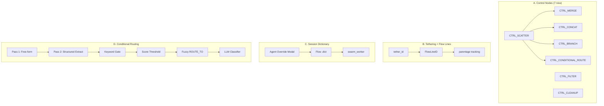

# Phase 5 FINAL: Control Node Evolution + Tethering + Session Dictionary

---

## Architecture Summary



---

## System 1: Control Node Implementations

### 1A. The 7 Priority Nodes

All handlers in [deterministic_nodes.py](file:///B:/EXO_GANS/maccre_core/orchestration/deterministic_nodes.py). Registry updates in [controlnode_registry.py](file:///B:/EXO_GANS/maccre_core/controlnode_registry.py).

| Node | Category | Behavior | Accepts Fan-In Tether |
|------|----------|----------|-----------------------|
| **CTRL_SCATTER** | Data Flow | Splits payload into N flow lines. Creates downstream tasks for each slotted agent. Tags each task with `tether_id` + `flow_line_id`. 2–10 agent slots. | No (source only) |
| **CTRL_MERGE** | Data Flow | Collects outputs from ALL flow lines sharing its tether. Assembles structured (`## Source: {node}`) or flat concat output. Configurable via NodeConfig. | ✅ Yes |
| **CTRL_CONCAT** | Data Flow | Like MERGE but always flat concatenation with configurable delimiter. Respects tether scope. | ✅ Yes |
| **CTRL_BRANCH** | Routing | Deterministic keyword router. Scans payload for configured keywords → routes to matching target. | ✅ Yes |
| **CTRL_CONDITIONAL_ROUTE** | Routing | Dual-pass probabilistic router with quadrivector failback. See Section 4. | ✅ Yes |
| **CTRL_FILTER** | Data Flow | Strips payload sections by predicate rules (strip_sections, max_chars, regex_remove). | No (inline) |
| **CTRL_CLEANUP** | State Mgmt | Deletes temp files matching glob patterns from job ledger directory. | No (inline) |

### 1B. Handler Signature Update

```python
def execute_deterministic_node(
    node_id: str,
    task: dict[str, Any],
    topology_config: dict[str, Any] | None = None,
    predecessor_payloads: list[dict[str, str]] | None = None,  # NEW: tether-scoped
) -> DeterministicNodeResult:
```

`predecessor_payloads` is pre-collected by swarm_worker using the existing fan-in artifact injection at [swarm_worker.py:762-819](file:///B:/EXO_GANS/maccre_core/orchestration/swarm_worker.py#L762-L819), extended to run for CTRL_ nodes and scoped by `tether_id`.

### 1C. Enum + Registry Updates

#### [MODIFY] [deterministic_nodes.py](file:///B:/EXO_GANS/maccre_core/orchestration/deterministic_nodes.py)

- Add 7 new values to `DeterministicNodeType` enum
- Add 7 handler functions: `_handle_merge`, `_handle_scatter`, `_handle_concat`, `_handle_branch`, `_handle_conditional_route`, `_handle_filter`, `_handle_cleanup`
- Register all 7 in `_NODE_HANDLERS` dict

#### [MODIFY] [controlnode_registry.py](file:///B:/EXO_GANS/maccre_core/controlnode_registry.py)

- Update 7 nodes: `status` → `"active"`, populate `handler_module` + `handler_func`
- Add `config_schema` JSON for each node documenting expected config fields
- Add `_SEED_VERSION` constant so `_seed_builtins` re-seeds on version bump (currently only seeds if table empty)

---

## System 2: Node Tethering + Flow Lines

### 2A. Tether ID

Every fan-out/fan-in control node pair shares a `tether_id` — a deterministic identifier that scopes which nodes belong to which scatter/gather group.

**Tether Roles:**

| Role | Nodes | Meaning |
|------|-------|---------|
| **Source** | `CTRL_SCATTER`, `CTRL_BRANCH` | Creates the tether, spawns flow lines |
| **Sink** | `CTRL_MERGE`, `CTRL_CONCAT`, `CTRL_BRANCH`, `CTRL_CONDITIONAL_ROUTE` | Closes the tether, collects from flow lines |

**Auto-tethering:** When a sink node (MERGE/CONCAT/BRANCH/CONDITIONAL_ROUTE) is added to the topology, it auto-tethers to the most recent untethered source. Manual override available in NodeConfig Modal.

### 2B. FlowLineID

When CTRL_SCATTER creates N downstream tasks, each gets a `flow_line_id` tracking its parentage:

```
flow_line_id format: "FL_{tether_id}_{branch_index}"

Example: CTRL_SCATTER_1 (tether_alpha) → 3 agents
  Agent_A task: flow_line_id = "FL_alpha_0"
  Agent_B task: flow_line_id = "FL_alpha_1"  
  Agent_C task: flow_line_id = "FL_alpha_2"
```

**Parentage chain for nested scatters:**
```
FL_alpha_0                          ← top-level scatter line 0
FL_alpha_0.FL_beta_0                ← nested scatter within line 0, sub-line 0
FL_alpha_0.FL_beta_1                ← nested scatter within line 0, sub-line 1
```

This dot-delimited hierarchy lets MERGE collect the right scope:
- `CTRL_MERGE tethered to alpha` → collects all `FL_alpha_*` (top-level lines)
- `CTRL_MERGE tethered to beta` → collects all `FL_alpha_0.FL_beta_*` (nested lines only)

### 2C. Tether Storage in Topology Row

```python
{
    "Node_ID": "CTRL_SCATTER_1",
    "tether_id": "tether_alpha",
    "tether_role": "source",
    "tether_partner": "CTRL_MERGE_1",
    "scatter_targets": ["Agent_A_s1", "Agent_B_s1", "Agent_C_s1"],
    "scatter_mode": "full_copy",
    "Next_Node": "Agent_A_s1|Agent_B_s1|Agent_C_s1",
    ...
}
```

### 2D. CTRL_SCATTER Auto-Populate Companion

In the NodeConfig Modal for CTRL_SCATTER, an option to auto-create an associated sink node:

```
┌─ Configure Node: CTRL_SCATTER_1 ─────────────────────┐
│                                                        │
│  ── Scatter Targets (2–10) ────────────────────────   │
│  [Select Agent… ▼]  [+ Add]                            │
│                                                        │
│  Slotted:                                              │
│    1. OSINT_Analyst        [⚙ Overrides] [✕]          │
│    2. Regular_Joe          [⚙ Overrides] [✕]          │
│    3. Devil_Advocate       [⚙ Overrides] [✕]          │
│                                                        │
│  Scatter Mode: [Full Copy ▼]                           │
│                                                        │
│  ── Auto-Create Companion ─────────────────────────   │
│  ☑ Auto-create companion node                          │
│  Companion Type: [CTRL_MERGE ▼]                        │
│    (CTRL_MERGE / CTRL_CONCAT / CTRL_BRANCH /           │
│     CTRL_CONDITIONAL_ROUTE)                            │
│                                                        │
│  Companion will be pre-tethered and pre-slotted        │
│  with all scatter targets as Wait_For sources.         │
│                                                        │
│  [Cancel]                              [Save]          │
└────────────────────────────────────────────────────────┘
```

### 2E. Broker Changes for Tethering

#### [MODIFY] [local_broker.py](file:///B:/EXO_GANS/maccre_core/orchestration/local_broker.py)

**`route_task()`**: When routing to a tether-sink node (MERGE/CONCAT/BRANCH/CONDITIONAL_ROUTE), the `Wait_For` resolution is scoped by `tether_id`. Instead of checking ALL completed predecessors, only check predecessors that share the same `tether_id`.

**`fetch_and_lock_task()`**: When evaluating `wait_for` dependencies for a tethered sink node, query `task_queue` for completed tasks matching the tether's `flow_line_id` prefix.

**New column in `task_queue`**: `flow_line_id TEXT DEFAULT ''` — populated by CTRL_SCATTER when creating downstream tasks.

---

## System 3: Session Dictionary (Flow .dict)

### 3A. Existing Pattern (Chat Studio)

Chat Studio builds `.dict` files at `02_Dynamic_Context/ChatStudioSessions/$Name-Chat/ChatStudio-$Name.dict`. Format is JSON keyed by agent name with full profile + `ai_studio_options`. Loaded via `MACCRE_CUSTOM_DICT` env var. Currently only applied in the Chat Studio code path of swarm_worker.

### 3B. Flow Dictionary Format

```json
{
    "_flow_meta": {
        "session_name": "MyResearchFlow",
        "created_at": "2026-07-12T22:00:00Z",
        "tethers": {
            "tether_alpha": {
                "source": "CTRL_SCATTER_1",
                "sink": "CTRL_MERGE_1",
                "targets": ["OSINT_s1", "RegJoe_s1", "DevAdv_s1"]
            }
        },
        "flow_lines": {
            "FL_alpha_0": { "agent": "OSINT_Analyst", "parent": "CTRL_SCATTER_1" },
            "FL_alpha_1": { "agent": "Regular_Joe", "parent": "CTRL_SCATTER_1" },
            "FL_alpha_2": { "agent": "Devil_Advocate", "parent": "CTRL_SCATTER_1" }
        },
        "node_configs": {
            "CTRL_SCATTER_1": { "scatter_mode": "full_copy", "tether_id": "tether_alpha" },
            "CTRL_MERGE_1": { "merge_mode": "structured", "tether_id": "tether_alpha" },
            "CTRL_CONDITIONAL_ROUTE_1": { "routing_vectors": ["structured", "keyword", "score", "route_to"], "fallback": "END" }
        }
    },
    "OSINT_Analyst": {
        "agent_name": "OSINT_Analyst",
        "system_prompt": "...",
        "model": "gemini-2.5-flash",
        "temperature": 0.7,
        "tools_allowed": "google_search,search_web",
        "ai_studio_options": {
            "thinking_level": "high",
            "grounding_google_search": true,
            "grounding_brave_search": true,
            "code_execution": false,
            "structured_output": false,
            "media_resolution": "default"
        }
    },
    "Regular_Joe": { "..." : "..." },
    "Devil_Advocate": { "..." : "..." }
}
```

### 3C. Dictionary Lifecycle

| Step | Action | Location |
|------|--------|----------|
| User adds nodes to topology | Dict buffer created/updated in memory | MacroNodeWorkshop |
| User clicks [⚙ Overrides] on agent slot | AgentProfileOverridesModal opens | NodeConfig Modal |
| User applies overrides | Dict buffer updated for that agent | In-memory |
| Dict displayed live | "As-Wrapped Preview" InfoPane shows JSON | InformationPanel |
| User presses Launch | Dict written to `02_Dynamic_Context/$Session/Flow-$Session.dict` | NexusPlex launch handler |
| swarm_worker starts | Dict loaded via `MACCRE_CUSTOM_DICT` env var | swarm_worker.py |
| Resume Session | Dict loaded from session's `02_Dynamic_Context` directory | Session Manager |

### 3D. Override Precedence (Dict Wins)

```
1. Flow Dict (Flow-$Session.dict)     ← session-specific intent, WINS
2. Topology CSV columns               ← base template structure
3. Agent Library DB                    ← global agent profile
```

#### [MODIFY] [swarm_worker.py](file:///B:/EXO_GANS/maccre_core/orchestration/swarm_worker.py)

Extend dict loading from Chat Studio code path (L194-224) to `execute_cycle()` → `_load_agent_cfg()`. When `MACCRE_CUSTOM_DICT` is set, read agent config from dict before falling back to agent_library.db.

---

## System 4: Dual-Pass Conditional Routing (Quadrivector Failback)

### 4A. The Two-Pass Pattern

When a CTRL_CONDITIONAL_ROUTE node fires:

**Pass 1 — Free-form generation** (upstream agent, normal temp):
The agent produces its unimpeded evaluation, critique, or analysis. No structural constraints. Full quality output.

**Pass 2 — Structured routing extraction** (same agent, temp=0.1):
A cheap follow-up call where the agent reviews what it just wrote, receives a routing table of valid targets, and produces a **structured output** with a guaranteed `route_to` field:

```python
class RoutingDecision(BaseModel):
    """Structured routing extraction — guaranteed route_to field."""
    route_to: str          # Must be one of the valid target names
    confidence: float      # 0.0 - 1.0
    reasoning: str         # One-sentence justification
```

**Pass 2 prompt template:**
```
You just produced the following evaluation:
---
{pass_1_output}
---

Based on your evaluation, you must route to exactly one of these targets:
{routing_table}

Output your routing decision as structured JSON.
```

This gives us the best of both worlds: quality critique AND near-100% reliable routing.

### 4B. Quadrivector Failback Chain

If Pass 2 (structured output) fails or returns an invalid target, vectors are tried in order:

| Priority | Vector | Type | How |
|----------|--------|------|-----|
| **1** | Structured Output (Pass 2) | Deterministic | `response_schema` with `RoutingDecision` model. ~100% reliable. |
| **2** | Keyword Gate | Deterministic | Scan Pass 1 output for keywords → map to targets. Config: `{"ACCEPTED": "Synth_1", "REJECTED": "Advocate_1"}` |
| **3** | Score Threshold | Deterministic | Regex extract score (e.g. `Score: 8/10`). Route based on threshold. |
| **4** | Fuzzy ROUTE_TO | Probabilistic | Enhanced regex with Levenshtein fuzzy matching (distance ≤ 2). |
| **Fallback** | Configured default | Static | `fallback_target` from NodeConfig (default: `"END"`). |

> [!NOTE]
> The LLM Classifier (Vector 5 from previous plan) is now unnecessary — Pass 2's structured output already covers that case more reliably and cheaply. Dropped from the plan.

### 4C. Config in NodeConfig Modal

```
┌─ Configure Node: CTRL_CONDITIONAL_ROUTE_1 ──────────┐
│                                                       │
│  ── Routing Vectors (tried in priority order) ─────  │
│                                                       │
│  ☑ 1. Dual-Pass Structured Output                    │
│     Model: [gemini-2.5-flash ▼]  Temp: [0.1]        │
│                                                       │
│  ☑ 2. Keyword Gate                                    │
│     [Edit Keyword Map]                                │
│     ACCEPTED → Synth_1                                │
│     REJECTED → Advocate_1                             │
│                                                       │
│  ☑ 3. Score Threshold                                 │
│     Regex: [Score:\s*(\d+)/10      ]                  │
│     Threshold: >= [7]  → Synth_1                      │
│     Below    →  Advocate_1                            │
│                                                       │
│  ☑ 4. Fuzzy ROUTE_TO Tag                              │
│     (fuzzy match enabled, distance ≤ 2)               │
│                                                       │
│  ── Fallback ──────────────────────────────────────   │
│  If ALL vectors fail: [END ▼]                         │
│                                                       │
│  ── Tether (optional) ────────────────────────────   │
│  Accept fan-in from: [CTRL_SCATTER_1 ▼]              │
│                                                       │
│  [Cancel]                            [Save]           │
└───────────────────────────────────────────────────────┘
```

---

## System 5: Agent Profile Overrides Modal

### 5A. Where It's Spawned

From any node with agent slots in the **NodeConfig Modal**. Each slotted agent gets `[⚙ Overrides]` → opens `AgentProfileOverridesModal`.

### 5B. Modal Layout

#### [NEW] `AgentProfileOverridesModal(ModalScreen[dict | None])`

Mirrors Chat Studio's [ChatBuilderPane](file:///B:/EXO_GANS/maccre_tui/nexus_plex.py#L505-L585) fields as a standalone modal:

```
┌─ Agent Profile Overrides: OSINT_Analyst ──────────────┐
│                                                         │
│  Base: OSINT_Analyst (agent_library.db)                 │
│  [dim]Session-specific — base profile NOT modified[/dim]│
│                                                         │
│  ── Model ───────────────────────────────────────────  │
│  Model:       [gemini-2.5-flash ▼]                      │
│  Temperature: [0.7              ]                       │
│  Thinking:    [High ▼]                                  │
│                                                         │
│  ── System Instructions ─────────────────────────────  │
│  [Edit System Instructions]                             │
│                                                         │
│  ── Tool Assignments ────────────────────────────────  │
│  ☑ Google Search          ☐ Code Execution              │
│  ☑ Brave Search           ☐ Structured Outputs          │
│  ☐ Local Memory           ☐ Function Calling            │
│  ☐ FinOps Ledger          ☐ Google Maps                 │
│  ☐ Exclusionary Search    ☐ URL Context                 │
│  ☐ Funnel Search                                        │
│  ──────────────────────────────────────────────────── │
│  ☐ read_file     ☐ write_file    ☐ list_dir            │
│  ☐ web_search    ☐ hybrid_search ☐ execute_sql          │
│  ☐ execute_terminal                                     │
│                                                         │
│  ── Advanced ────────────────────────────────────────  │
│  Output Length: [65536]  Top P: [0.95]                   │
│  Media Res:     [Default ▼]                             │
│                                                         │
│  [Cancel]                        [Apply Overrides]      │
└─────────────────────────────────────────────────────────┘
```

**On Apply:** Updates the in-memory dict buffer for this agent. Does NOT touch `agent_library.db`.

---

## System 6: Session Manager — Dual MacroNode Save

### 6A. Two Save Buttons

#### [MODIFY] [session_manager_modal.py](file:///B:/EXO_GANS/maccre_tui/widgets/session_manager_modal.py)

Replace the single "Save as Template" button (`#btn-save-registry`) with two buttons:

```
┌─ Session Manager ──────────────────────────────────────┐
│                                                          │
│  [Save Topology as MacroNode]  [Save as MacroNode Template] │
│                                                          │
│  [dim]ℹ No completed session selected — these buttons    │
│  will use the topology currently on the Topology         │
│  Visualizer.[/dim]                                       │
│                                                          │
└──────────────────────────────────────────────────────────┘
```

### 6B. Source Logic

| Completed Session Selected? | Source |
|---|---|
| **Yes** | Use the completed session's `as_wrapped_topology.json` |
| **No** | Use the current topology from `MacroNodeWorkshop._flow_steps` |

### 6C. Naming Modal

#### [NEW] `MacroNodeNameModal(ModalScreen[dict | None])`

Appears after clicking either save button:

```
┌─ Name Your MacroNode ──────────────────────────┐
│                                                  │
│  Name:        [                              ]   │
│  Description: [                              ]   │
│                                                  │
│  Save Mode:   [Configured MacroNode]             │
│               (or [MacroNode Template])           │
│                                                  │
│  Source: Completed session "MyResearch_v2"        │
│  Nodes: 4 agent + 2 control                      │
│                                                  │
│  [Cancel]                          [Save]        │
└──────────────────────────────────────────────────┘
```

### 6D. Save Modes in Registry

#### [MODIFY] MacroNode registry `save()` method

Add `save_mode` parameter: `"configured"` | `"template"`

- **Configured**: Saves topology + agent assignments + tool configs + overrides. Ready to drop into a flow and launch.
- **Template**: Saves topology structure with empty agent slots. User must configure agents before launching.

The Node Catalog should show both with distinct visual markers.

---

## System 7: Topology Visualizer — Color Coding + Flow Lines

### 7A. Color Coding System

#### [MODIFY] [topology_visualizer.py](file:///B:/EXO_GANS/maccre_tui/widgets/topology_visualizer.py)

| Element | Color | Meaning |
|---------|-------|---------|
| **Agent nodes** | `cyan` | Standard AI agent execution |
| **CTRL_ nodes** | `magenta bold` | Deterministic control flow |
| **Active node** | `bold green` + pulse animation | Currently executing |
| **Completed node** | `dim green` | Successfully finished |
| **Failed node** | `bold red` | Execution failed |
| **Paused node** | `bold yellow` | Awaiting resume |
| **Tether source** | `⟨tether:α⟩` in `bold blue` | SCATTER/BRANCH origin |
| **Tether sink** | `⟨tether:α⟩` in `bold blue` | MERGE/CONCAT/BRANCH/CONDROUTE destination |
| **Flow line branch** | `dim yellow` prefix | `FL_α_0:` before node name |
| **Recursion back-ref** | `↩` in `bold yellow` | Loop-back indicator with iteration count |
| **Wait_For dependency** | `dim cyan` | `← waiting on: X, Y` suffix |

**Tether pairs share the same Greek letter** (`α`, `β`, `γ`, `δ`, etc.) and matching `bold blue` color for instant visual pairing.

### 7B. Flow Line Visualization

When CTRL_SCATTER creates N flow lines, the Topology Visualizer renders them as **parallel branches** under the scatter node:

```
Flow:
├── ○ CTRL_SCATTER_1 ⟨tether:α⟩ [magenta]
│   ├── FL_α_0: ────────────────────────────── [yellow dim]
│   │   ├── ○ OSINT_Analyst_s1 [cyan]
│   │   ├── ○ Fact_Checker [cyan]
│   │   └── ○ CTRL_CHECKPOINT_1 [magenta]
│   ├── FL_α_1: ────────────────────────────── [yellow dim]
│   │   ├── ○ Regular_Joe_s1 [cyan]
│   │   └── ○ CTRL_FILTER_1 [magenta]
│   └── FL_α_2: ────────────────────────────── [yellow dim]
│       ├── ○ Devil_Advocate_s1 [cyan]
│       ├── ○ CTRL_SCATTER_2 ⟨tether:β⟩ [magenta]
│       │   ├── FL_β_0: ○ Sub_A → CTRL_MERGE_2
│       │   └── FL_β_1: ○ Sub_B → CTRL_MERGE_2
│       └── ○ CTRL_MERGE_2 ⟨tether:β⟩ [magenta]
├── ○ CTRL_MERGE_1 ⟨tether:α⟩ ← waiting on: FL_α_0, FL_α_1, FL_α_2 [magenta]
└── ○ Synthesizer → END [cyan]
```

### 7C. Node Interaction UX

| Action | Result |
|--------|--------|
| **Single click** | Show node details in InformationPanel |
| **Double click** | Open NodeConfig Modal for that node |
| **Drag node** | Reposition within its flow line (reorder, move between lines) |

> [!NOTE]
> **Drag-and-drop** in Textual's Tree widget is not natively supported. Phase 5 implementation will use **keyboard shortcuts** for repositioning: `Ctrl+↑`/`Ctrl+↓` to move a selected node up/down within its flow line, `Ctrl+←`/`Ctrl+→` to move between flow lines. True drag-and-drop is a Phase 6+ stretch goal when we explore custom canvas widgets.

### 7D. Expand MacroNodes to Show Inner Topology

When a MacroNode is in the flow, the Topology Visualizer expands it to show all inner nodes:

```
├── ○ Step 1: HOLO_Research [MacroNode] [dim]
│   ├── ○ HOLO_OSINT_b3f2 [cyan]
│   ├── ○ HOLO_ANALYST_b3f2 [cyan]
│   └── ○ HOLO_SYNTH_b3f2 (Wait_For: OSINT, ANALYST) [cyan]
```

---

## System 8: Workshop Cleanup

### 8A. Remove Flow Monitor from MacroNodeWorkshop

#### [MODIFY] [macronode_workshop.py](file:///B:/EXO_GANS/maccre_tui/widgets/macronode_workshop.py)

Remove the `flow-monitor-section` Vertical (L208-243): stage readout, RichLog, VCR instructions, Proceed Anyway button, context injection Input. Remove `write_monitor_log()` and `set_stage_readout()` methods (L299-311).

**Keep:** NodeCatalog, TopologyVisualizer, Topo Actions, Active Flow Sequence, Flow Control buttons.

### 8B. Verify Flow Monitor Collapse Button

The `📊 Monitor` button already exists at [nexus_plex.py:1404](file:///B:/EXO_GANS/maccre_tui/nexus_plex.py#L1404) with collapse/expand handlers at [L2154-2172](file:///B:/EXO_GANS/maccre_tui/nexus_plex.py#L2154-L2172). Verify it works during live flow execution and on session resume.

---

## Verification Plan

### Automated QA
```bash
omni qa maccre_core/orchestration/deterministic_nodes.py --smart
omni qa maccre_core/controlnode_registry.py --smart
omni qa maccre_core/orchestration/swarm_worker.py --smart
omni qa maccre_core/orchestration/local_broker.py --smart
omni qa maccre_tui/widgets/macronode_workshop.py --smart
omni qa maccre_tui/widgets/topology_visualizer.py --smart
omni qa maccre_tui/widgets/session_manager_modal.py --smart
omni qa maccre_tui/nexus_plex.py --smart
```

### Manual Verification
1. **CTRL_SCATTER → CTRL_MERGE pipeline**: Build flow with SCATTER(3 agents) → 3 parallel agents → MERGE → Synthesizer. Verify tether scoping, FlowLineID tracking, and structured output assembly.
2. **Nested scatter**: Add CTRL_SCATTER_2 inside one of SCATTER_1's flow lines. Verify MERGE_2 only collects from SCATTER_2's lines, not SCATTER_1's.
3. **Conditional routing dual-pass**: Configure CTRL_CONDITIONAL_ROUTE with all 4 vectors. Verify Pass 2 structured output fires first, failback chain activates on failure.
4. **Session Dictionary**: Launch flow, verify `.dict` is written. Resume session, verify `.dict` is loaded. Check override precedence (dict > CSV > DB).
5. **Agent Overrides**: Open override modal for slotted agent, change model + tools. Verify changes appear in dict preview. Launch and verify swarm_worker uses overrides.
6. **MacroNode save modes**: Save a session as Configured MacroNode and as MacroNode Template. Verify both appear in Node Catalog with correct behavior.
7. **Topology Visualizer**: Verify color coding, tether labels, flow line branches, recursion indicators, and node click → NodeConfig.

---

## Prioritized Work Breakdown (5 Waves, 35 Items)

### Wave 1: Foundation + Cleanup (no runtime changes)

| # | Item | File(s) |
|---|------|---------|
| 1 | Remove Flow Monitor section from MacroNodeWorkshop | `macronode_workshop.py` |
| 2 | Verify Flow Monitor collapse/expand button in header | `nexus_plex.py` |
| 3 | Create `MacroNodeNameModal` (naming popup for save) | `session_manager_modal.py` |
| 4 | Replace single "Save as Template" with dual buttons + source logic | `session_manager_modal.py` |
| 5 | Add `save_mode` field to MacroNode registry save() | `macronode_registry.py` |
| 6 | Wire dual save buttons through NexusPlex handler | `nexus_plex.py` |

### Wave 2: Session Dictionary System

| # | Item | File(s) |
|---|------|---------|
| 7 | Define `FlowDict` JSON schema with `_flow_meta` | New type definition |
| 8 | Build in-memory dict buffer in MacroNodeWorkshop | `macronode_workshop.py` |
| 9 | Wire dict buffer display to InformationPanel "As-Wrapped Preview" | `nexus_plex.py`, `information_panel.py` |
| 10 | Create `AgentProfileOverridesModal` | `nexus_plex.py` (new modal class) |
| 11 | Wire [⚙ Overrides] buttons in NodeConfig Modal | `nexus_plex.py` (NodeConfigModal) |
| 12 | Write dict to `02_Dynamic_Context/$Session/Flow-$Session.dict` on Launch | `nexus_plex.py` launch handler |
| 13 | Extend `swarm_worker.execute_cycle()` → `_load_agent_cfg()` to load flow dict | `swarm_worker.py` |
| 14 | Wire Resume Session to load existing flow dict | `nexus_plex.py` resume handler |

### Wave 3: Tethering + Control Node Handlers

| # | Item | File(s) |
|---|------|---------|
| 15 | Add `flow_line_id` column to `task_queue` table | `local_broker.py` |
| 16 | Design tether field schema in topology rows | `topology_engine.py` |
| 17 | Implement auto-tether logic in MacroNodeWorkshop | `macronode_workshop.py` |
| 18 | Add tether config section to NodeConfigModal | `nexus_plex.py` |
| 19 | Add CTRL_SCATTER companion auto-create option | `nexus_plex.py` NodeConfigModal |
| 20 | Implement `_handle_scatter` (creates tasks with flow_line_id) | `deterministic_nodes.py` |
| 21 | Implement `_handle_merge` (tether-scoped fan-in collection) | `deterministic_nodes.py` |
| 22 | Implement `_handle_concat` (tether-scoped flat concat) | `deterministic_nodes.py` |
| 23 | Implement `_handle_branch` (keyword routing) | `deterministic_nodes.py` |
| 24 | Implement `_handle_filter` (predicate payload stripping) | `deterministic_nodes.py` |
| 25 | Implement `_handle_cleanup` (temp file deletion) | `deterministic_nodes.py` |
| 26 | Extend fan-in artifact collection to be tether-scoped | `swarm_worker.py` |
| 27 | Update broker Wait_For resolution for tether scoping | `local_broker.py` |
| 28 | Update registry seeds → active + handler refs + config schemas | `controlnode_registry.py` |

### Wave 4: Conditional Routing

| # | Item | File(s) |
|---|------|---------|
| 29 | Implement `_handle_conditional_route` with dual-pass orchestration | `deterministic_nodes.py` |
| 30 | Implement Vector 2: Keyword Gate | `deterministic_nodes.py` |
| 31 | Implement Vector 3: Score Threshold | `deterministic_nodes.py` |
| 32 | Enhance Vector 4: Fuzzy ROUTE_TO with Levenshtein | `deterministic_nodes.py` |
| 33 | Add CTRL_CONDITIONAL_ROUTE config section to NodeConfigModal | `nexus_plex.py` |

### Wave 5: Topology Visualizer + Polish

| # | Item | File(s) |
|---|------|---------|
| 34 | Color coding system for node types, states, tethers | `topology_visualizer.py` |
| 35 | Flow line branch rendering (FL_α_0, FL_α_1, etc.) | `topology_visualizer.py` |
| 36 | Tether label rendering (⟨tether:α⟩ tags) | `topology_visualizer.py` |
| 37 | MacroNode inner topology expansion | `topology_visualizer.py` |
| 38 | Wire `TopologyNodeDoubleClicked` → NodeConfigModal | `nexus_plex.py` |
| 39 | Keyboard shortcuts for node repositioning (Ctrl+↑↓←→) | `topology_visualizer.py` |
| 40 | Recursion iteration display in tree labels | `topology_visualizer.py` |

---

## Files Changed Summary

| File | Changes |
|------|---------|
| `maccre_core/orchestration/deterministic_nodes.py` | 7 new handlers + enum values + registry |
| `maccre_core/controlnode_registry.py` | 7 nodes → active, seed versioning |
| `maccre_core/orchestration/swarm_worker.py` | Flow dict loading, tether-scoped fan-in |
| `maccre_core/orchestration/local_broker.py` | `flow_line_id` column, tether-scoped Wait_For |
| `maccre_core/orchestration/topology_engine.py` | Tether field schema in topology rows |
| `maccre_core/macronode_registry.py` | `save_mode` field |
| `maccre_tui/nexus_plex.py` | AgentProfileOverridesModal, NodeConfig tether/CTRL_ sections, dual save handler, dict write/load |
| `maccre_tui/widgets/macronode_workshop.py` | Remove Flow Monitor section, dict buffer, auto-tether |
| `maccre_tui/widgets/topology_visualizer.py` | Color coding, flow lines, tether labels, keyboard nav, MacroNode expansion |
| `maccre_tui/widgets/session_manager_modal.py` | Dual save buttons, MacroNodeNameModal, source logic |

