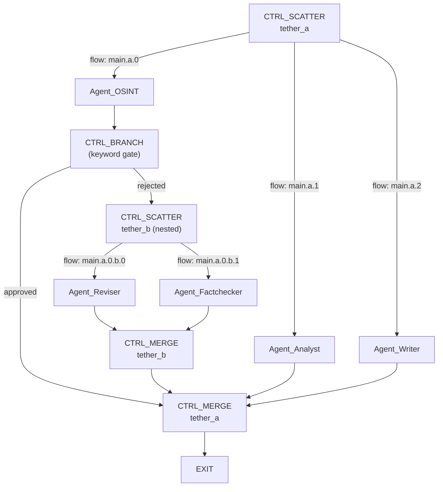

# CTRL_ Node Analysis — Structures, Parameters, and Routing Architecture

## Executive Summary

MACCREv2 has **23 registered CTRL_ nodes** (14 active, 9 ComingSoon). They form the **deterministic skeleton** of every topology — the non-AI structural primitives that control flow, transform data, and route between agent nodes. After analyzing the registry, handler implementations, tethering system, and your design vision, I've identified three architectural tiers and a gap analysis for what needs to happen next.

---

## 1. Complete CTRL_ Node Inventory

### Tier 1: Flow Control (Passthrough / Halt Primitives)

| Node | Status | Category | What It Does | Config Parameters | Routing Effect |
|------|--------|----------|-------------|-------------------|---------------|
| `CTRL_ANCHOR` | ✅ Active | Flow Control | Pass-through entry marker. No-op. | *None* | None — forwards to `Next_Node` |
| `CTRL_PAUSE` | ✅ Active | Flow Control | Halts execution, sets `should_pause=True` | *None* | **Blocks** — flow waits for manual Resume |
| `CTRL_DELAY` | ✅ Active | Flow Control | Sleeps N seconds (via `Instruction_Override`) | `Instruction_Override`: seconds (default 5, max 3600) | None — delays then forwards |
| `CTRL_GATE` | ✅ Active | Flow Control | Blocks if payload is empty/missing | *None* | **Re-queues self** if blocked; passes if payload exists |
| `CTRL_REVIEW` | ✅ Active | HITL | Live swarm intercept — pauses for human review | *None* | **Blocks** — hardcoded intercept in `local_broker` and `swarm_worker`, sets task to `awaiting_orders` |
| `CTRL_CHECKPOINT` | ✅ Active | State Management | Snapshots payload to `03_Agent_Ledgers/<job_id>/` | *None* | None — copies payload then forwards |

> [!NOTE]
> **Tier 1 nodes need minimal Configure Modal options.** CTRL_DELAY needs a seconds input. CTRL_GATE could benefit from a "prerequisite nodes" multi-select. The rest are zero-config.

---

### Tier 2: Data Transformation (Payload Manipulation)

| Node | Status | Category | What It Does | Config Parameters | Routing Effect |
|------|--------|----------|-------------|-------------------|---------------|
| `CTRL_TRANSFORM` | ✅ Active | Data Flow | Applies text template with `{PAYLOAD}` placeholder | `Instruction_Override`: template string | None — writes transformed payload, forwards |
| `CTRL_FILTER` | ✅ Active | Data Flow | Strip sections, regex removal, truncation | `filter_rules.strip_sections`: `string[]`; `filter_rules.max_chars`: `int`; `filter_rules.regex_remove`: `string` | None — writes filtered payload, forwards |
| `CTRL_CONCAT` | ✅ Active | Data Flow | Flat concatenation of predecessor payloads | `concat_delimiter`: `string` (default `\n`) | None — joins predecessor payloads, forwards |
| `CTRL_CLEANUP` | ✅ Active | State Management | Deletes temp files matching glob patterns | `glob_patterns`: `string[]` (default `["*.tmp"]`); `cleanup_dir`: `string` | None — deletes files, forwards |

> [!NOTE]
> **Tier 2 nodes need richer Configure Modal options.** CTRL_TRANSFORM needs a multi-line template editor. CTRL_FILTER needs the strip_sections list, regex input, and max_chars number input. CTRL_CONCAT just needs a delimiter input. CTRL_CLEANUP needs glob pattern list and dir selector.

---

### Tier 3: Flow Routing & Orchestration (THE PROGENITORS) 🔥

These are the nodes you identified as the **"progenitors and arbiters of Flow"** — they fundamentally alter the topology graph at runtime.

| Node | Status | Category | What It Does | Config Parameters | Routing Effect |
|------|--------|----------|-------------|-------------------|---------------|
| `CTRL_SCATTER` | ✅ Active | Data Flow | **Fan-out** — distributes payload to multiple downstream nodes | `scatter_targets`: `string[]` (node IDs); `scatter_mode`: `"full_copy"` \| `"chunk_split"` | **CREATES PARALLEL FLOW LINES** — returns `next_nodes[]` list |
| `CTRL_MERGE` | ✅ Active | Data Flow | **Fan-in** — merges multiple upstream payloads into one | `merge_mode`: `"structured"` \| `"concat"`; `merge_delimiter`: `string` | **GATHERS FLOW LINES** — waits for all predecessors, outputs single payload |
| `CTRL_BRANCH` | ✅ Active | Routing | **Conditional fork** — keyword-based routing to ONE target | `keyword_map`: `{keyword: target_node_id}`; `default_target`: `string` | **SELECTS ONE PATH** — returns `next_node` override |
| `CTRL_RECURSION` | ✅ Active | Loop Control | **Loop-back** with iteration counter | `Max_Recursion`: `int` (default 3); `Instruction_Override`: loop target node | **OVERRIDES next_node** to loop target until max reached, then forwards |
| `CTRL_CONDITIONAL_ROUTE` | ✅ Active | Routing | **4-vector fallback routing chain** | `route_vectors`: `string[]`; `keyword_map`: `{}`; `score_threshold`: `float`; `default_target`, `high_target`, `low_target`: `string`; `available_targets`: `string[]`; `fuzzy_max_distance`: `int` | **SELECTS ONE PATH** via 4-vector cascade: structured tag → keyword → score → fuzzy |

> [!IMPORTANT]
> **These are the critical architectural nodes.** CTRL_SCATTER and CTRL_MERGE form tethered pairs that CREATE and DESTROY parallel flow dimensions. CTRL_BRANCH and CTRL_CONDITIONAL_ROUTE are the decision gates that PRUNE paths. CTRL_RECURSION is the only node that creates backward edges in the DAG.

---

### Tier 4: Coming Soon (9 nodes — No Handlers Yet)

| Node | Category | Description |
|------|----------|------------|
| `CTRL_DIALOG` | Orchestration | Multi-agent group dialog dispatch |
| `CTRL_CHAT` | Orchestration | Interactive chat session within a flow node |

> [!WARNING]
> **Phantom Nodes Discovered:** The TUI fallback catalog in `nexus_plex.py` references two nodes that exist in NEITHER the registry NOR deterministic_nodes.py:
> - **`CTRL_END`** — "Terminal node — marks flow completion." Semantic marker only, no handler.
> - **`CTRL_PAYLOAD_INJECT`** — "Injects a static payload into the flow." No handler.
>
> These should either be formalized into the registry with handlers, or removed from the TUI fallback list.

> [!IMPORTANT]
> **Misregistration: CTRL_CONDITIONAL_ROUTE** — This node is registered as `ComingSoon` in the DB, but has a **complete 4-vector handler implementation** in `deterministic_nodes.py` (L729-796) with full Levenshtein fuzzy matching. Its registry status should be updated to `active`.
| `CTRL_USER_REVIEW` | HITL | Extended human review with FinOps gating |
| `CTRL_EXTRACT` | Data Flow | Structured data extraction from unstructured payload |
| `CTRL_WEBHOOK` | External | Send payload to external webhook endpoint |
| `CTRL_MEDIA_PROBE` | Media | Extract metadata from media files |
| `CTRL_RENDER_STITCH` | Media | ffmpeg-based media stitching pipeline |
| `CTRL_MANIFEST` | Media | Generate structured manifest from media artifacts |

---

## 2. Configure Node Modal — Required Options Per Node

### Current State

The [NodeConfigModal](file:///B:/EXO_GANS/maccre_tui/nexus_plex.py#L1939) already has a tether config section (L2094-L2177) that renders fields based on node type. It currently handles:
- `tether_id` (all CTRL_ nodes)
- CTRL_SCATTER: `scatter_mode` select, `scatter_targets` input
- CTRL_MERGE: `merge_mode` select
- CTRL_BRANCH: `keyword_map` JSON, `default_target` input
- CTRL_FILTER: `max_chars`, `regex_remove`
- CTRL_CONDITIONAL_ROUTE: `keyword_map`, `score_threshold`, `default_target`, `high_target`, `low_target`

### What's Missing

| Node | Missing Config Fields |
|------|----------------------|
| `CTRL_ANCHOR` | Nothing needed (zero-config) |
| `CTRL_PAUSE` | Nothing needed (zero-config) |
| `CTRL_REVIEW` | Nothing needed (zero-config, hardcoded intercept) |
| `CTRL_GATE` | **Prerequisite nodes list** — which upstream nodes must complete before gate opens |
| `CTRL_CHECKPOINT` | **Checkpoint label/tag** — optional name for the snapshot |
| `CTRL_DELAY` | **Seconds input** — currently read from `Instruction_Override` which is a generic text field |
| `CTRL_TRANSFORM` | **Template editor** — multi-line textarea with `{PAYLOAD}` placeholder preview |
| `CTRL_FILTER` | **Strip sections list** — currently missing from the modal (only has max_chars and regex) |
| `CTRL_CONCAT` | **Delimiter input** — currently has no modal fields |
| `CTRL_CLEANUP` | **Glob patterns list**, **cleanup directory** — no modal fields |
| `CTRL_RECURSION` | **Max iterations input**, **Loop target node selector** — currently read from generic config fields |
| `CTRL_SCATTER` | **Agent assignment UI** ← THE BIG ONE (see §3) |
| `CTRL_MERGE` | **Merge delimiter input** (currently hardcoded `\n---\n`) |
| `CTRL_CONDITIONAL_ROUTE` | **Available targets list**, **fuzzy_max_distance** — partially missing |

---

## 3. Tethering & Flow Line Architecture — The Core Analysis

### 3a. Current Auto-Tethering System

The tethering system lives in [macronode_workshop.py](file:///B:/EXO_GANS/maccre_tui/widgets/macronode_workshop.py#L248):

```
When CTRL_SCATTER is added:
  1. _tether_counter increments → generates "tether_a", "tether_b", etc.
  2. tether_id is assigned to the SCATTER node
  3. tether_id is pushed onto _pending_scatters stack
  4. User is notified: "Add a CTRL_MERGE to complete the tether pair"

When CTRL_MERGE is added:
  1. _pending_scatters.pop() → auto-assigns the matching tether_id
  2. The MERGE node inherits the SCATTER's tether_id
```

This creates **tethered pairs** (SCATTER↔MERGE) that define the boundaries of parallel flow dimensions.

### 3b. How flow_line_id SHOULD Work (Gap)

> [!WARNING]
> **Critical Gap:** `flow_line_id` exists as a column in the `task_queue` schema (local_broker.py L132) but is **never actively assigned during scatter execution.** The CTRL_SCATTER handler returns `next_nodes[]` but does NOT assign flow_line_ids to the spawned tasks. This means the system currently has no way to track which flow line a task belongs to after scatter.

The intended architecture (based on the dot-delimited hierarchy in [topology_visualizer.py](file:///B:/EXO_GANS/maccre_tui/widgets/topology_visualizer.py#L448)):

```
Main flow line:     "main"
After SCATTER_A:    "main.tether_a.0", "main.tether_a.1", "main.tether_a.2"
After nested SCATTER_B inside .0:
                    "main.tether_a.0.tether_b.0", "main.tether_a.0.tether_b.1"
After MERGE_B:      "main.tether_a.0"  (children merged)
After MERGE_A:      "main"  (all branches gathered)
```

### 3c. Your Vision: CTRL_ Nodes as Flow Architects

Your insight is architecturally correct: **CTRL_SCATTER doesn't just copy a payload — it creates entirely new flow dimensions.** Each scattered flow line is an independent execution context with its own agent, its own payload evolution, and its own telemetry trail.

Here's the full model:



### 3d. What CTRL_SCATTER Configuration Actually Needs

When you configure a CTRL_SCATTER, you're defining:

1. **Which agents get spawned** — `scatter_targets` should be a list of agent node IDs, each becoming the head of a new flow line
2. **How the payload is distributed** — `full_copy` (each gets everything) vs `chunk_split` (payload divided by `## ` headers)
3. **The tether pair** — which downstream CTRL_MERGE (or CTRL_CONCAT, CTRL_BRANCH) will gather the results
4. **Flow line naming** — auto-generated from `{parent_flow_line}.{tether_id}.{index}`

The Configure Node Modal for CTRL_SCATTER should show:
- **Tether ID** (auto-generated, editable)
- **Scatter Mode** select (full_copy / chunk_split)
- **Agent Assignment** — multi-select from available agents, each becoming a flow line target
- **Paired Gather Node** — shows which CTRL_MERGE/CONCAT is tethered (read-only, auto-linked)

---

## 4. Implications for the Three Display Systems

### 4a. Topology Visualizer

Currently shows a **linear tree**. Needs to evolve to show:
- **Parallel branches** emerging from CTRL_SCATTER nodes (multiple children)
- **Convergence points** where CTRL_MERGE gathers branches
- **Nested scatters** indented under their parent flow line
- **Tether badges** showing the scatter↔merge pairing
- **Color coding** to distinguish different flow lines

### 4b. Active Flow Sequence

Currently shows a **horizontal linear strip**. After scatter, it would need to show:
- **Stacked parallel lanes** — each flow line as a separate horizontal row
- **Sync points** where CTRL_MERGE forces all lanes to converge
- **VCR state per flow line** — each line can be at different stages of completion

### 4c. Telemetry & Agent Identity

Your point about agents maintaining identity across flow reassignment is critical:

> [!IMPORTANT]
> **Agent Persistence Across Flow Lines:** An agent instance should carry its accumulated context (conversation history, memory, tools state) even when CTRL_MERGE collapses its flow line into another. The agent's identity is NOT the flow line — the flow line is just the routing context. Agent identity should be tracked separately via `agent_instance_id` that persists across flow line transitions.

---

## 5. Status Summary

| Area | Current State | What's Needed |
|------|--------------|--------------|
| **CTRL_ Registry** | 23 nodes registered, 14 active, 9 ComingSoon | CTRL_CONDITIONAL_ROUTE was listed as ComingSoon but has a full handler — update status to `active` |
| **Handler Implementations** | 14 handlers fully implemented in deterministic_nodes.py | All active nodes have working handlers ✅ |
| **Configure Modal** | Partial — covers SCATTER, MERGE, BRANCH, FILTER, COND_ROUTE | Missing: DELAY seconds, TRANSFORM template, RECURSION max/target, CONCAT delimiter, CLEANUP globs, GATE prereqs, FILTER strip_sections |
| **Auto-Tethering** | SCATTER↔MERGE pairing works via `_pending_scatters` stack | No support for SCATTER↔BRANCH or SCATTER↔CONCAT pairing yet |
| **flow_line_id** | Column exists in task_queue schema | **Not assigned during execution** — the biggest gap |
| **Topology Visualizer** | Linear tree with tether badges | Needs parallel branch rendering for scatter/merge |
| **Active Flow Sequence** | Single horizontal strip | Needs multi-lane display for parallel flows |
