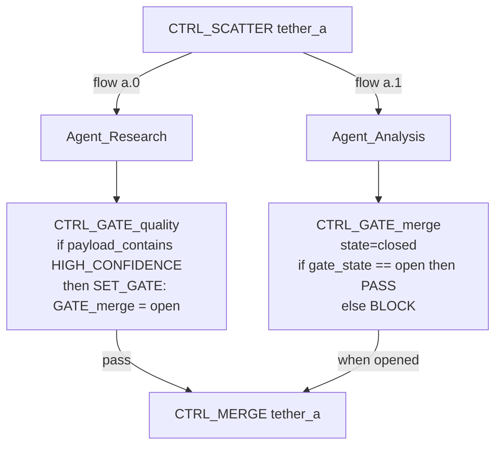

# CTRL_ Node Analysis — Second Draft
## Post-TUI Refactor Architectural Assessment

> Based on first draft at [ctrl_node_analysis-PostTUIrefactor-draft.md](file:///B:/EXO_GANS/ctrl_node_analysis-PostTUIrefactor-draft.md), refined with deep analysis of pause mechanics, GATE semantics, and ANCHOR vs CHECKPOINT nuance.

---

## 1. CTRL_PAUSE — Is It Necessary?

### Three Distinct Pause Mechanisms Exist

| Mechanism | Where | How | State |
|-----------|-------|-----|-------|
| **VCR Transport Pause** | TUI `btn-vcr` button | `threading.Event.clear()` — blocks the flow worker thread | Python-only, not persisted |
| **CTRL_PAUSE** (topological) | Placed in topology by user | `broker.pause_task(row_id)` → sets `lock_status = 'paused'` in SQLite | **Persisted in DB** |
| **CTRL_REVIEW** (HITL intercept) | Placed in topology | Broker sets `lock_status = 'awaiting_orders'` — hardcoded intercept in `route_task()` | Persisted in DB, different state |

### Analysis

The **VCR button** is a *transport control* — it freezes the entire flow worker thread. It's the user saying "stop everything right now." It doesn't know about topology; it blocks at the Python threading level. If the TUI crashes, the pause is lost.

**CTRL_PAUSE** is a *topological breakpoint* — it's embedded in the DAG itself. When the swarm worker hits it, the task is set to `paused` in SQLite. This survives crashes. It's a checkpoint in the execution graph where the user DESIGNED a stop point.

**CTRL_REVIEW** is a *semantic intercept* — it's not just "stop," it's "stop and present this to a human for judgment." The `awaiting_orders` state is distinct from `paused` because the flow engine's HITL callback fires when it detects `still_paused > 0 && still_open == 0`.

### Verdict

> [!IMPORTANT]
> **CTRL_PAUSE is necessary and distinct.** It's the only mechanism that creates a **persistent, topology-authored, resumable pause point**. The VCR button is ephemeral. CTRL_REVIEW is semantically different (it implies human judgment, not just a wait). CTRL_PAUSE is the "breakpoint" — useful for:
> - Debug topologies: pause before a critical node to inspect state
> - Staged execution: design a flow that pauses between phases for external events
> - Batch flows: pause at known checkpoints for resource management
>
> **However**, CTRL_PAUSE currently has zero config options. It should gain:
> - `pause_message`: custom message shown in the TUI when pause is hit
> - `auto_resume_after`: optional seconds before auto-resuming (transforms it into a "timed gate")
> - `condition`: optional predicate that, if true, skips the pause (making it a conditional breakpoint)

---

## 2. CTRL_GATE — The "Floating If"

### Current Implementation (Minimal)

The current `_handle_gate` ([deterministic_nodes.py:L230](file:///B:/EXO_GANS/maccre_core/orchestration/deterministic_nodes.py#L230)) is extremely simple:

```python
if not payload_path or path doesn't exist or file is empty:
    return next_node = self  # re-queue (block)
else:
    return pass-through  # proceed
```

It only checks one thing: "does my payload file exist with content?" This is a single boolean predicate with no configurability.

### Your Vision: The Conditional Truth Evaluator

Your "floating if" concept is much more powerful. Conceptually:

```
CTRL_GATE → if <PREDICATE> → then <ACTION>
```

Where **PREDICATE** could be:

| Predicate Type | Example | What It Checks |
|----------------|---------|----------------|
| `artifact_exists` | `if $SessionArtifact exists` | File/path existence in DATACENTER |
| `flow_state` | `if flowID == active` | Status of a named flow line |
| `gate_state` | `if CTRL_GATE_$ID2 state == open` | State of another GATE node (inter-gate coordination) |
| `payload_contains` | `if payload contains "APPROVED"` | Keyword/regex in payload content |
| `counter_threshold` | `if iteration_count >= 3` | Numeric comparison against flow metadata |
| `expression` | `if len(payload) > 5000` | Arbitrary Python expression against flow context |

And **ACTION** could be:

| Action | Effect |
|--------|--------|
| `ROUTE_TO: <node_id>` | Override next_node (conditional routing) |
| `SET_GATE: <gate_ids> = open/closed` | Open/close other gates (domino coordination) |
| `BLOCK` | Re-queue self (current behavior) |
| `PASS` | Forward to default Next_Node |
| `SCATTER_TO: <targets>` | Dynamic scatter based on condition |

### Why This Matters Architecturally

CTRL_GATE becomes the **universal conditional primitive**. It subsumes parts of CTRL_BRANCH (keyword matching → `payload_contains` predicate) and parts of CTRL_CONDITIONAL_ROUTE (structured/keyword/score → predicate types). But it adds something neither has: **inter-gate coordination**.

Consider this topology:



Here, `GATE_merge` stays **closed** until `GATE_quality` evaluates its payload and **opens** it. This creates a **dependency gate** — the merge only fires when the quality check passes. This is fundamentally different from just checking if a payload file exists.

### Proposed Config Schema for CTRL_GATE

```json
{
  "gate_id": "string (auto-generated, user-editable)",
  "initial_state": "open | closed (default: open)",
  "predicates": [
    {
      "type": "artifact_exists | flow_state | gate_state | payload_contains | counter | expression",
      "target": "string (path, gate_id, keyword, expression)",
      "operator": "== | != | > | < | >= | <= | contains | matches",
      "value": "string (comparison value)"
    }
  ],
  "predicate_logic": "all | any (default: all)",
  "on_true": "PASS | ROUTE_TO:<node> | SET_GATE:<ids>=<state>",
  "on_false": "BLOCK | ROUTE_TO:<node> | SET_GATE:<ids>=<state>"
}
```

---

## 3. CTRL_ANCHOR vs CTRL_CHECKPOINT — The Nuance

### Surface Similarity

Both pass the payload through unchanged. Both forward to Next_Node. Neither alters the routing graph. So why have both?

### The Fundamental Distinction

| | CTRL_ANCHOR | CTRL_CHECKPOINT |
|---|---|---|
| **Purpose** | **Structural** — a named point in the topology | **Operational** — an active data operation |
| **Side Effects** | None. Zero I/O. | Writes a file to `03_Agent_Ledgers/` |
| **Payload** | Passes pointer unchanged | Passes pointer unchanged, but also **copies the content** to disk |
| **Analogy** | A label on a wire | A save point in a video game |
| **Use Case** | Junction/waypoint for routing references | Snapshot for debugging, rollback, or audit |

### CTRL_ANCHOR: The Named Junction

ANCHOR is a **routing primitive**. It exists so other nodes can reference it by name. Consider:

```
CTRL_RECURSION (loop_target = CTRL_ANCHOR_START)
  └→ Agent_A → Agent_B → CTRL_RECURSION
       ↑                        │
       └────────────────────────┘ (loops back to ANCHOR_START)
```

Without ANCHOR, what does CTRL_RECURSION loop back to? It needs a named node to target. ANCHOR is that target — a no-op that exists purely as a **named address** in the topology graph.

Other uses:
- **Fan-in junction**: Multiple branches converge at a named ANCHOR before proceeding
- **Documentation**: Mark semantic boundaries in the topology ("this is where Phase 2 begins")
- **Default fallback**: When BRANCH/CONDITIONAL_ROUTE has no match, route to an ANCHOR that represents "continue normally"

### CTRL_CHECKPOINT: The State Snapshot

CHECKPOINT is a **data operation**. It reads the current payload and copies it to a timestamped file in the agent ledger. The flow continues with the same payload pointer, but now there's a persistent record of what the payload looked like at that exact point.

Uses:
- **Pre-mutation snapshot**: Before CTRL_TRANSFORM or CTRL_FILTER changes the payload
- **Audit trail**: Comply with data governance by capturing intermediate states
- **Rollback point**: If a downstream agent corrupts the payload, the checkpoint file provides recovery
- **Diff analysis**: Compare checkpoint files to see how payload evolved through the flow

### Should They Merge?

**No.** They serve fundamentally different roles:
- ANCHOR is **topological** (exists for graph structure)
- CHECKPOINT is **operational** (exists for data management)

Combining them would violate single-responsibility. You'd end up with every named junction also writing files, which is wasteful. Keep them separate.

### Proposed Enhancements

**CTRL_ANCHOR** — Keep zero-config. Consider adding:
- `anchor_label`: Optional human-readable name for display in Topology Visualizer
- `anchor_type`: `junction | phase_marker | fallback_target` (purely semantic metadata)

**CTRL_CHECKPOINT** — Currently zero-config. Should gain:
- `checkpoint_label`: Named tag for the snapshot (e.g., "pre-filter", "phase-1-complete")
- `checkpoint_format`: `full_copy | metadata_only | diff_from_previous`
- `retention_policy`: `keep_all | keep_latest_n | keep_until_flow_complete`

---

## 4. Revised Node Taxonomy — 5 Functional Roles

Based on the analysis above, the 14 active CTRL_ nodes fall into 5 functional roles:

### Role 1: STRUCTURAL (Graph Primitives)
*Exist for topology graph structure, not for data operations.*

| Node | Role | Config Needs |
|------|------|-------------|
| `CTRL_ANCHOR` | Named junction point / waypoint | `anchor_label`, `anchor_type` |

### Role 2: FLOW CONTROL (Execution State)
*Alter the execution state of the flow without changing the payload.*

| Node | Role | Config Needs |
|------|------|-------------|
| `CTRL_PAUSE` | Persistent topological breakpoint | `pause_message`, `auto_resume_after`, `condition` |
| `CTRL_REVIEW` | HITL intercept — human judgment point | None (hardcoded broker intercept) |
| `CTRL_DELAY` | Timed wait | `seconds` (currently via Instruction_Override) |
| `CTRL_GATE` | Conditional truth evaluator ("Floating If") | `predicates[]`, `on_true`, `on_false`, `gate_id`, `initial_state` |
| `CTRL_RECURSION` | Loop-back with counter | `max_iterations`, `loop_target`, `exit_target` |

### Role 3: DATA TRANSFORM (Payload Mutation)
*Read, modify, and write the payload content.*

| Node | Role | Config Needs |
|------|------|-------------|
| `CTRL_CHECKPOINT` | Snapshot payload to disk | `checkpoint_label`, `format`, `retention` |
| `CTRL_TRANSFORM` | Template-based text wrapper | `template` (multi-line, `{PAYLOAD}` placeholder) |
| `CTRL_FILTER` | Strip, regex, truncate | `strip_sections[]`, `regex_remove`, `max_chars` |
| `CTRL_CLEANUP` | Delete temp files | `glob_patterns[]`, `cleanup_dir` |

### Role 4: FLOW ROUTING (Topology Alteration — THE PROGENITORS)
*Create, destroy, or redirect flow lines at runtime.*

| Node | Role | Config Needs |
|------|------|-------------|
| `CTRL_SCATTER` | **Create** parallel flow lines (fan-out) | `scatter_targets[]`, `scatter_mode`, `tether_id` |
| `CTRL_MERGE` | **Destroy** parallel flow lines (fan-in) | `merge_mode`, `merge_delimiter`, `tether_id` |
| `CTRL_CONCAT` | **Destroy** flow lines by concatenation | `concat_delimiter`, `tether_id` |
| `CTRL_BRANCH` | **Redirect** to one target (keyword gate) | `keyword_map`, `default_target` |
| `CTRL_CONDITIONAL_ROUTE` | **Redirect** via 4-vector cascade | `route_vectors[]`, `keyword_map`, `score_threshold`, targets |

### Role 5: DATA COMBINATION (Multi-Payload Operations)
*MERGE and CONCAT also belong here — they are the only nodes that consume `predecessor_payloads[]`.*

> [!NOTE]
> MERGE and CONCAT live at the intersection of Data Transform and Flow Routing. They transform data (combine multiple payloads into one) AND they alter the flow graph (collapse multiple flow lines into one). This dual role is correct — they are the natural complement to SCATTER.

---

## 5. Configure Node Modal — Complete Requirements Matrix

| Node | Required Modal Fields | Field Types | Current TUI State |
|------|----------------------|-------------|-------------------|
| `CTRL_ANCHOR` | `anchor_label` | Text input | ❌ No config |
| `CTRL_PAUSE` | `pause_message`, `auto_resume_after` | Text input, Number input | ❌ No config |
| `CTRL_REVIEW` | *None needed* | — | ✅ Complete |
| `CTRL_DELAY` | `seconds` | Number input (0-3600) | ❌ Uses generic Instruction_Override |
| `CTRL_GATE` | `gate_id`, `initial_state`, `predicates[]`, `on_true`, `on_false` | Text, Select, JSON editor | ❌ No config |
| `CTRL_RECURSION` | `max_iterations`, `loop_target` | Number input, Node selector | ❌ Uses generic fields |
| `CTRL_CHECKPOINT` | `checkpoint_label` | Text input | ❌ No config |
| `CTRL_TRANSFORM` | `template` | Multi-line textarea with {PAYLOAD} preview | ❌ Uses generic Instruction_Override |
| `CTRL_FILTER` | `strip_sections[]`, `regex_remove`, `max_chars` | Tag input, Text input, Number | ⚠️ Partial (missing strip_sections) |
| `CTRL_CONCAT` | `concat_delimiter` | Text input | ❌ No config |
| `CTRL_CLEANUP` | `glob_patterns[]`, `cleanup_dir` | Tag input, Directory input | ❌ No config |
| `CTRL_SCATTER` | `tether_id`, `scatter_mode`, `scatter_targets[]` (agent assignment) | Text, Select, Multi-select | ⚠️ Partial (targets is text input, not agent selector) |
| `CTRL_MERGE` | `tether_id`, `merge_mode`, `merge_delimiter` | Text, Select, Text input | ⚠️ Partial (missing delimiter) |
| `CTRL_BRANCH` | `keyword_map`, `default_target` | JSON editor, Text input | ✅ Complete |
| `CTRL_CONDITIONAL_ROUTE` | All 4-vector config fields | Mixed | ✅ Mostly complete |

---

## 6. Tethering Architecture — Updated Assessment

### Current State

The `_pending_scatters` LIFO stack in [macronode_workshop.py:L175](file:///B:/EXO_GANS/maccre_tui/widgets/macronode_workshop.py#L175) auto-pairs SCATTER↔MERGE only. The pairing is:
1. SCATTER pushes `tether_id` to stack
2. MERGE pops from stack (LIFO = most recent unpaired SCATTER)

### What's Missing

1. **SCATTER↔BRANCH pairing** — CTRL_BRANCH can be a gather node too (routes one selected branch forward, others terminate)
2. **SCATTER↔CONCAT pairing** — CTRL_CONCAT should auto-tether like MERGE
3. **SCATTER↔GATE pairing** — The enhanced GATE could act as a conditional gather point
4. **Nested tether tracking** — When a scatter exists inside another scatter's flow line, the tether hierarchy should be tracked: `tether_a > tether_b` means `tether_b` lives inside `tether_a`'s scope
5. **`flow_line_id` assignment at runtime** — The column exists in `task_queue` but is never populated during scatter execution

### Agent Identity Persistence

> [!IMPORTANT]
> **Agent instances should persist across flow line transitions.** When an agent is scattered to `flow_line main.a.0`, works through several nodes, then gets merged back into `main`, the agent's conversation history, memory state, and tool context should carry forward. The `agent_instance_id` (separate from `flow_line_id`) is the permanent identity. Flow lines are routing contexts; agents are cognitive entities.

---

## 7. Discrepancies Found

| Issue | Detail | Recommended Action |
|-------|--------|-------------------|
| **CTRL_CONDITIONAL_ROUTE status** | Registry says `ComingSoon`, but full 4-vector handler exists in [deterministic_nodes.py:L729](file:///B:/EXO_GANS/maccre_core/orchestration/deterministic_nodes.py#L729) | Update registry status to `active` |
| **Phantom: CTRL_END** | Referenced in TUI fallback catalog, no registry or handler | Formalize as registry entry (semantic terminal marker) or remove |
| **Phantom: CTRL_PAYLOAD_INJECT** | Referenced in TUI fallback catalog, no registry or handler | Formalize with handler (inject static text into payload) or remove |
| **CTRL_REVIEW handler path** | Registry says `local_broker.intercept_review` but no such function exists — it's a hardcoded check in `route_task()` L414 | Fix registry to point to actual implementation or create the function |
| **flow_line_id column** | Exists in `task_queue` schema but never populated | Wire up during SCATTER execution in swarm_worker |
