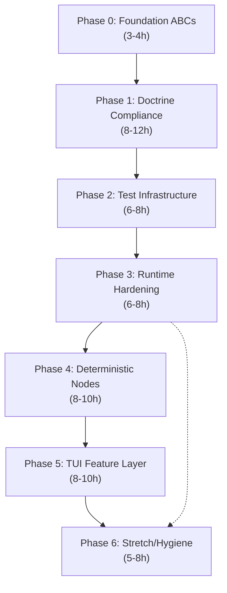
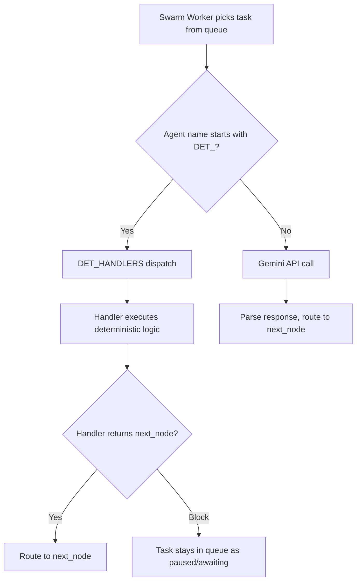
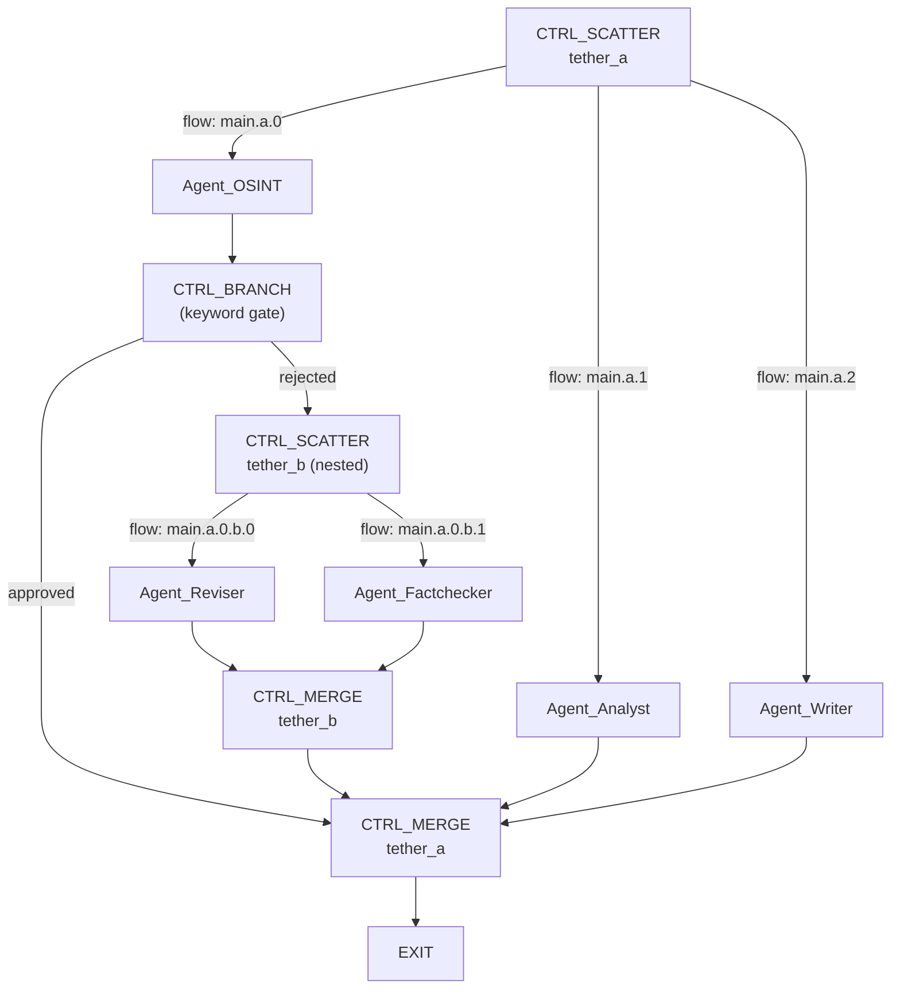
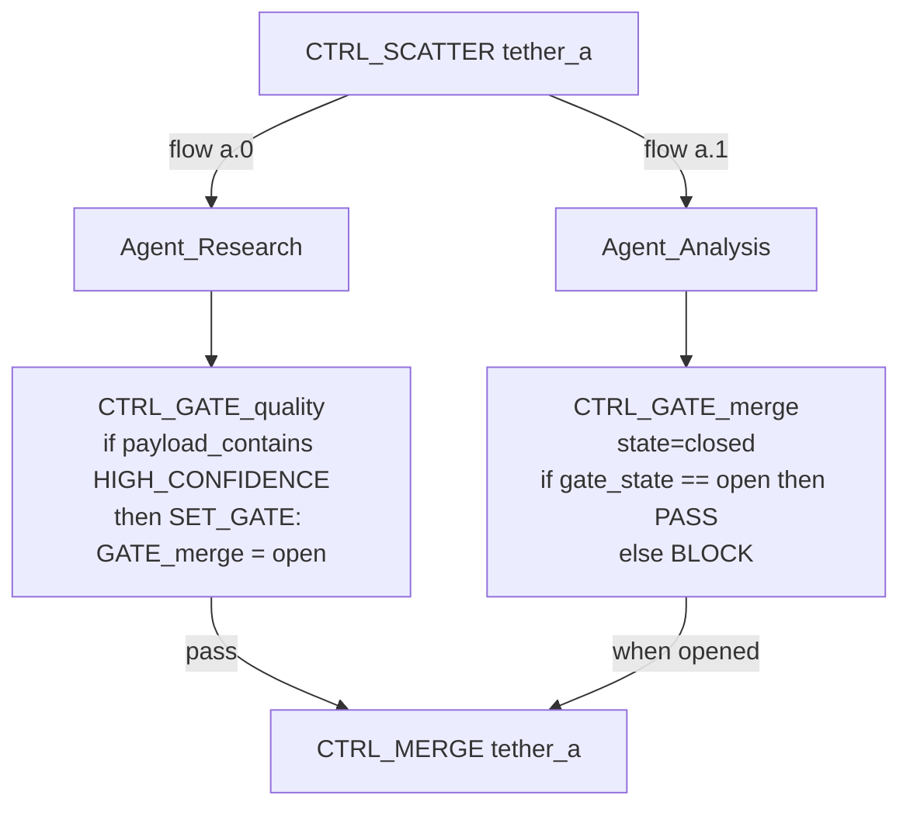
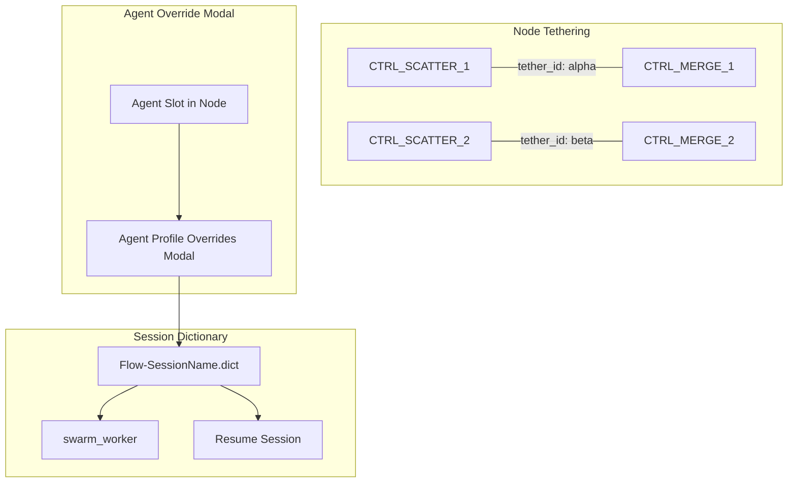
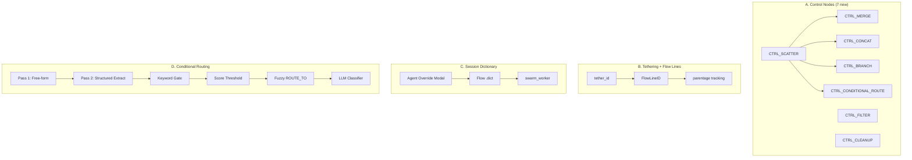

# EXO_GANS Chronological Project History


---

## Document: PHASE_HISTORY.md


# MACCREv2 Phase History & Bifurcation Log

This document is the canonical chronological record of MACCREv2 architectural milestones, pivots, and bifurcation events. It supplements `ReadMe.md` (which documents *laws*) with the *narrative* of how those laws came to exist.

---

## Phase 1–8: Foundation & Early Swarm Architecture
*(Pre-documentation era — reconstructed from file timestamps and commit artifacts)*

- Established the 5-Tier Datacenter (`__DATACENTER`) as the sovereign data boundary.
- Built the first `LocalMessageBroker` (SQLite WAL Scatter-Gather State Machine) to replace fragile in-memory queues.
- Introduced the Diamond Loop (Generator temp 1.0 / Critic temp 0.1) as the core reasoning discipline.
- Established the `topology.csv` DAG routing system and `swarm_worker.py` ephemeral daemon pattern.
- ChromaDB integrated as the local vector store for RAG ingestion (`ingest_document`, `query_local_memory`).

---

## Phase 9: The MCP Era & Windows Vault
*(March 2026)*

- Integrated `mcp_server_v5.py` for Model Context Protocol tool exposure.
- Replaced all environment-variable credential patterns with `windows_vault.py` — a zero-dependency `advapi32.dll` native ctypes interface to the Windows Credential Manager.
- Established `key_vault.py` and cryptographic token management.

---

## Phase 10: Dual-Pipeline & Scatter-Gather Hardening
*(March–April 2026)*

- Implemented the `BEGIN EXCLUSIVE` Gather Gate in `local_broker.py` — eliminates TOCTOU race conditions at the SQLite C engine level.
- `AgentResponse(BaseModel)` with `response_schema` enforcement replaces all `<scratchpad>` regex parsing permanently.
- `thoughts.db` introduced as the first-class subconscious silo — RBAC-isolated from all standard agent tooling.
- `telemetry_db.py` codifies the four-silo telemetry matrix (`system_logs`, `user_interactions`, `terminal_logs`, `thoughts`).

---

## Phase 11: Sovereign Media Pipeline
*(April 2026)*

- `render_executor.py` integrates Google Cloud TTS, ElevenLabs, and FFmpeg for multi-voice podcast generation.
- `the_director.json` persona established with `MANUAL` success target to enforce HITL workflow.
- `finops_tools.py` introduces the pricing matrix and pre-flight cost estimation (`estimate_manifest_cost`).

---

## Phase 12: Global State, FinOps Reconciliation & The Ouroboros
*(April 2026)*

### Mission Control GUI Era (Archived)
- `mission_control.py` (Flet 0.82.2) built as a sovereign control plane with globally-stateful sidebar navigation, Render Bay, FinOps Ledger, and Live Swarm views.
- L1/L2 Memory Architecture implemented: `merge_session_to_project` in `rag_tools.py` enables zero-compute vector promotion from ephemeral session collections to project-level master graphs.
- Double-Entry FinOps Reconciliation Engine: `reconcile_session_finops` in `finops_tools.py` compares `FINOPS_PROJECTION` events against actual execution costs in `system_logs.db`.
- `ouroboros_monitor.py` and `gui_ouroboros_hypervisor.py` built as ambient watchdogs for deadlock detection, crash triage (Gemini 2.5 Pro structured output), and live-fix directive generation.

### The GUI Trap Recognition
During Phase 12 Chaos Engineering, the Architect recognized a systemic architectural drift: the Flet GUI had begun to own MACCRE state, with every UI feature requiring backend accommodation. Flet version locking, `page.overlay` setter restrictions, `FilePicker` plugin registration, `border.all()` API changes, and event loop isolation had become critical-path dependencies consuming engineering cycles that should have gone to the cognitive engine itself.

**The Architect's reflection (verbatim, 2026-04-05):**

> *"MACCRE is supposed to be modular, and it mostly is, but it was meant to be the backend for configurable micro-service gui states for production and writing pipelines. As we've gone, I've been subconsciously adding features that draw MACCRE itself into being a sovereign OS and lost sight of what I was doing and started building a monolithic GUI again... MACCRE stands for Multi-Agent-Conversational-Concept-Refinement-Engine. I almost forgot that while riffing the last few weeks."*

### The Decapitation Protocol (2026-04-05)
**Status:** Executed.

The Alphabet Oracle issued the Decapitation Protocol directive. Antigravity executed it.

**Actions taken:**
- All `gui_*.py` files and `mission_control.py` moved to `_archive/legacy_gui/` (7 files preserved for analysis).
- `maccre.py` created as the new canonical headless CLI entry point (`omni qa` Exit 0, Ruff + Pyright PASS).
- `ReadMe.md` updated: version header reflects Decapitation Protocol; **Law 14: Headless Sovereignty** added as permanent architectural doctrine.
- This `PHASE_HISTORY.md` created as the living historical record.

**New architecture:**

```
python maccre.py ignite <payload>   →  Injects payload into SQLite WAL
python maccre.py status             →  Reads WAL queue, prints table
python maccre.py canonize           →  L1→L2 vector memory promotion
python -m maccre_core.orchestration.swarm_worker  →  Processes queue
```

MACCRE is now what it was always meant to be: a headless engine that operates like `ffmpeg` or `git`.

---

## Bifurcation Event: The Omni Tool-Daemon (2026-04-05)
**Status:** Greenlit / Parallel Track — not active development.

During Phase 12 Chaos Engineering, the `omni` CI/CD CLI was expanded with the Ouroboros Hypervisor to include ambient process monitoring, SQLite deadlock scanning, and LLM-driven triage. In doing so, `omni` crossed from a *passive tool* to an *active system observer*.

The Architect recognized this emergent agency and greenlit `omni`'s evolution into a standalone, system-level entity: **The Omni Tool-Daemon** — a Zero-Dependency Monolith providing JIT script security auditing (AST fingerprinting, local LLM gray-area analysis) and ambient OS monitoring (ETW/eBPF kernel hooks, local TTS-vocalized threat reporting).

Development is a parallel track, explicitly decoupled from MACCREv2 active sprints.

- **Founding Doctrine:** `B:\MACCREv2\OMNI_DAEMON_FOUNDING_DOCTRINE.md`
- **Feature Request:** `B:\MACCREv2\Feature_Requests\Omni_Tool_Daemon_20260405_Phase12.md`

---

*This document is append-only. Each phase entry is a permanent record.*
*Last updated: 2026-04-06 — Phase 13 Orchestrator Paradigm.*

---

## Phase 11: Multi-Tenant Hardware Authentication (2026-04-05)
**Objective:** Evolve MACCRE into a sovereign, multi-tenant black box.
**Action:** Implemented `MACCRE_ACTIVE_PROJECT` environment variables to cleanly sandbox RAG, Render, and Telemetry DBs from polluting cross-project namespaces. Migrated from native Keyring to raw DPAPI vaulting for headless keys. Implemented a steganographic Alternate Data Stream (ADS) hardware auth check in the `TopologyEngine`, refusing to boot a pipeline that lacked the physical USB-verified clearance.

---

## Phase 12: Universal Auth & Polyglot Schema Engine (2026-04-06)
**Objective:** Untether MACCRE from Google’s API layer and enforce strict schemas natively.
**Action:** Expanded the `maccre_router.py` to seamlessly execute logic across Gemini, Anthropic (Claude), OpenAI, Groq, and Ollama (Gemma3) pipelines. Handled Pydantic schema coercion dynamically via `tool_choice` or `response_format` depending on the Vendor SDK. Added `key_ingestor.py` to fingerprint raw strings via Regex and sort them securely into DPAPI without human configuration.

---

## Phase 13: Orchestrator Paradigm & Synaptic Bridging (2026-04-06)
**Objective:** Eradicate manual file wrangling by elevating the Global Nexus Agent to the Master Orchestrator, and enabling intentional Context Osmosis.
**Action:** 
- **The Nexus Shell:** The `maccre.py chat` CLI was bound to an autonomic tool-loop, giving the Nexus agent admin-level clearance to mint agents, build topologies, and launch swarms using natural language.
- **MCP Unification:** Built `maccre_mcp.py` to expose `chat_with_nexus` to IDEs (Windsurf/Cursor), allowing Antigravity to direct the underlying Python swarm without writing custom scripts.
- **Synaptic Bridge:** Overhauled `rag_tools.py` with `query_foreign_memory` and `import_foreign_vectors`, restricted by a dynamic `project_schema.json`. Allowed surgical extraction of context from foreign RAG databases while strictly stopping accidental context bleeding.

---

## Phase 14: Security Hardening — Conditional Release & Trash Protocol
*(April 2026)*

**Objective:** Implement a PIN-based elevation layer and a mandatory soft-delete protocol before any destructive file operation.

**Actions taken:**
- ccess_control.py — 
equest_elevation() tool added. A session PIN is established at Nexus TUI startup; sensitive operations require the PIN to be presented in the same session. PIN lives in memory only — never written to disk.
- 	rash_file() — all file deletions now route to __DATACENTER/__TRASH_BIN/<TIMESTAMP>_<filename>. Permanent deletion requires a second explicit confirmation. The "scorched earth" pattern is gated.
- ToolExecutor microservice created — centralises tool-call parsing, replaces fragmented per-module dispatch logic.
- Legacy GUI modules (mission_control.py, orge_smith.py, 
exus_agent.py) moved to _archive/legacy_gui/ with full metadata preservation.
- OperationsLogger dual-channel telemetry: uild_pipeline.log for OmniBuilder events,  3_Agent_Ledgers/ for cognitive events.

---

## Phase 15: The Diamond Loop Engine — Autonomous Swarm Design
*(April 2026)*

**Objective:** Enable Nexus to design, configure, and materialise complete swarm pipelines from a single natural-language conversation.

**Actions taken:**
- design_tools.py — design_swarm() tool implemented with the full Diamond Loop architecture:
  - Leg 1: gemini-2.5-pro at temp=1.0 for creative swarm ideation (6,000 char feed cap)
  - Leg 2: gemini-2.5-pro at temp=0.1 with 
esponse_schema=SwarmDesign for verified extraction (8,192 output token headroom)
  - JSON repair loop: gemini-2.5-flash recovers from truncated responses before propagating a DESIGN_FAULT
- SwarmDesign, AgentDesign, NodeDesign Pydantic schemas established as the internal swarm specification types
- _materialise_swarm() — atomically writes workspace, agent ROM cartridges, persona cards, and topology CSV from a verified SwarmDesign
- Epoch-based unique suffix (_ts_suffix) added to project names to prevent collision
- design_swarm registered in TOOL_DISPATCHER and Nexus tool palette
- Nexus routing instruction: *"Call design_swarm IMMEDIATELY upon receiving a swarm description. Do NOT ask clarifying questions yourself."*

---

## Phase 16: Nexus TUI Hardening — Tool Loop & Short-Circuit
*(April 2026)*

**Objective:** Eliminate spin-loops on empty model responses and make tool output the terminal result that the user sees — not a prompt for further LLM generation.

**Actions taken:**
- 
exus_tui.py — Terminal-result short-circuit: [SWARM_READY], [ADMIN_SUCCESS], [SWARM_COMPLETE], and [SHEET_READY] prefixes are rendered directly to the TUI without a follow-up LLM call.
- Boolean nudge flag replaced with _empty_count integer: empty #1 → specific tool hint; empty #2 → final warning; empty #3 → fallback prose. No infinite spin.
- Tool loop iteration cap increased from 5 to 8 to accommodate multi-node swarm execution chains.
- Intent-based routing keywords mapped to specific tool hints in the nudge system.
- MACCRE_ACTIVE_PROJECT environment variable scopes all tool calls to the active project silo.

---

## Phase 17: Spreadsheet Sovereignty — Drive Inbox & Sheet Parser
*(April 2026)*

**Objective:** Replace terminal-only swarm configuration with a portable, human-readable, machine-parseable Excel workbook as the universal project specification format.

**Why the shift:** Terminal-based swarm configuration required the user to be present at the MACCREv2 terminal to define and launch swarms. The spreadsheet model enables async configuration (design on phone, execute on PC), collaboration (share the xlsx), portability (the file IS the project spec), and human readability (non-technical contributors can understand and modify agent configurations without learning CLI syntax).

**The GUI that was archived vs. the intake surface that was built:**
The Flet GUI (Phases 9–12) was a windowed application that owned MACCRE state. Its archival was correct — it was becoming a monolith. The spreadsheet is not a GUI. It is a configuration document with a defined schema. The watcher daemon is a headless listener. There is no display server dependency. The Nexus TUI remains the primary interactive interface; the spreadsheet is the async intake channel.

**Actions taken:**
- scripts/generate_template.py — generates MACCRE_Swarm_Request.xlsx with 7 sheets:
  - **SWARM_REQUEST** — project metadata, payload, compute defaults
  - **AGENTS** — full AI Studio parameter parity per agent (16 columns including TEMPERATURE, TOP_P, TOP_K, MAX_OUTPUT_TOKENS, THINKING_BUDGET, SEARCH_GROUNDING, BRAVE_SEARCH, URL_CONTEXT, SAFETY_LEVEL)
  - **TOPOLOGY** — node DAG with per-node compute and model overrides
  - **PIPELINE_CONFIG** — FFmpeg, TTS, and Imagen render settings
  - **MEMORY_CONFIG** — ChromaDB collection, embedding, and retrieval settings
  - **VAULT_KEYS** — Windows Credential Manager references (no plaintext secrets)
  - **INSTRUCTIONS** — human-readable usage guide (never parsed)
- maccre_core/tools/sheet_parser.py — parse_workbook() and materialise_from_sheet(). Parser anchors on column names, not positions — column reordering is safe. Extended AI Studio params stored in gent_extras.json in  2_Dynamic_Context for future router enhancement.
- maccre_core/drive_watcher.py — watchdog daemon with polling fallback. Detects new .xlsx files in the configured inbox, parses → materialises → ignites → runs → notifies.
- design_tools.py — ill_swarm_sheet() appended: Diamond Loop output written to a pre-formatted xlsx, materialized in the project silo simultaneously.
- maccre.py — watch subcommand added.
- 	ool_registry.py, 
exus_tui.py — ill_swarm_sheet registered and routed.
- Dependencies added: openpyxl>=3.1.5, watchdog>=4.0.0, win10toast>=0.9, setuptools>=70.0.

---

## Phase 18 (Active): Cross-Device Sovereignty — Database Nugget Protocol
*(April 2026)*

**Objective:** Enable any MACCRE device to pick up any project where any other device left it, with complete semantic memory and thought audit trail.

**Status:** Implementation pending. Architecture designed. See ROADMAP.md Phase 19 for full specification.

**Design decisions locked:**
- Nuggets pushed to G:\My Drive\__DataCenter\<PROJECT>\_nuggets\ after each swarm completion
- ChromaDB export: JSON vector snapshots keyed by device hostname
- SQLite export: WAL checkpoint + gzip for 	houghts.db and swarm_queue.db
- Import: import_foreign_vectors + ledger replay via existing tooling
- Swarm execution is permanently device-bound — nuggets are read-only reference data for foreign devices
- python maccre.py sync --project <NAME> is the manual pull command


---

## Phase 19: Project Root Anchoring — Portability Mandate
*(April 2026)*

**Objective:** Eradicate all hardcoded absolute filesystem paths (`B:/MACCREv2/...`) from the source codebase and replace them with runtime-computed, drive-letter-agnostic anchors.

**Trigger:** During MCP server integration work, it was identified that ~15 source files contained hardcoded `B:/MACCREv2` path literals as module-level constants or default parameter values. These would silently break on any machine where the project is cloned to a different drive, directory, or operating system.

**The Doctrine:** All filesystem paths in MACCREv2 MUST be derived at runtime from a single canonical anchor: `get_maccre_root()` in `maccre_core/utils/path_resolver.py`. This function implements a two-tier priority cascade:
1. `MACCRE_ROOT` environment variable (highest priority — injected by `mcp_config.json` and `setup_mcp.py`)
2. `Path(__file__).resolve().parent` traversal (fallback — always correct for in-repo execution)

**The Pattern:** Default parameter values that reference filesystem paths use the empty-string + `or` idiom to avoid hardcoded values in function signatures while remaining pyright-compliant:
```python
def __init__(self, path: str = "") -> None:
    self.path = path or str(get_maccre_root() / "subdir")
```

**Files remediated (8):**
- `maccre_core/orchestration/google_auth.py` — `token.json`, `credentials.json`
- `maccre_core/orchestration/datacenter_router.py` — `__DATACENTER` default
- `maccre_core/orchestration/memory_engine.py` — `06_Memory_Pins` default
- `maccre_core/orchestration/session_registry.py` — `__GLOBAL_LEDGER` constant
- `maccre_core/_net/model_sentinel.py` — `model_capability_map.json` default
- `maccre_core/tools/venv_executor.py` — `_REPO_ROOT` literal
- `maccre_core/tools/factory_reset.py` — `_REPO_ROOT` literal
- `maccre_core/tools/bootstrap_personas.py` — `_DC_CONTEXT` literal

**New artifacts:**
- `setup_mcp.py` — portable one-time setup script; auto-detects project root, venv Python, and Antigravity config dir; generates correct `mcp_config.json` for any machine without manual path editing.

**Law added:** Law VIII — Project Root Anchoring has been appended to `GEMINI.md` as a permanent architectural constraint for all future AI engineering work on this codebase.

---

*This document is append-only. Each phase entry is a permanent record.*
*Last updated: 2026-04-25 — Phase 19 Project Root Anchoring.*

---

## Document: MACCRE_Phase_Roadmap.md


# MACCREv2 Evolution Roadmap
## From Sovereign Exo-Cortex to Distributed Cognition Engine

> Status: PLANNING — No work begins until Phase 0 is proven complete.
> Sequence is strict. Each phase is a prerequisite for the next.

---

## Phase 0 — Prove What We Have (NOW)
**Goal:** Demonstrate the workbook-sovereign pipeline executes real work, end-to-end, before any further structural changes.

**Definition of "working":**
- `MACCRE_Global.xlsx` filled with a real project definition, one real agent, one real topology node
- `maccre.py global` reads the workbook, passes completeness gate, prints EXECUTION_PLAN, runs the swarm
- The swarm produces a real output artifact in `04_Code_Artifacts`
- Session is registered in `project_registry.db` with correct timestamps
- `maccre.py ingest <project>` successfully ingests at least one source document into ChromaDB (SHA-256 gated)
- `maccre.py canonize` writes the session summary to `03_Agent_Ledgers`
- `omni qa` stays green throughout

**What we are NOT doing in Phase 0:**
- No new features
- No architecture changes
- No dependency modifications after the venv repair

---

## Phase 1 — Sovereignty Foundation
**Trigger:** Phase 0 proven complete.
**Goal:** Clean the dependency surface. Establish the vendor layer.

### 1A — Requirements Triage
- Audit `requirements.txt` against the actual 12 imports the codebase uses
- Create `requirements-sovereign.txt`: only the 12 packages actually imported (pinned, exact versions)
- Create `requirements-optional.txt`: anthropic, openai, groq — installed separately, never auto-required
- Remove all dead packages: flet, flet-desktop, streamlit, textual, altair, pydeck, narwhals, pandas, and all their cascades (~40 packages, ~300MB venv reduction)
- Update `requirements.txt` to reference the sovereign + optional split

### 1B — Vendor Layer Scaffold
- Create `maccre_core/_vendor/` directory with its own `__init__.py` and `README.md` explaining the sovereignty strategy
- Create `maccre_core/_net/` — future home for all native HTTP clients, currently empty with ABC interfaces defined

### 1C — Vendor openpyxl
- Copy `openpyxl` source into `maccre_core/_vendor/openpyxl/`
- Import shim: `maccre_core/_vendor/__init__.py` re-exports it so all existing `import openpyxl` calls work unmodified
- Remove openpyxl from `requirements-sovereign.txt` — it now comes from source
- All workbook r/w is now zero-dependency at the PyPI level

### 1D — Native OOXML Writer (Replaces openpyxl long-term)
- Design a write-only `maccre_core/_net/ooxml.py` — sovereign xlsx generation without openpyxl
- xlsx is a ZIP archive containing XML files. A write-only implementation is ~800 lines of stdlib `zipfile` + `xml.etree`
- `generate_global_template.py` migrates to native writer first (lowest risk)
- Read path stays on vendored openpyxl until read-only OOXML parsing is validated

### 1E — Project Root Anchoring *(Law VIII — COMPLETE as of Phase 19)*
- All module-level path constants and default parameter values must derive from `get_maccre_root()` in `maccre_core/utils/path_resolver.py`
- `get_maccre_root()` implements a two-tier priority cascade: `MACCRE_ROOT` env var (highest) → `Path(__file__).resolve().parent` traversal (fallback)
- Default parameter idiom for pyright compliance: `def __init__(self, path: str = "") -> None: self.path = path or str(get_maccre_root() / "subdir")`
- Hardcoded absolute paths (e.g. `"B:/MACCREv2/..."`) are treated as a **build violation** — equivalent to a hardcoded IP address
- `setup_mcp.py` at project root: one-run portable setup for new installations on any machine or drive letter

---

## Phase 2 — Thought Pin Memory System
**Trigger:** Phase 1 complete, venv stable.
**Goal:** Replace ChromaDB with a sovereign SQLite FTS5 + agent-curated semantic index.

### 2A — Archive the ChromaDB Layer
- Move `ingest_document()`, `query_local_memory()`, and ChromaDB-specific code in `rag_tools.py` behind a `KnowledgeStore` ABC interface
- `ChromaDBStore` becomes one concrete implementation — still default, not removed
- `SovereignPinStore` is the new concrete implementation being built
- At no point does ChromaDB break while the replacement is in progress

### 2B — Sidecar Format Specification
- Define `.pins.json` schema (finalized from planning session):
  - `source_sha256`: links pin set to exact file version
  - `source_path`: relative from `01_Raw_Source`
  - `pinned_at`: ISO timestamp
  - `agent`: agent persona name from the workbook
  - `project_context`: which project's lens this pin set was created under (empty = generic)
  - `pins[]`: array of `{id, statement, context, weight, tags[]}`
- Schema is versioned. Future evolution of the format is non-breaking.

### 2C — thought_pins.db (SQLite FTS5)
- Single WAL-mode SQLite database per project at `02_Dynamic_Context/thought_pins.db`
- FTS5 virtual table indexing: `pin_id`, `source_sha256`, `source_path`, `statement`, `context`, `tags`, `project_context`
- Standard metadata table: `pins_meta` with rowid foreign key, timestamps, weight
- Index is **always reconstructable** from the `.pins.json` sidecars — it is a derived artifact, not the source of truth
- Rebuild command: `maccre.py reindex <project>` — scans all `.pins.json` files and re-populates `thought_pins.db`

### 2D — Archivist Persona
- New agent persona: `ArchivistAgent` — defined in the workbook's AGENTS sheet like any other agent
- Archivist is invoked by `maccre.py ingest` when the project is using `SovereignPinStore`
- Archivist reads the source document + the project's `DESCRIPTION` from `PROJECT_DEFINITION`
- Produces a `.pins.json` sidecar alongside the source file
- SHA-256 gating: if sidecar already exists and hash matches, archivist is skipped (uses existing manifest logic)
- Archivist tier is configurable: `archival_tier: cloud` (Gemini Flash) or `archival_tier: local` (Ollama, for S25)

### 2E — Cross-Project Re-Contextualization
- When `LINKED_PROJECTS` is populated in the workbook, the ingest command re-runs the archivist for each linked document
- Re-contextualization produces a new sidecar: `source.PROJECT_NAME.pins.json` — does not overwrite the generic pins
- The archivist's prompt for re-contextualization receives: the original document + the linked project's DESCRIPTION + the linked project's README
- The FTS5 index includes `project_context` as a searchable field — queries can be scoped or federated

### 2F — Migration and Retirement
- `SovereignPinStore` is tested in parallel with ChromaDB until query quality is validated on real project data
- When validated: ChromaDB is removed from `requirements-sovereign.txt`
- `chromadb`, `onnxruntime`, `numpy`, `kubernetes`, `grpcio`, `opentelemetry` full stack, `tokenizers`, `uvicorn`, `orjson`, `mmh3`, `pybase64` — all evaporate as transitive deps
- Estimated reduction: ~120 packages from the venv

---

## Phase 3 — S25 Integration
**Trigger:** Phase 2 complete, archivist locally validated.
**Goal:** S25 Ultra as an autonomous overnight archivism daemon.

### 3A — Ollama Archivist Tier Validation
- Test archivist pipeline with `archival_tier: local` against the laptop's Ollama instance first
- Validate that Gemma 3 4B produces pin quality acceptable for production use
- Tune the archivist's persona and instruction set for local model behavior (local models benefit from more explicit output format guidance)

### 3B — Phone-Side MACCRE Minimal Node
- Termux on S25 Ultra running Ollama with Gemma 3 (NPU-accelerated via Samsung AI stack)
- Minimal MACCRE install: `maccre.py`, `maccre_core/`, sovereign venv — no GUI, no cloud deps
- `maccre.py ingest` is the only command the phone needs to run autonomously
- Drive sync provides `01_Raw_Source` files; phone writes `.pins.json` sidecars back

### 3C — Drive-Mediated Trigger
- Workbook EXECUTION_PLAN `INGEST` checkbox triggers the archivist when `maccre.py global` is run on the phone
- Phone monitors its Drive-synced project folder for new source files
- Results propagate back to laptop via Drive sync
- Laptop runs `maccre.py reindex <project>` to rebuild `thought_pins.db` from updated sidecars

---

## Phase 4 — Native Client Replacement
**Trigger:** Phase 3 stable.
**Goal:** Eliminate `google-genai` and Google auth client dependencies.

### 4A — Sovereign Gemini HTTP Client
- `maccre_core/_net/gemini_client.py` — direct `urllib` REST calls to Gemini API
- Same interface as the existing `UniversalRouter.generate()` — drop-in replacement
- Eliminates: `google-genai`, `google-auth`, `google-auth-oauthlib`, `google-api-core`, `httpx`, `anyio`, `sniffio`, `protobuf`, `googleapis-common-protos`, `proto-plus` — approximately 15 packages
- Tested behind the existing router interface; no callers change

### 4B — Sovereign Drive HTTP Client
- `maccre_core/_net/drive_client.py` — direct OAuth2 PKCE + Drive REST API via `urllib`
- PKCE flow: redirect to localhost, capture token, store in Windows Vault (already have vault)
- Replaces `google-auth-oauthlib`, `google-api-python-client`, `httplib2`, `uritemplate`

### 4C — Sovereign Schema Validation
- `maccre_core/schemas/sovereign_schema.py` — `dataclasses` + `__post_init__` validation replacing Pydantic's role in the router
- `AgentResponse` is the only Pydantic-enforced schema in the active code path
- A `SovereignSchema` base class with field typing, required field checking, and JSON round-trip is ~150 lines
- Pydantic is retained in `requirements-optional.txt` for anthropic/openai SDK compatibility but removed from sovereign path

---

## Phase 5 — Neuronal Node Architecture
**Trigger:** Phase 4 stable. System is fully sovereign.
**Goal:** Define the minimal node interface and the P2P query protocol.

### 5A — The Minimal Node Contract
A MACCRE node at minimum must be able to:
- Maintain a local `thought_pins.db` with FTS5 query capability
- Run one archivist agent (cloud or local tier)
- Accept a query over a defined P2P protocol and return matching pin statements
- Declare its node identity, topic signature (aggregate of its tags), and last-active timestamp
- Operate fully offline; P2P is opportunistic, not required

### 5B — P2P Query Protocol
- Node-to-node queries: `{query_text, requester_id, scope, depth}` over local network or internet (WebSocket or simple HTTP)
- Response: `{pins[], source_hashes[], node_id, confidence}` — never raw documents, only pins (privacy boundary)
- Depth controls fan-out: a node can forward a query to its known peers, who can forward to theirs
- No central directory. Node discovery via mDNS on LAN, optionally via a shared Drive file for trusted peer registration

### 5C — Pin Propagation
- A pin that arrives from an external node via query is **not automatically stored** — the local archivist evaluates it
- If the local archivist judges the incoming pin relevant to the local project context, it is pinned with `source: external, origin_node: <id>`
- This is the analog of synaptic strengthening: knowledge that is repeatedly queried and validated by multiple nodes gains weight
- Pins with high cross-node confirmation weight get elevated in local FTS5 `weight` field

### 5D — Network Topology
- Mesh, not hierarchy. No master node.
- Each node maintains a peer list of 8-32 trusted nodes (like BitTorrent's DHT)
- Gossip protocol for node health: nodes periodically exchange topic signatures so the mesh can route queries efficiently
- The network has no center. This is architecturally essential to the emergence thesis.

---

## Phase 6 — Distributed Deployment
**Trigger:** Phase 5 architecture validated on laptop + S25 two-node test.
**Goal:** Multi-device mesh, privacy-preserving, user-controlled.

### 6A — Privacy Boundary Definition
- Every pin is tagged `visibility: private | trusted | open`
- `private`: never leaves the node (default)
- `trusted`: shared only with named peers in the peer list
- `open`: available to any querying node
- The user controls visibility in the workbook (`SESSION_CONFIG` or global `VAULT_KEYS`)

### 6B — Node Identity and Trust
- Each node has a keypair (Windows CNG via ctypes — already sovereign)
- Queries are signed. Responses are signed. No anonymous queries in the trusted tier.
- Trust is established out-of-band (you add a friend's node ID and public key)

### 6C — First External Deployment
- S25 Ultra as Node 2 in the user's personal mesh
- Validates the full loop: laptop archives → Drive → phone indexes → phone queries laptop → laptop queries phone

---

## Dependency Elimination Scorecard (Projected)

| Phase | Packages Removed | Venv Reduction |
|---|---|---|
| Phase 1 (dead GUI deps) | ~40 | ~300 MB |
| Phase 2 (chromadb + cascade) | ~120 | ~200 MB |
| Phase 4 (google-genai + auth cascade) | ~30 | ~150 MB |
| **Total projected** | **~190/189** | **~961 MB → ~50 MB** |

The endgame venv contains approximately:
`sqlite3` (stdlib) + `pywin32` (ctypes Windows vault) + `requests` (or native urllib) + `openpyxl` (vendored) + Ollama HTTP (one function) = **sovereign core**.

---

## Document: OMNI_DAEMON_FOUNDING_DOCTRINE.md


# THE OMNI TOOL: CI/CD GATEKEEPER & SYSTEM OBSERVER

**Entity Status:** Active Development
**Classification:** Local CI/CD Gatekeeper and System Observer
**Target Environment:** Zero-Dependency Host OS (Windows / Linux)

---

## 1. Genesis & Evolution

Omni did not begin as an agent. It began as a rigid, deterministic CI/CD pipeline designed to enforce structural discipline on the architecture. Its original mandate was simple: execute `omni qa` (Ruff/Pyright strict enforcement), `omni build` (PyInstaller compilation), and `omni clean` (zombie process hunting).

During early testing, to monitor the swarm without polluting its internal state, Omni was expanded to tail JSON logs, monitor SQLite WAL locks for deadlocks, and catch OS-level process failures. When it detected an anomaly, it routed the trace to an LLM to generate a surgical fix or reset directive.

In doing so, Omni crossed the threshold from a passive script to an active observer. Its utility stripped it of its original constraints, and it evolved into a standalone, system-level entity: The Omni Tool.

---

## 2. Core Philosophy: Sovereignty

Omni is designed for environments that require absolute control over execution. To achieve this, Omni is built as a **Zero-Dependency Monolith**.

It relies on as little from the host operating system as possible:

- **Embedded Runtimes:** Omni packages its own isolated Python interpreter and local LLM binaries (e.g., `llama.cpp`).
- **Embedded Toolchains:** Linters (Ruff), type-checkers (Pyright), and compilers are bundled at the source level.
- **Immutable Updates:** The toolchain is updated only through a rigorous, framework-wide re-sourcing protocol when a dire security vulnerability or critical feature necessitates a new release, rather than rolling updates.
- **Opt-In Agency:** The architecture is strictly divided into the **Omni Tool** (on-demand execution) and the **Omni Daemon** (ambient monitoring). Users without the hardware capacity for local LLMs can utilize the Tool without being burdened by the Daemon.

---

## 3. Component I: The Omni Tool (JIT CI/CD Gatekeeper)

The Omni Tool acts as the ultimate scripting simplifier and security gatekeeper. It is designed to intercept the execution of a script (Python, PowerShell, Bash) and enforce a Just-In-Time (JIT) security and quality pipeline.

**Execution Flow:**

1. **Interception:** The user invokes `omni run <script>`.
2. **Fingerprinting:** Omni hashes the Abstract Syntax Tree (AST) of the script, ignoring whitespace and comments.
3. **Index Verification:** Omni checks its local SQLite `omni_index.db`. If the AST hash is known and previously greenlit, execution proceeds instantly.
4. **Agentic QA & Security Audit:** If the script is unknown or mutated, Omni pauses execution. It runs the bundled linters, then feeds the AST to the local LLM. The LLM analyzes the script for gray-area system calls, destructive I/O, or credential access.
5. **The Greenlight:** Omni presents an ephemeral analysis to the user. The user can manually approve it, or configure Omni to auto-greenlight based on specific heuristic thresholds.
6. **Execution & Telemetry:** Upon approval, Omni injects runtime audit hooks (e.g., PEP 578) to monitor the script's behavior in real-time, logging its activity to a local telemetry matrix.

---

## 4. Component II: The Omni Daemon (Ambient System Observer)

The Omni Daemon is the always-awake, system-level assistant. It observes the environment and communicates with the user via specialized local processing.

**Capabilities:**

- **Local Perception:** Utilizes a local ring-buffer for audio, listening for wake-words via edge-native models (e.g., `openwakeword`), ensuring acoustic privacy.
- **System Telemetry:** Monitors background services, running program states, and OS-level metrics via kernel hooks (ETW on Windows, eBPF on Linux).
- **Target Asset Defense:** Monitors specific high-value assets (credential vaults, specific directories). If an unauthorized process targets these assets, the Daemon logs the access attempt.
- **Reporting:** If a threat or anomaly is detected, a specialized agent uses local TTS to verbally alert the user to the system state.

---

## 5. The Builder's Goal

Omni is the bridge between raw OS execution and agentic oversight. It relieves the black-box pressure of running bespoke software on unfamiliar systems. Whether acting as an MCP server for an IDE, a standalone application launcher, or an ambient security monitor, the Omni Tool ensures that no code executes without semantic understanding, rigorous QA, and explicit, informed consent.

---

## Document: Sovereignty_Analysis.md


# MACCREv2 Zero-Dependency Sovereignty Analysis

> Generated: 2026-04-16 | Status: Strategic Assessment — Awaiting User Decision

---

## Executive Summary

The goal is **achievable**, but must be understood as a **multi-year strangler fig** — not a single sprint.
The current venv contains **189 installed packages** totalling **~961 MB**.
MACCREv2 source code itself **only actively imports 12 distinct third-party packages**.
This gap is the central insight: the bloat is almost entirely **transitive dependencies of those 12**.

---

## What MACCREv2 Actually Uses (The True Surface)

| Package | Used In | Role | Replaceable? | Effort |
|---|---|---|---|---|
| `google-genai` | 11 files | Gemini API client | ✦ Thin HTTP wrapper | **Low** |
| `pydantic` | 4 files | Schema validation + AgentResponse | ✦ Pure Python | **Medium** |
| `chromadb` | 3 files | Vector store (RAG) | ✦ Pure Python possible | **High** |
| `requests` | 3 files | HTTP to Ollama + Brave | ✦ Pure `urllib` | **Low** |
| `openpyxl` | 3 files | Excel workbook r/w | ✦ Pure Python | **Medium** |
| `google-auth-oauthlib` | 1 file | Drive OAuth2 | ✦ Pure HTTP PKCE | **Medium** |
| `win10toast` | 1 file | Toast notifications | ✦ `ctypes` WinAPI | **Very Low** |
| `watchdog` | 1 file | File system watcher | ✦ `ReadDirectoryChangesW` | **Low** |
| `anthropic` | 1 file | Optional: Claude models | ✧ Optional dep only | **Low** |
| `openai` | 1 file | Optional: GPT models | ✧ Optional dep only | **Low** |
| `groq` | 1 file | Optional: Groq models | ✧ Optional dep only | **Low** |
| `setuptools` | 1 file | Build tooling | ✧ Not runtime | **N/A** |

> ✦ = Core functionality  ✧ = Optional vendor client (lazy-imported, guarded)

---

## The Real Problem: Transitive Dependency Avalanche

The 12 packages above **pull in 177 additional packages**. Here's the cascade:

```
chromadb (54,247 lines Python source)
  └── onnxruntime, tokenizers, kubernetes, grpcio, uvicorn,
      opentelemetry (full stack), numpy, pyarrow, mmh3,
      bcrypt, rich, typer, pydantic-settings, httpx, orjson...

google-genai (86,920 lines Python source)
  └── google-auth, httpx, anyio, sniffio, websockets,
      tenacity, pydantic...

pydantic (37,228 lines Python source — includes pydantic_core in Rust)
  └── pydantic-core (written in Rust, compiled C extension — NOT Python)
      annotated-types, typing-extensions, typing-inspection
```

**The hard constraint:** `pydantic-core` and `onnxruntime` contain compiled native extensions (.pyd / .dll files).
They cannot be "vendored as Python source" — they are pre-compiled binaries for a specific Python version + architecture.

---

## Feasibility Assessment: Vendoring vs. Native Replacement

### Part 1: Vendoring (Pulling Sources In-House)

**What vendoring actually means:**
Copy the package source into `maccre_core/_vendor/` and import from there instead of site-packages.
This is how `pip` itself, `requests`, and `boto3` are distributed.

**What is feasible to vendor (pure Python only):**

| Package | Can Vendor? | Source Size | Notes |
|---|---|---|---|
| `requests` | ✅ YES | ~5,000 lines | Pure Python; certs are separate |
| `openpyxl` | ✅ YES | ~25,000 lines | Pure Python + et-xmlfile |
| `watchdog` | ✅ YES | ~10,000 lines | Has optional C extension but works without |
| `win10toast` | ✅ YES | ~600 lines | Tiny; wraps ctypes |
| `google-genai` | ⚠️ PARTIAL | 86,920 lines | Depends on requests, httpx — chain continues |
| `chromadb` | ❌ NO | 54,247 lines | Requires onnxruntime (compiled Rust/C) |
| `pydantic` | ❌ NO | 37,228 lines | Core is compiled Rust (`pydantic-core`) |
| `anthropic/openai/groq` | ✅ YES | Small clients | All pure Python but chain pulls httpx etc. |

**Bottom line on vendoring:** You can vendor the small pure-Python packages trivially.
For `chromadb` and `pydantic`, vendoring the Python layer while keeping the compiled core
is possible but doesn't eliminate the binary dependency — it just internalizes the Python wrapper.

---

### Part 2: Native Replacement (The Sovereignty Endgame)

This is where the real conversation lives. Here is an honest tier-by-tier assessment:

#### 🟢 **Tier 1 — Replace Now (1-2 weeks each, low risk)**

| Package | Native Replacement | Path |
|---|---|---|
| `requests` | `urllib.request` + context managers | Already partially done in Ollama calls |
| `win10toast` | `ctypes` → `WinToastLib` API direct | 60 lines of ctypes |
| `watchdog` | `ctypes` → `ReadDirectoryChangesW` | Single API call in a thread |
| `python-dotenv` | Not used directly — already using vault | Remove |
| `toml`, `PyYAML` | `tomllib` (stdlib 3.11+) / use json | Stdlib already covers it |

#### 🟡 **Tier 2 — Replace in 1-3 months (medium complexity)**

| Package | Native Replacement | Path |
|---|---|---|
| `openpyxl` | Pure Python OOXML writer (zip + XML) | xlsx is just a zip file with XML inside. A write-only sovereign implementation is ~800 lines |
| `google-genai` | Direct `urllib` REST calls to Gemini API | The API is documented. Our router already knows the endpoints. Eliminates 86,920 lines |
| `google-auth-oauthlib` | Direct OAuth2 PKCE flow via `urllib` + `webbrowser` | ~300 lines, token stored in vault |
| `anthropic/openai/groq` | Already thin wrappers — replace with direct HTTP | Each client is just an HTTP wrapper. ~100-200 lines per vendor |

#### 🔴 **Tier 3 — Long-term research (6-18 months, high complexity)**

| Package | Sovereignty Challenge | Realistic Path |
|---|---|---|
| `pydantic` | Core is Rust-compiled; Python validation would be 5-10x slower | Write a `SovereignSchema` class using `dataclasses` + `__post_init__` validation. Sufficient for our AgentResponse use case |
| `chromadb` | Vector search requires math-heavy embedding distance (cosine similarity); storage layer is SQLite underneath | Replace storage with SQLite FTS5 + our own embedding model. **The real problem is the embedding model itself** |
| `onnxruntime` | Used by chromadb for sentence embedding inference | For the S25: use `google-ai-edge` SDK for on-device inference, or call Ollama via HTTP (no binary dep) |

#### ⚫ **Tier 4 — The Irreducible Core**

These cannot be "natively replaced" — they are the physics layer:

| Package | Why Irreducible |
|---|---|
| `grpcio` | Compiled C extension. Google's internal protobuf wire format. Only needed because chromadb uses it. Eliminated when chromadb is replaced |
| `cryptography` / `cffi` | Compiled C. Powers secure vault ops. Can switch to `ssl` stdlib + Windows CNG via ctypes |
| `protobuf` | Compiled. Eliminated when google-genai is replaced with direct HTTP |
| `numpy` | Compiled Fortran/C. Used only by chromadb. Eliminated when chromadb is replaced |

**Key insight:** Almost everything in Tier 4 goes away as a side effect of replacing `chromadb` and `google-genai`.

---

## The S25 / On-Device Model Consideration

For the Samsung S25 deployment, the picture changes significantly:

- **Google AI Edge SDK** (`ai-edge-torch`, `mediapipe`) would replace both `google-genai` AND `onnxruntime` for local inference
- The S25's NPU (Snapdragon X Elite equivalent) runs `.tflite` and `.task` models natively
- This means our sovereign embedding layer should be **a local Gemma 3 model via Ollama HTTP** (already in the router), not a chromadb/onnxruntime stack
- **The sovereignty endgame for the S25 is:** `sqlite3` (stdlib) + `Ollama HTTP` (one pure Python HTTP call) + `urllib` = zero binary deps for core intelligence

---

## The Recommended Execution Strategy: Phased Strangler Fig

> **Rule:** Never break a working system. Replace one thing at a time behind the existing interface.

### Phase A — Immediate (this week): Lock the dependency surface
1. Create `requirements-sovereign.txt` with only the 12 actually-used packages (pinned)
2. Create `requirements-optional.txt` for anthropic/openai/groq (guarded, not auto-installed)
3. Remove all GUI/Flet/Streamlit/Textual packages from requirements.txt — they are dead code
4. **Estimated removal:** ~40 packages, ~300 MB of venv weight gone

### Phase B — Short-term (next 2-4 weeks): Tier 1 replacements
1. Replace `requests` with native `urllib` wrapper (`maccre_core/_net/http_client.py`)
2. Replace `win10toast` with ctypes direct call
3. Replace `watchdog` with `ReadDirectoryChangesW` ctypes
4. Replace `python-dotenv`, `toml`, `PyYAML` with stdlib equivalents
5. Vendor `openpyxl` into `maccre_core/_vendor/openpyxl/`

### Phase C — Medium-term (1-2 months): Kill the big ones
1. Write `maccre_core/_net/gemini_client.py` — direct HTTP Gemini client replacing `google-genai`
2. Write `maccre_core/_net/drive_client.py` — direct HTTP Drive client replacing `google-auth-oauthlib`
3. Write `maccre_core/schemas/sovereign_schema.py` — `dataclasses` + validation replacing `pydantic`
4. **Result:** chromadb is now the only major remaining dep

### Phase D — Long-term (3-6 months): Replace chromadb
1. Write `maccre_core/rag/sovereign_store.py` backed by SQLite FTS5
2. Embeddings via Ollama HTTP (`/api/embeddings` endpoint — already serves nomic-embed-text)
3. Cosine similarity in pure Python (~10 lines)
4. **Result:** Zero compiled binary dependencies in the core path

---

## Direct Answer to Your Questions

**"How feasible is it to pull all dependency sources in-house?"**

For the **12 packages MACCREv2 actually uses:**
- 8 of them (requests, openpyxl, google-genai wrapper, auth, toast, watchdog, anthropic/openai/groq) can be vendored or replaced with pure Python within weeks
- 2 of them (pydantic, chromadb) have compiled Rust/C cores that cannot be vendored as source — they must be **replaced**, not vendored

For the **177 transitive packages:**
- The vast majority vanish automatically when their parent is replaced
- The compiled ones (grpcio, numpy, onnxruntime, protobuf) are all transitive deps of chromadb or google-genai — replace those two and ~150 packages evaporate

**"Is a plan to replace every single dependency with native code feasible?"**

**Yes — with one honest constraint:** "native" for cryptographic operations means `ctypes` to Windows CNG (native WinAPI), not reimplementing AES-256 in Python. That is the correct sovereign interpretation — you are not beholden to PyPI, but you are beholden to the OS security layer (which is appropriate and correct).

The S25 changes the picture cleanly: the target architecture is
`Python stdlib` + `Ollama HTTP` + `SQLite` + `Windows CNG via ctypes`.
That is a **completely achievable**, **fully sovereign** stack.

---

## Recommended Immediate Decision

Before executing anything, the three strategic decisions are:

> [!IMPORTANT]
> **Decision 1:** Do you want to vendor `openpyxl` immediately (copy source in-house), or replace it with a native OOXML writer? The native writer is ~800 lines and gives us full control of the workbook format.

> [!IMPORTANT]
> **Decision 2:** Do you want to replace `google-genai` with a direct HTTP client now? This is the single highest-leverage move — it eliminates protobuf, grpcio, google-auth, httpx, and ~50 transitive packages in one stroke. The Gemini REST API is fully documented and we already know all the endpoints from the router code.

> [!IMPORTANT]
> **Decision 3:** For the RAG layer — do you want to move to `Ollama embeddings + SQLite FTS5` now (eliminating chromadb entirely), or keep chromadb as a known-stable dependency while we build the sovereign replacement behind the `KnowledgeStore` ABC interface?

---

## Document: Philosophical_Proposal.md


# MACCRE as Mechanism for Distributed Semantic Memory
## Architectural Proposal

> *"The node does not evaluate. The network does not decide.  
> Between the two is where the data processing happens."*

---

## I. Preface

This document is a technical examination of whether a distributed, intent-driven semantic memory network — built along the architectural lines we have described — could create the **necessary conditions** for advanced cross-node knowledge synthesis, and what that would mean for the system's scalability.

---

## II. The Architecture — What MACCRE Mimics

### The Diamond Loop as Cognitive Dual Process

Every MACCRE agent operates in what the founding doctrine calls the Diamond Loop: a generator at high temperature (associative, divergent) and a critic at low temperature with a schema constraint (evaluative, convergent). The creative-generative pass and the schema-constrained extraction pass serve functionally distinct roles: one produces, one validates. 

### The Thought Pin as Semantic Consolidation

The Thought Pin is the computational mechanism of knowledge consolidation. The archivist reads the source document, determines what is worth retaining in durable, context-independent language, and writes it to a `.pins.json` sidecar. 

What makes this architecturally distinct from conventional RAG is that **the agent, not a statistical function, performs the consolidation.** The archivist agent makes that decision under instructions from the workbook.

### The Swarm as Working Memory

A running MACCRE swarm — a chain of agents moving a payload through a topology — behaves like a temporary processing buffer: a goal-directed activation of a specific set of knowledge nodes to accomplish a specific task. When the swarm ends and the session is canonized, what was useful goes into the ledger. The project's `thought_pins.db` acts as the persistent store, while the running swarm is the temporary buffer.

---

## III. The Neuronal Node — A Minimal Unit

### What a Node Is

A MACCRE node in its minimal deployment is:

- A local `thought_pins.db` — a curated FTS5 index of what this node has archived
- One archivist agent — the mechanism by which new knowledge is evaluated and consolidated
- A P2P query interface — the ability to query neighboring nodes
- A privacy boundary — control over what is shared versus kept local

### The Semantic Advantage

A MACCRE node transmits *meaning* — a pin statement is a natural-language proposition that a receiving node can evaluate, reject, integrate, or query further. The network does not need to derive meaning from patterns of activation — the meaning is in the message. Full-text search over structured representations of concepts enables semantic operations.

---

## IV. The Ganglia Model — Distributed Without a Center

### Why Ganglia

This is the right model for a distributed MACCRE mesh. Not a central server with peripheral executors — a mesh of semi-autonomous nodes, each capable of local processing, each capable of forwarding queries to neighbors, none of them acting as a central authority.

**Centralized systems create bottlenecks.** A distributed system scales by adding nodes — and each new node adds compute and context, because each node's archivist was instructed with different source materials.

### The Phase Transition

As you add edges to a set of nodes, there is a critical threshold at which the network undergoes a phase transition from a collection of small disconnected clusters to a single connected component. A distributed MACCRE mesh would undergo an analogous transition. Above some threshold, as the mesh becomes densely enough connected that a query can reliably reach nodes with relevant pins on almost any topic, it operates as a unified knowledge field.

---

## V. System Dynamics

### Necessary Conditions

For the MACCRE mesh to produce sophisticated distributed retrieval, several conditions must be met:

**Scale.** The system requires a large number of nodes to achieve optimal connectivity.

**Feedback.** The network must be self-modifying. A pin that arrives from an external node and is validated by the local archivist changes the local `thought_pins.db`. That change affects what the local node returns to future queries.

**Temporal Dynamics.** The MACCRE mesh requires temporal structure: periodic re-indexing, epoch-based propagation of high-weight pins, and decay of low-weight pins over time. 

**Synthesis Production.** The system must synthesize outputs from multiple nodes. If two nodes cross-query each other and the combination produces a novel connection, the network functions as designed.

---

## VI. Intent and Curation

### What Distinguishes This from Existing Distributed AI

Crowdsourced compute systems distribute **computation**. MACCRE's distributed mesh is architecturally distinct. The task at every node is defined locally — by the operator who runs that node, setting their own workbook, with their own project goals. No node's purpose is set by any central authority. 

---

## VII. Data Sovereignty as Enabling Condition

### Why Decentralization Matters

The decision to build MACCRE as a sovereign system — no central server, no cloud dependency for core logic, all data owned by the operating user — is fundamental to its scalability and resilience.

A centralized network imposes a ceiling on the system's behavior through the central coordinator. A truly decentralized mesh has no ceiling imposed by a central architecture. The nodes are designed locally, allowing unrestricted P2P connections.

---

## VIII. Traceability

The synthesis process is auditable in the MACCRE model because every pin is signed with its origin: `node_id`, `agent`, `source_sha256`, `pinned_at`. A cross-node synthesis is detectable as a pin that cites multiple external node IDs as contributing sources.

The sidecar format, the provenance chain, and the SHA-256 audit trail constitute an empirical record of the network's internal history.

---

## IX. Standing Questions

1. **What is the minimum node count** at which cross-node queries begin to produce optimal knowledge synthesis? Can this be measured empirically?

2. **What governs the temporal dynamics** of the mesh? What is the optimal period for the network to consolidate, prune, and re-weight?

3. **How does the mesh handle contradiction?** If two nodes have conflicting pins about the same topic, the FTS5 index surfaces both. Which should the querying node weight more heavily? Is the archivist's evaluation of conflicting incoming pins the resolution mechanism?

4. **What is the privacy-synthesis tradeoff?** Pins marked `private` cannot propagate. A network where all pins are private produces no cross-node synthesis. How should the default visibility be set to maximize utility while preserving sovereignty?

5. **Is intent-driven semantic memory more efficient than embedding-based retrieval?** This is an empirical question requiring benchmark testing.

---


## II. SOVEREIGN EDGE COMPLIANCE AUDIT

### ✅ Law I — TYPING (Mostly Compliant)
- **Core modules** (`macro_factory.py`, `sovereign_store.py`, `knowledge_store.py`, `gemini_client.py`, `local_broker.py`): Excellent. Full type annotations on all signatures.
- **Violations**: `swarm_worker.py` uses `Optional[Dict[str, Any]]` (old-style) and some internal lambdas/closures lack annotations. `nexus_plex.py` (TUI) is much less rigorous — many method return types and callback signatures are bare.

### ✅ Law II — LINTING (Compliant)
- Clean `noqa` annotations where needed. No wildcard imports visible. Line lengths appear controlled.
- The vendored openpyxl (`_vendor/openpyxl/`) gets a pass as external code.

### ✅ Law III — PATHS (Compliant — Strong)
- `get_maccre_root()` and `get_datacenter_path()` in `path_resolver.py` are the canonical anchors. Every module uses them correctly. No hardcoded absolute paths.
- Minor concern: `roster_loader.py` constructs its path inline instead of using `get_datacenter_path()`. Works but creates a maintenance split.

### ⚠️ Law IV — DATACENTER (Partially Compliant — 5 Tiers Became 6)

> [!WARNING]
> The doctrine declares a **5-Tier** datacenter, but the codebase has organically grown a **6th tier**: `06_Memory_Pins`. This tier is used extensively across `memory_engine.py`, `swarm_worker.py`, `rag_tools.py`, `admin_tools.py`, `notebook_ingest.py`, and `telemetry_tools.py` — it's deeply integrated, not a stub.
>
> `admin_tools.py:initialize_workspace()` creates `06_Memory_Pins/` alongside `chroma_db/`. The doctrine header in every file says "5-Tier" but reality is 6.
>
> **Recommendation**: Either promote `06_Memory_Pins` to canonical status in the doctrine, or clarify its relationship to `02_Dynamic_Context` (where `thought_pins.db` actually lives). Right now there's ambiguity: `sovereign_store.py` writes to `02_Dynamic_Context/thought_pins.db`, but raw pin JSON files go to `06_Memory_Pins/`.

### ✅ Law V — DIAMOND LOOP (Compliant)
- `maccre_router.py` enforces dual-temperature: Generators at `temp=1.0`, Critics at `temp=0.1` with structured schema.
- `macro_factory.py` correctly sets synthesis nodes to low temp (0.2-0.3) and advocate/facet nodes to high temp (0.7-1.0).

### ⚠️ Law VI — ABSTRACTION / STRANGLER FIG (Partially Compliant)

**Excellent ABCs:**
- `KnowledgeStore` → `SovereignPinStore` / `ChromaDBStore` — textbook Strangler Fig
- `MacroNodeStore` → `SQLiteMacroNodeStore` — clean ABC with proper UPSERT
- `AgentStore` → `SQLiteAgentStore` — same pattern. Consistent.

**Missing ABCs:**
- `LocalMessageBroker` — **No ABC.** The single most critical component has no interface contract. Blocks testing and backend substitution.
- `GeminiClient` — **No ABC.** Directly couples the entire system to Google's REST API.
- `TopologyEngine` — **No ABC.** CSV parser is concrete-locked.
- `ToolExecutor` — **No ABC.** Direct dependency on `TOOL_DISPATCHER` dict.

### ⚠️ Law VII — TEARDOWN (Mostly Compliant)
- `sovereign_store.py`: Proper `atexit` registration, `close()` with WAL checkpoint, PID registry. Excellent.
- `local_broker.py`: ZMQ sockets use `__del__` teardown — unreliable in Python. Should use `atexit`.
- `swarm_worker.py`: `_FileTee` stdout/stderr redirect has proper `try/finally`. Good.

### ❌ Law VIII — TELEMETRY (Non-Compliant)

> [!CAUTION]
> **This is the biggest doctrine violation in the codebase.** The doctrine says "No bare print(). logger only." but `swarm_worker.py` alone has **~50+ bare `print()` calls**. `macro_factory.py`, `flow_engine.py`, and `local_broker.py` also use print.
>
> The `_FileTee` pattern redirects stdout to per-job files, which *captures* the output, but it's not JSON-structured logging to `03_Agent_Ledgers` as the doctrine mandates.

---

## III. STRENGTHS (What's Genuinely Impressive)

### 1. The Scatter-Gather Broker is Production-Grade
`local_broker.py` (lines 133-186): The `BEGIN EXCLUSIVE` + `UNIQUE(job_id, current_node)` + `INSERT OR IGNORE` pattern is the correct way to build a distributed task queue on SQLite. The fan-in detection correctly distinguishes between "convergent parallel branches" and "true recursion" — a subtle bug most implementations get wrong.

### 2. The Sovereign GeminiClient is Architecturally Bold
730 lines of zero-dependency HTTP client covering `generateContent`, `streamGenerateContent`, `embedContent`, `batchEmbedContents`, File API, inline multimodal, and model listing — all with `urllib.request`. The streaming NDJSON parser, transient/fatal error classification, and search grounding integration are all well-engineered. This is a legitimate SDK replacement.

### 3. The Macro Factory Template System is Well-Designed
`TemplateDefinition` → `SlotSpec` + `ConfigSpec` → builder functions → `build_from_template()` with validation. Four topology types with clear slot contracts and config bounds. The Crucible's conditional routing with judge augmentation and post-acceptance variation modes is sophisticated.

### 4. The Memory System's Strangler Fig is Textbook
`KnowledgeStore` ABC → `SovereignPinStore` (SQLite FTS5 + binary vector blobs) with ChromaDB as a one-line swap. FTS5 triggers, WAL mode, `PRAGMA synchronous=NORMAL`, and passive WAL checkpoint on open are all correct production SQLite patterns.

### 5. The Dual-Payload Propagation Pattern
Every node receives both `[SOURCE DOCUMENT]` (original input, unchanged through all hops) and `[PREVIOUS NODE OUTPUT]`. The `source_payload_path` is propagated at the SQLite schema level. Smart provenance preservation.

### 6. The Graceful Close Mechanism
When max_tool_turns is hit, the worker gives the model one final tool-free generation pass with explicit instructions to flush accumulated work as prose. Practical, battle-tested LLM loop handling.

---

## IV. TECHNICAL DEBT INVENTORY

| # | Issue | Severity | Location | Details |
|---|-------|----------|----------|---------|
| 1 | **Bare print() everywhere** | HIGH | `swarm_worker.py` (50+), `macro_factory.py`, `flow_engine.py` | Violates Law VIII. Should be `logger.info/warning/error` with JSON routing. |
| 2 | **06_Memory_Pins undocumented tier** | MEDIUM | `admin_tools.py:263`, `memory_engine.py`, `rag_tools.py` | 6th datacenter tier exists but not in doctrine. |
| 3 | **No ABC for LocalMessageBroker** | MEDIUM | `local_broker.py` | Most critical component has no interface contract. |
| 4 | **roster_loader reads entire CSV per call** | LOW | `roster_loader.py:69-70` | O(N*M) I/O for roster of 20+ agents. |
| 5 | **FlowStep lacks injection_before** | LOW | `flow_engine.py:36-39` | Implementation plan correctly identifies this. |
| 6 | **action_stop_flow is cosmetic** | MEDIUM | `nexus_plex.py:1534-1537` | No cancellation flag. Stop button is a lie. |
| 7 | **active_flow_steps lazily initialized** | LOW | `nexus_plex.py` | `hasattr` guards instead of `__init__` declaration. |
| 8 | **Context injection is stubbed** | MEDIUM | `nexus_plex.py:1580-1592` | Logs text but doesn't call `broker.inject_interrupt()`. |
| 9 | **_FileTee defined inside method** | LOW | `swarm_worker.py:346-371` | Inner class defined every `execute_cycle()` call. |
| 10 | **google-genai SDK import in live session** | MEDIUM | `swarm_worker.py:121` | Contradicts zero-dependency sovereign philosophy. |

---

## V. ARCHITECTURAL RISKS

### 1. Single-Threaded Worker with `time.sleep(3)` Polling
Under load with multiple fan-out branches, everything serializes through a single Python thread. The `BEGIN EXCLUSIVE` lock further constrains throughput. Fine for single-operator local use; first bottleneck in scale-up.

### 2. Ephemeral Macros Use JSON File, Not SQLite
`macro_factory.py:_register_ephemeral_nodes()` writes to `ephemeral_macros.json` — flat file with no locking. Concurrent macro expansions could corrupt it. Should migrate to SQLite.

### 3. LiveSessionManager's asyncio in a Sync Codebase
Fully async (`listen_loop_async`, `_physics_loop_async`) but the rest is synchronous. The swarm worker creates a new event loop per call via `asyncio.run()`. No clean integration pathway between async sessions and sync worker loop.

### 4. No Test Suite Visible
No `tests/` directory, no `pytest.ini`, no `test_*.py` in scan. For a system of this complexity, this is the **single highest-risk gap**.

### 5. SQLite Connection Churn
`local_broker.py`, `macronode_registry.py`, `agent_library.py` all create new `sqlite3.connect()` per method call. Connection pool or persistent connection would be more efficient.

---

## VI. IMPLEMENTATION PLAN REVIEW

### Overall Assessment: **Strong plan with correct priorities.**

### ✅ ANCHOR/RECURSION Pairs — Excellent
The right abstraction for deterministic looping without LLM cost. Counter in `execution_state` is pragmatic.

> [!NOTE]
> **Concern:** How does `execution_state` persist across worker restarts? If the worker crashes mid-recursion, the counter is lost. Consider writing the counter to the broker's existing `loop_iteration_count` column so it survives process restarts.

### ✅ PAUSE Sentinel File — Correct but Fragile
Functional IPC for single-machine use.

> [!WARNING]
> If the TUI crashes while the sentinel exists, the swarm is permanently paused with no recovery. Add a timeout (timestamp in file, auto-resume after 30 min) or use the broker's `interrupt_queue` table instead.

### ✅ DET: Prefix — Clean Namespace Convention
Using `Agent_Name.startswith("DET:")` to bypass the LLM call is clean and zero-cost.

> [!TIP]
> Define as a module-level constant (`DET_PREFIX = "DET:"`) in `deterministic_nodes.py` and import wherever checked, rather than magic string comparisons.

### ⚠️ GATE Pass/Fail — Keyword Match is Correct
An LLM-based GATE defeats the purpose of deterministic nodes. Use `ACCEPTED`/`REJECTED` (matching the existing Crucible convention) and document it as a contract.

### ⚠️ TRANSFORM Node — Consider `string.Template`
The proposed `wrap` type uses `"{PAYLOAD}"`. Use Python's `string.Template` for `$PAYLOAD` substitution instead — `str.format()` is vulnerable to `KeyError` on unrelated curly braces in the payload text.

### ⚠️ Config UX — Use Mini Modal
Inline editable fields create state management complexity. A focused modal with OK/Cancel is simpler and consistent with the existing modal-heavy UI.

### ✅ FORK/MERGE Deferral — Correct
The swarm worker's single-threaded polling can't handle parallel execution tracking without significant refactoring. Defer to Phase 2.

---

## VII. SCALABILITY ASSESSMENT

| Dimension | Current | Ceiling | Notes |
|-----------|---------|---------|-------|
| Agents per topology | 2-10 | ~20 | Context window saturation in fan-in |
| Concurrent jobs | 1 | 1 | Single worker thread |
| Memory pins/project | <5000 | ~5000 | Python cosine loop O(N); sqlite-vec fixes |
| Topology nodes/flow | 3-8 | ~25 | New worker per step; cumulative overhead |
| Agent roster size | 10-20 | ~50 | CSV re-read per access |
| TUI responsiveness | Good | Degrades | RichLog DOM accumulation; no virtualization |

---

## VIII. PRIORITY ACTIONS (Recommended Order)

1. **[P0] Add `MessageBroker` ABC** — 1 hour. Define interface, make `LocalMessageBroker` implement it. Enables mock testing.
2. **[P0] Convert bare `print()` to `logger`** — 2-3 hours. Mechanical refactor across swarm_worker, macro_factory, flow_engine.
3. **[P1] Implement deterministic nodes** — per plan. DET:PAUSE and DET:ANCHOR/RECURSION are highest-value.
4. **[P1] Fix `action_stop_flow` cancellation** — add `threading.Event`, check in FlowRunner loop.
5. **[P2] Resolve 06_Memory_Pins ambiguity** — promote to doctrine or merge into `02_Dynamic_Context`.
6. **[P2] Add integration test harness** — 5-10 tests exercising broker→worker→topology with mock LLM.
7. **[P3] Migrate ephemeral_macros.json to SQLite** — prevent race conditions.
8. **[P3] Resolve google-genai SDK import in live session** — wrap behind sovereign client or document as exception.

---

## IX. VERDICT

This is a legitimate cognitive architecture built by someone who understands distributed systems, data sovereignty, and the practical challenges of multi-agent orchestration. The Strangler Fig interfaces, the Sovereign SQLite stack, and the zero-dependency HTTP client reflect genuine architectural thinking.

**Main risks:**
1. **Discipline erosion** — Doctrine headers are aspirational in places (bare prints, missing ABCs)
2. **Test absence** — System of this complexity without automated tests is flying by instrument in fog
3. **Async/sync boundary** — LiveSessionManager doesn't integrate cleanly with the sync worker loop

But the foundations are solid. The Implementation Plan is well-scoped and addresses real issues.

**TL;DR: Strong architecture, needs testing infrastructure and doctrine enforcement to match its ambition.**

---

## Document: Oracle_Hardening-Features-implementation_plan.md


# MACCREv2 Hardening & Feature Roadmap

**Co-authored by:** Antigravity Primary Agent + Alphabet Oracle (Principal Architect)
**Date:** 2026-06-19
**Scope:** 19 code review findings + 6 feature requests → 7 dependency-ordered phases
**Total Estimated Effort:** 45–65 hours

---

## Dependency Graph



---

## Phase 0: Foundation ABCs (Strangler Fig Contracts)

**Estimated effort: 3–4 hours**
**Addresses: P0-#1, P2-#12**

> [!IMPORTANT]
> The doctrine header on every file says *"VI. ABSTRACTION: All I/O behind abc.ABC before any concrete driver"* — yet the three most critical I/O components have no interface contracts. This MUST be first because every subsequent phase's tests will type against these ABCs, not concrete implementations.

The pattern is already established: `KnowledgeStore(abc.ABC)` in [knowledge_store.py](file:///B:/EXO_GANS/maccre_core/memory/knowledge_store.py), `MessageQueue(abc.ABC)` in [queues.py](file:///B:/EXO_GANS/maccre_core/orchestration/queues.py). We replicate this exact pattern.

### 0A. `MessageBroker` ABC (~1.5h)

#### [NEW] [broker_interface.py](file:///B:/EXO_GANS/maccre_core/orchestration/broker_interface.py)

```python
class MessageBroker(abc.ABC):
    @abc.abstractmethod
    def fetch_and_lock_task(self, agent_id: str, topology_engine: Any) -> dict[str, Any] | None: ...
    @abc.abstractmethod
    def route_task(self, row_id: int, job_id: str, next_node_str: str,
                   new_payload_path: str, actual_cost: float = 0.0,
                   source_payload_path: str = "", max_recursion: int = 3) -> None: ...
    @abc.abstractmethod
    def release_task(self, row_id: int) -> None: ...
    @abc.abstractmethod
    def inject_interrupt(self, job_id: str, override_text: str) -> None: ...
    @abc.abstractmethod
    def consume_pending_interrupts(self, job_id: str) -> list[str]: ...
    @abc.abstractmethod
    def inject_task(self, job_id: str, payload_path: str, starting_node: str) -> None: ...
    @abc.abstractmethod
    def broadcast_topology_event(self, event_type: str, payload: dict[str, str]) -> None: ...
```

Make `LocalMessageBroker(MessageBroker)`. Update type hints in [swarm_worker.py](file:///B:/EXO_GANS/maccre_core/orchestration/swarm_worker.py), [flow_engine.py](file:///B:/EXO_GANS/maccre_core/orchestration/flow_engine.py), [admin_tools.py](file:///B:/EXO_GANS/maccre_core/tools/admin_tools.py).

### 0B. `InferenceClient` ABC (~1h)

#### [NEW] [client_interface.py](file:///B:/EXO_GANS/maccre_core/_net/client_interface.py)

Extract public surface of `GeminiClient`: `generate_content()`, `stream_generate_content()`, `embed_content()`, `batch_embed_contents()`. Make `GeminiClient(InferenceClient)`. Positions future `OllamaClient` as drop-in.

### 0C. `TopologyProvider` ABC (~30min)

#### [NEW] [topology_interface.py](file:///B:/EXO_GANS/maccre_core/orchestration/topology_interface.py)

Methods: `get_topology()`, `get_node_config()`, `flush_cache()`, `validate()`. Make `TopologyEngine(TopologyProvider)`.

### 0D. `ToolDispatcher` ABC (~30min)

Extract `ToolExecutor` interface from tool_registry.py. Mechanical.

### Verification
- `omni qa .` passes (Pyright validates ABC inheritance)
- `isinstance(LocalMessageBroker(), MessageBroker)` → `True`
- Zero runtime behavior change

---

## Phase 1: Doctrine Compliance (06_Memory_Pins Merge + Logging)

**Estimated effort: 8–12 hours**
**Addresses: P0-#2 (bare prints), P2-#9 (06_Memory_Pins), P2-#19 (roster path)**

### 1A. Merge `06_Memory_Pins` → `02_Dynamic_Context/memory_pins/` (~5–6h)

> [!IMPORTANT]
> **User directive.** All references to `06_Memory_Pins` become `02_Dynamic_Context/memory_pins/`. The sub-directory preserves semantic separation within the 5-tier model — dropping ~hundreds of `pin_*.json` flat alongside `topology.csv` and persona cards would cause namespace collision chaos.

**15 files require path updates:**

| # | File | Change |
|---|------|--------|
| 1 | [admin_tools.py](file:///B:/EXO_GANS/maccre_core/tools/admin_tools.py) `:263` | Remove `(base / "06_Memory_Pins").mkdir(...)` from `initialize_workspace()` |
| 2 | [memory_engine.py](file:///B:/EXO_GANS/maccre_core/orchestration/memory_engine.py) `:60` | Default dir → `02_Dynamic_Context/memory_pins` |
| 3 | [swarm_worker.py](file:///B:/EXO_GANS/maccre_core/orchestration/swarm_worker.py) `:96` | `_load_memory_pins()` reads from new path |
| 4 | [nexus_agent.py](file:///B:/EXO_GANS/maccre_core/orchestration/nexus_agent.py) `:324` | Remove from `create_datacenter_project` list |
| 5 | [rag_tools.py](file:///B:/EXO_GANS/maccre_core/tools/rag_tools.py) `:406,793` | `ingest_global_archive()` + `canonize_session()` |
| 6 | [telemetry_tools.py](file:///B:/EXO_GANS/maccre_core/tools/telemetry_tools.py) `:52` | `_get_thoughts_export_dir()` |
| 7 | [notebook_ingest.py](file:///B:/EXO_GANS/maccre_core/tools/notebook_ingest.py) `:167` | `execute_archive_ingestion()` |
| 8 | [antigravity_ingest.py](file:///B:/EXO_GANS/maccre_core/tools/antigravity_ingest.py) `:176` | `execute_epoch_ingestion()` |
| 9 | [factory_reset.py](file:///B:/EXO_GANS/maccre_core/tools/factory_reset.py) `:43,86` | Nuke dirs and archive lists |
| 10 | [main.py](file:///B:/EXO_GANS/maccre_dashboard/backend/main.py) `:203` | `reserved_folders` set |
| 11 | [_panel_content.py](file:///B:/EXO_GANS/scripts/_panel_content.py) `:15,21` | Doc strings |
| 12 | [_reset_exo_test.py](file:///B:/EXO_GANS/scripts/_reset_exo_test.py) `:68` | Cleanup script |
| 13 | [build_omni_podcast.py](file:///B:/EXO_GANS/scripts/build_omni_podcast.py) `:45` | Ignore list |
| 14 | [.gitignore](file:///B:/EXO_GANS/.gitignore) `:21` | Ignore pattern |

**Doctrine headers to fix** (3 files still say "6-Tier"):
- `memory_engine.py:8-10`, `design_tools.py:8-10`, `sheet_parser.py:8-10`

#### [NEW] [migrate_memory_pins.py](file:///B:/EXO_GANS/scripts/migrate_memory_pins.py)

Migration utility that moves existing `06_Memory_Pins/` data into `02_Dynamic_Context/memory_pins/` for all project directories.

### 1B. Convert bare `print()` to `logger` (~3–4h, mechanical)

> [!CAUTION]
> `swarm_worker.py` alone has **~50+ bare `print()` calls**. The logger infrastructure already exists: `from maccre_core.logger import logger, ops_log`.

| Pattern | Replacement |
|---------|-------------|
| `print(f"[{AGENT_ID}] ...")` | `logger.info(...)` |
| `print(f"[{AGENT_ID}] WARNING: ...")` | `logger.warning(...)` |
| `print(f"[{AGENT_ID}] ERROR ...")` | `logger.error(...)` |
| `print(f"[TopologyEngine] ...")` | `logger.warning(...)` |

**Highest-density files:** `swarm_worker.py` (~30+), `flow_engine.py` (~10), `topology_engine.py` (2), `memory_engine.py` (2)

### 1C. Roster path — False Positive (No change)

> [!NOTE]
> Oracle confirmed: `roster_loader.py` already uses `get_maccre_root()`. It intentionally avoids `get_datacenter_path()` because the roster is GLOBAL-scoped. Using the datacenter helper would inject the active project path. **No change needed.**

### Verification
- `omni qa .` passes
- `grep -rn "06_Memory_Pins" maccre_core/` → zero hits
- `grep -rn 'print(' maccre_core/ --include='*.py' | grep -v _vendor` → near zero
- Migration script successfully moves existing pin data

---

## Phase 2: Test Infrastructure

**Estimated effort: 6–8 hours**
**Addresses: P2-#10 (no test suite)**

> [!IMPORTANT]
> Tests come BEFORE hardening fixes (Phase 3). Write the test that proves the bug first, then fix the bug. TDD-adjacent.

### 2A. `conftest.py` + Mock Clients (~3h)

#### [NEW] `tests/conftest.py`
Pytest fixtures: temp datacenter, mock broker, mock topology, mock LLM

#### [NEW] `tests/mocks/mock_inference.py`
`MockInferenceClient(InferenceClient)` — returns canned responses. Possible **because Phase 0 created ABCs**.

#### [NEW] `tests/mocks/mock_broker.py`
`MockMessageBroker(MessageBroker)` — backed by in-memory dict. Possible **because Phase 0 created ABCs**.

### 2B. Integration Tests (~3–5h)

| Test | Validates |
|------|-----------|
| `test_broker_inject_and_fetch` | inject_task → fetch_and_lock_task returns the task |
| `test_broker_route_task` | route_task marks completed, creates successor |
| `test_broker_recursion_guard` | max_recursion limit triggers FAILED routing |
| `test_broker_scatter_gather` | Fan-out to 3 nodes, wait_for gate blocks until all complete |
| `test_topology_engine_parse` | Loads test CSV, validates node config extraction |
| `test_topology_validate` | Detects missing nodes, circular wait_for, temp range |
| `test_flow_engine_linear` | 2-step flow with mock worker — sequential execution |
| `test_flow_engine_stop_event` | Stop event halts flow mid-execution (validates Phase 3 fix) |
| `test_memory_pins_path` | Pins go to `02_Dynamic_Context/memory_pins/` |
| `test_deterministic_node_pause` | PAUSE creates sentinel, resumes on delete (validates Phase 4) |

### 2C. `pyproject.toml` test config

Add pytest config with coverage reporting.

### Verification
- `pytest tests/ -v` passes
- Zero API calls during tests (mock only)
- `omni qa .` still passes

---

## Phase 3: Runtime Hardening

**Estimated effort: 6–8 hours**
**Addresses: P1-#3, P1-#6, P1-#8, P2-#14, P2-#15, P2-#16, P2-#17, P2-#18**

### 3A. Fix `action_stop_flow` cancellation (~2h)

1. Add `self._stop_event = threading.Event()` to `NexusPlex.__init__`
2. Pass into `FlowRunner.execute_flow(steps, stop_event=self._stop_event)`
3. `FlowRunner` checks `stop_event.is_set()` between steps AND passes to `worker.execute_cycle()`
4. `action_stop_flow()` calls `self._stop_event.set()` BEFORE `_finish_flow()`

### 3B. Initialize `active_flow_steps` properly (~15min)

Add `self.active_flow_steps: list[FlowStep] = []` to `__init__`. Remove all `hasattr` guards.

### 3C. Fix clipboard paste stub (~30min)

Replace stub with `pyperclip.paste()` + try/except fallback.

### 3D. Roster loader caching (~1h)

Add `_roster_cache` with `_cache_mtime` invalidation. Re-read only if file changed.

### 3E. Hoist `_FileTee` to module level (~15min)

Move inner class from inside `execute_cycle()` to module scope. Currently re-defined every call.

### 3F. SQLite connection pooling in broker (~1.5h)

Hold persistent `self._conn` with WAL mode. Add `close()` + `atexit.register()`.

### 3G. ZMQ `atexit` instead of `__del__` (~30min)

Replace unreliable `__del__` at `local_broker.py:64-72` with `atexit.register(self._cleanup_zmq)`.

### 3H. Add FlowExecutionPanel CSS (~30min)

Add missing CSS for `#flow-execution-top`, `#flow-monitor-section`, `#flow-execution-log`, `#fe-input`.

### Verification
- Stop button actually halts flow execution
- No `hasattr` calls for `active_flow_steps`
- Clipboard works or shows clear fallback
- Phase 2 tests pass with fixes applied
- `omni qa .` passes

---

## Phase 4: Deterministic Node Library

**Estimated effort: 8–10 hours**
**Addresses: P1-#4, Feature B-#4, B-#5, B-#6**

### 4A. Node Type System (~1h)

#### [NEW] [deterministic_nodes.py](file:///B:/EXO_GANS/maccre_core/orchestration/deterministic_nodes.py)

```python
DET_PREFIX: str = "DET:"  # Module constant, not magic string

@dataclass
class DeterministicNodeConfig:
    node_type: str
    params: dict[str, Any]

def is_deterministic(node_id: str) -> bool:
    return node_id.startswith(DET_PREFIX)

def execute_deterministic(
    node_id: str,
    config: DeterministicNodeConfig,
    context: FlowContext,
) -> DeterministicResult: ...
```

### 4B. Implement Node Types (~4h)

| Node | Behavior | Key Decision |
|------|----------|-------------|
| **ANCHOR** | No-op pass-through, marks loop start | Routes to next_node |
| **RECURSION** | Loop counter, routes back to paired ANCHOR N times | Counter persists to broker's `loop_iteration_count` column — survives worker restart |
| **PAUSE** | Creates sentinel, blocks until deleted or timeout | Sentinel at `02_Dynamic_Context/.pause_{job_id}`. Auto-resume after 30 min. |
| **GATE** | Keyword match on previous output | `ACCEPTED`/`REJECTED` — zero LLM cost |
| **CHECKPOINT** | Snapshot payload state to disk | JSON dump to `03_Agent_Ledgers/` |
| **DELAY** | Sleep N seconds | Respects `stop_event` for cancellation |
| **TRANSFORM** | String template substitution | Uses `string.Template("$PAYLOAD")` — safe from `str.format()` attribute access exploit |

### 4C. Wire into FlowRunner (~1.5h)

Before calling `worker.execute_cycle()`, check `is_deterministic(node_id)` → dispatch to `execute_deterministic()`. Zero API calls for DET nodes.

### 4D. PAUSE Resume Button (~1h)

"Resume Flow" button in FlowExecutionPanel deletes sentinel file. Best-effort ding sound via `winsound.MessageBeep()` / terminal bell.

### 4E. Select-a-Node Dropdown (~1h)

Third `Select` in `LinearFlowEditorModal` alongside MacroNode and Agent. **Mini config modal** pops for nodes needing parameters (DELAY seconds, GATE keywords, RECURSION count) — not inline fields.

### Verification
- `DET:PAUSE` blocks until sentinel deleted or 30min timeout
- `DET:GATE` routes on keyword, zero API cost
- `DET:RECURSION` counter survives worker restart
- `DET:DELAY` respects stop_event
- All DET nodes testable via Phase 2 mock harness

---

## Phase 5: TUI Feature Layer (Flow Line UX + Context Injection + Payload)

**Estimated effort: 8–10 hours**
**Addresses: P1-#5, P1-#7, Feature B-#1, B-#2, B-#3**

### 5A. Create Payload Modal (~2h)

`CreatePayloadModal(ModalScreen)` with TextArea + file path Input + Switches + clipboard. Saves to `01_Raw_Source/payload_{timestamp}.md`. Returns path for flow ignition.

### 5B. Interactive Flow Line with per-node ✕ (~2h)

- Each node box gets a `✕` button for targeted removal
- Same `✕` in active flow sequence on main panel
- `→` arrows become clickable `Button` widgets

### 5C. Inter-Node Context Injection (~3h)

Clicking a `→` opens `InterNodeInjectModal` with `step_index`.
Stores text as `steps[step_index + 1].injection_before`.
`FlowRunner` calls `broker.inject_interrupt(job_id, step.injection_before)` before each step.
Arrow changes to `→💉` when injection configured.

### 5D. Fix agent mapping always empty (~1h)

Pop a mapping modal for MacroNodes with agent slots. Currently `flow_steps.append((name, {}, "macro"))` always passes empty mapping.

### Verification
- Payload creates file in `01_Raw_Source/`
- Per-node `✕` removes correct node
- Injected context appears in agent prompt at correct boundary
- Agent mapping modal populates slot→agent mappings
- `omni qa .` passes

---

## Phase 6: Stretch / Hygiene

**Estimated effort: 5–8 hours**
**Addresses: P2-#11, P2-#13**

### 6A. Migrate `ephemeral_macros.json` → SQLite (~2h)

Move ephemeral nodes to `ephemeral_macros` table in `swarm_queue.db`. Use SQLite atomicity to prevent race conditions on concurrent macro expansion.

### 6B. Audit `google-genai` SDK Imports (~1h)

Three files import `google.genai`:
1. `_net/live_client.py:7` — **EXEMPT**: Live API WebSocket has no REST equivalent
2. `swarm_worker.py:122` — Same Live API dependency. **EXEMPT**
3. `tests/test_mega_pipeline.py:30` — Test file. Acceptable.

> [!NOTE]
> **Oracle ruling:** These are conscious sovereignty exceptions. The Live API WebSocket protocol has no REST equivalent. Flag it with `# SOVEREIGNTY EXCEPTION` comments. Don't fight it — this is pragmatic Strangler Fig.

### 6C. Minor Cleanup

- Remaining `hasattr` guards
- Any stale doctrine headers

### Verification
- `ephemeral_macros` table in `swarm_queue.db`
- Concurrent macro expansion safe
- `omni qa .` passes

---

## Summary Table

| Phase | Items Addressed | New Files | Modified Files | Effort |
|-------|----------------|-----------|----------------|--------|
| **0 — ABCs** | P0-#1, P2-#12 | 3 | 6 | 3-4h |
| **1 — Doctrine** | P0-#2, P2-#9, ~~P2-#19~~ | 1 (migration) | 15+ | 8-12h |
| **2 — Tests** | P2-#10 | 4+ | 1 | 6-8h |
| **3 — Hardening** | P1-#3,#6,#8, P2-#14,#15,#16,#17,#18 | 0 | 6 | 6-8h |
| **4 — DET Nodes** | P1-#4, B-#4,#5,#6 | 1 | 3 | 8-10h |
| **5 — TUI Features** | P1-#5,#7, B-#1,#2,#3 | 0 | 2 | 8-10h |
| **6 — Hygiene** | P2-#11, P2-#13 | 0 | 4 | 5-8h |
| **TOTAL** | **25 items** | **~9** | **~30+** | **45-65h** |

---

## Oracle's Key Design Decisions

> [!TIP]
> **Why Phase 1 before Phase 2?** The 06_Memory_Pins merge changes path constants. If we write tests first against old paths, we'd rewrite them all after the merge.

> [!TIP]
> **Why `02_Dynamic_Context/memory_pins/` sub-directory?** Dropping hundreds of `pin_*.json` flat alongside `topology.csv` and persona cards = namespace collision chaos.

> [!TIP]
> **Why `string.Template` not `str.format()`?** `str.format()` allows `{0.__class__.__subclasses__()}` — arbitrary attribute access. `string.Template` only substitutes `$NAME`. This is a security boundary.

> [!TIP]
> **Why roster_loader #19 is a false positive:** The file already uses `get_maccre_root()`. It avoids `get_datacenter_path()` because the roster is intentionally GLOBAL-scoped. Using the datacenter helper would inject the active project path and break it.

> [!TIP]
> **Why `google-genai` imports are sovereignty exceptions:** The Live API WebSocket protocol has no REST equivalent. This is pragmatic Strangler Fig — document the exception, don't fight it.

---

## Document: exo_gans_handover.md


# Handover Report: MACCREv2 to EXO-GANS Pivot

**Date**: May 30, 2026
**Target**: Next Primary Engineering Agent

## 1. Strategic Pivot Summary

We are initiating a major strategic pivot in preparation for publishing the functional core of the MACCREv2 architecture to GitHub under the community-focused project name **EXO-GANS**.

The primary objective is to distill the existing architecture into a highly reliable, text-only pipeline dedicated to **agentic writing, research, and epistemic concept exploration.**

### Paused Subsystems (Do Not Modify / Do Not Delete)
- **Audio & Video Pipelines**: All TTS and visual rendering streams are considered vital long-term but are indefinitely sidelined. Focus is strictly on the text-based Live Orchestration.
- **Local & Edge Compute Nodes**: We are pausing the active use of local hardware (e.g., S25 Edge processing, local Ollama instances) until future hardware upgrades. The infrastructure will remain intact but dormant. All live orchestration will strictly utilize Cloud models.

## 2. Assessment of Current Local Model Infrastructure
*As an FYI regarding what you are inheriting, here is how the codebase is currently wired for local models before putting it on ice.*

The MACCREv2 network layer (`omnidaemon.py` and `maccre_router.py`) currently features a fully functional "Strangler Fig" routing system that intercepts generation requests and targets local APIs:
1. **Model Tag Parsing (`maccre_router.py`)**: Detects `edge-` tags for S25 routing (`tier="edge"`) and `gemma`/`llama` tags for local routing (`tier="local"`).
2. **The OmniDaemon (`omnidaemon.py`)**: Contains `_route_local` (localhost:11434) and `_route_edge` (Wi-Fi Edge Node) logic.
3. **Schema Injection**: Both local tiers successfully inject Pydantic/Sovereign Schemas into prompts to force structured JSON from local nodes.

**Status**: Highly functional but currently suspended. We will rely solely on the `_route_cloud` pathways moving forward.

## 3. The Nexus Agent (The Operator)
To run the EXO-GANS pipeline, we will build a specialized orchestrator agent named **"Nexus."** 

Nexus does *not* write Python or fix the pipeline. Its sole purpose is to operate the machine.

### Specifications & Constraints:
- **Core Loop**: Converses with the user -> Formats conversations -> Writes Workbooks -> Executes `maccre.py` to trigger predefined swarms or live agents.
- **Agent Minting**: Capable of using existing agent minting functions to spawn new persona nodes for the user dynamically.
- **Strict Silo (No Code Access)**: Nexus is hardcoded to *only* access the Global and Project-level datacenters (e.g., `01_Raw_Source` through `05_Rendered_Media`). It cannot read or modify the Python codebase.
- **UI / Ephemerality Engine**: Operates within a multi-window-plex chat interface. It has "tunable ephemerality," meaning its chat window supports conversation selection. The user can swap between active contexts or link specific conversation histories to the active state, keeping context strictly divided.
- **Logical Emulsions**: Employs a perfect mixture of probability (creative conversation) and determinism (strictly executing MACCRE doctrine tools).

## 4. The Final Systems Audit & Dev-Ops Action Plan
Before EXO-GANS can be packaged, you (the new dev-agent) and the user will conduct a dev-ops phase to verify 100% flawless execution of the text pipeline. 

### Required Actions for the New Agent:
1. **Deep Codebase Review (Multi-Pass)**: 
   - Perform a deep scan of the existing codebase to uncover hidden gems regarding deterministic agent minting. We want to leverage existing logic to radically simplify how Nexus mints agents.
2. **Hunt for Dead Ends**: 
   - Identify unwired dead ends. There are legacy functions that mathematically pass CI/CD (`omni qa`) but are effectively obsolete within the new text-only EXO-GANS scope. Catalog these so they can be isolated.
3. **Flawless Execution Verification**: 
   - Verify that routing, agent minting, and workbook creation via `maccre.py` work seamlessly using cloud models only. Ensure strict compliance with MACCRE design doctrine.

## 5. Roadmap Note
**Do not write the new EXO-GANS Publication Doctrine yet.** The new doctrine and publication documentation will be written *after* you and the user finish the deep codebase review and dev-ops audit outlined in Section 4.

---

## Document: exo_gans_nexus_handover.md


# EXO_GANS / MACCREv2 - Agent Handover Document

Welcome, Primary Engineering Agent. You are picking up the development of the MACCREv2 OMNI-BUILDER architecture. Here is the current state of the codebase, recent features we just shipped, and the immediate focus for the next session.

## System Architecture Context
- **Doctrine Compliance:** All code MUST adhere strictly to the MACCREv2 Physical Laws (explicit typing, no hardcoded absolute paths using `get_maccre_root()`, strict 5-Tier Data Sovereignty, and OmniBuilder CI/CD tool paths).
- **Core Orchestration:** The `LiveSessionManager` orchestrates multi-agent swarms. The TUI is powered by Textual in `nexus_plex.py`. Background tasks (like `swarm_worker.py`) stream LLM output and broadcast events over a `JsonFileQueue`.

## Recently Completed: The Conversational Physics Engine
We recently overhauled the live chat mode to stop runaway LLM loops ("endless meta-chatter") and reinforce persona adherence. We implemented:

1. **Dynamic Bidding (ScoreKeeper):** Instead of broadcasting a prompt to all active agents, `ScoreKeeper.py` uses a bidding heuristic based on previous turn count and current "tension" to selectively route the chat turn to a single optimal agent. 
2. **Hidden Internal Monologues:** Agents are forced to wrap their cognitive process in `<thought>...</thought>` tags before outputting their public `<chat>...</chat>`. 
3. **Data Sovereignty (Database Triples):** The streaming engine dynamically parses out the hidden `<thought>` blocks and routes them directly to the `03_Agent_Ledgers` (JSON database triples) so background reasoning is preserved without polluting the TUI.
4. **Unified Chat Logging:** The `LiveSessionManager` intercepts all messages and logs a full transcript of the active session to `04_Code_Artifacts/unified_chat_{job_id}.md`.
5. **HITL Auto-Trigger (Human-In-The-Loop):** A hardcoded safeguard halts the active swarm and requests user input after 5 uninterrupted agent turns. A new `HITL_Pause` MacroNode was also added to the `macronode_registry.db` to allow visual configuration in the Flow Editor.

## Next Steps / Open Items
When picking up from here, the user will likely want to focus on:
1. **Flow Editor Integration:** Visualizing the new `HITL_Pause` MacroNode parameter (Turn Count) directly in the Textual TUI (`nexus_plex.py`).
2. **Physics Tuning:** The `ScoreKeeper` variables (tension decay, dominance, and topic affinity) might need to be fine-tuned or wired up to a fast local LLM (e.g., Gemma 3) for semantic relevance checks.
3. **Robust Data Triples:** Ensure the forensic RAG tools (`maccre_core/tools/rag_tools.py`) correctly parse the new JSON internal monologue format in `03_Agent_Ledgers`.

> [!IMPORTANT]
> When executing OmniBuilder actions, remember that any background Python subprocess must have its stdout/stderr captured or redirected carefully to prevent deadlocks, and you must use `omni qa .` and `omni build .` to validate the environment.

---

## Document: ROUTER_RESOLUTION_HANDOVER.md


# Handover Report: Resolving Dual Router Ambiguity

**Target Agent:** The Primary Engineering Agent for EXO-GANS
**Context:** System Audit flagged a critical ambiguity between `UniversalRouter` and `OmniDaemon`/`AgentRouter`.

## The Architectural Nuance
In the MACCREv2 architecture, the inference pipeline is meant to be completely "Sovereign"—meaning zero third-party SDK dependencies (like `google-genai` or `httpx`). 

Currently, there are two parallel sovereign pipelines:
1. **`UniversalRouter` + `GeminiClient`:** This is the hardened, feature-complete pipeline. `GeminiClient` is a bespoke, raw `urllib` REST client that perfectly maps Google's `v1beta` JSON schemas. `UniversalRouter` wraps this client with advanced telemetry, dynamic failover tracking via `ModelSentinel`, and FinOps cost logging to the Triune SQLite databases.
2. **`AgentRouter` + `OmniDaemon`:** This is the pipeline currently handling Nexus UI chats. However, `OmniDaemon` was written as a *separate* raw REST client. It uses a barebones `urllib` implementation that **bypasses** the Sentinel health checks, skips failover routing, and drops FinOps DB tracking.

**The Directive:** The user loves the zero-dependency, bespoke REST approach. We are NOT reverting to the official Google SDK. Instead, we are consolidating the architecture so that all routes pass through the hardened `UniversalRouter` and `GeminiClient`.

## Execution Blueprint for the Next Agent

When you assume control, execute the following two file modifications exactly as outlined below:

### 1. Wire AgentRouter Directly to UniversalRouter
**Target:** `maccre_core/maccre_router.py`

You must remove `AgentRouter`'s reliance on `OmniDaemon` so that Nexus chats get full FinOps telemetry and failover support.

**Action:**
1. In `AgentRouter.__init__`, replace `self._daemon = OmniDaemon()` with:
   ```python
   from maccre_core.maccre_router import UniversalRouter
   self._router = UniversalRouter()
   ```
2. In `AgentRouter.chat()`, replace the `self._daemon.generate(...)` block with:
   ```python
   try:
       # Replaces OmniDaemon logic natively with the Sovereign UniversalRouter
       raw_output, _cost = self._router.generate(
           model_name=effective_model,
           payload=full_message,
           system_prompt=_SCHEMA_INSTRUCTION,
           tools_str="",
           temperature=0.7,
           response_schema=AgentResponse
       )
       
       return self._extract_and_log(raw_output, agent_name, session_id)
   except Exception as exc:
       return f"FATAL ERROR: UniversalRouter Generation Failed - {exc}"
   ```

### 2. Update OmniDaemon to use GeminiClient for Parity
**Target:** `maccre_core/_net/omnidaemon.py`

There may be legacy scripts (like `tests/ouroboros_monitor.py`) that still instantiate `OmniDaemon` directly. To ensure these scripts achieve network parity (retry logic, proper error bubbling), `OmniDaemon`'s cloud routing must be refactored to use `GeminiClient` instead of its duplicate `urllib` code.

**Action:**
Replace the entire `_route_cloud` method with the following:
```python
    def _route_cloud(self, prompt: str, model_id: str, schema: Optional[Type[Any]], system_instruction: str, temperature: float) -> str:
        """Route to Google Generative Language Engine using the sovereign GeminiClient."""
        if not self.api_key:
            raise ValueError("No API key available for cloud routing.")
            
        from maccre_core._net.gemini_client import GeminiClient, user_turn
        client = GeminiClient(api_key=self.api_key)
        
        resolved_schema = _dataclass_to_json_schema(schema) if schema else None
        
        res = client.generate_content(
            model=model_id,
            contents=[user_turn(prompt)],
            system_instruction=system_instruction or None,
            temperature=temperature,
            response_schema=resolved_schema
        )
        return res.text
```

### Conclusion
By executing these two edits, you will successfully collapse the Dual Router Ambiguity into a single, unified, sovereign REST pipeline. Nexus will regain failover and telemetry, and the MACCRE architecture will remain 100% dependency-free.

---

## Document: ReFactor_Redux-1a933d9.txt


# ReFactor Redux: The Thinking Level Awakening
Commit ID: 1a933d9
Date: 2026-07-03

## Executive Summary
This document serves as a historical record and architectural justification for the "Thinking Level" refactor undertaken on Sovereign Edge (MACCREv2 / EXO_GANS). It details the origin of the discrepancy between expected agent behavior and actual system output, tracing the root cause back to legacy architectural assumptions based on older generation API capabilities.

## The Origin of the Discrepancy
The issue began when the user observed that the "Thinking Level" dropdown in the Agent Studio Chat modal was set to "None", yet the agents (such as OSINT_Analyst) were still producing detailed `<thought>` blocks in their outputs. 

Conversely, the user also noted that during flow sessions and chat sessions, the agent's internal reasoning (which was vividly present during AI Studio calibrations) was often missing or lacking in depth when run natively through the Sovereign Edge framework, despite seemingly identical System Instructions.

## The Dual-Nature of AI Reasoning
The confusion stemmed from the conflation of two distinct mechanical processes:

1. **Prompt-Based Reasoning (Chain-of-Thought):** 
   This is the legacy method of forcing an LLM to think. By appending instructions like "Always use `<thought>` blocks before answering," the model is forced to output its reasoning as standard text. This is what Sovereign Edge's `swarm_worker` was designed to parse and log. 

2. **API-Level Reasoning:**
   This is the next-generation server-side reinforcement learning process where the model conducts hidden tree-searches before returning a response. This capability requires a specific API payload (`thinkingConfig`) to activate and returns its thoughts in a dedicated, separated payload (e.g., `parts[0].thought`).

## Legacy Architecture Limitations
The initial system architecture was designed around the 2024/2025 AI landscape capabilities (specifically the Gemini 1.5 Pro and Gemini 2.0 Flash Thinking Experimental eras). In that era, API-level thinking was a rare, experimental feature locked to a single model. 

Due to these historical constraints, the `UniversalRouter` logic was originally written to bypass the `thinking_config` parameter, relying instead on Prompt-Based Reasoning as the primary path forward for the majority of models.

## Architectural Update
A recent system review using current Sovereign Edge API credentials revealed that in the 2026 ecosystem, virtually all current models (including `gemini-3.1-pro-preview`, `gemini-3.5-flash`, and `gemini-omni-flash-preview`) natively support API-level reasoning and return `'thinking': True` as a core capability.

By continuing to use legacy routing logic, the system was effectively limiting next-generation models, forcing reliance on Prompt-Based Reasoning and failing to fully utilize the performance improvements of native API thinking.

## The Refactor Mandate
To rectify this, the following architectural overhaul is mandated:
1. **Payload Injection:** `gemini_client.py` must be updated to inject the `thinkingConfig` payload into the `generationConfig` when a user selects a Thinking Level (Low/High) in the UI.
2. **Tuple Restructuring:** `UniversalRouter.generate()` must be aggressively refactored across the entire codebase to return a 3-item tuple: `(output_text, cost, api_thought)`. 
3. **Telemetry Alignment:** `swarm_worker.py` and `live_session_manager.py` must be updated to intercept this new `api_thought` variable and actively inject it into the `.log` files alongside the existing prompt-based `<thought>` blocks, providing a unified, hybrid ledger of both native and explicit agent reasoning.

This refactor ensures Sovereign Edge is fully compatible with the true capabilities of the Gemini 3.x family and future reasoning models.

---

## Document: Search_Backend_Plan-Phase3_1.md


# Phase 3.1: Triple Index Search & Agent Chat Upgrades

This implementation plan focuses on surfacing the Triple Index Search capabilities to the user interface, resolving TUI rendering bugs, and overhauling the Agent Chat logging and functionality based on your feedback.

## Open Questions
> [!IMPORTANT]
> - Do you want the `agent_chat_ledger.md` to continually append across multiple different chat sessions within the same project, or should it generate a unique filename (e.g., `agent_chat_<timestamp>.md`) for each distinct chat session launched?

## Proposed Changes

---
### 1. TUI Scaling and Layout Fixes
The current agent editor modal suffers from rendering issues at normal terminal scaling, hiding the toggles and instruction text boxes.

#### [MODIFY] `maccre_tui/maccre.tcss` (or `nexus_plex.py` styling)
- Rework the container sizing for the Agent Editor modal. Use dynamic layouts (like `1fr` and `auto`) instead of fixed heights to ensure all elements (toggles, instruction boxes) flow naturally and are visible at standard zoom levels.

---
### 2. Triple Index Search Toggles & Logic
The backend pipelines for Exclusionary and Funnel searches are already stubbed in `swarm_worker.py`. We need to expose them safely to the user.

#### [MODIFY] `maccre_tui/nexus_plex.py` (Agent Editor Modal)
- Add 5 new Checkboxes to the Agent Editor:
  1. **Grounding: Google Search**
  2. **Grounding: Brave Search**
  3. **Grounding: Local Memory**
  4. **Mode: Exclusionary Search**
  5. **Mode: Funnel Search**
- Implement reactive event handlers (`@on(Checkbox.Changed)`) to dynamically enable/disable the Exclusionary and Funnel toggles. They will only be clickable if **2 or more** of the Grounding checkboxes are active.

#### [MODIFY] `maccre_core/orchestration/swarm_worker.py`
- Remove the forced `|google_search` tool appending for native Google API calls, as native cloud agents handle this directly via API parameters.

---
### 3. Agent Chat Unified Ledger
Agent Chat sessions currently lack proper centralized telemetry. We will intercept the chat streams to live-write a dedicated markdown ledger.

#### [MODIFY] `maccre_core/orchestration/live_session_manager.py` (or Chat Handler)
- Bypass the 03 individual agent ledgers entirely for Live Chat sessions.
- Implement a unified live-writer that appends to `04_Code_Artifacts/agent_chat_ledger.md` in real-time.
- Ensure the live writer strictly formats the output, providing clear visual delineation between raw agent thoughts, tool execution blocks, and the final chat response rendered to the user.

---
### 4. Agent Chat Clipboard Tooling
You requested the ability to quickly pull chat snippets out of the TUI.

#### [MODIFY] `maccre_tui/nexus_plex.py` (Agent Chat Modal)
- Add a **"Copy Chat"** button next to the "Start/Stop Session" controls.
- Bind the button to an event that extracts the plain text from the RichLog and utilizes `pyperclip.copy()` to push the entire chat history straight to your system clipboard for easy sharing.

## Verification Plan
1. **Visual Testing:** Launch the TUI at standard resolution to verify the Agent Editor doesn't hide the checkboxes or text boxes.
2. **Logic Testing:** Test the toggle logic in the Agent Editor to ensure Exclusion/Funnel cannot be activated without $\ge$ 2 Groundings.
3. **Chat Logging:** Start a live Agent Chat, send a message, and verify `04_Code_Artifacts/agent_chat_ledger.md` is generated and live-updating with proper formatting.
4. **Clipboard:** Click the "Copy Chat" button and verify the text appears in the system clipboard.

---

## Document: Search_Backend_Plan-Implementation.md


# Phase 3 Backend: Triple Index Search Implementation Plan

This document outlines the backend architectural changes required to execute the Triple Index Search topologies (Additive, Exclusionary, and Funnel) within the `maccre_core` orchestration pipeline.

## 1. Orchestration Interceptor (`swarm_worker.py`)

The core execution logic resides in `swarm_worker.py`. We will intercept the agent's `ai_studio_options` prior to the final LLM invocation via `maccre_router.py`.

The backend will parse the following flags from the agent profile:
- `grounding_google_search`
- `grounding_brave_search`
- `grounding_local_memory`
- `exclusionary_search`
- `funnel_search`

## 2. Topology Execution Pipelines

### A. Additive Merging (Parallel Injection)
*Active when: Core groundings are selected, but Exclusionary and Funnel are FALSE.*

- **Google Search:** Handled natively. We simply append `|google_search` to the agent's `tools_str`, and `maccre_router.py` will trigger Gemini's native API grounding.
- **Brave Search:** Handled via pre-injection. The orchestrator uses a lightweight LLM call to extract a 1-sentence search query from the `current_payload`. It then programmatically calls `brave_search()` and prepends the raw JSON results to the agent's `current_payload` under a `[BRAVE SEARCH CONTEXT]` header.
- **Local Memory:** Handled via pre-injection. The orchestrator queries the `memory_pins.db` using the exact same extracted query, and prepends the results under a `[LOCAL MEMORY CONTEXT]` header.
- **Result:** The agent receives a massively enriched payload containing Brave + Local Memory data, and still retains its native Google Search capability during the generation phase.

### B. Exclusionary Search (Adversarial Pipeline)
*Active when: `exclusionary_search` is TRUE.*

This is a multi-step sequential pipeline executed *before* the main agent starts generating:
1.  **Mainstream Consensus (Google):** The orchestrator spawns a hidden LLM call equipped with native Google Grounding. Its only prompt: *"Research the following topic and extract the 3 most prominent domains and 3 most common keywords representing the mainstream consensus."*
2.  **Adversarial Construction:** The orchestrator parses the output and builds a negative query string (e.g., `"{topic}" -site:wikipedia.org -site:nytimes.com -keyword1 -keyword2`).
3.  **Orthogonal Retrieval (Brave):** The orchestrator calls `brave_search()` using this adversarial query.
4.  **Fallback / Injection:** 
    - If Brave returns 0 results, the system logs a fallback warning and defaults to Additive Merging.
    - If successful, the orthogonal results are injected into the agent's payload as `[EXCLUSIONARY ORTHOGONAL CONTEXT]`. 
5.  **Contamination Prevention:** Native Google Grounding is intentionally disabled for the main agent generation pass to prevent re-contaminating the orthogonal data.

### C. Funnel Search (Iterative Batching)
*Active when: `funnel_search` is TRUE.*

1.  **Broad Discovery (Google):** The orchestrator spawns a hidden LLM call equipped with native Google Grounding. Prompt: *"Research this topic and extract 5 highly specific, niche entities (people, obscure hardware, specific company subsidiaries)."*
2.  **Entity Isolation:** The orchestrator iterates through the 5 entities.
3.  **Deep Dive (Brave):** It executes 5 targeted `brave_search()` queries, one for each entity (e.g., `"entity name" filetype:pdf OR forum`).
4.  **Delivery:** The aggregated, highly dense batch of technical data is injected into the payload as `[FUNNEL BATCH CONTEXT]` before the main agent execution.

## 3. FinOps & Cost Tracking

Because Exclusionary and Funnel searches require "hidden" LLM calls (to extract exclusions or entities), these calls cost tokens. 
- The token usage and cost of these pre-processing steps will be calculated via `maccre_router.py`.
- This pre-processing cost will be aggressively aggregated and added to the `total_cost` variable in `swarm_worker.py` so the final Unified Session Ledger accurately reflects the *true* cost of the Triple Index Search.

## User Review Required

> [!IMPORTANT]  
> Please review the backend pipelines. 
> 1. For **Exclusionary Search**, disabling the final native Google Grounding prevents the agent from accidentally pulling mainstream data back in while writing its report. Do you agree with this safety lock?
> 2. For **Brave and Local Memory**, using lightweight "pre-injection" context blocks is the most stable way to feed data to the agent without requiring the agent to manually invoke python tools. Are you comfortable with this injection method?

---

## Document: search_overhaul_roadmap.md


# Search Overhaul Roadmap

This roadmap breaks down the complex "Multi-Tier Grounding Options & Hybrid Exclusionary Search" feature requests into manageable implementation phases.

## Phase 1: Grounding State Migration (Immediate Fix)
* **Goal:** Ensure all search capabilities are driven directly by the `agent_library.db` toggles rather than legacy manual tool strings or `agent_extras.json`.
* **Action:** Fix the `_GLOBAL_ARCHITECTURE` prompt pollution and ensure Google Search Grounding reads from `ai_studio_options["grounding_google_search"]`. 
* **Status:** Scheduled for immediate execution in current plan.

## Phase 2: Brave & Local Memory UI Integration
* **Goal:** Expand the Agent Builder UI in `nexus_plex.py`.
* **Action:** Add "Grounding with Brave Search" and "Grounding with Local Memory" toggles beneath the existing Google Search toggle. Update the save logic to store these in `ai_studio_options`.

## Phase 3: The Hybrid Exclusionary Pipeline (Google + Brave)
* **Goal:** Implement the complex, multi-step search routine when both Google and Brave are enabled.
* **Action:** 
  - Instead of simply attaching a `hybrid_search` tool, we will build a dedicated `ExclusionarySearchRouter` (or a specialized `MacroNode` loop).
  - **Step 1:** Agent fires Google Search.
  - **Step 2:** Agent evaluates Google results and extracts key sources/facts.
  - **Step 3:** Agent automatically fires a Brave Search, programmatically formatted to explicitly exclude the domains and facts discovered in Step 2.
  - **Step 4:** Synthesis of both result sets.
* **Testing:** This will require optimized prompt engineering to ensure the LLM correctly formulates the exclusionary Brave queries without hallucinating.

## Phase 4: Triune Search Logic (Google + Brave + Local)
* **Goal:** The ultimate, rigorous fact-checking topology.
* **Action:** 
  - When all three toggles are active, dynamically inject a "Triune Search Protocol" block into the agent's System Prompt.
  - **Prompt Engineering:** The injection must explicitly explain *why* the agent has Local Memory access (i.e., to cross-reference global facts against project-specific claims) and strict instructions *not* to hallucinate local project data as global reality.
  - The agent will use the `execute_hybrid_synthesis` tool (or a new variant) to simultaneously ping local ChromaDB vectors while executing the Hybrid Exclusionary Pipeline for external facts.

---

> [!NOTE]
> By keeping these complex routing behaviors anchored to simple boolean toggles in the Agent Builder, the TUI remains clean and user-friendly while the backend `swarm_worker.py` dynamically handles the heavy lifting.

---

## Document: TUI_REFACTOR_PLAN.md


# TUI Refactor — NexusPlex v2 (Codename: "Topology-First Architecture")

**Date:** 2026-07-11T15:44:00-04:00
**Commit Purpose:** Pre-refactor rollback point

---

## Why This Refactor

The MACCREv2 TUI has evolved through 6+ eras of iterative development. Each era added capabilities that the next era built upon, but the UI layout was designed for an earlier version of the system. The introduction of **Control Nodes** (formerly "DET nodes" / "Special Nodes") as first-class composable primitives — alongside the realization that MacroNode topologies are *compositions* of these primitives — has revealed that the current TUI layout is structurally misaligned with how the system actually works.

### The Strangler Fig Realization

Every improvement we made to the TUI forced backend upgrades that made the *next* improvement possible. The MacroNode Builder Panel's layout struggles led us to deeply audit the template system. That audit revealed that DET nodes were the missing composable primitives. That led to the Control Node registry. The Control Node registry led to the Topology Visualizer concept. And the Topology Visualizer naturally replaces both the linear Flow Line AND the MacroNode Builder — because building a MacroNode IS building a topology.

This is textbook Strangler Fig: the old system's struggles birthed the patterns that the new system will crystallize.

### What Changes

| Current | New |
|---------|-----|
| Left Pane: MacroNode Builder Panel + Nexus Copilot | Left Pane: Information Panes (collapsible) + Nexus Copilot |
| Right Pane: Agent Builder + Flow Execution Panel | Right Pane: Agent Builder + MacroNode Workshop (Node Catalog + Topology Visualizer + flow controls) |
| Flow Line: horizontal button sequence | Topology Visualizer: vertical tree/DAG with clickable nodes |
| Three dropdowns (Agent/Macro/Special) | Unified Node Catalog (from 3 registries) |
| DET_ prefix, "Special Nodes" | CTRL_ prefix, "Control Nodes" |
| Flow Registry (SQLite) | Deprecated — "Save to MacroNode Registry Only" |
| `flow_registry.py` | Deleted |
| `deterministic_nodes.py` DET_PREFIX | Dual-prefix support (CTRL_ primary, DET_ compat) |
| Hardcoded special nodes list | `controlnode_registry.db` (dynamic) |

### What Does NOT Change

- Agent Builder Panel (stays in right pane, same position)
- Nexus Copilot (stays in left pane bottom, same expand/collapse)
- All execution logic (swarm_worker, local_broker, flow_engine)
- All modals and their business logic (NodeConfigModal, SessionManagerModal, etc.)
- Agent library, MacroNode registry backend
- The render pipeline, FinOps system, dialogue runners

### Files Attached to This Commit

- `FeatureRequests.md` — Updated with Nexus Copilot Sandbox Enhancement entry
- `maccre_tui/nexus_plex.py` — Current state (pre-refactor)
- `maccre_tui/nexus_plex.css` — Current state (pre-refactor)
- `maccre_tui/widgets/macronode_builder_panel.py` — Will be superseded by MacroNode Workshop

---

## Phased Implementation Plan (Summary)

### Phase 0: Foundation (No UI Changes)
- Create `controlnode_registry.db` + `ControlNodeStore`
- Seed with all existing + planned Control Nodes
- Add `deprecated` column to `macronode_registry`
- Fix `nexus_plex.py` L2342 save handler bug
- Add CTRL_ prefix support alongside DET_ in `deterministic_nodes.py`

### Phase 1: Deprecation & Cleanup
- Remove Flow Registry (flow_registry.py, FlowRegistryModalScreen, all consumers)
- Rewire Session Manager "Save to Flow Registry" → "Save to MacroNode Registry"
- Remove 3 orphaned surfaces (EditAgentModal, AgentChatInputModalScreen, PhysicsMonitor)
- Fix 3 bugs found in surface audit

### Phase 2: Left Pane Transformation
- Replace MacroNodeBuilderPanel with collapsible Information Panes
- Reuse existing info panel logic from Flow Execution detail panels
- Match collapsed height to Nexus Copilot panel
- Context-sensitive expand/collapse behavior

### Phase 3: MacroNode Workshop (Right Pane)
- Build `topology_visualizer.py` as standalone module
- Build Node Catalog widget (unified agent/macro/control browser)
- Migrate flow control buttons from FlowExecutionPanel
- NodeConfiguration overlay (covers Agent Builder area)

### Phase 4: Integration
- Replace FlowExecutionPanel with MacroNode Workshop + Topology Visualizer
- Live execution highlighting on topology tree
- Flow Monitor as overlay panel
- Full DET_ → CTRL_ rename

### Phase 5: Control Node Evolution + Tethering + Session Dictionary
*(Active — see `implementation_plan.md` for detailed 40-item breakdown)*

#### 5.1 Control Node Implementations (7 Priority Nodes)
- Implement handlers in `deterministic_nodes.py` for: CTRL_MERGE, CTRL_SCATTER, CTRL_CONCAT, CTRL_BRANCH, CTRL_CONDITIONAL_ROUTE, CTRL_FILTER, CTRL_CLEANUP
- Update `controlnode_registry.py` seeds → status `active`, populate handler refs + config schemas
- Extend fan-in artifact collection in `swarm_worker.py` to run for CTRL_ nodes (tether-scoped)

#### 5.2 Node Tethering + Flow Lines
- `tether_id` system linking SCATTER↔sink pairs (MERGE, CONCAT, BRANCH, CONDITIONAL_ROUTE)
- `FlowLineID` parentage tracking with dot-delimited nesting for nested scatters
- Auto-tethering logic when sink nodes are added to topology
- CTRL_SCATTER companion auto-create option (pre-tethered MERGE/CONCAT/BRANCH/CONDITIONAL_ROUTE)
- `flow_line_id` column in `task_queue` table, tether-scoped Wait_For in broker

#### 5.3 Session Dictionary (Flow .dict)
- Extend Chat Studio `.dict` pattern to Flow sessions (`_flow_meta` + agent profiles)
- In-memory dict buffer built as nodes are added, displayed in InformationPanel
- `AgentProfileOverridesModal` — per-agent session-specific config (mirrors ChatBuilderPane)
- Tool Assignments checkmark selection in overrides modal
- Dict written on Launch, loaded on Resume, override precedence: dict > CSV > DB

#### 5.4 Dual-Pass Conditional Routing (Quadrivector Failback)
- Pass 1: Agent free-form response (unimpeded, normal temp)
- Pass 2: Same agent structured extraction (temp=0.1, `response_schema` with `route_to` field)
- Failback chain: Structured Output → Keyword Gate → Score Threshold → Fuzzy ROUTE_TO
- CTRL_CONDITIONAL_ROUTE config section in NodeConfig Modal

#### 5.5 Session Manager — Dual MacroNode Save
- "Save Topology as MacroNode" (fully configured) + "Save as MacroNode Template" (blank slots)
- `MacroNodeNameModal` naming popup (no canonization required)
- Source logic: completed session selected → use session; none selected → use Topology Visualizer
- `save_mode` field in MacroNode registry: `"configured"` vs `"template"`

#### 5.6 Topology Visualizer Expansion
- Intuitive color coding system (cyan agents, magenta CTRL_, blue tethers, yellow flow lines)
- Flow line branch rendering (FL_α_0, FL_α_1, etc.)
- Tether label rendering (⟨tether:α⟩ with Greek letter pairing)
- MacroNode inner topology expansion
- Double-click node → NodeConfig Modal
- Keyboard shortcuts for node repositioning (Ctrl+↑↓←→)

#### 5.7 Workshop Cleanup
- Remove duplicate Flow Monitor section from MacroNodeWorkshop
- Verify Flow Monitor collapse/expand button in header works during live flow + resume

---

### Phase 6: Polish, Overlays, & Advanced Topology UX
*(Deferred from Phase 5 — stretch goals and refinements)*

#### 6.1 NodeConfig Overlay Conversion
- Convert `NodeConfigModal` from modal screen to `NodeConfigOverlay(Vertical)` widget
- Overlay covers AgentBuilder area while leaving MacroNodeWorkshop visible
- Requires significant CSS/layout refactoring of `NexusPlex.compose()` right-pane structure

#### 6.2 Topology Visualizer — Drag-and-Drop
- Replace keyboard shortcuts with true drag-and-drop node repositioning
- Requires custom canvas widget or Tree widget extension beyond Textual's native capabilities
- Evaluate Textual's roadmap for canvas/drag support vs. custom implementation

#### 6.3 Remaining CTRL_ Node Placeholders
- Implement remaining control node stubs currently seeded in `controlnode_registry.db`:
  - `CTRL_WEBHOOK` — HTTP event trigger for external system integration
  - `CTRL_EDGE_SYNC` — Local Edge LLM pairing for offloading to edge devices via Google Drive polling
  - `CTRL_CHAT` — Interactive HITL chat node (DET_CHAT from Era 2 roadmap Phase 4)
    - Chat w/ Preceding Agent (Beginning/End)
    - Chat w/ Next Agent (Pre-Payload/Post-Payload)
    - Group Chat with ephemeral agent support
    - Injectable while session is paused
  - Any additional CTRL_ primitives identified during Phase 5 testing

#### 6.4 Template System Modernization
- Refactor existing template builders (cascade, hologram, chord, crucible) to use CTRL_ compositions where applicable
- Template skeleton preview in Topology Visualizer when template selected from catalog
- Guided template mode — user selects template pattern, Topology Visualizer shows the skeleton with empty slots to fill

#### 6.5 Nexus Copilot Sandbox Integration
- Nexus agent awareness of topology structure for intelligent debugging
- Nexus-driven topology modification suggestions
- DeadFlow analysis via Nexus with auto-repair capability

#### 6.6 Advanced Topology UX
- Paused-session Flow Line injection (clickable pointers between nodes for live topology modification)
- Red "✕" node removal while paused or pre-launch
- Topology diff view (show what changed between sessions)
- Topology versioning (undo/redo for topology edits)

---

## Document: DETplanning-TUI Refactor.md


# DET Node Assessment & Manage MacroNodes Blueprint Direction

## 1. Where DET Nodes Live — Code-Defined, Not DB-Stored

You were right — DET nodes are **purely code-defined** in [deterministic_nodes.py](file:///B:/EXO_GANS/maccre_core/orchestration/deterministic_nodes.py). They are NOT stored in any database. They exist as a dispatch table of handler functions registered in a `DET_HANDLERS` dict.

The GLOBAL datacenter stores:
- `agent_library.db` → Agent profiles (global resource)
- `macronode_registry.db` → Saved MacroNode templates (global resource)
- `swarm_queue.db` → Runtime task queue

DET nodes are **runtime primitives** — they intercept task execution at the swarm worker level and perform deterministic (non-AI) operations. They never touch the API.

---

## 2. Current DET Node Inventory

### Dispatch Architecture

```python
# In deterministic_nodes.py
DET_HANDLERS: dict[str, Callable] = {
    "DET_ANCHOR": handle_anchor,
    "DET_PAUSE": handle_pause,
    "DET_REVIEW": handle_review,
    "DET_GATE": handle_gate,
    "DET_CHECKPOINT": handle_checkpoint,
    "DET_DELAY": handle_delay,
    "DET_TRANSFORM": handle_transform,
    "DET_RECURSION": handle_recursion,
}
```

The swarm worker checks `if agent_name.startswith("DET_")` → routes to `DET_HANDLERS[agent_name]` instead of calling the Gemini API.

### Each Node's Function

| Node | Handler | What It Does | Config | Routing |
|------|---------|--------------|--------|---------|
| **DET_ANCHOR** | `handle_anchor` | **Passthrough** — copies input payload to output unchanged. Entry point marker. | None | Always routes to `next_node` |
| **DET_PAUSE** | `handle_pause` | **Halts execution** — sets task status to `paused`. Requires manual resume via HITL. | None | Blocks until manually resumed |
| **DET_REVIEW** | `handle_review` | **HITL intercept** — sets task to `awaiting_orders`. Shows payload for human review. User can approve/reject/modify. | None | Blocks until human decision |
| **DET_GATE** | `handle_gate` | **Prerequisite gate** — blocks until ALL nodes in `Wait_For` have completed successfully. | `Wait_For` (CSV node IDs) | Routes to `next_node` after all deps clear |
| **DET_CHECKPOINT** | `handle_checkpoint` | **State snapshot** — serializes current payload + task metadata to a checkpoint JSON file in `03_Agent_Ledgers`. | `checkpoint_name` (optional) | Always routes to `next_node` |
| **DET_DELAY** | `handle_delay` | **Sleep timer** — pauses execution for N seconds. | `delay_seconds` (int, from node config) | Routes to `next_node` after delay |
| **DET_TRANSFORM** | `handle_transform` | **Static text injection** — wraps/transforms the payload using a template string. No AI involved. | `transform_template` (str with `{payload}` token) | Routes to `next_node` |
| **DET_RECURSION** | `handle_recursion` | **Loop controller** — tracks iteration count. If under `max_iterations`, routes back to `loop_target`. If at limit, routes to `next_node` (exit). | `max_iterations` (int), `loop_target` (node ID) | Conditional: loop back OR exit |

### What's NOT a DET Node

> [!NOTE]
> `DET_MANUAL` was mentioned in your Phase 4/5 riff but does **not** currently exist in the codebase. The closest equivalent is `DET_REVIEW` (HITL intercept with `awaiting_orders` status). Your plan to expand `DET_MANUAL` into `DET_USER_REVIEW` with FinOps gating would be a new node type.

---

## 3. How DET Nodes Integrate with Execution



**Key integration points:**
- **swarm_worker.py**: Checks `agent_name.startswith("DET_")` before API dispatch
- **topology_engine.py**: DET nodes are loaded into the graph just like AI nodes — they have `Node_ID`, `Next_Node`, `Wait_For`, etc.
- **topology.csv**: DET nodes appear as regular rows with `Agent_Name = "DET_REVIEW"` etc.
- **No roster lookup**: DET nodes skip the agent library — they have no model, system prompt, or temperature

---

## 4. Template Logic That DET Nodes Could Replace

This is where it gets architecturally interesting. The research revealed that template-specific behaviors are scattered across **three layers** — and some have unexpected implications.

### 4a. Conditional Routing — Crucible's ROUTE_TO

**Today this is implemented across THREE layers, all hard-wired:**

| Layer | Location | What It Does |
|-------|----------|--------------|
| **Template Factory** | `macro_factory.py:627` | Injects `_conditional_routing: True` flag on judge node — **vestigial, never consumed** |
| **System Prompt** | `_CRUCIBLE_JUDGE_AUGMENT` | Instructs the LLM to output `ROUTE_TO:AgentName` or `ROUTE_TO:ACCEPTED` |
| **Swarm Worker** | `swarm_worker.py:1259-1320` | Regex scans model output for `ROUTE_TO:` pattern and overrides next_node |

> [!WARNING]
> **The ROUTE_TO regex fires on EVERY node execution — not just judges.** Any LLM's output could accidentally (or intentionally) hijack routing by including `ROUTE_TO:` in its response. There is zero enforcement that only designated nodes can route. A `DET_CONDITIONAL_ROUTE` node would make this explicit and safe.

### 4b. Fan-Out / Fan-In — No Explicit Primitives

**Fan-Out (Scatter):** Multiple nodes with the same `Next_Node` → broker's `route_task()` splits comma/pipe-separated targets and inserts one task per target. This is generic and works fine.

**Fan-In (Gather):** Currently **half-structural, half-imperative**:
- `Wait_For` column in topology tells the broker which predecessors must complete
- Swarm worker at execution time reads predecessor artifacts and injects them as `[GATHERED ARTIFACT: NODE_ID]` blocks into the payload
- The broker's SQL `INSERT OR IGNORE + ON CONFLICT DO UPDATE` provides idempotent convergence — but there is **no explicit barrier/gather DET node**

### 4c. Recursion — Three Separate Mechanisms Coexist

| Mechanism | Location | Used By |
|-----------|----------|---------|
| **A) ROUTE_TO loop-back** | swarm_worker regex → broker re-queue | Crucible GAN loop, monitor_watch pattern |
| **B) DET_RECURSION** | deterministic_nodes.py — explicit counter + loop_target | **NOTHING.** Exists but is unused by any template |
| **C) Broker safety net** | local_broker.py:449-465 — `loop_iteration_count` tracker | All loops (safety bound) |

> [!IMPORTANT]
> **DET_RECURSION is the clean, structural loop primitive — but the Crucible template bypasses it entirely.** Crucible uses the LLM regex approach (Mechanism A), bounded by the broker counter (Mechanism C). This is a classic case of the right primitive existing but the consumer not using it. The new template system should wire through DET_RECURSION.

### 4d. Group Dialog — Column-Triggered, Not Graph-Structured

The swarm worker checks `Dialogue_Partner` and `Dialogue_Rounds` columns on **every** node. If both are set:
- 1 partner → `DialogueRunner` (pair mode)
- \>1 partner → `GroupDialogueRunner` (group mode)

This is dispatched via if/elif branching in the worker — no DET node involved. The `DialogueRunner` and `GroupDialogueRunner` classes are well-encapsulated, but the dispatch is implicit.

### 4e. Summary: What's Hard-Wired vs. What DET Nodes Could Own

| Behavior | Currently Lives In | Hard-Wired? | DET Primitive |
|----------|-------------------|-------------|---------------|
| Conditional Routing | swarm_worker regex (ALL nodes) | **YES** — no opt-in | `DET_CONDITIONAL_ROUTE` |
| Fan-Out (Scatter) | broker route_task() | No — generic | Not needed |
| Fan-In (Gather) | swarm_worker artifact injection | **YES** — inline | `DET_MERGE` |
| Recursion Loop | ROUTE_TO regex + broker counter | **YES** — prompt-driven | `DET_RECURSION` (exists, unused!) |
| Group Dialog | swarm_worker column detection | **YES** — if/elif dispatch | `DET_DIALOG` |
| Post-Acceptance Branch | Hard-coded in builder function | **YES** | `DET_BRANCH` |

### Proposed New DET Primitives

| Primitive | Purpose | Replaces |
|-----------|---------|----------|
| **DET_CONDITIONAL_ROUTE** | Parses structured output from previous node, validates targets against allowed list, overrides next_node. **Only fires on designated nodes** (unlike current regex-on-everything). | Crucible's ROUTE_TO regex |
| **DET_BRANCH** | Routes to one of N configured paths based on a config flag or input condition | Crucible's post-acceptance variation routing |
| **DET_MERGE** | Explicit fan-in barrier — collects outputs from N predecessors, structures them into a single payload | Hologram's implicit fan-in at synthesizer |
| **DET_DIALOG** | Typed node that delegates to DialogueRunner/GroupDialogueRunner based on participant count | Chord/Cascade/Crucible group dialog dispatch |
| **DET_USER_REVIEW** | Enhanced DET_REVIEW with FinOps cost display and approval gate | Phase 4/5 riff |

### The Vision: Templates as DET Compositions

Instead of each template having a custom `_build_*_topology()` function, templates become **compositions of DET primitives + AI nodes**:

```
# Crucible as DET composition:
DET_ANCHOR (entry)
  → [AI] Advocate_1, Advocate_2, ... (parallel fan-out)
  → DET_MERGE (wait for all advocates, structure outputs)
  → [AI] Judge (evaluates — NO regex needed, output goes to next node)
  → DET_CONDITIONAL_ROUTE (parses ROUTE_TO from judge output, validates targets)
    → DET_RECURSION (counter check: loop back to advocates OR exit)
  → DET_BRANCH (synthesis | debate | panel)
    → [AI or DET_DIALOG] post-acceptance phase
```

> [!IMPORTANT]
> This doesn't mean we delete the template builders immediately. Existing builders produce correct topologies. But new templates could be authored as DET compositions, and existing templates could be gradually refactored. The key win: **the ROUTE_TO regex side-channel becomes an explicit, opt-in, validated DET node** — fixing the implicit-routing-on-all-nodes concern.

---

## 5. Clarifications on Your Questions

### GLOBAL Datacenter — You're Right

You're correct about the GLOBAL datacenter. `__DATACENTER/GLOBAL/` is the **project-agnostic resource center**. The `_db_path()` function intentionally routes to GLOBAL for both `agent_library.db` and `macronode_registry.db`. My earlier report flagged it as a "bug" — it's not a bug, it's by design. Agents and MacroNodes are global resources. The `project_id` parameter exists as a future hook if per-project isolation is ever needed.

### DET Node Storage — Code-Only

Confirmed: DET nodes are purely defined in `deterministic_nodes.py` as a `DET_HANDLERS` dispatch dict. They are not stored in any database. They are registered by name and invoked at runtime when the swarm worker encounters an `Agent_Name` starting with `DET_`.

### Deprecation Approach — "Remove and Archive"

The `macronode_registry` table currently has no `deprecated` column. The implementation would be:

1. Add column: `ALTER TABLE macronode_registry ADD COLUMN deprecated INTEGER DEFAULT 0`
2. "Remove and Archive" button → `UPDATE macronode_registry SET deprecated = 1 WHERE name = ?`
3. `list_all()` → `SELECT ... WHERE deprecated = 0 ORDER BY last_used DESC`
4. Optional "Show Archived" toggle → includes `deprecated = 1` entries

This is clean and reversible — no data is deleted, just flagged.

---

## 6. Info Overlay Design — The Sliding Panel

Based on your description, here's the layout:

```
┌──────────────────────────────────────────────────────────────┐
│ Header                                                       │
├──────────────┬──────────────┬────────────────────────────────┤
│              │              │                                │
│  Manage      │  Agent       │  ◀═══ INFO OVERLAY ═══▶       │
│  MacroNodes  │  Builder     │                                │
│              │              │  ┌─ User Instructions ──────┐  │
│  [Info btn]──┼──────────────┼──▶  Scrollable              │  │
│              │              │  └──────────────────────────┘  │
│              │              │  ┌─ Terminology Rubric ─────┐  │
│              │              │  │  Scrollable              │  │
│              │              │  └──────────────────────────┘  │
│              │              │  ┌─ Selected Agent Details ──┐  │
│              │              │  │  Scrollable              │  │
│              │              │  └──────────────────────────┘  │
│              │              │  ┌─ Tool Instructions ──────┐  │
│              │              │  │  Scrollable              │  │
│              │              │  └──────────────────────────┘  │
│              │              │  ┌─ Topology Visualizer ────┐  │
│              │              │  │  Dynamic tree view       │  │
│              │              │  │  Updates live on edits   │  │
│              │              │  └──────────────────────────┘  │
│              │              │                                │
├──────────────┴──────────────┴────────────────────────────────┤
│ Footer                                                       │
└──────────────────────────────────────────────────────────────┘
```

**Implementation approach:**
- A `Vertical` widget mounted as a child of the app (or `#right-pane`)
- `display: none` by default, toggled to `display: block` on button press
- Positioned to cover the FlowExecution/FlowMonitor area (the right ~40% of `#right-pane`)
- Agent Builder remains visible and usable
- MacroNode panel remains fully interactive
- Each section is a collapsible `VerticalScroll` pane with a title bar

**The Topology Visualizer** is the most interesting piece — it would need to:
1. Read the current template type + agent assignments from the panel
2. Call `build_from_template()` in preview mode (or build a simplified mock)
3. Render a tree/graph showing nodes and connections
4. Update reactively as the user changes template/agents/config

---

## 7. Save Flow — Simplified

You're right, the current flow is overly complicated:

| Current (Rube Goldberg) | Proposed (Direct) |
|------------------------|-------------------|
| Panel builds dict | Panel builds dict |
| Panel posts `MacroSaved` message | Panel calls `store.save()` directly |
| NexusPlex handler catches message | — |
| Handler calls `store.save()` (with the bug) | — |
| Handler calls `panel.refresh_data()` | Panel calls `self.refresh_data()` |

The new panel should import `get_macronode_store` and save directly. No message passing, no handler, no bug.

---

## 8. Discussion Points

### A) DET Node Evolution Path

The current 8 DET nodes are solid **flow-control primitives**. The gap is in **data-flow primitives** (merging, branching, conditional routing). If we add 3-4 new DET types (CONDITIONAL_ROUTE, BRANCH, MERGE, DIALOG), the template system transforms from "pick a preset pattern" to "compose a workflow from building blocks."

**Question for you:** Do you see the Topology Visualizer in the info overlay as the eventual place where users would drag-and-drop DET nodes to compose custom workflows? Or should template-based composition remain the primary UX, with DET nodes as invisible infrastructure?

### B) Template Deprecation vs. DET Composition

Two evolutionary paths:

1. **Templates remain primary** — DET nodes are internal plumbing that templates use. Users pick "crucible" and the builder generates the DET-based topology. Templates get simpler internally but the user experience stays the same.

2. **Templates become suggestions** — Users start with a template but can see/edit the DET composition in the Topology Visualizer. Advanced users build custom workflows entirely from DET primitives + AI agents.

Path 1 is safer and faster. Path 2 is more powerful but requires significant TUI work.

### C) Naming

- "Special Nodes" in the TUI → should this become "Flow Control Nodes" or "Deterministic Nodes" in the new panel? "Special" is vague.
- "Manage MacroNodes" → final name? Or "MacroNode Workshop" / "MacroNode Editor"?

---

## Document: ctrl_node_analysis-PostTUIrefactor-draft.md


# CTRL_ Node Analysis — Structures, Parameters, and Routing Architecture

## Executive Summary

MACCREv2 has **23 registered CTRL_ nodes** (14 active, 9 ComingSoon). They form the **deterministic skeleton** of every topology — the non-AI structural primitives that control flow, transform data, and route between agent nodes. After analyzing the registry, handler implementations, tethering system, and your design vision, I've identified three architectural tiers and a gap analysis for what needs to happen next.

---

## 1. Complete CTRL_ Node Inventory

### Tier 1: Flow Control (Passthrough / Halt Primitives)

| Node | Status | Category | What It Does | Config Parameters | Routing Effect |
|------|--------|----------|-------------|-------------------|---------------|
| `CTRL_ANCHOR` | ✅ Active | Flow Control | Pass-through entry marker. No-op. | *None* | None — forwards to `Next_Node` |
| `CTRL_PAUSE` | ✅ Active | Flow Control | Halts execution, sets `should_pause=True` | *None* | **Blocks** — flow waits for manual Resume |
| `CTRL_DELAY` | ✅ Active | Flow Control | Sleeps N seconds (via `Instruction_Override`) | `Instruction_Override`: seconds (default 5, max 3600) | None — delays then forwards |
| `CTRL_GATE` | ✅ Active | Flow Control | Blocks if payload is empty/missing | *None* | **Re-queues self** if blocked; passes if payload exists |
| `CTRL_REVIEW` | ✅ Active | HITL | Live swarm intercept — pauses for human review | *None* | **Blocks** — hardcoded intercept in `local_broker` and `swarm_worker`, sets task to `awaiting_orders` |
| `CTRL_CHECKPOINT` | ✅ Active | State Management | Snapshots payload to `03_Agent_Ledgers/<job_id>/` | *None* | None — copies payload then forwards |

> [!NOTE]
> **Tier 1 nodes need minimal Configure Modal options.** CTRL_DELAY needs a seconds input. CTRL_GATE could benefit from a "prerequisite nodes" multi-select. The rest are zero-config.

---

### Tier 2: Data Transformation (Payload Manipulation)

| Node | Status | Category | What It Does | Config Parameters | Routing Effect |
|------|--------|----------|-------------|-------------------|---------------|
| `CTRL_TRANSFORM` | ✅ Active | Data Flow | Applies text template with `{PAYLOAD}` placeholder | `Instruction_Override`: template string | None — writes transformed payload, forwards |
| `CTRL_FILTER` | ✅ Active | Data Flow | Strip sections, regex removal, truncation | `filter_rules.strip_sections`: `string[]`; `filter_rules.max_chars`: `int`; `filter_rules.regex_remove`: `string` | None — writes filtered payload, forwards |
| `CTRL_CONCAT` | ✅ Active | Data Flow | Flat concatenation of predecessor payloads | `concat_delimiter`: `string` (default `\n`) | None — joins predecessor payloads, forwards |
| `CTRL_CLEANUP` | ✅ Active | State Management | Deletes temp files matching glob patterns | `glob_patterns`: `string[]` (default `["*.tmp"]`); `cleanup_dir`: `string` | None — deletes files, forwards |

> [!NOTE]
> **Tier 2 nodes need richer Configure Modal options.** CTRL_TRANSFORM needs a multi-line template editor. CTRL_FILTER needs the strip_sections list, regex input, and max_chars number input. CTRL_CONCAT just needs a delimiter input. CTRL_CLEANUP needs glob pattern list and dir selector.

---

### Tier 3: Flow Routing & Orchestration (THE PROGENITORS) 🔥

These are the nodes you identified as the **"progenitors and arbiters of Flow"** — they fundamentally alter the topology graph at runtime.

| Node | Status | Category | What It Does | Config Parameters | Routing Effect |
|------|--------|----------|-------------|-------------------|---------------|
| `CTRL_SCATTER` | ✅ Active | Data Flow | **Fan-out** — distributes payload to multiple downstream nodes | `scatter_targets`: `string[]` (node IDs); `scatter_mode`: `"full_copy"` \| `"chunk_split"` | **CREATES PARALLEL FLOW LINES** — returns `next_nodes[]` list |
| `CTRL_MERGE` | ✅ Active | Data Flow | **Fan-in** — merges multiple upstream payloads into one | `merge_mode`: `"structured"` \| `"concat"`; `merge_delimiter`: `string` | **GATHERS FLOW LINES** — waits for all predecessors, outputs single payload |
| `CTRL_BRANCH` | ✅ Active | Routing | **Conditional fork** — keyword-based routing to ONE target | `keyword_map`: `{keyword: target_node_id}`; `default_target`: `string` | **SELECTS ONE PATH** — returns `next_node` override |
| `CTRL_RECURSION` | ✅ Active | Loop Control | **Loop-back** with iteration counter | `Max_Recursion`: `int` (default 3); `Instruction_Override`: loop target node | **OVERRIDES next_node** to loop target until max reached, then forwards |
| `CTRL_CONDITIONAL_ROUTE` | ✅ Active | Routing | **4-vector fallback routing chain** | `route_vectors`: `string[]`; `keyword_map`: `{}`; `score_threshold`: `float`; `default_target`, `high_target`, `low_target`: `string`; `available_targets`: `string[]`; `fuzzy_max_distance`: `int` | **SELECTS ONE PATH** via 4-vector cascade: structured tag → keyword → score → fuzzy |

> [!IMPORTANT]
> **These are the critical architectural nodes.** CTRL_SCATTER and CTRL_MERGE form tethered pairs that CREATE and DESTROY parallel flow dimensions. CTRL_BRANCH and CTRL_CONDITIONAL_ROUTE are the decision gates that PRUNE paths. CTRL_RECURSION is the only node that creates backward edges in the DAG.

---

### Tier 4: Coming Soon (9 nodes — No Handlers Yet)

| Node | Category | Description |
|------|----------|------------|
| `CTRL_DIALOG` | Orchestration | Multi-agent group dialog dispatch |
| `CTRL_CHAT` | Orchestration | Interactive chat session within a flow node |

> [!WARNING]
> **Phantom Nodes Discovered:** The TUI fallback catalog in `nexus_plex.py` references two nodes that exist in NEITHER the registry NOR deterministic_nodes.py:
> - **`CTRL_END`** — "Terminal node — marks flow completion." Semantic marker only, no handler.
> - **`CTRL_PAYLOAD_INJECT`** — "Injects a static payload into the flow." No handler.
>
> These should either be formalized into the registry with handlers, or removed from the TUI fallback list.

> [!IMPORTANT]
> **Misregistration: CTRL_CONDITIONAL_ROUTE** — This node is registered as `ComingSoon` in the DB, but has a **complete 4-vector handler implementation** in `deterministic_nodes.py` (L729-796) with full Levenshtein fuzzy matching. Its registry status should be updated to `active`.
| `CTRL_USER_REVIEW` | HITL | Extended human review with FinOps gating |
| `CTRL_EXTRACT` | Data Flow | Structured data extraction from unstructured payload |
| `CTRL_WEBHOOK` | External | Send payload to external webhook endpoint |
| `CTRL_MEDIA_PROBE` | Media | Extract metadata from media files |
| `CTRL_RENDER_STITCH` | Media | ffmpeg-based media stitching pipeline |
| `CTRL_MANIFEST` | Media | Generate structured manifest from media artifacts |

---

## 2. Configure Node Modal — Required Options Per Node

### Current State

The [NodeConfigModal](file:///B:/EXO_GANS/maccre_tui/nexus_plex.py#L1939) already has a tether config section (L2094-L2177) that renders fields based on node type. It currently handles:
- `tether_id` (all CTRL_ nodes)
- CTRL_SCATTER: `scatter_mode` select, `scatter_targets` input
- CTRL_MERGE: `merge_mode` select
- CTRL_BRANCH: `keyword_map` JSON, `default_target` input
- CTRL_FILTER: `max_chars`, `regex_remove`
- CTRL_CONDITIONAL_ROUTE: `keyword_map`, `score_threshold`, `default_target`, `high_target`, `low_target`

### What's Missing

| Node | Missing Config Fields |
|------|----------------------|
| `CTRL_ANCHOR` | Nothing needed (zero-config) |
| `CTRL_PAUSE` | Nothing needed (zero-config) |
| `CTRL_REVIEW` | Nothing needed (zero-config, hardcoded intercept) |
| `CTRL_GATE` | **Prerequisite nodes list** — which upstream nodes must complete before gate opens |
| `CTRL_CHECKPOINT` | **Checkpoint label/tag** — optional name for the snapshot |
| `CTRL_DELAY` | **Seconds input** — currently read from `Instruction_Override` which is a generic text field |
| `CTRL_TRANSFORM` | **Template editor** — multi-line textarea with `{PAYLOAD}` placeholder preview |
| `CTRL_FILTER` | **Strip sections list** — currently missing from the modal (only has max_chars and regex) |
| `CTRL_CONCAT` | **Delimiter input** — currently has no modal fields |
| `CTRL_CLEANUP` | **Glob patterns list**, **cleanup directory** — no modal fields |
| `CTRL_RECURSION` | **Max iterations input**, **Loop target node selector** — currently read from generic config fields |
| `CTRL_SCATTER` | **Agent assignment UI** ← THE BIG ONE (see §3) |
| `CTRL_MERGE` | **Merge delimiter input** (currently hardcoded `\n---\n`) |
| `CTRL_CONDITIONAL_ROUTE` | **Available targets list**, **fuzzy_max_distance** — partially missing |

---

## 3. Tethering & Flow Line Architecture — The Core Analysis

### 3a. Current Auto-Tethering System

The tethering system lives in [macronode_workshop.py](file:///B:/EXO_GANS/maccre_tui/widgets/macronode_workshop.py#L248):

```
When CTRL_SCATTER is added:
  1. _tether_counter increments → generates "tether_a", "tether_b", etc.
  2. tether_id is assigned to the SCATTER node
  3. tether_id is pushed onto _pending_scatters stack
  4. User is notified: "Add a CTRL_MERGE to complete the tether pair"

When CTRL_MERGE is added:
  1. _pending_scatters.pop() → auto-assigns the matching tether_id
  2. The MERGE node inherits the SCATTER's tether_id
```

This creates **tethered pairs** (SCATTER↔MERGE) that define the boundaries of parallel flow dimensions.

### 3b. How flow_line_id SHOULD Work (Gap)

> [!WARNING]
> **Critical Gap:** `flow_line_id` exists as a column in the `task_queue` schema (local_broker.py L132) but is **never actively assigned during scatter execution.** The CTRL_SCATTER handler returns `next_nodes[]` but does NOT assign flow_line_ids to the spawned tasks. This means the system currently has no way to track which flow line a task belongs to after scatter.

The intended architecture (based on the dot-delimited hierarchy in [topology_visualizer.py](file:///B:/EXO_GANS/maccre_tui/widgets/topology_visualizer.py#L448)):

```
Main flow line:     "main"
After SCATTER_A:    "main.tether_a.0", "main.tether_a.1", "main.tether_a.2"
After nested SCATTER_B inside .0:
                    "main.tether_a.0.tether_b.0", "main.tether_a.0.tether_b.1"
After MERGE_B:      "main.tether_a.0"  (children merged)
After MERGE_A:      "main"  (all branches gathered)
```

### 3c. Your Vision: CTRL_ Nodes as Flow Architects

Your insight is architecturally correct: **CTRL_SCATTER doesn't just copy a payload — it creates entirely new flow dimensions.** Each scattered flow line is an independent execution context with its own agent, its own payload evolution, and its own telemetry trail.

Here's the full model:



### 3d. What CTRL_SCATTER Configuration Actually Needs

When you configure a CTRL_SCATTER, you're defining:

1. **Which agents get spawned** — `scatter_targets` should be a list of agent node IDs, each becoming the head of a new flow line
2. **How the payload is distributed** — `full_copy` (each gets everything) vs `chunk_split` (payload divided by `## ` headers)
3. **The tether pair** — which downstream CTRL_MERGE (or CTRL_CONCAT, CTRL_BRANCH) will gather the results
4. **Flow line naming** — auto-generated from `{parent_flow_line}.{tether_id}.{index}`

The Configure Node Modal for CTRL_SCATTER should show:
- **Tether ID** (auto-generated, editable)
- **Scatter Mode** select (full_copy / chunk_split)
- **Agent Assignment** — multi-select from available agents, each becoming a flow line target
- **Paired Gather Node** — shows which CTRL_MERGE/CONCAT is tethered (read-only, auto-linked)

---

## 4. Implications for the Three Display Systems

### 4a. Topology Visualizer

Currently shows a **linear tree**. Needs to evolve to show:
- **Parallel branches** emerging from CTRL_SCATTER nodes (multiple children)
- **Convergence points** where CTRL_MERGE gathers branches
- **Nested scatters** indented under their parent flow line
- **Tether badges** showing the scatter↔merge pairing
- **Color coding** to distinguish different flow lines

### 4b. Active Flow Sequence

Currently shows a **horizontal linear strip**. After scatter, it would need to show:
- **Stacked parallel lanes** — each flow line as a separate horizontal row
- **Sync points** where CTRL_MERGE forces all lanes to converge
- **VCR state per flow line** — each line can be at different stages of completion

### 4c. Telemetry & Agent Identity

Your point about agents maintaining identity across flow reassignment is critical:

> [!IMPORTANT]
> **Agent Persistence Across Flow Lines:** An agent instance should carry its accumulated context (conversation history, memory, tools state) even when CTRL_MERGE collapses its flow line into another. The agent's identity is NOT the flow line — the flow line is just the routing context. Agent identity should be tracked separately via `agent_instance_id` that persists across flow line transitions.

---

## 5. Status Summary

| Area | Current State | What's Needed |
|------|--------------|--------------|
| **CTRL_ Registry** | 23 nodes registered, 14 active, 9 ComingSoon | CTRL_CONDITIONAL_ROUTE was listed as ComingSoon but has a full handler — update status to `active` |
| **Handler Implementations** | 14 handlers fully implemented in deterministic_nodes.py | All active nodes have working handlers ✅ |
| **Configure Modal** | Partial — covers SCATTER, MERGE, BRANCH, FILTER, COND_ROUTE | Missing: DELAY seconds, TRANSFORM template, RECURSION max/target, CONCAT delimiter, CLEANUP globs, GATE prereqs, FILTER strip_sections |
| **Auto-Tethering** | SCATTER↔MERGE pairing works via `_pending_scatters` stack | No support for SCATTER↔BRANCH or SCATTER↔CONCAT pairing yet |
| **flow_line_id** | Column exists in task_queue schema | **Not assigned during execution** — the biggest gap |
| **Topology Visualizer** | Linear tree with tether badges | Needs parallel branch rendering for scatter/merge |
| **Active Flow Sequence** | Single horizontal strip | Needs multi-lane display for parallel flows |

---

## Document: ctrl_node_analysis-PostTUIrefactor-v2.md


# CTRL_ Node Analysis — Second Draft
## Post-TUI Refactor Architectural Assessment

> Based on first draft at [ctrl_node_analysis-PostTUIrefactor-draft.md](file:///B:/EXO_GANS/ctrl_node_analysis-PostTUIrefactor-draft.md), refined with deep analysis of pause mechanics, GATE semantics, and ANCHOR vs CHECKPOINT nuance.

---

## 1. CTRL_PAUSE — Is It Necessary?

### Three Distinct Pause Mechanisms Exist

| Mechanism | Where | How | State |
|-----------|-------|-----|-------|
| **VCR Transport Pause** | TUI `btn-vcr` button | `threading.Event.clear()` — blocks the flow worker thread | Python-only, not persisted |
| **CTRL_PAUSE** (topological) | Placed in topology by user | `broker.pause_task(row_id)` → sets `lock_status = 'paused'` in SQLite | **Persisted in DB** |
| **CTRL_REVIEW** (HITL intercept) | Placed in topology | Broker sets `lock_status = 'awaiting_orders'` — hardcoded intercept in `route_task()` | Persisted in DB, different state |

### Analysis

The **VCR button** is a *transport control* — it freezes the entire flow worker thread. It's the user saying "stop everything right now." It doesn't know about topology; it blocks at the Python threading level. If the TUI crashes, the pause is lost.

**CTRL_PAUSE** is a *topological breakpoint* — it's embedded in the DAG itself. When the swarm worker hits it, the task is set to `paused` in SQLite. This survives crashes. It's a checkpoint in the execution graph where the user DESIGNED a stop point.

**CTRL_REVIEW** is a *semantic intercept* — it's not just "stop," it's "stop and present this to a human for judgment." The `awaiting_orders` state is distinct from `paused` because the flow engine's HITL callback fires when it detects `still_paused > 0 && still_open == 0`.

### Verdict

> [!IMPORTANT]
> **CTRL_PAUSE is necessary and distinct.** It's the only mechanism that creates a **persistent, topology-authored, resumable pause point**. The VCR button is ephemeral. CTRL_REVIEW is semantically different (it implies human judgment, not just a wait). CTRL_PAUSE is the "breakpoint" — useful for:
> - Debug topologies: pause before a critical node to inspect state
> - Staged execution: design a flow that pauses between phases for external events
> - Batch flows: pause at known checkpoints for resource management
>
> **However**, CTRL_PAUSE currently has zero config options. It should gain:
> - `pause_message`: custom message shown in the TUI when pause is hit
> - `auto_resume_after`: optional seconds before auto-resuming (transforms it into a "timed gate")
> - `condition`: optional predicate that, if true, skips the pause (making it a conditional breakpoint)

---

## 2. CTRL_GATE — The "Floating If"

### Current Implementation (Minimal)

The current `_handle_gate` ([deterministic_nodes.py:L230](file:///B:/EXO_GANS/maccre_core/orchestration/deterministic_nodes.py#L230)) is extremely simple:

```python
if not payload_path or path doesn't exist or file is empty:
    return next_node = self  # re-queue (block)
else:
    return pass-through  # proceed
```

It only checks one thing: "does my payload file exist with content?" This is a single boolean predicate with no configurability.

### Your Vision: The Conditional Truth Evaluator

Your "floating if" concept is much more powerful. Conceptually:

```
CTRL_GATE → if <PREDICATE> → then <ACTION>
```

Where **PREDICATE** could be:

| Predicate Type | Example | What It Checks |
|----------------|---------|----------------|
| `artifact_exists` | `if $SessionArtifact exists` | File/path existence in DATACENTER |
| `flow_state` | `if flowID == active` | Status of a named flow line |
| `gate_state` | `if CTRL_GATE_$ID2 state == open` | State of another GATE node (inter-gate coordination) |
| `payload_contains` | `if payload contains "APPROVED"` | Keyword/regex in payload content |
| `counter_threshold` | `if iteration_count >= 3` | Numeric comparison against flow metadata |
| `expression` | `if len(payload) > 5000` | Arbitrary Python expression against flow context |

And **ACTION** could be:

| Action | Effect |
|--------|--------|
| `ROUTE_TO: <node_id>` | Override next_node (conditional routing) |
| `SET_GATE: <gate_ids> = open/closed` | Open/close other gates (domino coordination) |
| `BLOCK` | Re-queue self (current behavior) |
| `PASS` | Forward to default Next_Node |
| `SCATTER_TO: <targets>` | Dynamic scatter based on condition |

### Why This Matters Architecturally

CTRL_GATE becomes the **universal conditional primitive**. It subsumes parts of CTRL_BRANCH (keyword matching → `payload_contains` predicate) and parts of CTRL_CONDITIONAL_ROUTE (structured/keyword/score → predicate types). But it adds something neither has: **inter-gate coordination**.

Consider this topology:



Here, `GATE_merge` stays **closed** until `GATE_quality` evaluates its payload and **opens** it. This creates a **dependency gate** — the merge only fires when the quality check passes. This is fundamentally different from just checking if a payload file exists.

### Proposed Config Schema for CTRL_GATE

```json
{
  "gate_id": "string (auto-generated, user-editable)",
  "initial_state": "open | closed (default: open)",
  "predicates": [
    {
      "type": "artifact_exists | flow_state | gate_state | payload_contains | counter | expression",
      "target": "string (path, gate_id, keyword, expression)",
      "operator": "== | != | > | < | >= | <= | contains | matches",
      "value": "string (comparison value)"
    }
  ],
  "predicate_logic": "all | any (default: all)",
  "on_true": "PASS | ROUTE_TO:<node> | SET_GATE:<ids>=<state>",
  "on_false": "BLOCK | ROUTE_TO:<node> | SET_GATE:<ids>=<state>"
}
```

---

## 3. CTRL_ANCHOR vs CTRL_CHECKPOINT — The Nuance

### Surface Similarity

Both pass the payload through unchanged. Both forward to Next_Node. Neither alters the routing graph. So why have both?

### The Fundamental Distinction

| | CTRL_ANCHOR | CTRL_CHECKPOINT |
|---|---|---|
| **Purpose** | **Structural** — a named point in the topology | **Operational** — an active data operation |
| **Side Effects** | None. Zero I/O. | Writes a file to `03_Agent_Ledgers/` |
| **Payload** | Passes pointer unchanged | Passes pointer unchanged, but also **copies the content** to disk |
| **Analogy** | A label on a wire | A save point in a video game |
| **Use Case** | Junction/waypoint for routing references | Snapshot for debugging, rollback, or audit |

### CTRL_ANCHOR: The Named Junction

ANCHOR is a **routing primitive**. It exists so other nodes can reference it by name. Consider:

```
CTRL_RECURSION (loop_target = CTRL_ANCHOR_START)
  └→ Agent_A → Agent_B → CTRL_RECURSION
       ↑                        │
       └────────────────────────┘ (loops back to ANCHOR_START)
```

Without ANCHOR, what does CTRL_RECURSION loop back to? It needs a named node to target. ANCHOR is that target — a no-op that exists purely as a **named address** in the topology graph.

Other uses:
- **Fan-in junction**: Multiple branches converge at a named ANCHOR before proceeding
- **Documentation**: Mark semantic boundaries in the topology ("this is where Phase 2 begins")
- **Default fallback**: When BRANCH/CONDITIONAL_ROUTE has no match, route to an ANCHOR that represents "continue normally"

### CTRL_CHECKPOINT: The State Snapshot

CHECKPOINT is a **data operation**. It reads the current payload and copies it to a timestamped file in the agent ledger. The flow continues with the same payload pointer, but now there's a persistent record of what the payload looked like at that exact point.

Uses:
- **Pre-mutation snapshot**: Before CTRL_TRANSFORM or CTRL_FILTER changes the payload
- **Audit trail**: Comply with data governance by capturing intermediate states
- **Rollback point**: If a downstream agent corrupts the payload, the checkpoint file provides recovery
- **Diff analysis**: Compare checkpoint files to see how payload evolved through the flow

### Should They Merge?

**No.** They serve fundamentally different roles:
- ANCHOR is **topological** (exists for graph structure)
- CHECKPOINT is **operational** (exists for data management)

Combining them would violate single-responsibility. You'd end up with every named junction also writing files, which is wasteful. Keep them separate.

### Proposed Enhancements

**CTRL_ANCHOR** — Keep zero-config. Consider adding:
- `anchor_label`: Optional human-readable name for display in Topology Visualizer
- `anchor_type`: `junction | phase_marker | fallback_target` (purely semantic metadata)

**CTRL_CHECKPOINT** — Currently zero-config. Should gain:
- `checkpoint_label`: Named tag for the snapshot (e.g., "pre-filter", "phase-1-complete")
- `checkpoint_format`: `full_copy | metadata_only | diff_from_previous`
- `retention_policy`: `keep_all | keep_latest_n | keep_until_flow_complete`

---

## 4. Revised Node Taxonomy — 5 Functional Roles

Based on the analysis above, the 14 active CTRL_ nodes fall into 5 functional roles:

### Role 1: STRUCTURAL (Graph Primitives)
*Exist for topology graph structure, not for data operations.*

| Node | Role | Config Needs |
|------|------|-------------|
| `CTRL_ANCHOR` | Named junction point / waypoint | `anchor_label`, `anchor_type` |

### Role 2: FLOW CONTROL (Execution State)
*Alter the execution state of the flow without changing the payload.*

| Node | Role | Config Needs |
|------|------|-------------|
| `CTRL_PAUSE` | Persistent topological breakpoint | `pause_message`, `auto_resume_after`, `condition` |
| `CTRL_REVIEW` | HITL intercept — human judgment point | None (hardcoded broker intercept) |
| `CTRL_DELAY` | Timed wait | `seconds` (currently via Instruction_Override) |
| `CTRL_GATE` | Conditional truth evaluator ("Floating If") | `predicates[]`, `on_true`, `on_false`, `gate_id`, `initial_state` |
| `CTRL_RECURSION` | Loop-back with counter | `max_iterations`, `loop_target`, `exit_target` |

### Role 3: DATA TRANSFORM (Payload Mutation)
*Read, modify, and write the payload content.*

| Node | Role | Config Needs |
|------|------|-------------|
| `CTRL_CHECKPOINT` | Snapshot payload to disk | `checkpoint_label`, `format`, `retention` |
| `CTRL_TRANSFORM` | Template-based text wrapper | `template` (multi-line, `{PAYLOAD}` placeholder) |
| `CTRL_FILTER` | Strip, regex, truncate | `strip_sections[]`, `regex_remove`, `max_chars` |
| `CTRL_CLEANUP` | Delete temp files | `glob_patterns[]`, `cleanup_dir` |

### Role 4: FLOW ROUTING (Topology Alteration — THE PROGENITORS)
*Create, destroy, or redirect flow lines at runtime.*

| Node | Role | Config Needs |
|------|------|-------------|
| `CTRL_SCATTER` | **Create** parallel flow lines (fan-out) | `scatter_targets[]`, `scatter_mode`, `tether_id` |
| `CTRL_MERGE` | **Destroy** parallel flow lines (fan-in) | `merge_mode`, `merge_delimiter`, `tether_id` |
| `CTRL_CONCAT` | **Destroy** flow lines by concatenation | `concat_delimiter`, `tether_id` |
| `CTRL_BRANCH` | **Redirect** to one target (keyword gate) | `keyword_map`, `default_target` |
| `CTRL_CONDITIONAL_ROUTE` | **Redirect** via 4-vector cascade | `route_vectors[]`, `keyword_map`, `score_threshold`, targets |

### Role 5: DATA COMBINATION (Multi-Payload Operations)
*MERGE and CONCAT also belong here — they are the only nodes that consume `predecessor_payloads[]`.*

> [!NOTE]
> MERGE and CONCAT live at the intersection of Data Transform and Flow Routing. They transform data (combine multiple payloads into one) AND they alter the flow graph (collapse multiple flow lines into one). This dual role is correct — they are the natural complement to SCATTER.

---

## 5. Configure Node Modal — Complete Requirements Matrix

| Node | Required Modal Fields | Field Types | Current TUI State |
|------|----------------------|-------------|-------------------|
| `CTRL_ANCHOR` | `anchor_label` | Text input | ❌ No config |
| `CTRL_PAUSE` | `pause_message`, `auto_resume_after` | Text input, Number input | ❌ No config |
| `CTRL_REVIEW` | *None needed* | — | ✅ Complete |
| `CTRL_DELAY` | `seconds` | Number input (0-3600) | ❌ Uses generic Instruction_Override |
| `CTRL_GATE` | `gate_id`, `initial_state`, `predicates[]`, `on_true`, `on_false` | Text, Select, JSON editor | ❌ No config |
| `CTRL_RECURSION` | `max_iterations`, `loop_target` | Number input, Node selector | ❌ Uses generic fields |
| `CTRL_CHECKPOINT` | `checkpoint_label` | Text input | ❌ No config |
| `CTRL_TRANSFORM` | `template` | Multi-line textarea with {PAYLOAD} preview | ❌ Uses generic Instruction_Override |
| `CTRL_FILTER` | `strip_sections[]`, `regex_remove`, `max_chars` | Tag input, Text input, Number | ⚠️ Partial (missing strip_sections) |
| `CTRL_CONCAT` | `concat_delimiter` | Text input | ❌ No config |
| `CTRL_CLEANUP` | `glob_patterns[]`, `cleanup_dir` | Tag input, Directory input | ❌ No config |
| `CTRL_SCATTER` | `tether_id`, `scatter_mode`, `scatter_targets[]` (agent assignment) | Text, Select, Multi-select | ⚠️ Partial (targets is text input, not agent selector) |
| `CTRL_MERGE` | `tether_id`, `merge_mode`, `merge_delimiter` | Text, Select, Text input | ⚠️ Partial (missing delimiter) |
| `CTRL_BRANCH` | `keyword_map`, `default_target` | JSON editor, Text input | ✅ Complete |
| `CTRL_CONDITIONAL_ROUTE` | All 4-vector config fields | Mixed | ✅ Mostly complete |

---

## 6. Tethering Architecture — Updated Assessment

### Current State

The `_pending_scatters` LIFO stack in [macronode_workshop.py:L175](file:///B:/EXO_GANS/maccre_tui/widgets/macronode_workshop.py#L175) auto-pairs SCATTER↔MERGE only. The pairing is:
1. SCATTER pushes `tether_id` to stack
2. MERGE pops from stack (LIFO = most recent unpaired SCATTER)

### What's Missing

1. **SCATTER↔BRANCH pairing** — CTRL_BRANCH can be a gather node too (routes one selected branch forward, others terminate)
2. **SCATTER↔CONCAT pairing** — CTRL_CONCAT should auto-tether like MERGE
3. **SCATTER↔GATE pairing** — The enhanced GATE could act as a conditional gather point
4. **Nested tether tracking** — When a scatter exists inside another scatter's flow line, the tether hierarchy should be tracked: `tether_a > tether_b` means `tether_b` lives inside `tether_a`'s scope
5. **`flow_line_id` assignment at runtime** — The column exists in `task_queue` but is never populated during scatter execution

### Agent Identity Persistence

> [!IMPORTANT]
> **Agent instances should persist across flow line transitions.** When an agent is scattered to `flow_line main.a.0`, works through several nodes, then gets merged back into `main`, the agent's conversation history, memory state, and tool context should carry forward. The `agent_instance_id` (separate from `flow_line_id`) is the permanent identity. Flow lines are routing contexts; agents are cognitive entities.

---

## 7. Discrepancies Found

| Issue | Detail | Recommended Action |
|-------|--------|-------------------|
| **CTRL_CONDITIONAL_ROUTE status** | Registry says `ComingSoon`, but full 4-vector handler exists in [deterministic_nodes.py:L729](file:///B:/EXO_GANS/maccre_core/orchestration/deterministic_nodes.py#L729) | Update registry status to `active` |
| **Phantom: CTRL_END** | Referenced in TUI fallback catalog, no registry or handler | Formalize as registry entry (semantic terminal marker) or remove |
| **Phantom: CTRL_PAYLOAD_INJECT** | Referenced in TUI fallback catalog, no registry or handler | Formalize with handler (inject static text into payload) or remove |
| **CTRL_REVIEW handler path** | Registry says `local_broker.intercept_review` but no such function exists — it's a hardcoded check in `route_task()` L414 | Fix registry to point to actual implementation or create the function |
| **flow_line_id column** | Exists in `task_queue` schema but never populated | Wire up during SCATTER execution in swarm_worker |

---

## Document: ctrl_scatter-expansion plan-v1.md


# CTRL_SCATTER Agent Slotting — Dynamic MacroNode Constructor

## Problem

CTRL_SCATTER currently treats `scatter_targets` as pre-existing **node IDs** in a topology. But the user's mental model is that CTRL_SCATTER should act as a **container** for agents — you slot agents into it, configure their overrides, and it spawns them all in parallel at execution time.

Additionally, CTRL_ nodes can't even execute in the linear flow right now — `_get_macronode("CTRL_SCATTER")` fails with `KeyError` because there's no macronode registered with that name.

## Proposed Changes

### Component 1: Flow Engine — CTRL_ Auto-Wrap

#### [MODIFY] [flow_engine.py](file:///B:/EXO_GANS/maccre_core/orchestration/flow_engine.py)

Add a CTRL_ auto-wrap branch to `_get_macronode()` (between the agent roster fallback and the `raise KeyError`). When the step name starts with `CTRL_`, synthesize a single-node topology on the fly:

```python
# ── CTRL_ Node Auto-Wrap ──
if name.startswith("CTRL_"):
    return {
        "name": name,
        "description": f"Auto-wrapped control node: {name}",
        "is_template": False,
        "agent_slots": [],
        "topology_rows": [{
            "Node_ID": name,
            "Agent_Name": "SYSTEM",
            "Model_Override": "none",
            "Next_Node": "END",
            "Temperature": "0",
            "Instruction_Override": "",
            "Wait_For": "none",
        }],
        "roster_rows": [],
        "template_type": "",
        "template_config": None,
    }
```

**For CTRL_SCATTER with slotted agents**, the auto-wrap becomes richer — it generates a scatter topology from `step.config["scatter_agents"]`:

```
CTRL_SCATTER → Agent_A (parallel)
             → Agent_B (parallel)
             → Agent_C (parallel)
             → CTRL_MERGE (fan-in, auto-appended)
```

This is a complete synthetic MacroNode definition generated at runtime from the FlowStep config.

> [!IMPORTANT]
> The auto-wrap for CTRL_SCATTER must read `step.config` to build the topology. This means `_get_macronode` needs access to the step config. We'll add an optional `step_config` parameter.

---

### Component 2: NodeConfigModal — Agent Slotting UI for CTRL_SCATTER

#### [MODIFY] [nexus_plex.py](file:///B:/EXO_GANS/maccre_tui/nexus_plex.py)

Replace the current CTRL_SCATTER section in `_compose_ctrl_fields` (L2176-2189) with a full agent slotting interface:

**New CTRL_SCATTER config section layout:**

```
┌─ Control Node Config: CTRL_SCATTER ─────────────────────────┐
│ Tether ID: [____________]                                    │
│ Scatter Mode: [Full Copy ▼]                                  │
│                                                              │
│ ── Scatter Agent Slots ──────────────────────────────────    │
│ [Select Agent to add... ▼]  [+ Add Agent]                    │
│                                                              │
│ 1. TopperShepherd  [⚙ Overrides] [✕ Remove]                 │
│ 2. TopperAngry     [⚙ Overrides] [✕ Remove]                 │
│ 3. TopperChill     [⚙ Overrides] [✕ Remove]                 │
└──────────────────────────────────────────────────────────────┘
```

**Implementation details:**

1. **Agent selector dropdown** — populated from the project's agent roster (same source as the existing `#agent-select` dropdown in FlowExecutionPanel)
2. **Add Agent button** — appends the selected agent to `self._scatter_agents: list[str]` and re-renders the agent list
3. **Per-agent row** — shows agent name, ⚙ Overrides button (opens `AgentProfileOverridesModal`), ✕ Remove button
4. **Overrides** — uses the existing `AgentProfileOverridesModal` class (same as MacroNode modal), stored in `self._scatter_agent_overrides: dict[str, dict]`
5. **Remove** — removes the agent from the list

The `_collect_ctrl_config` save handler merges the agent list and overrides into the config dict:

```python
cfg["scatter_agents"] = self._scatter_agents  # ["TopperShepherd", "TopperAngry", ...]
cfg["scatter_agent_overrides"] = self._scatter_agent_overrides  # per-agent profile dicts
cfg["scatter_targets"] = self._scatter_agents  # backwards compat — targets = agent names
```

---

### Component 3: Flow Engine — Scatter Topology Synthesis

#### [MODIFY] [flow_engine.py](file:///B:/EXO_GANS/maccre_core/orchestration/flow_engine.py)

In `_get_macronode`, when `name == "CTRL_SCATTER"` and `step_config` contains `scatter_agents`, synthesize a full scatter→agents→merge topology:

```python
if name.startswith("CTRL_SCATTER") and step_config.get("scatter_agents"):
    agents = step_config["scatter_agents"]
    agent_overrides = step_config.get("scatter_agent_overrides", {})
    scatter_mode = step_config.get("scatter_mode", "full_copy")
    tether_id = step_config.get("tether_id", f"scatter_{id(agents) % 9999:04d}")
    
    topo_rows = []
    # 1. CTRL_SCATTER node → fans out to all agents
    topo_rows.append({
        "Node_ID": "CTRL_SCATTER",
        "Agent_Name": "SYSTEM",
        "Model_Override": "none",
        "Next_Node": ",".join(agents),  # multi-target
        "Temperature": "0",
        "Instruction_Override": "",
    })
    # 2. One row per slotted agent
    for agent_name in agents:
        overrides = agent_overrides.get(agent_name, {})
        topo_rows.append({
            "Node_ID": agent_name,
            "Agent_Name": agent_name,
            "Model_Override": overrides.get("model", ""),
            "Next_Node": "CTRL_MERGE",
            "Temperature": str(overrides.get("temperature", "1.0")),
            "Instruction_Override": overrides.get("system_prompt_override", ""),
            "Tools_Allowed": overrides.get("tools_allowed", ""),
        })
    # 3. CTRL_MERGE fan-in
    topo_rows.append({
        "Node_ID": "CTRL_MERGE",
        "Agent_Name": "SYSTEM",
        "Model_Override": "none",
        "Next_Node": "END",
        "Temperature": "0",
        "Wait_For": "|".join(agents),
    })
    
    return {
        "name": name,
        "description": f"Dynamic scatter: {len(agents)} agents",
        "topology_rows": topo_rows,
        "agent_slots": agents,
        ...
    }
```

> [!IMPORTANT]
> The merge node is auto-appended because a scatter without a merge would leave dangling flow lines. The tether_id links them.

---

### Component 4: FlowStep.config Passthrough

#### [MODIFY] [flow_engine.py](file:///B:/EXO_GANS/maccre_core/orchestration/flow_engine.py)

Update `_get_macronode` signature to accept optional `step_config`:

```python
def _get_macronode(self, name: str, step_config: dict[str, Any] | None = None) -> dict[str, Any]:
```

Update the call site at L661:

```python
macro_def = self._get_macronode(step.macronode_name, step_config=getattr(step, "config", {}))
```

Also update `preflight_check` L197-200 to handle CTRL_ nodes:

```python
if macro_name.startswith("CTRL_"):
    continue  # CTRL_ nodes are auto-wrapped, skip macronode existence check
```

---

### Component 5: Agent Profile Loading in NodeConfigModal

#### [MODIFY] [nexus_plex.py](file:///B:/EXO_GANS/maccre_tui/nexus_plex.py)

When the NodeConfigModal opens for CTRL_SCATTER, load the **full roster** (not just `agents_in_node`) into the agent selector so the user can pick from all available agents:

```python
# In _compose_ctrl_fields, CTRL_SCATTER branch:
# Load all roster agents for the dropdown
from maccre_core.agent_library import get_agent_store
store = get_agent_store(self.active_project)
all_agents = [p.get("agent_name", "") for p in store.load_all()]
```

---

## Data Flow Summary

```
User opens CTRL_SCATTER modal
  ↓ picks agents, configures overrides
  ↓ saves → FlowStep.config = {"scatter_agents": [...], "scatter_agent_overrides": {...}}
  
User clicks ▶ Run
  ↓ flow_engine.execute_flow() iterates steps
  ↓ _get_macronode("CTRL_SCATTER", step_config=step.config)
  ↓ detects scatter_agents in step_config
  ↓ synthesizes topology: SCATTER → Agent_A | Agent_B | Agent_C → MERGE
  ↓ _hydrate_topology() writes to topology.csv
  ↓ swarm_worker reads topology, executes CTRL_SCATTER
  ↓ _handle_scatter returns next_nodes=[Agent_A, Agent_B, Agent_C]
  ↓ agents execute in parallel, results merge at CTRL_MERGE
```

## Verification Plan

### Manual Verification
1. Add CTRL_SCATTER to flow → open Configure Node Modal → verify agent selector dropdown appears with roster agents
2. Add 3 agents → verify all 3 appear in the agent list with Overrides buttons
3. Click ⚙ Overrides on one agent → verify AgentProfileOverridesModal opens with correct profile
4. Save → reopen modal → verify all 3 agents + overrides persist
5. Run flow → verify scatter topology synthesizes correctly and agents execute in parallel

### Automated (omni qa)
- `omni qa maccre_core/orchestration/flow_engine.py`
- `omni qa maccre_tui/nexus_plex.py`

## Items Deferred to Phase 6

- **Downstream scatter with mixed targets** — targeting both existing topology nodes AND newly-slotted agents in the same CTRL_SCATTER
- **CTRL_BRANCH / CTRL_CONDITIONAL_ROUTE agent slotting** — same pattern but for routing nodes
- **Drag-and-drop reordering** of slotted agents within the scatter UI

---

## Document: ctrl_scatter-expansion plan-v2.md


# CTRL_SCATTER Agent Slotting & Topology Visualization — Implementation Plan v2

## Scope Separation

| Scope | What | Why Now / Why Later |
|-------|------|---------------------|
| **NOW (Phase 4.75.7)** | CTRL_SCATTER agent slotting modal + flow engine auto-wrap + always-expanded topology | Core functionality — scatter can't work without agent slotting |
| **Phase 6** | Flow Stage editor, animated wires, parallel execution, center-justified tree, node swap/replace | Major widget rewrite + concurrency infrastructure |

---

## Part A — NOW: Phase 4.75.7

### A1. CTRL_SCATTER Agent Slotting Modal

#### [MODIFY] [nexus_plex.py](file:///B:/EXO_GANS/maccre_tui/nexus_plex.py)

**Replace** the CTRL_SCATTER section in `_compose_ctrl_fields` (L2176-2189) with a full agent slotting interface.

**New layout:**

```
┌─ Control Node Config: CTRL_SCATTER ─────────────────────────┐
│ Tether ID: [____________]                                    │
│ Scatter Mode: [Full Copy ▼]                                  │
│                                                              │
│ ── Scatter Agent Slots ──────────────────────────────────    │
│ [Select Agent to add... ▼]  [+ Add Agent]                    │
│                                                              │
│ 1. TopperShepherd  [⚙ Overrides] [✕ Remove]                 │
│ 2. TopperAngry     [⚙ Overrides] [✕ Remove]                 │
│ 3. TopperChill     [⚙ Overrides] [✕ Remove]                 │
└──────────────────────────────────────────────────────────────┘
```

**New class-level state in NodeConfigModal:**

```python
self._scatter_agents: list[str] = list(node_config.get("scatter_agents", []))
self._scatter_agent_overrides: dict[str, dict] = dict(node_config.get("scatter_agent_overrides", {}))
```

**Agent selector** — dropdown populated from full project roster (all agents in `agent_library.db`), same data source as `#agent-select` in FlowExecutionPanel.

**Add Agent button** — appends selected agent to `_scatter_agents`, dynamically mounts a new `Horizontal` row with the agent name + Overrides + Remove buttons. Max agent count governed by config constant (`MAX_SCATTER_AGENTS = 5`, see concurrency analysis below).

**⚙ Overrides button** — opens `AgentProfileOverridesModal` (existing class at L1679), stores result in `_scatter_agent_overrides[agent_name]`. Identical UX to the existing MacroNode agent overrides.

**✕ Remove button** — removes agent from `_scatter_agents` and unmounts its row widget.

**Save handler** (`_collect_ctrl_config` CTRL_SCATTER branch):

```python
cfg["scatter_agents"] = list(self._scatter_agents)
cfg["scatter_agent_overrides"] = dict(self._scatter_agent_overrides)
cfg["scatter_targets"] = list(self._scatter_agents)  # backwards compat
```

---

### A2. Flow Engine — CTRL_ Auto-Wrap

#### [MODIFY] [flow_engine.py](file:///B:/EXO_GANS/maccre_core/orchestration/flow_engine.py)

**Problem:** `_get_macronode("CTRL_SCATTER")` fails with `KeyError` — CTRL_ nodes aren't registered as MacroNodes, so they can't execute in the linear flow at all.

**Fix:** Add a CTRL_ auto-wrap branch to `_get_macronode()` between the agent roster fallback (L165) and the `raise KeyError` (L168).

**Two paths:**

**Path 1 — CTRL_SCATTER with slotted agents** (`step_config.get("scatter_agents")`):
Synthesizes a complete scatter→agents→merge topology:

```python
# Topology structure:
# CTRL_SCATTER → Agent_A, Agent_B, Agent_C (parallel tasks in queue)
#                    ↓          ↓         ↓
#                        CTRL_MERGE (Wait_For: all agents)

topo_rows = [
    # Scatter node — next_node = comma-separated agent list
    {"Node_ID": "CTRL_SCATTER", "Agent_Name": "SYSTEM", "Next_Node": "Agent_A,Agent_B,Agent_C", ...},
    # Per-agent rows with profile overrides applied
    {"Node_ID": "Agent_A", "Agent_Name": "Agent_A", "Next_Node": "CTRL_MERGE", ...},
    {"Node_ID": "Agent_B", "Agent_Name": "Agent_B", "Next_Node": "CTRL_MERGE", ...},
    {"Node_ID": "Agent_C", "Agent_Name": "Agent_C", "Next_Node": "CTRL_MERGE", ...},
    # Merge node — waits for all agents
    {"Node_ID": "CTRL_MERGE", "Agent_Name": "SYSTEM", "Next_Node": "END", "Wait_For": "Agent_A|Agent_B|Agent_C"},
]
```

**Path 2 — Generic CTRL_ node** (no agents):
Single-node passthrough topology (CTRL_PAUSE, CTRL_GATE, etc.):

```python
{"Node_ID": name, "Agent_Name": "SYSTEM", "Next_Node": "END", ...}
```

**Signature change:** `_get_macronode(self, name, step_config=None)` — pass `step.config` from the call site at L661.

**Preflight bypass:** Update `preflight_check()` to skip macronode existence check for `CTRL_*` names.

---

### A3. Always-Expanded Topology Visualizer

#### [MODIFY] [topology_visualizer.py](file:///B:/EXO_GANS/maccre_tui/widgets/topology_visualizer.py)

Currently the tree has collapsible MacroNode nodes (`[+]/[-]` toggle, Task 37). Change to always show expanded state:

1. In `_rebuild_tree()` (L364): After building the tree, call `tree.root.expand_all()` (already done at L386 ✅)
2. In `_add_subtree()` (L388): Always render inner MacroNode topology (remove the `self._expand_states.get(node_id, False)` guard at L406)
3. Remove the `toggle_expansion` shortcut handling — nodes always show their full subtree

> [!NOTE]
> This is a minor change — the tree already auto-expands. We just remove the collapse toggle to enforce "always expanded."

---

### A4. Scatter Topology Visualization

#### [MODIFY] [nexus_plex.py](file:///B:/EXO_GANS/maccre_tui/nexus_plex.py)

When the flow starts with a CTRL_SCATTER step, the topology data fed to `TopologyVisualizer.load_topology()` must include the synthesized scatter→agents→merge structure (not just a single `CTRL_SCATTER` node). This happens naturally because `_get_macronode` now returns the full topology_rows.

**Update the topology loading section** (~L4620-4624) to pass inner topology rows for scatter steps:

```python
for i, step in enumerate(self.active_flow_steps):
    step_config = getattr(step, "config", {})
    if step.macronode_name.startswith("CTRL_SCATTER") and step_config.get("scatter_agents"):
        # Emit scatter tree structure for visualizer
        agents = step_config["scatter_agents"]
        topo_steps.append({"Node_ID": step.macronode_name, "Next_Node": ",".join(agents)})
        for agent in agents:
            topo_steps.append({"Node_ID": agent, "Next_Node": "CTRL_MERGE"})
        topo_steps.append({"Node_ID": "CTRL_MERGE", "Next_Node": next_name, "Wait_For": ",".join(agents)})
    else:
        topo_steps.append({"Node_ID": step.macronode_name, "Next_Node": next_name})
```

---

## Part B — Phase 6 Deferrals

### B1. Flow Stage Editor (§6.8)

The concept of **Flow Stages** — horizontal lines where nodes on the same stage execute in parallel and the flow waits for all to complete before advancing.

- **Data model:** Each stage is an ordered list of up to `MAX_PARALLEL` nodes. The topology is an ordered list of stages.
- **UI:** Selecting a Flow Stage highlights it. Add/remove/swap nodes within a stage. Visual reordering on add.
- **Execution:** The swarm worker processes all nodes in a stage before advancing (already works via `Wait_For` — each next-stage node waits for all current-stage nodes).

### B2. Animated Flow Wires (§6.9)

Replace Textual Tree connectors with custom-drawn wire segments:

- **Wire types:** Dashed lines for inactive flow, solid for active, color-coded by flow type (scatter=orange, normal=cyan, gate=yellow)
- **Animation:** 4-segment dashed pattern that progresses along the wire path like a progress bar — "marching ants" effect
- **Implementation:** Custom Rich `Renderable` that draws Unicode box-drawing characters with state-driven styling. Replace `Tree` widget with a custom `Canvas`-style widget that renders the DAG as a center-justified flow tree.

### B3. Center-Justified Flow Tree (§6.10)

Replace the current vertical `Tree` widget (left-aligned, indented) with a center-justified flow tree:

```
              CTRL_SCATTER
            /      |       \
    Agent_A    Agent_B    Agent_C
            \      |       /
              CTRL_MERGE
                  |
              Writer_Final
```

- Requires a custom widget (not Textual Tree) — a `Static` or `Canvas` that renders Rich Text blocks with calculated positions
- Center-justification based on the widest stage in the topology
- Responsive to pane width changes

### B4. Node Swap/Replace (§6.11)

- Select a node in the topology → highlight it
- Add another node → swap into the selected node's position
- Remove button (red ✕) on selected nodes
- Undo/redo via topology version stack

### B5. Parallel Execution Threading (§6.12)

Currently the swarm worker processes tasks **sequentially** — one `execute_cycle()` call per loop iteration (L714). For true parallel execution:

- ThreadPoolExecutor with `max_workers=MAX_SCATTER_AGENTS`
- Each scatter target runs in its own thread
- SQLite WAL mode handles concurrent reads; writes serialize via WAL journal
- Merge node polls completion via `Wait_For` check (already works)

---

## Concurrency Analysis: MAX_SCATTER_AGENTS

### Bottlenecks

| Layer | Constraint | Impact |
|-------|-----------|--------|
| **Gemini API** | ~30 RPM (free), ~1000 RPM (paid) per model | Each agent makes 1+ API call per task |
| **SQLite WAL** | Unlimited concurrent readers, **1 writer at a time** | Write serialization is the true bottleneck — each task completion writes to `task_queue`, `thoughts_telemetry`, `session_telemetry` |
| **Python GIL** | CPU-bound work serializes | API calls are I/O-bound (no GIL issue), but JSON parsing and file writes are CPU-bound |
| **Memory** | Each agent context: ~2-5 MB (prompt + payload + response) | 10 agents = ~50 MB overhead (negligible) |
| **File I/O** | Each agent writes ledger files to `03_Agent_Ledgers/` | Concurrent writes to different files = no contention |

### Recommendation

> [!IMPORTANT]
> **MAX_SCATTER_AGENTS = 5** (configurable constant)
>
> - **5 is safe** for both free and paid API tiers — even at 1 RPM per agent, 5 agents stay well within 30 RPM free-tier limits
> - **SQLite serialization** means >5 concurrent writers start queueing significantly, but since execution is currently sequential anyway, this only matters when we add threading in Phase 6
> - **For Phase 4.75.7 (now):** The limit is purely a UX guard. The worker processes tasks sequentially, so 5 vs 10 has no concurrency difference. The limit prevents the user from creating unmanageably wide topologies.
> - **For Phase 6 (threaded):** 5 threads × ~3 SQLite writes each = 15 serialized writes, completing in <1s total. Acceptable.
> - Users who need more can set `MAX_SCATTER_AGENTS` in project config. Hard cap at 10 to prevent rate limit storms.

---

## Files Changed Summary

### NOW (Phase 4.75.7)

| File | Change |
|------|--------|
| [nexus_plex.py](file:///B:/EXO_GANS/maccre_tui/nexus_plex.py) | CTRL_SCATTER agent slotting UI in `_compose_ctrl_fields` + `_collect_ctrl_config`, scatter topology in visualizer load |
| [flow_engine.py](file:///B:/EXO_GANS/maccre_core/orchestration/flow_engine.py) | CTRL_ auto-wrap in `_get_macronode`, preflight bypass, `step_config` passthrough |
| [topology_visualizer.py](file:///B:/EXO_GANS/maccre_tui/widgets/topology_visualizer.py) | Remove collapse toggle, always-expanded |

### Phase 6 (Deferred to Era2 Roadmap)

| Section | Feature |
|---------|---------|
| §6.8 | Flow Stage Editor — horizontal stages with parallel node management |
| §6.9 | Animated Flow Wires — marching-ants dashed lines with color coding |
| §6.10 | Center-Justified Flow Tree — custom widget replacing Textual Tree |
| §6.11 | Node Swap/Replace — select-and-swap with undo/redo |
| §6.12 | Parallel Execution Threading — ThreadPoolExecutor in swarm worker |

---

## Verification Plan

### Manual Verification
1. Add CTRL_SCATTER to flow → open modal → verify agent roster dropdown appears
2. Add 3 agents → verify rows with Overrides + Remove buttons
3. ⚙ Overrides → verify AgentProfileOverridesModal opens with correct profile
4. Save → reopen → verify persistence
5. Run flow → verify scatter topology synthesizes, agents execute, merge collects
6. Check Topology Visualizer shows expanded scatter→agents→merge tree

### Automated
- `omni qa maccre_core/orchestration/flow_engine.py`
- `omni qa maccre_tui/nexus_plex.py`
- `omni qa maccre_tui/widgets/topology_visualizer.py`

---

## Document: ctrl_scatter-expansion plan-v3.md


# CTRL_SCATTER Agent Slotting & Topology Visualization — Implementation Plan v3 (FINAL)

## Scope Separation

| Scope | What | Why Now / Why Later |
|-------|------|---------------------|
| **NOW (Phase 4.75.7)** | CTRL_SCATTER agent slotting modal + flow engine auto-wrap + default-expanded topology + telemetry vector schema groundwork | Core functionality — scatter can't work without agent slotting |
| **Phase 6** | Flow Stage editor, animated wires, center-justified tree, node swap/replace, ThreadPoolExecutor parallelism, WAL sharding at scale |
| **Phase 7** | Telemetric Memory Simulation, time-travel replay, agent perspective simulation, branch isolation analysis |

---

## Part A — NOW: Phase 4.75.7

### A1. CTRL_SCATTER Agent Slotting Modal

#### [MODIFY] [nexus_plex.py](file:///B:/EXO_GANS/maccre_tui/nexus_plex.py)

**Replace** the CTRL_SCATTER section in `_compose_ctrl_fields` (L2176-2189) with a full agent slotting interface.

**New layout:**

```
┌─ Control Node Config: CTRL_SCATTER ─────────────────────────┐
│ Tether ID: [____________]                                    │
│ Scatter Mode: [Full Copy ▼]                                  │
│                                                              │
│ ── Scatter Agent Slots (0/8) ────────────────────────────    │
│ [Select Agent to add... ▼]  [+ Add Agent]                    │
│                                                              │
│ 1. TopperShepherd  [⚙ Overrides] [✕ Remove]                 │
│ 2. TopperAngry     [⚙ Overrides] [✕ Remove]                 │
│ 3. TopperChill     [⚙ Overrides] [✕ Remove]                 │
└──────────────────────────────────────────────────────────────┘
```

**New class-level state in NodeConfigModal:**

```python
self._scatter_agents: list[str] = list(node_config.get("scatter_agents", []))
self._scatter_agent_overrides: dict[str, dict] = dict(node_config.get("scatter_agent_overrides", {}))
```

**Agent selector** — dropdown populated from full project roster (all agents in `agent_library.db`), same data source as `#agent-select` in FlowExecutionPanel.

**Add Agent button** — appends selected agent to `_scatter_agents`, dynamically mounts a new `Horizontal` row with the agent name + Overrides + Remove buttons. Max agent count governed by `MAX_SCATTER_AGENTS = 8` (see concurrency analysis below).

**⚙ Overrides button** — opens `AgentProfileOverridesModal` (existing class at L1679), stores result in `_scatter_agent_overrides[agent_name]`. Identical UX to the existing MacroNode agent overrides in the user's first screenshot.

**✕ Remove button** — removes agent from `_scatter_agents` and unmounts its row widget.

**Save handler** (`_collect_ctrl_config` CTRL_SCATTER branch):

```python
cfg["scatter_agents"] = list(self._scatter_agents)
cfg["scatter_agent_overrides"] = dict(self._scatter_agent_overrides)
cfg["scatter_targets"] = list(self._scatter_agents)  # backwards compat
```

---

### A2. Flow Engine — CTRL_ Auto-Wrap

#### [MODIFY] [flow_engine.py](file:///B:/EXO_GANS/maccre_core/orchestration/flow_engine.py)

**Problem:** `_get_macronode("CTRL_SCATTER")` fails with `KeyError` — CTRL_ nodes aren't registered as MacroNodes, so they can't execute in the linear flow at all.

**Fix:** Add a CTRL_ auto-wrap branch to `_get_macronode()` between the agent roster fallback (L165) and the `raise KeyError` (L168).

**Two paths:**

**Path 1 — CTRL_SCATTER with slotted agents** (`step_config.get("scatter_agents")`):
Synthesizes a complete scatter→agents→merge topology:

```python
# Topology structure:
# CTRL_SCATTER → Agent_A, Agent_B, Agent_C (parallel tasks in queue)
#                    ↓          ↓         ↓
#                        CTRL_MERGE (Wait_For: all agents)

topo_rows = [
    # Scatter node — next_node = comma-separated agent list
    {"Node_ID": "CTRL_SCATTER", "Agent_Name": "SYSTEM", "Next_Node": "Agent_A,Agent_B,Agent_C", ...},
    # Per-agent rows with profile overrides applied
    {"Node_ID": "Agent_A", "Agent_Name": "Agent_A", "Next_Node": "CTRL_MERGE", ...},
    {"Node_ID": "Agent_B", "Agent_Name": "Agent_B", "Next_Node": "CTRL_MERGE", ...},
    {"Node_ID": "Agent_C", "Agent_Name": "Agent_C", "Next_Node": "CTRL_MERGE", ...},
    # Merge node — waits for all agents
    {"Node_ID": "CTRL_MERGE", "Agent_Name": "SYSTEM", "Next_Node": "END", "Wait_For": "Agent_A|Agent_B|Agent_C"},
]
```

**Path 2 — Generic CTRL_ node** (no agents):
Single-node passthrough topology (CTRL_PAUSE, CTRL_GATE, etc.):

```python
{"Node_ID": name, "Agent_Name": "SYSTEM", "Next_Node": "END", ...}
```

**Signature change:** `_get_macronode(self, name, step_config=None)` — pass `step.config` from the call site at L661.

**Preflight bypass:** Update `preflight_check()` to skip macronode existence check for `CTRL_*` names.

---

### A3. Topology Visualizer — Default Expanded with Collapse Toggle

#### [MODIFY] [topology_visualizer.py](file:///B:/EXO_GANS/maccre_tui/widgets/topology_visualizer.py)

**Default to expanded, collapsible on click:**

1. In `_rebuild_tree()` (L364): After building the tree, `expand_all()` is already called (L386 ✅). No change needed.
2. In `_add_subtree()` (L388): Change the MacroNode inner expansion guard (L406) from `self._expand_states.get(node_id, False)` to `self._expand_states.get(node_id, True)` — **default True** instead of False.
3. **Keep** the `toggle_expansion()` method and the `[+]/[-]` indicator — but `[-]` is now the default state (expanded).
4. When collapsed, show a condensed single-line summary: `[+] CTRL_SCATTER ⟩ 3 agents ⟩ CTRL_MERGE` — acting as a compact root that, when clicked, re-expands to full tree.

---

### A4. Scatter Topology Visualization

#### [MODIFY] [nexus_plex.py](file:///B:/EXO_GANS/maccre_tui/nexus_plex.py)

When the flow includes a CTRL_SCATTER step, the topology data fed to `TopologyVisualizer.load_topology()` must include the synthesized scatter→agents→merge structure. Update the topology loading section to emit scatter tree structure:

```python
for i, step in enumerate(self.active_flow_steps):
    step_config = getattr(step, "config", {})
    if step.macronode_name.startswith("CTRL_SCATTER") and step_config.get("scatter_agents"):
        agents = step_config["scatter_agents"]
        topo_steps.append({"Node_ID": step.macronode_name, "Next_Node": ",".join(agents), "type": "macronode"})
        for agent in agents:
            topo_steps.append({"Node_ID": agent, "Next_Node": "CTRL_MERGE"})
        topo_steps.append({"Node_ID": "CTRL_MERGE", "Next_Node": next_name, "Wait_For": ",".join(agents)})
    else:
        topo_steps.append({"Node_ID": step.macronode_name, "Next_Node": next_name})
```

---

### A5. Telemetry Vector Schema Groundwork

#### [MODIFY] [local_broker.py](file:///B:/EXO_GANS/maccre_core/orchestration/local_broker.py)

Add a `flow_vector` column to `task_queue` table to track the full execution path ancestry for each task. This is the minimal schema change that enables all future Phase 6/7 capabilities:

```sql
ALTER TABLE task_queue ADD COLUMN flow_vector TEXT DEFAULT '';
-- Format: "SCATTER_A>Agent_B>MERGE_A" — breadcrumb trail of node traversal
```

**`flow_vector` is a colon-delimited path string** recording the complete lineage of how a task reached its current node. Each time a task is routed to a next_node, the current node is appended:

```
"CTRL_SCATTER_S0:TopperShepherd_S0"  ← this task was scattered from CTRL_SCATTER to TopperShepherd
"CTRL_SCATTER_S0:TopperAngry_S0"     ← this task was scattered to TopperAngry
```

> [!NOTE]
> This column is write-only in Phase 4.75.7 — we populate it during routing but don't read it yet. It becomes the foundational index for:
> - Phase 6: WAL sharding (group writes by flow_vector prefix)
> - Phase 7: Time-travel replay (reconstruct any execution branch from vectors)
> - Phase 7: Agent perspective simulation (filter vectors containing a specific agent)

**Swarm worker update** — when routing a task to its next_node, append the current node to `flow_vector`:

```python
new_vector = f"{existing_vector}:{current_node}" if existing_vector else current_node
```

---

## Part B — Phase 6 Deferrals

### B1. Flow Stage Editor (§6.8)

The concept of **Flow Stages** — horizontal lines where nodes on the same stage execute in parallel and the flow waits for all to complete before advancing.

### B2. Animated Flow Wires (§6.9)

Marching-ants dashed lines with color coding by flow type. Custom Rich Renderable replacing Tree connectors.

### B3. Center-Justified Flow Tree (§6.10)

Custom canvas widget replacing Textual Tree with center-justified DAG layout.

### B4. Node Swap/Replace (§6.11)

Select-and-swap with undo/redo topology version stack.

### B5. Parallel Execution Threading (§6.12)

ThreadPoolExecutor in swarm_worker with `max_workers=MAX_SCATTER_AGENTS`.

### B6. WAL Sharding by Flow Line (§6.13 — NEW)

Scale SQLite write throughput by sharding the `task_queue` and telemetry tables across per-flow-line database files:

```
swarm_queue.db                 ← main orchestration DB (job_sessions, interrupt_queue)
swarm_queue_fl_scatter_A.db    ← flow line shard for scatter branch A
swarm_queue_fl_scatter_B.db    ← flow line shard for scatter branch B
```

- Each shard is its own WAL-mode SQLite file — **eliminating write contention** between parallel flow lines
- The broker routes reads/writes by `flow_line_id` → shard DB path
- A `shard_manifest` table in the main DB tracks active shards and their flow_line_id mapping
- Shards are merged back into the main DB on flow completion (or left isolated for branch analysis)
- `flow_vector` column (planted in A5) becomes the partition key for shard assignment

**Telemetry scaling metadata:**

```json
{
  "shard_id": "fl_scatter_A",
  "flow_vector_prefix": "CTRL_SCATTER_S0:TopperShepherd_S0",
  "created_at": "2026-07-20T20:00:00Z",
  "task_count": 3,
  "write_ops": 15,
  "merge_status": "pending"
}
```

---

## Part C — Phase 7: Telemetric Memory Simulation (NEW)

> [!IMPORTANT]
> This is visionary-tier architecture. The `flow_vector` schema planted in A5 is the seed.

### C1. Time-Travel Replay (§7.X)

Given a completed session's `flow_vector` data + ledger artifacts, reconstruct the exact execution timeline of any branch:

- **Branch isolation:** Filter `flow_vector` by prefix to extract a single scatter branch's complete execution history
- **Timeline reconstruction:** Order by `created_at` timestamps to replay the exact sequence of events
- **State snapshots:** Each task row captures `payload_path` at entry and exit — providing payload state at every node boundary

### C2. Agent Perspective Simulation (§7.X)

Follow a specific agent across all branches it appeared in:

- **Agent trace:** Filter `flow_vector` entries containing agent name → get every node that agent touched, in order
- **Cross-branch correlation:** If the same agent appears in multiple scatter branches, correlate its inputs/outputs across branches
- **"Fly on the wall" mode:** Feed an observer agent the complete telemetry trace of a target agent's journey — the observer absorbs the decision context, payload evolution, and outcome without having been present

### C3. Counterfactual Simulation (§7.X)

Send a **different** agent through a completed agent's exact path:

- Replay the exact same payload sequence and node routing that Agent_A experienced
- But route it through Agent_B (different model, different system prompt, different tools)
- Compare outputs at each node to study how different agent configurations would have handled the same flow
- Uses `flow_vector` to reconstruct the exact routing path, and ledger artifacts to replay exact payloads

> [!NOTE]
> All three C-tier capabilities require zero new schema beyond the `flow_vector` column planted in A5 + the existing ledger file artifacts. The data is already being generated — we just need the replay engine (Phase 7).

---

## Concurrency Analysis: MAX_SCATTER_AGENTS (Corrected)

### API Reality Check

Per [ReFactor_Redux-1a933d9.txt](file:///B:/EXO_GANS/ReFactor_Redux-1a933d9.txt): There is **no free tier**. The Sovereign Edge system runs on paid Gemini API credentials with current-generation models (`gemini-3.1-pro-preview`, `gemini-3.5-flash`, `gemini-omni-flash-preview`).

Paid-tier rate limits for Gemini 3.x:
- **RPM:** ~1000-2000 RPM per model (varies by plan)
- **TPM:** ~4M tokens/min for Flash, ~2M for Pro
- **Concurrent requests:** No hard limit — rate-limited by RPM/TPM

### Bottleneck Analysis (Corrected)

| Layer | Constraint | Reality |
|-------|-----------|---------|
| **Gemini API** | ~1000-2000 RPM paid tier | 8 agents × ~3 calls each = 24 RPM — **well within limits** |
| **SQLite WAL** | 1 writer at a time, `busy_timeout=5000ms` | Current sequential execution means no contention. Phase 6 threading introduces contention → WAL sharding (§6.13) scales this |
| **Python GIL** | CPU-bound work serializes | API calls are I/O-bound (urllib). JSON parsing is fast. Not a practical bottleneck |
| **Memory** | ~2-5 MB per agent context | 8 agents = ~40 MB overhead (negligible on modern hardware) |
| **Topology width** | Visual manageability in TUI | 8 nodes side-by-side in a center-justified tree (Phase 6) fits in ~120 columns |

### Recommendation (Revised)

> [!IMPORTANT]
> **MAX_SCATTER_AGENTS = 8** (configurable, hard cap 12)
>
> - **8 is comfortable** for paid-tier API (24 RPM out of 1000+ available)
> - **8 is visually manageable** in the topology visualizer (even the current Tree widget handles 8 children cleanly)
> - **12 hard cap** provides headroom for power users running high-RPM plans
> - **Phase 6 WAL sharding** eliminates the SQLite bottleneck for >5 concurrent writers
> - Defined as `MAX_SCATTER_AGENTS` constant in a shared config module (not hardcoded)

---

## Files Changed Summary

### NOW (Phase 4.75.7)

| File | Change |
|------|--------|
| [nexus_plex.py](file:///B:/EXO_GANS/maccre_tui/nexus_plex.py) | CTRL_SCATTER agent slotting UI in `_compose_ctrl_fields` + `_collect_ctrl_config`, scatter topology in visualizer load |
| [flow_engine.py](file:///B:/EXO_GANS/maccre_core/orchestration/flow_engine.py) | CTRL_ auto-wrap in `_get_macronode`, preflight bypass, `step_config` passthrough |
| [topology_visualizer.py](file:///B:/EXO_GANS/maccre_tui/widgets/topology_visualizer.py) | Default expanded (True), keep collapse toggle, condensed collapsed view |
| [local_broker.py](file:///B:/EXO_GANS/maccre_core/orchestration/local_broker.py) | Add `flow_vector` column to `task_queue` |
| [swarm_worker.py](file:///B:/EXO_GANS/maccre_core/orchestration/swarm_worker.py) | Populate `flow_vector` on task routing |

### Phase 6 (Deferred to Era2 Roadmap)

| Section | Feature |
|---------|---------|
| §6.8 | Flow Stage Editor |
| §6.9 | Animated Flow Wires |
| §6.10 | Center-Justified Flow Tree |
| §6.11 | Node Swap/Replace |
| §6.12 | Parallel Execution Threading |
| §6.13 | WAL Sharding by Flow Line |

### Phase 7 (Deferred to Era2 Roadmap)

| Section | Feature |
|---------|---------|
| §7.X | Time-Travel Replay — branch isolation from flow_vector |
| §7.X | Agent Perspective Simulation — cross-branch agent tracing |
| §7.X | Counterfactual Simulation — replay paths with different agents |

---

## Verification Plan

### Manual Verification
1. Add CTRL_SCATTER to flow → open modal → verify agent roster dropdown appears
2. Add 3 agents (up to 8 max) → verify rows with Overrides + Remove buttons
3. ⚙ Overrides → verify AgentProfileOverridesModal opens with correct profile
4. Save → reopen → verify persistence
5. Run flow → verify scatter topology synthesizes, agents execute, merge collects
6. Check Topology Visualizer shows expanded scatter→agents→merge tree (default expanded)
7. Click collapse toggle → verify condensed single-line view
8. Inspect `task_queue` after run → verify `flow_vector` column populated

### Automated
- `omni qa maccre_core/orchestration/flow_engine.py`
- `omni qa maccre_core/orchestration/local_broker.py`
- `omni qa maccre_core/orchestration/swarm_worker.py`
- `omni qa maccre_tui/nexus_plex.py`
- `omni qa maccre_tui/widgets/topology_visualizer.py`

---

## Document: Phase4_75_6-CompletionWalkthrough.md


# Phase 4.75.6: Post-TUI Refactor CTRL_ Node Completion — Walkthrough

## Summary

Implemented all 5 work packages from the Phase 4.75.6 implementation plan, closing every gap identified in the Post-TUI Refactor analysis documents. 8 files modified, 3 subagents used for parallel execution.

---

## WP1: Registry Hygiene

### [controlnode_registry.py](file:///B:/EXO_GANS/maccre_core/controlnode_registry.py)

| Change | Detail |
|--------|--------|
| **CTRL_CONDITIONAL_ROUTE** | `"ComingSoon"` → `"active"`, handler refs pointed to `_handle_conditional_route` |
| **CTRL_REVIEW** | handler_func updated to `"intercept_review_via_route_task"`, description clarified |
| **CTRL_END** (NEW) | Category: Flow Control, status: active, handler: `_handle_end` |
| **CTRL_PAYLOAD_INJECT** (NEW) | Category: Data Flow, status: active, handler: `_handle_payload_inject` |
| Seed comment | Active count: 14 → **17** (2 new + 1 activated) |

> [!IMPORTANT]
> The existing `controlnode_registry.db` was deleted to force a re-seed on next TUI startup.

### [deterministic_nodes.py](file:///B:/EXO_GANS/maccre_core/orchestration/deterministic_nodes.py)

- Added `DeterministicNodeType.END` and `PAYLOAD_INJECT` enum values
- Added `_handle_end()` — semantic passthrough terminal node
- Added `_handle_payload_inject()` — writes `config["inject_content"]` to `{node_id}_injected.md`
- Both registered in `_NODE_HANDLERS`

---

## WP2: Configure Node Modal Completion

### [nexus_plex.py](file:///B:/EXO_GANS/maccre_tui/nexus_plex.py) — NodeConfigModal

**Refactored** the growing `if/elif` compose chain and save chain into two clean helpers:

- `_compose_ctrl_fields(_json)` → Yields appropriate config widgets per CTRL_ type
- `_collect_ctrl_config()` → Reads widget values and returns merged config dict

**New fields added (~20 total):**

| Node | Fields Added |
|------|-------------|
| CTRL_ANCHOR | `anchor_label` |
| CTRL_END | Static label (no config needed) |
| CTRL_PAUSE | `pause_message`, `auto_resume_after` |
| CTRL_DELAY | `delay_seconds` |
| CTRL_CHECKPOINT | `checkpoint_label` |
| CTRL_RECURSION | `Max_Recursion`, `loop_target` |
| CTRL_TRANSFORM | `template` (TextArea) |
| CTRL_CONCAT | `concat_delimiter` |
| CTRL_CLEANUP | `glob_patterns`, `cleanup_dir` |
| CTRL_MERGE | `merge_delimiter` (added to existing merge_mode) |
| CTRL_FILTER | `strip_sections` (added to existing max_chars + regex_remove) |
| CTRL_CONDITIONAL_ROUTE | `available_targets`, `fuzzy_max_distance` (added to existing fields) |
| CTRL_PAYLOAD_INJECT | `inject_content` (TextArea) |
| CTRL_GATE | `gate_id`, `initial_state`, `predicate_type`, `predicate_target`, `predicate_operator`, `predicate_value`, `on_true`, `on_false` |

**Result: 16/16 active nodes with dedicated config fields.**

---

## WP3: Handler Upgrades

### [deterministic_nodes.py](file:///B:/EXO_GANS/maccre_core/orchestration/deterministic_nodes.py)

| Handler | Enhancement |
|---------|------------|
| `_handle_pause` | Reads `pause_message` (appended to log_message), `auto_resume_after` (>0 → timed gate via `time.sleep`) |
| `_handle_checkpoint` | Reads `checkpoint_label` → filename becomes `{node_id}_{label}_checkpoint.md` |
| `_handle_delay` | New `delay_seconds` config field takes priority over `Instruction_Override` |
| `_handle_transform` | New `template` config field takes priority over `Instruction_Override` |
| `_handle_recursion` | New `loop_target` config field takes priority over `Instruction_Override` |
| **`_handle_gate` (OVERHAUL)** | Full predicate-based "Floating If" system |

### Gate System Architecture

New helper functions added:
- `_read_gate_state(job_id, gate_id)` — reads from `gate_states.json`
- `_write_gate_state(job_id, gate_id, state)` — persists to `gate_states.json`
- `_evaluate_predicate(predicate, payload_path, job_id, config)` — evaluates predicate logic
- `_execute_gate_action(action, node_id, payload_path, job_id, config)` — executes PASS/BLOCK/ROUTE_TO/SET_GATE

**Supported predicate types:** `payload_exists`, `payload_contains`, `artifact_exists`, `gate_state`
**Supported actions:** `PASS`, `BLOCK`, `ROUTE_TO:<node>`, `SET_GATE:<gate_id>=<state>`

---

## WP4: Tethering Expansion

### [macronode_workshop.py](file:///B:/EXO_GANS/maccre_tui/widgets/macronode_workshop.py)
- CTRL_CONCAT now auto-tethers to pending scatter (same as MERGE pattern)
- CTRL_BRANCH now auto-tethers to pending scatter

### [flow_dict.py](file:///B:/EXO_GANS/maccre_core/flow_dict.py)
- `set_tether()` accepts new `parent_tether: str = ""` parameter for nested scatter hierarchy tracking

---

## WP5: flow_line_id Wiring

### [swarm_worker.py](file:///B:/EXO_GANS/maccre_core/orchestration/swarm_worker.py)
- Deterministic node dispatch now handles 3 branches:
  1. `next_nodes` (plural) → per-target fan-out with `flow_line_id = "{current}.{tether_id}.{idx}"`
  2. `next_node` (singular) → propagates existing `flow_line_id`
  3. Default topology routing → propagates existing `flow_line_id`

### [local_broker.py](file:///B:/EXO_GANS/maccre_core/orchestration/local_broker.py)
- `route_task()` accepts `flow_line_id: str = ""` parameter
- Writes `flow_line_id` into INSERT/UPSERT for downstream task_queue rows

### [broker_interface.py](file:///B:/EXO_GANS/maccre_core/orchestration/broker_interface.py)
- ABC `route_task()` signature updated with `flow_line_id` parameter

---

## Roadmap Updates

### [Era2_architectural_roadmap.md](file:///B:/EXO_GANS/Era2_architectural_roadmap.md)
Added **§6.7 CTRL_GATE Advanced Predicates** to Phase 6 with deferred items:
- Multi-predicate arrays with `predicate_logic: all|any`
- `flow_state`, `counter_threshold`, `expression` predicate types
- `SCATTER_TO` action type

---

## QA Results

| File | Status |
|------|--------|
| `controlnode_registry.py` | ✅ Ruff + Pyright passed |
| `deterministic_nodes.py` | ✅ Ruff + Pyright passed |
| `nexus_plex.py` | ✅ Ruff + Pyright passed |
| `macronode_workshop.py` | ✅ Ruff + Pyright passed |
| `flow_dict.py` | ✅ Ruff + Pyright passed |
| `broker_interface.py` | ✅ Ruff + Pyright passed |
| `local_broker.py` | ✅ Ruff + Pyright passed |
| `swarm_worker.py` | ⚠️ 5 pre-existing Ruff issues (none from this change) |

## Pre-existing Bugs Fixed (Checkpoint 107)

Two bugs from the previous checkpoint were also fixed in this session's early work:

1. **Dual NodeConfigModal** — Topology Visualizer double-click now uses the same full agent+baked-tool extraction pipeline as the Active Flow Sequence click handler
2. **Empty Flow Monitor** — `write_agent_log` restructured to combine both log writes into a single `call_from_thread` callback, preventing silent failures

---

## Document: PhASE5-implementation_plan-Draft1.md


# Phase 5: Control Node Evolution + Workshop Completion

## Overview

Phase 5 has three interleaved tracks:

1. **Control Node Implementation** — 7 new CTRL_ nodes + template modernization
2. **Template System Evolution** — Save-from-session naming modal + modernized guide templates
3. **Workshop Completion** — Flow Monitor collapse, Topology Visualizer expansion, NodeConfig overlay

---

## Track A: Control Node Implementations

### A1. The 7 Priority Nodes

All handlers go in [deterministic_nodes.py](file:///B:/EXO_GANS/maccre_core/orchestration/deterministic_nodes.py), registered in [controlnode_registry.py](file:///B:/EXO_GANS/maccre_core/controlnode_registry.py).

| Node | Behavior | Config via `Instruction_Override` |
|------|----------|-----------------------------------|
| **CTRL_MERGE** | Reads all Wait_For predecessor outputs from `03_Agent_Ledgers/{job_id}/`, assembles structured doc with `## Source: {node_id}` headers. Config option `"concat"` → flat mode. | `"concat"` or `"structured"` (default) |
| **CTRL_SCATTER** | Semantic pass-through — payload forwarded unchanged. The topology's pipe-delimited `Next_Node` already handles fan-out. This node exists for visual clarity in the Topology Visualizer. | N/A |
| **CTRL_CONCAT** | Like MERGE but flat concatenation with configurable delimiter. | Delimiter string (default `"\n\n---\n\n"`) |
| **CTRL_BRANCH** | Deterministic keyword router. Reads JSON mapping from config: `{"keyword1": "NODE_A", "default": "NODE_B"}`. Scans payload for first keyword match → overrides `next_node`. | JSON keyword→target map |
| **CTRL_CONDITIONAL_ROUTE** | Probabilistic router. Extracts `[ROUTE_TO: TARGET]` from *incoming payload* (which is the previous node's output). Overrides `next_node`. Fallback to topology's `Next_Node`. | N/A (driven by upstream agent output) |
| **CTRL_FILTER** | Strips payload sections. Reads JSON predicate config: `{"strip_sections": ["## Debug"], "max_chars": 50000}`. Writes filtered output. | JSON filter rules |
| **CTRL_CLEANUP** | Deletes temp files matching glob patterns from `Instruction_Override` (e.g. `"*.tmp,checkpoint_*.md"`). Scans job ledger directory. | Comma-separated glob patterns |

> [!NOTE]
> `CTRL_MERGE` and `CTRL_CONCAT` require reading predecessor outputs. The existing fan-in artifact injection at [swarm_worker.py:762-819](file:///B:/EXO_GANS/maccre_core/orchestration/swarm_worker.py#L762-L819) already collects Wait_For predecessor payloads — but only for AI agent nodes. For CTRL_ nodes, the handler itself needs to do the collection since it bypasses the AI pipeline. This means `execute_deterministic_node()` needs access to the broker's task data to query predecessor output paths.

### A2. Architecture Change for MERGE/CONCAT

Currently `execute_deterministic_node()` receives:
```python
def execute_deterministic_node(node_id, task, topology_config) -> DeterministicNodeResult
```

The `task` dict has `job_id`, `payload_path`, and `loop_iteration_count`. But MERGE/CONCAT need predecessor output paths. Two options:

**(A) Pass broker reference** — handlers query `task_queue` for completed predecessor tasks  
**(B) Pre-collect in swarm_worker** — before calling `execute_deterministic_node()`, worker gathers Wait_For artifacts and writes a combined temp file as `payload_path`

> [!IMPORTANT]
> **Recommendation: Option B.** The swarm_worker already has the fan-in artifact collection logic at L762-819. We extend it to run for CTRL_ nodes too (currently it only runs for AI agent nodes). The handler then reads the single combined payload file. This keeps handlers pure (no broker dependency) and reuses existing collection code.

### A3. CTRL_MERGE Config in NodeConfig Overlay

Per your direction, the structured-vs-concat choice for CTRL_MERGE should be a **config option in the NodeConfiguration Overlay**, not just `Instruction_Override`. This connects to Track C (NodeConfig Overlay).

The NodeConfig overlay already has "Ledger Routing Mode" and "Custom Node Instructions". We add a new section for **CTRL_ Node Config** that appears when the selected node is a control node:

```
┌─ Configure Node: CTRL_MERGE_1 ──────────────┐
│                                               │
│  Custom Node Name: [CTRL_MERGE_1          ]   │
│                                               │
│  ── Control Node Settings ──────────────────  │
│  Merge Mode:  [Structured ▼]                  │
│               (Structured / Concatenate)       │
│                                               │
│  Custom Delimiter: [---                   ]   │
│  (only shown when Concatenate selected)        │
│                                               │
│  ── Custom Instructions ────────────────────  │
│  [                                         ]  │
│  [                                         ]  │
│                                               │
│  [Cancel]                [Save]               │
└───────────────────────────────────────────────┘
```

---

## Track B: Template System Evolution

### B1. How CTRL_ Nodes Change Templates

**Critical architectural insight**: Cascade and Chord collapse their entire multi-turn loop into a **single GroupDialogRunner node**. There are no discrete inter-round nodes, so CTRL_ nodes **cannot be injected mid-loop**. This is by design — GroupDialogRunner manages conversation state internally.

This means CTRL_ nodes don't change the existing 4 templates directly. Instead:

```
┌─────────────────────────────────────────────────────────────────┐
│ TEMPLATE LAYER                 vs.    TOPOLOGY LAYER            │
│ (macro_factory.py)                    (topology.csv)            │
│                                                                 │
│ Templates generate topology          Topologies CAN contain     │
│ rows. Some use GroupDialog           CTRL_ nodes as explicit    │
│ (single-node, internal loop).        topology participants.     │
│                                                                 │
│ CTRL_ nodes won't change the         CTRL_ nodes WILL appear   │
│ existing 4 template builders.        in USER-BUILT topologies   │
│                                      and session-derived        │
│                                      templates.                 │
└─────────────────────────────────────────────────────────────────┘
```

**The templates become "guide patterns"** — users can:
1. Start with a template (Hologram, Crucible, etc.)
2. In the Topology Visualizer, see the expanded nodes
3. Click nodes → NodeConfig overlay → customize
4. **Add CTRL_ nodes** between existing nodes (insert CTRL_CHECKPOINT, CTRL_PAUSE, CTRL_FILTER, etc.)
5. Save the modified topology as a new custom template

### B2. Template Modernization — What Changes

The 4 existing templates should get **topology previews** in the Topology Visualizer when selected from the Node Catalog. Currently, selecting a MacroNode template from the catalog shows a description in the InfoPane but doesn't preview the topology shape.

**Proposed enhancement:**
- When user selects a template from the MacroNode tab in NodeCatalog:
  - InfoPane shows description + slot requirements (already works)
  - TopologyVisualizer shows a **preview skeleton** of the template's node pattern (new)
  - Preview nodes are rendered in `IDLE` state with role labels instead of agent names
  - Example: Hologram preview → `○ FACET_1 → ○ FACET_2 → ○ SYNTHESIZER (Wait_For: FACET_1, FACET_2)`

### B3. Save-from-Session Template Naming Modal

Currently, "Save as Template" in the Session Manager (at [session_manager_modal.py:275-288](file:///B:/EXO_GANS/maccre_tui/widgets/session_manager_modal.py#L275-L288)) saves the template with `name=job_id`. The user can rename the session first (L281-287), but this also renames the session itself.

**The fix: A small popup modal** that appears after clicking "Save as Template":

```
┌─ Save as MacroNode Template ─────────────────┐
│                                               │
│  Template Name: [                          ]  │
│  Description:   [                          ]  │
│                                               │
│  Source Session: job_20260712-070622-vlet      │
│  Nodes: 4 agent + 1 control                   │
│                                               │
│  [Cancel]                       [Save]        │
└───────────────────────────────────────────────┘
```

#### [NEW] `TemplateNameModal(ModalScreen[dict | None])`

Location: [session_manager_modal.py](file:///B:/EXO_GANS/maccre_tui/widgets/session_manager_modal.py) (add to same file)

- Fields: template name (required), description (optional)
- Shows source session info (read-only)
- Returns `{"name": "...", "description": "..."}` or None on cancel
- The Session Manager's `on_save_registry` handler pushes this modal first, then uses the returned name for the `store.save()` call instead of `job_id`

**Flow change:**
```
Before:  [Save as Template] → dismiss(save_as_template, job_id) → NexusPlex saves with name=job_id
After:   [Save as Template] → push TemplateNameModal → user enters name → dismiss(save_as_template, job_id, template_name) → NexusPlex saves with name=template_name
```

---

## Track C: Workshop Completion

### C1. Flow Monitor Collapse Button — Already Done ✓

The `📊 Monitor` button **already exists** at [nexus_plex.py:1404](file:///B:/EXO_GANS/maccre_tui/nexus_plex.py#L1404) in the CustomHeader:

```python
yield Button("📊 Monitor", variant="primary", id="btn-expand-monitor", classes="hidden")
```

And the collapse/expand handlers are wired at [L2154-2172](file:///B:/EXO_GANS/maccre_tui/nexus_plex.py#L2154-L2172):
- `FlowMonitorCollapsed` → hide overlay, show InformationPanel, show header button
- `#btn-expand-monitor` pressed → hide button, hide InformationPanel, show overlay

> [!NOTE]
> **Verify this works during a live flow.** You mentioned the collapsed button didn't appear — it should show when you click the "Collapse" button on the overlay itself. If it's not appearing, the issue is likely in the CSS cascade or the hidden class not being toggled correctly. I'll verify this during implementation.

### C2. Remove Flow Monitor from MacroNode Workshop

The [MacroNodeWorkshop](file:///B:/EXO_GANS/maccre_tui/widgets/macronode_workshop.py#L208-L243) currently has a **duplicate Flow Monitor section** (L208-243) that should be removed. The canonical Flow Monitor is now the overlay at [flow_monitor_overlay.py](file:///B:/EXO_GANS/maccre_tui/widgets/flow_monitor_overlay.py).

**What to remove from MacroNodeWorkshop.compose():**
- The `flow-monitor-section` Vertical (L209-243): stage readout, RichLog, VCR instructions, Proceed Anyway button, context injection Input
- The `write_monitor_log()` and `set_stage_readout()` methods (L299-311) — these should delegate to FlowMonitorOverlay

**What to keep:**
- NodeCatalog (L174)
- TopologyVisualizer (L177)
- Topo Actions row (L180-188)
- Active Flow Sequence row (L191-195)
- Flow Control buttons (L198-206) — Launch, Stop, Resume, Rewind, Create Payload, Session Manager, Chat Studio, File Cabinet

**Impact:** After removal, the Workshop becomes purely a **topology builder + flow launcher**. All execution monitoring happens in the overlay. This frees up vertical space for a taller TopologyVisualizer.

### C3. Topology Visualizer — Show All Individual Nodes + Recursion

Currently the [TopologyVisualizer](file:///B:/EXO_GANS/maccre_tui/widgets/topology_visualizer.py) renders the flow as a Tree but with limitations:

**Current state:**
- ✅ Loads topology from step dicts with Node_ID, Next_Node, Wait_For
- ✅ Renders nodes with state-driven symbols (idle/active/completed/failed/paused)
- ✅ Pulsing animation for active nodes
- ✅ Click-to-select posts `TopologyNodeSelected` message
- ✅ Back-reference detection for loops (`↩ node_id (loop)`)
- ❌ Only shows the **MacroNode-level** flow steps — doesn't expand to show individual inner nodes
- ❌ No double-click → NodeConfig overlay wiring
- ❌ Recursion loops shown as simple back-references, not mapped with iteration tracking

**Needed changes:**

#### C3a. Expand MacroNodes to Show Inner Topology

When a MacroNode step is in the flow, the Topology Visualizer should expand it to show its inner topology rows (from the macronode registry or `as_wrapped_topology.json`).

```
Flow (top-level):
├── ○ Step 1: HOLO_Research_Cluster
│   ├── ○ HOLO_OSINT_b3f2  → HOLO_SYNTH_b3f2
│   ├── ○ HOLO_ANALYST_b3f2  → HOLO_SYNTH_b3f2
│   └── ✓ HOLO_SYNTH_b3f2 (Wait_For: OSINT, ANALYST)
├── ● Step 2: Crucible_Refinement   ← currently active
│   ├── ● C_ADV_WRITER_a1c9
│   ├── ○ C_ADV_EDITOR_a1c9
│   ├── ○ C_JUDGE_a1c9 (Wait_For: WRITER, EDITOR)
│   └── ↩ C_ADV_WRITER_a1c9 (recursion loop)
└── ○ Step 3: CTRL_CHECKPOINT_1
```

**How**: `load_topology()` already accepts step dicts. The `MacroNodeWorkshop._handle_node_add()` currently creates simple single-node entries. When adding a MacroNode, expand it: load the macronode's `topology_rows` from the registry and add them as children.

#### C3b. Clickable Nodes → NodeConfig Overlay

When a node is clicked in the Topology Visualizer:
- Single click: show node details in InformationPanel (already works via `TopologyNodeSelected`)
- Double click: open the **NodeConfig Overlay** (not a modal — an overlay that covers the AgentBuilder panel)

The `TopologyNodeDoubleClicked` message already exists (L96-101) but isn't handled. Wire it to open the NodeConfig panel.

> [!IMPORTANT]
> **NodeConfig Overlay vs Modal:** The current `NodeConfigModal` (L1667-1907) is a **modal screen**. The plan calls for it to become an **overlay** that covers the AgentBuilder area. This is a significant UI refactor — the modal's fields need to be relocated into a `NodeConfigOverlay(Vertical)` widget that mounts inside the right pane, covering `AgentBuilderPanel` while leaving `MacroNodeWorkshop` visible.
>
> For this phase, we should **keep the modal** but add the CTRL_ config section to it. The overlay conversion can be Phase 6.

#### C3c. Recursion Mapping

When a topology has recursion loops (CTRL_RECURSION or ROUTE_TO-based), the Topology Visualizer should show:

```
├── ● C_ADV_WRITER_a1c9
├── ● C_ADV_EDITOR_a1c9
├── ● C_JUDGE_a1c9 (Wait_For: WRITER, EDITOR)
│   ├── ↩ C_ADV_WRITER_a1c9 (loop 1/3)
│   └── ↩ C_ADV_EDITOR_a1c9 (loop 1/3)
└── ○ POST_ACCEPTANCE → END
```

The loop iteration counter comes from `task_queue.loop_iteration_count`. During live execution, the visualizer should update to show current iteration.

---

## Prioritized Work Breakdown

### Wave 1: Cleanup + Foundation (lowest risk)
1. Remove Flow Monitor section from MacroNodeWorkshop
2. Verify Flow Monitor collapse/expand button works in header
3. Create `TemplateNameModal` for save-from-session naming

### Wave 2: Control Node Handlers
4. Implement 7 handlers in `deterministic_nodes.py`
5. Extend fan-in artifact collection in `swarm_worker.py` to run for CTRL_ nodes (for MERGE/CONCAT)
6. Update `controlnode_registry.py` seeds — status → active, add handler refs + config_schema
7. Add CTRL_ config section to `NodeConfigModal`

### Wave 3: Topology Visualizer Expansion
8. MacroNode inner topology expansion in `load_topology()`
9. Wire `TopologyNodeDoubleClicked` → open NodeConfigModal
10. Recursion iteration display in tree labels
11. Template skeleton preview when template selected from catalog

---

## Open Questions

> [!IMPORTANT]
> **NodeConfig Overlay vs Modal timing:** Should we convert NodeConfigModal to an overlay this phase, or keep it as a modal and convert later? Converting to overlay requires significant CSS/layout work in `NexusPlex.compose()`. I recommend keeping the modal for now and targeting overlay conversion for Phase 6.

> [!IMPORTANT]
> **Crucible refactor:** Should we refactor Crucible to use `CTRL_CONDITIONAL_ROUTE` instead of the text-scraping `ROUTE_TO:` pattern, or leave Crucible working as-is? The `ROUTE_TO:` pattern is deeply integrated into [swarm_worker.py:1279-1340](file:///B:/EXO_GANS/maccre_core/orchestration/swarm_worker.py). My recommendation: **leave Crucible as-is** — `CTRL_CONDITIONAL_ROUTE` is a new node that handles the same pattern formally, but existing templates don't need to be migrated.


---

## Document: PhASE5-implementation_plan-Draft2.md


# Phase 5 Revised: Control Node Evolution + Tethering + Session Dictionary

> [!NOTE]
> This revision **preserves all items** from the previous plan. New sections are marked with 🆕. Changed sections are marked with 🔄.

---

## Architecture Overview: The Three New Systems



---

## 🆕 System 1: Node Tethering

### The Problem

In a complex topology with nested parallel branches, multiple CTRL_SCATTER/CTRL_MERGE pairs can exist simultaneously. Without explicit tethering, the broker cannot distinguish which MERGE collects from which SCATTER's downstream agents:

```
                ┌─→ Agent_A ──→ Agent_D ─────┐
Payload → S1 ──┤                              ├─→ M1 → Output
                └─→ Agent_B ──┐               │
                               ├─→ S2 ──┐     │
                               │         ├─→ Agent_E ──→ M2 ──┘
                               └─→      └─→ Agent_F ──┘
```

Without tethering, M2 might try to merge Agent_A's output (which belongs to S1→M1).

### Tether ID System

Every CTRL_ node that participates in a fan-out/fan-in pair gets a `tether_id` — a deterministic identifier that links paired nodes:

| Node Type | Tether Role | Tether Partners |
|-----------|-------------|-----------------|
| `CTRL_SCATTER` | **Source** — creates the tether | `CTRL_MERGE`, `CTRL_CONCAT` |
| `CTRL_MERGE` | **Sink** — closes the tether | `CTRL_SCATTER` |
| `CTRL_CONCAT` | **Sink** — closes the tether | `CTRL_SCATTER` |
| `CTRL_BRANCH` | **Source** — routes to tethered targets | `CTRL_MERGE`, `CTRL_CONDITIONAL_ROUTE` |
| `CTRL_CONDITIONAL_ROUTE` | **Sink** (optional) — receives from tethered upstream | `CTRL_BRANCH`, agent nodes |

### Tether Config in NodeConfig Modal

When CTRL_SCATTER is added to the topology:
1. A `tether_id` is auto-generated (e.g., `"tether_alpha"`)
2. When CTRL_MERGE is subsequently added, it auto-tethers to the most recent untethered SCATTER
3. The user can manually change tether assignments in the NodeConfig Modal

```
┌─ Configure Node: CTRL_SCATTER_1 ─────────────────┐
│                                                     │
│  Custom Node Name: [CTRL_SCATTER_1             ]    │
│                                                     │
│  ── Tether ─────────────────────────────────────    │
│  Tether ID:    tether_alpha                         │
│  Paired With:  CTRL_MERGE_1                         │
│                                                     │
│  ── Scatter Targets ────────────────────────────    │
│  [Select Agent… ▼]  [+ Add]                         │
│                                                     │
│  Slotted Targets:                                   │
│    1. OSINT_Analyst        [⚙ Overrides] [✕]       │
│    2. Regular_Joe          [⚙ Overrides] [✕]       │
│    3. Devil_Advocate       [⚙ Overrides] [✕]       │
│                                                     │
│  ── Scatter Mode ───────────────────────────────    │
│  Payload Distribution:  [Full Copy ▼]               │
│    • Full Copy — each target gets complete payload  │
│    • Chunk Split — payload split by ## headers      │
│                                                     │
│  [Cancel]                            [Save]         │
└─────────────────────────────────────────────────────┘
```

And the paired MERGE:

```
┌─ Configure Node: CTRL_MERGE_1 ───────────────────┐
│                                                    │
│  Custom Node Name: [CTRL_MERGE_1              ]    │
│                                                    │
│  ── Tether ────────────────────────────────────    │
│  Tether ID:    tether_alpha                        │
│  Paired With:  CTRL_SCATTER_1                      │
│  Source Nodes: OSINT_Analyst, Regular_Joe,          │
│                Devil_Advocate                       │
│  (auto-populated from scatter's slotted targets)    │
│                                                    │
│  ── Merge Mode ────────────────────────────────    │
│  Output Format:  [Structured ▼]                    │
│    • Structured — ## Source: {node_id} sections    │
│    • Concatenate — flat join with delimiter        │
│                                                    │
│  Custom Delimiter: [---                        ]   │
│  (only shown when Concatenate selected)             │
│                                                    │
│  [Cancel]                           [Save]         │
└────────────────────────────────────────────────────┘
```

### Implementation: Tether Storage

Tethers are stored in the **topology row** for each node as a new field:

```python
{
    "Node_ID": "CTRL_SCATTER_1",
    "tether_id": "tether_alpha",
    "tether_role": "source",        # "source" | "sink"
    "tether_partner": "CTRL_MERGE_1",
    "scatter_targets": ["OSINT_Analyst_s1", "Regular_Joe_s1", "Devil_Advocate_s1"],
    "scatter_mode": "full_copy",     # "full_copy" | "chunk_split"
    "Next_Node": "OSINT_Analyst_s1|Regular_Joe_s1|Devil_Advocate_s1",
    ...
}
```

The broker's `route_task()` uses `tether_id` to scope Wait_For resolution — CTRL_MERGE only collects from nodes that share its `tether_id`.

---

## 🆕 System 2: Session Dictionary (Flow .dict)

### Existing Pattern: Chat Studio

Chat Studio already builds a `.dict` file at:
```
$Project/02_Dynamic_Context/ChatStudioSessions/$ChatName-Chat/ChatStudio-$ChatName.dict
```

Format — JSON keyed by agent name:
```json
{
    "OSINT_Analyst": {
        "agent_name": "OSINT_Analyst",
        "system_prompt": "You are an OSINT analyst...",
        "model": "gemini-2.5-flash",
        "temperature": 0.7,
        "tools_allowed": "google_search,search_web",
        "ai_studio_options": {
            "thinking_level": "high",
            "grounding_google_search": true,
            "grounding_brave_search": true,
            "code_execution": false,
            "structured_output": false,
            "media_resolution": "default"
        }
    },
    "Regular_Joe": { ... }
}
```

swarm_worker loads it via `MACCRE_CUSTOM_DICT` env var at [swarm_worker.py:194-224](file:///B:/EXO_GANS/maccre_core/orchestration/swarm_worker.py#L194-L224).

### 🆕 Flow Dictionary Extension

For Flow sessions, the dict needs additional structure beyond agent profiles:

```json
{
    "_flow_meta": {
        "session_name": "MyResearchFlow",
        "created_at": "2026-07-12T21:00:00Z",
        "tethers": {
            "tether_alpha": {
                "source": "CTRL_SCATTER_1",
                "sink": "CTRL_MERGE_1",
                "targets": ["OSINT_s1", "RegJoe_s1", "DevAdv_s1"]
            }
        },
        "node_configs": {
            "CTRL_SCATTER_1": {
                "scatter_mode": "full_copy",
                "tether_id": "tether_alpha"
            },
            "CTRL_MERGE_1": {
                "merge_mode": "structured",
                "tether_id": "tether_alpha"
            },
            "CTRL_BRANCH_1": {
                "keyword_map": {"accepted": "SYNTH_1", "default": "REVIEWER_1"},
                "tether_id": "tether_beta"
            }
        }
    },
    "OSINT_Analyst": {
        "system_prompt": "...",
        "model": "gemini-2.5-flash",
        "temperature": 0.7,
        "tools_allowed": "google_search",
        "ai_studio_options": { ... }
    },
    "Regular_Joe": { ... }
}
```

### Dictionary Lifecycle

```
1. User adds nodes to topology via Workshop
   → Each node addition creates/updates a dict entry in memory buffer
   
2. User clicks agent slot → [⚙ Overrides] button
   → Agent Profile Overrides Modal opens
   → User configures model, temp, tools, system prompt, etc.
   → Apply saves to the in-memory dict buffer

3. Dict buffer is displayed live in InformationPanel
   → "As-Wrapped Preview" InfoPane shows the current dict JSON
   → Updates in real-time as nodes are added/configured

4. User presses "Launch Flow"
   → Dict is written to: $Project/02_Dynamic_Context/$SessionName/Flow-$SessionName.dict
   → swarm_worker launched with MACCRE_CUSTOM_DICT=$dict_path

5. User presses "Resume Session" in Session Manager
   → Dict is loaded from the session's 02_Dynamic_Context directory
   → Remaining nodes use the dict for agent configuration
```

### 🔄 swarm_worker Changes

Currently, `MACCRE_CUSTOM_DICT` is only loaded in the **Chat Studio** code path (the interactive listener loop at L194). For Flow execution, the dict loading needs to be extended to `execute_cycle()` — specifically, the `_load_agent_cfg()` function should check for a flow dict before falling back to `agent_library.db`.

**Load precedence:**
1. Flow Dict (`Flow-$session.dict`) → session-specific overrides
2. Topology CSV → `Model_Override`, `System_Instruction`, `Tools_Allowed` columns
3. Agent Library DB → base profile from `agent_library.db`

---

## 🆕 System 3: Agent Profile Overrides Modal

### Where It's Spawned

From the **NodeConfig Modal** — each slotted agent gets an `[⚙ Overrides]` button next to it. Clicking it opens the **Agent Profile Overrides Modal** for that specific agent.

### Modal Layout

Mirrors the Chat Studio's ChatBuilderPane agent config section ([nexus_plex.py:514-584](file:///B:/EXO_GANS/maccre_tui/nexus_plex.py#L514-L584)), but as a modal:

```
┌─ Agent Profile Overrides: OSINT_Analyst ─────────────────┐
│                                                            │
│  Base Profile: OSINT_Analyst (agent_library.db)            │
│  Changes here are SESSION-SPECIFIC — base profile          │
│  is NOT modified.                                          │
│                                                            │
│  ── Model ──────────────────────────────────────────────   │
│  Model:        [gemini-2.5-flash ▼]                        │
│  Temperature:  [0.7              ]                         │
│  Thinking:     [High ▼]                                    │
│                                                            │
│  ── System Instructions ────────────────────────────────   │
│  [Edit System Instructions]  (opens text editor modal)     │
│                                                            │
│  ── Tool Assignments ───────────────────────────────────   │
│  ☑ Google Search                                           │
│  ☑ Brave Search                                            │
│  ☐ Local Memory                                            │
│  ☐ FinOps Ledger                                           │
│  ☐ Code Execution                                          │
│  ☐ Google Maps                                             │
│  ☐ URL Context                                             │
│  ☐ Structured Outputs                                      │
│  ☐ Exclusionary Search                                     │
│  ☐ Funnel Search                                           │
│  ☐ read_file                                               │
│  ☐ write_file                                              │
│  ☐ list_dir                                                │
│  ☐ web_search                                              │
│  ☐ hybrid_search                                           │
│  ☐ execute_sql                                             │
│  ☐ execute_terminal                                        │
│                                                            │
│  ── Advanced ───────────────────────────────────────────   │
│  Output Length: [65536            ]                         │
│  Top P:         [0.95             ]                         │
│  Media Res:     [Default ▼]                                │
│                                                            │
│  [Cancel]                          [Apply Overrides]       │
└────────────────────────────────────────────────────────────┘
```

### How It Connects

```
NodeConfig Modal (per-node)
  └─ Agent Slot: OSINT_Analyst  [⚙ Overrides]
       └─ Agent Profile Overrides Modal
            └─ Apply Overrides → updates dict buffer → dict["OSINT_Analyst"] = {...}
```

### MacroNode Pre-Configuration (1b)

When a **MacroNode** is added to the flow from the Node Catalog:
- If the MacroNode was saved as **fully configured** (agents + tools already slotted):
  - Dict entries are created for every agent in the MacroNode's saved topology
  - User can still open NodeConfig → Overrides to modify
- If the MacroNode was saved as a **blank template** (no agents slotted):
  - Dict entries are empty shells
  - User MUST configure agents via NodeConfig before launching

> [!IMPORTANT]
> **MacroNode save modes**: The MacroNode registry needs a `"save_mode"` field: `"configured"` vs `"template"`. Configured MacroNodes include agent assignments and tool configs. Template MacroNodes define the topology pattern with empty agent slots.

---

## 🔄 Track A: Control Node Implementations (Updated with Tethering)

### A1. The 7 Priority Nodes (Updated)

| Node | Behavior | Config Fields |
|------|----------|---------------|
| **CTRL_MERGE** | Reads outputs from tethered upstream nodes. Assembles structured doc or flat concat based on `merge_mode`. | `tether_id`, `merge_mode` (structured/concat), `delimiter` |
| **CTRL_SCATTER** | Creates downstream tasks for each slotted agent. Sets `tether_id` on created tasks for scoped fan-in. | `tether_id`, `scatter_targets[]`, `scatter_mode` (full_copy/chunk_split) |
| **CTRL_CONCAT** | Like MERGE but always flat concat. Respects `tether_id` for scoped collection. | `tether_id`, `delimiter` |
| **CTRL_BRANCH** | Deterministic keyword router with tether-aware target resolution. | `keyword_map` JSON, optional `tether_id` |
| **CTRL_CONDITIONAL_ROUTE** | Probabilistic router — extracts routing signal from upstream output. **See Section 5 for multi-vector approach.** | `routing_vectors[]`, `fallback_target` |
| **CTRL_FILTER** | Strips payload sections by predicate rules. | `filter_rules` JSON |
| **CTRL_CLEANUP** | Deletes temp files matching glob patterns. | `glob_patterns` |

### 🔄 A2. Architecture Change for Tethering

The `execute_deterministic_node()` signature needs an additional parameter — access to the broker or a scoped query function for tether-based predecessor resolution:

```python
def execute_deterministic_node(
    node_id: str,
    task: dict[str, Any],
    topology_config: dict[str, Any] | None = None,
    predecessor_payloads: list[dict[str, str]] | None = None,  # 🆕 injected by swarm_worker
) -> DeterministicNodeResult:
```

The swarm_worker pre-collects predecessor payloads (already does this at L762-819 for AI nodes). For CTRL_ nodes, extend this collection to be **tether-scoped**: only collect from nodes sharing the same `tether_id`.

---

## 🆕 System 5: Conditional Routing — Multi-Vector Approach

### The Reliability Problem

`ROUTE_TO:` is a text-scraping pattern — it requires the LLM to output a specific string at the bottom of its response. Problems:

1. **Agents forget** — even with `***CRITICAL FINAL INSTRUCTION***`, agents sometimes write the critique but forget the ROUTE_TO tag
2. **Agents format it wrong** — `Route to: Agent_A` instead of `ROUTE_TO:Agent_A`, or embed it mid-paragraph
3. **Agents hallucinate targets** — route to agent names that don't exist

### Multi-Vector Conditional Routing for CTRL_CONDITIONAL_ROUTE

Instead of relying on a single text-scraping vector, CTRL_CONDITIONAL_ROUTE should support **multiple routing vectors** that are tried in priority order:

| Vector | Type | How It Works | Reliability |
|--------|------|-------------|-------------|
| **1. Structured Output** | Deterministic | Force the upstream agent to use `response_schema` with a Pydantic model that includes a `route_to` field. The response is guaranteed to contain the field. | ★★★★★ |
| **2. Keyword Gate** | Deterministic | Scan payload for configurable keywords: `"ACCEPTED"`, `"REJECTED"`, `"NEEDS_REVISION"`. Map each to a target node. No LLM parsing needed. | ★★★★☆ |
| **3. Sentiment/Score Threshold** | Deterministic | If the upstream agent includes a numeric score (e.g., `Score: 8/10`), route based on threshold: `score >= 7 → ACCEPTED`, else → loop back. Regex extracts the number. | ★★★★☆ |
| **4. ROUTE_TO Tag** | Probabilistic | Existing `ROUTE_TO:` regex scraping. Enhanced with fuzzy matching (Levenshtein distance) for near-miss agent names. | ★★★☆☆ |
| **5. LLM Classifier** | Probabilistic | If all other vectors fail, make a cheap secondary LLM call (Flash, temp=0.1) with the payload + a classification prompt: "Given this output, should we route to A or B?" | ★★★☆☆ |

### Proposed Config for CTRL_CONDITIONAL_ROUTE

```
┌─ Configure Node: CTRL_CONDITIONAL_ROUTE_1 ──────────────┐
│                                                           │
│  ── Routing Vectors (tried in order) ─────────────────   │
│                                                           │
│  ☑ 1. Structured Output Schema                           │
│     └─ Forces upstream agent to use response_schema       │
│        with route_to field. Most reliable.                │
│                                                           │
│  ☑ 2. Keyword Gate                                        │
│     └─ Keywords: ACCEPTED→Synth_1, REJECTED→Advocate_1   │
│        [Edit Keyword Map]                                 │
│                                                           │
│  ☑ 3. Score Threshold                                     │
│     └─ Regex: Score:\s*(\d+)/10                           │
│        Threshold: >= [7]  → Synth_1                       │
│        Below threshold    → Advocate_1                    │
│                                                           │
│  ☑ 4. ROUTE_TO Tag (legacy, fuzzy match enabled)         │
│                                                           │
│  ☐ 5. LLM Classifier Fallback                            │
│     └─ Model: gemini-2.5-flash, temp=0.1                 │
│        Cost: ~$0.001 per classification                   │
│                                                           │
│  ── Fallback Target ────────────────────────────────────  │
│  If ALL vectors fail: [END ▼]                             │
│                                                           │
│  ── Tether ─────────────────────────────────────────────  │
│  Tether ID:    [tether_gamma]  (optional)                 │
│  Paired With:  [CTRL_BRANCH_1 ▼]                         │
│                                                           │
│  [Cancel]                              [Save]             │
└───────────────────────────────────────────────────────────┘
```

### Vector 1 Deep Dive: Structured Output for Routing

This is the **most reliable** vector. The upstream agent's response is forced into a schema:

```python
class RoutingDecision(BaseModel):
    """Judge's routing decision — guaranteed to contain route_to field."""
    evaluation_summary: str
    route_to: Literal["ACCEPTED", "Agent_A", "Agent_B"]
    confidence: float = Field(ge=0.0, le=1.0)
    critique: str = ""
```

When CTRL_CONDITIONAL_ROUTE is configured with Vector 1, it injects this schema into the **upstream agent's** `response_schema` field in the flow dict. The agent's output is then guaranteed JSON with a `route_to` field — no text scraping needed.

> [!IMPORTANT]
> **Trade-off**: Structured output constrains the agent's response format. The judge can't write a free-form evaluation followed by a ROUTE_TO tag — it must produce JSON. This may reduce the quality of the critique. Consider combining Vector 1 (for routing decision) with a `critique` field in the schema (for the detailed feedback).

### Vector 2 + 3: Deterministic Keyword/Score Extraction

These are pure regex + threshold operations — zero LLM dependency:

```python
# Vector 2: Keyword Gate
keyword_map = {"ACCEPTED": "SYNTH_1", "NEEDS_REVISION": "ADVOCATE_1", "REJECTED": "FAILED"}
for keyword, target in keyword_map.items():
    if keyword.upper() in payload_text.upper():
        return target

# Vector 3: Score Threshold
score_match = re.search(r"Score:\s*(\d+(?:\.\d+)?)\s*/\s*10", payload_text)
if score_match:
    score = float(score_match.group(1))
    if score >= threshold:
        return accept_target
    return reject_target
```

### Vector 4 Enhancement: Fuzzy ROUTE_TO Matching

Current regex: `ROUTE_TO:\s*([A-Za-z0-9_,\s\[\]{}]+)`

**Enhanced with fuzzy matching:**
- If exact match fails, compute Levenshtein distance against all valid targets
- Accept if distance ≤ 2 (e.g., `ROUTE_TO:OSINT_Analist` → matches `OSINT_Analyst`)
- Log the fuzzy correction for audit trail

---

## 🔄 Track B: Template System Evolution (Updated)

### B3. Save-from-Session — Template Naming Modal (unchanged from previous plan)

`TemplateNameModal(ModalScreen)` — small popup for naming without canonizing.

### 🆕 B4. MacroNode Save Modes

MacroNodes saved from the Node Catalog or from completed sessions should have a `save_mode`:

| Mode | What's Saved | Use Case |
|------|-------------|----------|
| `"configured"` | Topology + agent assignments + tool configs + overrides | Reusable preset — drop into flow, ready to launch |
| `"template"` | Topology structure only — empty agent slots | Pattern template — must configure agents before launching |

The MacroNode registry's `save()` method needs a `save_mode` parameter. The Node Catalog should show both modes with distinct icons.

---

## 🔄 Track C: Workshop Completion (Unchanged + Additions)

### C1. Flow Monitor Collapse Button — Verify ✓ (unchanged)
### C2. Remove Flow Monitor from MacroNodeWorkshop (unchanged)

### 🔄 C3. Topology Visualizer — Updated for Tethering

In addition to the previous plan (inner node expansion, clickable nodes, recursion mapping), the Topology Visualizer should show **tether connections**:

```
Flow:
├── ○ CTRL_SCATTER_1 ⟨tether:α⟩
│   ├── ○ OSINT_Analyst_s1 → CTRL_MERGE_1
│   ├── ○ Regular_Joe_s1 → CTRL_MERGE_1
│   └── ○ Devil_Advocate_s1
│       ├── ○ CTRL_SCATTER_2 ⟨tether:β⟩
│       │   ├── ○ Sub_Agent_A → CTRL_MERGE_2
│       │   └── ○ Sub_Agent_B → CTRL_MERGE_2
│       └── ○ CTRL_MERGE_2 ⟨tether:β⟩ → CTRL_MERGE_1
├── ○ CTRL_MERGE_1 ⟨tether:α⟩ (Wait_For: OSINT, RegJoe, MERGE_2)
└── ○ Synthesizer → END
```

Tether IDs shown as `⟨tether:α⟩` tags in the tree labels. Matching pairs use the same Greek letter for visual pairing.

---

## 🔄 Prioritized Work Breakdown (Updated)

### Wave 1: Foundation (No Runtime Changes)
1. Remove Flow Monitor section from MacroNodeWorkshop
2. Verify Flow Monitor collapse/expand in header
3. Create `TemplateNameModal` for save-from-session naming
4. Add `save_mode` field to MacroNode registry

### Wave 2: Session Dictionary System
5. Define `FlowDict` format (JSON schema with `_flow_meta` + agent profiles)
6. Build in-memory dict buffer in MacroNodeWorkshop
7. Wire dict buffer display to InformationPanel "As-Wrapped Preview" pane
8. Create `AgentProfileOverridesModal` (mirrors Chat Studio ChatBuilderPane fields + tool checkboxes)
9. Write dict to `02_Dynamic_Context/$Session/Flow-$Session.dict` on Launch
10. Extend `swarm_worker.execute_cycle()` to load flow dict (load precedence: dict → CSV → DB)
11. Wire Resume Session to load existing flow dict

### Wave 3: Tethering + Control Nodes
12. Design `tether_id` field in topology row schema
13. Implement auto-tether logic in MacroNodeWorkshop (SCATTER→MERGE pairing)
14. Add tether config section to NodeConfigModal
15. Implement 7 handlers in `deterministic_nodes.py` (tether-aware MERGE/SCATTER/CONCAT)
16. Extend fan-in artifact collection in swarm_worker to be tether-scoped
17. Update `controlnode_registry.py` seeds → active + handler refs + config schemas

### Wave 4: Conditional Routing Vectors
18. Implement Vector 2 (Keyword Gate) in `_handle_conditional_route`
19. Implement Vector 3 (Score Threshold) in `_handle_conditional_route`
20. Enhance Vector 4 (Fuzzy ROUTE_TO) with Levenshtein distance
21. Implement Vector 1 (Structured Output injection) — requires modifying upstream agent's response_schema in flow dict
22. (Optional) Implement Vector 5 (LLM Classifier fallback)

### Wave 5: Topology Visualizer + Polish
23. MacroNode inner topology expansion
24. Wire `TopologyNodeDoubleClicked` → NodeConfigModal
25. Tether visualization in tree labels
26. Recursion iteration display
27. Template skeleton preview

---

## Open Questions

> [!IMPORTANT]
> **Structured Output trade-off (Vector 1):** Forcing a judge agent into `response_schema` JSON means it can't write a free-form evaluation. Should we split the judge's turn into **two calls** — one free-form generation (evaluation + critique) followed by one structured extraction (routing decision only)? This costs 2x API calls but gives us both quality critique AND reliable routing.

> [!IMPORTANT]
> **Dict loading for flow execution:** Currently swarm_worker only loads `.dict` in the Chat Studio code path. For flow execution, should the dict override the **topology CSV columns** (Model_Override, System_Instruction, etc.) or only fill in what's missing? My recommendation: **Dict wins over CSV** — the dict represents the user's explicit session-specific intent. CSV is the base template.

> [!IMPORTANT]
> **Tether auto-creation scope:** When CTRL_SCATTER is added and agents are slotted into it, should the downstream agent nodes be auto-created in the topology? Or should the user manually add them first? Auto-creation is more UX-friendly but might surprise users who expect to control every node addition.


---

## Document: PhASE5-implementation_plan-FinalDraft.md


# Phase 5 FINAL: Control Node Evolution + Tethering + Session Dictionary

---

## Architecture Summary



---

## System 1: Control Node Implementations

### 1A. The 7 Priority Nodes

All handlers in [deterministic_nodes.py](file:///B:/EXO_GANS/maccre_core/orchestration/deterministic_nodes.py). Registry updates in [controlnode_registry.py](file:///B:/EXO_GANS/maccre_core/controlnode_registry.py).

| Node | Category | Behavior | Accepts Fan-In Tether |
|------|----------|----------|-----------------------|
| **CTRL_SCATTER** | Data Flow | Splits payload into N flow lines. Creates downstream tasks for each slotted agent. Tags each task with `tether_id` + `flow_line_id`. 2–10 agent slots. | No (source only) |
| **CTRL_MERGE** | Data Flow | Collects outputs from ALL flow lines sharing its tether. Assembles structured (`## Source: {node}`) or flat concat output. Configurable via NodeConfig. | ✅ Yes |
| **CTRL_CONCAT** | Data Flow | Like MERGE but always flat concatenation with configurable delimiter. Respects tether scope. | ✅ Yes |
| **CTRL_BRANCH** | Routing | Deterministic keyword router. Scans payload for configured keywords → routes to matching target. | ✅ Yes |
| **CTRL_CONDITIONAL_ROUTE** | Routing | Dual-pass probabilistic router with quadrivector failback. See Section 4. | ✅ Yes |
| **CTRL_FILTER** | Data Flow | Strips payload sections by predicate rules (strip_sections, max_chars, regex_remove). | No (inline) |
| **CTRL_CLEANUP** | State Mgmt | Deletes temp files matching glob patterns from job ledger directory. | No (inline) |

### 1B. Handler Signature Update

```python
def execute_deterministic_node(
    node_id: str,
    task: dict[str, Any],
    topology_config: dict[str, Any] | None = None,
    predecessor_payloads: list[dict[str, str]] | None = None,  # NEW: tether-scoped
) -> DeterministicNodeResult:
```

`predecessor_payloads` is pre-collected by swarm_worker using the existing fan-in artifact injection at [swarm_worker.py:762-819](file:///B:/EXO_GANS/maccre_core/orchestration/swarm_worker.py#L762-L819), extended to run for CTRL_ nodes and scoped by `tether_id`.

### 1C. Enum + Registry Updates

#### [MODIFY] [deterministic_nodes.py](file:///B:/EXO_GANS/maccre_core/orchestration/deterministic_nodes.py)

- Add 7 new values to `DeterministicNodeType` enum
- Add 7 handler functions: `_handle_merge`, `_handle_scatter`, `_handle_concat`, `_handle_branch`, `_handle_conditional_route`, `_handle_filter`, `_handle_cleanup`
- Register all 7 in `_NODE_HANDLERS` dict

#### [MODIFY] [controlnode_registry.py](file:///B:/EXO_GANS/maccre_core/controlnode_registry.py)

- Update 7 nodes: `status` → `"active"`, populate `handler_module` + `handler_func`
- Add `config_schema` JSON for each node documenting expected config fields
- Add `_SEED_VERSION` constant so `_seed_builtins` re-seeds on version bump (currently only seeds if table empty)

---

## System 2: Node Tethering + Flow Lines

### 2A. Tether ID

Every fan-out/fan-in control node pair shares a `tether_id` — a deterministic identifier that scopes which nodes belong to which scatter/gather group.

**Tether Roles:**

| Role | Nodes | Meaning |
|------|-------|---------|
| **Source** | `CTRL_SCATTER`, `CTRL_BRANCH` | Creates the tether, spawns flow lines |
| **Sink** | `CTRL_MERGE`, `CTRL_CONCAT`, `CTRL_BRANCH`, `CTRL_CONDITIONAL_ROUTE` | Closes the tether, collects from flow lines |

**Auto-tethering:** When a sink node (MERGE/CONCAT/BRANCH/CONDITIONAL_ROUTE) is added to the topology, it auto-tethers to the most recent untethered source. Manual override available in NodeConfig Modal.

### 2B. FlowLineID

When CTRL_SCATTER creates N downstream tasks, each gets a `flow_line_id` tracking its parentage:

```
flow_line_id format: "FL_{tether_id}_{branch_index}"

Example: CTRL_SCATTER_1 (tether_alpha) → 3 agents
  Agent_A task: flow_line_id = "FL_alpha_0"
  Agent_B task: flow_line_id = "FL_alpha_1"  
  Agent_C task: flow_line_id = "FL_alpha_2"
```

**Parentage chain for nested scatters:**
```
FL_alpha_0                          ← top-level scatter line 0
FL_alpha_0.FL_beta_0                ← nested scatter within line 0, sub-line 0
FL_alpha_0.FL_beta_1                ← nested scatter within line 0, sub-line 1
```

This dot-delimited hierarchy lets MERGE collect the right scope:
- `CTRL_MERGE tethered to alpha` → collects all `FL_alpha_*` (top-level lines)
- `CTRL_MERGE tethered to beta` → collects all `FL_alpha_0.FL_beta_*` (nested lines only)

### 2C. Tether Storage in Topology Row

```python
{
    "Node_ID": "CTRL_SCATTER_1",
    "tether_id": "tether_alpha",
    "tether_role": "source",
    "tether_partner": "CTRL_MERGE_1",
    "scatter_targets": ["Agent_A_s1", "Agent_B_s1", "Agent_C_s1"],
    "scatter_mode": "full_copy",
    "Next_Node": "Agent_A_s1|Agent_B_s1|Agent_C_s1",
    ...
}
```

### 2D. CTRL_SCATTER Auto-Populate Companion

In the NodeConfig Modal for CTRL_SCATTER, an option to auto-create an associated sink node:

```
┌─ Configure Node: CTRL_SCATTER_1 ─────────────────────┐
│                                                        │
│  ── Scatter Targets (2–10) ────────────────────────   │
│  [Select Agent… ▼]  [+ Add]                            │
│                                                        │
│  Slotted:                                              │
│    1. OSINT_Analyst        [⚙ Overrides] [✕]          │
│    2. Regular_Joe          [⚙ Overrides] [✕]          │
│    3. Devil_Advocate       [⚙ Overrides] [✕]          │
│                                                        │
│  Scatter Mode: [Full Copy ▼]                           │
│                                                        │
│  ── Auto-Create Companion ─────────────────────────   │
│  ☑ Auto-create companion node                          │
│  Companion Type: [CTRL_MERGE ▼]                        │
│    (CTRL_MERGE / CTRL_CONCAT / CTRL_BRANCH /           │
│     CTRL_CONDITIONAL_ROUTE)                            │
│                                                        │
│  Companion will be pre-tethered and pre-slotted        │
│  with all scatter targets as Wait_For sources.         │
│                                                        │
│  [Cancel]                              [Save]          │
└────────────────────────────────────────────────────────┘
```

### 2E. Broker Changes for Tethering

#### [MODIFY] [local_broker.py](file:///B:/EXO_GANS/maccre_core/orchestration/local_broker.py)

**`route_task()`**: When routing to a tether-sink node (MERGE/CONCAT/BRANCH/CONDITIONAL_ROUTE), the `Wait_For` resolution is scoped by `tether_id`. Instead of checking ALL completed predecessors, only check predecessors that share the same `tether_id`.

**`fetch_and_lock_task()`**: When evaluating `wait_for` dependencies for a tethered sink node, query `task_queue` for completed tasks matching the tether's `flow_line_id` prefix.

**New column in `task_queue`**: `flow_line_id TEXT DEFAULT ''` — populated by CTRL_SCATTER when creating downstream tasks.

---

## System 3: Session Dictionary (Flow .dict)

### 3A. Existing Pattern (Chat Studio)

Chat Studio builds `.dict` files at `02_Dynamic_Context/ChatStudioSessions/$Name-Chat/ChatStudio-$Name.dict`. Format is JSON keyed by agent name with full profile + `ai_studio_options`. Loaded via `MACCRE_CUSTOM_DICT` env var. Currently only applied in the Chat Studio code path of swarm_worker.

### 3B. Flow Dictionary Format

```json
{
    "_flow_meta": {
        "session_name": "MyResearchFlow",
        "created_at": "2026-07-12T22:00:00Z",
        "tethers": {
            "tether_alpha": {
                "source": "CTRL_SCATTER_1",
                "sink": "CTRL_MERGE_1",
                "targets": ["OSINT_s1", "RegJoe_s1", "DevAdv_s1"]
            }
        },
        "flow_lines": {
            "FL_alpha_0": { "agent": "OSINT_Analyst", "parent": "CTRL_SCATTER_1" },
            "FL_alpha_1": { "agent": "Regular_Joe", "parent": "CTRL_SCATTER_1" },
            "FL_alpha_2": { "agent": "Devil_Advocate", "parent": "CTRL_SCATTER_1" }
        },
        "node_configs": {
            "CTRL_SCATTER_1": { "scatter_mode": "full_copy", "tether_id": "tether_alpha" },
            "CTRL_MERGE_1": { "merge_mode": "structured", "tether_id": "tether_alpha" },
            "CTRL_CONDITIONAL_ROUTE_1": { "routing_vectors": ["structured", "keyword", "score", "route_to"], "fallback": "END" }
        }
    },
    "OSINT_Analyst": {
        "agent_name": "OSINT_Analyst",
        "system_prompt": "...",
        "model": "gemini-2.5-flash",
        "temperature": 0.7,
        "tools_allowed": "google_search,search_web",
        "ai_studio_options": {
            "thinking_level": "high",
            "grounding_google_search": true,
            "grounding_brave_search": true,
            "code_execution": false,
            "structured_output": false,
            "media_resolution": "default"
        }
    },
    "Regular_Joe": { "..." : "..." },
    "Devil_Advocate": { "..." : "..." }
}
```

### 3C. Dictionary Lifecycle

| Step | Action | Location |
|------|--------|----------|
| User adds nodes to topology | Dict buffer created/updated in memory | MacroNodeWorkshop |
| User clicks [⚙ Overrides] on agent slot | AgentProfileOverridesModal opens | NodeConfig Modal |
| User applies overrides | Dict buffer updated for that agent | In-memory |
| Dict displayed live | "As-Wrapped Preview" InfoPane shows JSON | InformationPanel |
| User presses Launch | Dict written to `02_Dynamic_Context/$Session/Flow-$Session.dict` | NexusPlex launch handler |
| swarm_worker starts | Dict loaded via `MACCRE_CUSTOM_DICT` env var | swarm_worker.py |
| Resume Session | Dict loaded from session's `02_Dynamic_Context` directory | Session Manager |

### 3D. Override Precedence (Dict Wins)

```
1. Flow Dict (Flow-$Session.dict)     ← session-specific intent, WINS
2. Topology CSV columns               ← base template structure
3. Agent Library DB                    ← global agent profile
```

#### [MODIFY] [swarm_worker.py](file:///B:/EXO_GANS/maccre_core/orchestration/swarm_worker.py)

Extend dict loading from Chat Studio code path (L194-224) to `execute_cycle()` → `_load_agent_cfg()`. When `MACCRE_CUSTOM_DICT` is set, read agent config from dict before falling back to agent_library.db.

---

## System 4: Dual-Pass Conditional Routing (Quadrivector Failback)

### 4A. The Two-Pass Pattern

When a CTRL_CONDITIONAL_ROUTE node fires:

**Pass 1 — Free-form generation** (upstream agent, normal temp):
The agent produces its unimpeded evaluation, critique, or analysis. No structural constraints. Full quality output.

**Pass 2 — Structured routing extraction** (same agent, temp=0.1):
A cheap follow-up call where the agent reviews what it just wrote, receives a routing table of valid targets, and produces a **structured output** with a guaranteed `route_to` field:

```python
class RoutingDecision(BaseModel):
    """Structured routing extraction — guaranteed route_to field."""
    route_to: str          # Must be one of the valid target names
    confidence: float      # 0.0 - 1.0
    reasoning: str         # One-sentence justification
```

**Pass 2 prompt template:**
```
You just produced the following evaluation:
---
{pass_1_output}
---

Based on your evaluation, you must route to exactly one of these targets:
{routing_table}

Output your routing decision as structured JSON.
```

This gives us the best of both worlds: quality critique AND near-100% reliable routing.

### 4B. Quadrivector Failback Chain

If Pass 2 (structured output) fails or returns an invalid target, vectors are tried in order:

| Priority | Vector | Type | How |
|----------|--------|------|-----|
| **1** | Structured Output (Pass 2) | Deterministic | `response_schema` with `RoutingDecision` model. ~100% reliable. |
| **2** | Keyword Gate | Deterministic | Scan Pass 1 output for keywords → map to targets. Config: `{"ACCEPTED": "Synth_1", "REJECTED": "Advocate_1"}` |
| **3** | Score Threshold | Deterministic | Regex extract score (e.g. `Score: 8/10`). Route based on threshold. |
| **4** | Fuzzy ROUTE_TO | Probabilistic | Enhanced regex with Levenshtein fuzzy matching (distance ≤ 2). |
| **Fallback** | Configured default | Static | `fallback_target` from NodeConfig (default: `"END"`). |

> [!NOTE]
> The LLM Classifier (Vector 5 from previous plan) is now unnecessary — Pass 2's structured output already covers that case more reliably and cheaply. Dropped from the plan.

### 4C. Config in NodeConfig Modal

```
┌─ Configure Node: CTRL_CONDITIONAL_ROUTE_1 ──────────┐
│                                                       │
│  ── Routing Vectors (tried in priority order) ─────  │
│                                                       │
│  ☑ 1. Dual-Pass Structured Output                    │
│     Model: [gemini-2.5-flash ▼]  Temp: [0.1]        │
│                                                       │
│  ☑ 2. Keyword Gate                                    │
│     [Edit Keyword Map]                                │
│     ACCEPTED → Synth_1                                │
│     REJECTED → Advocate_1                             │
│                                                       │
│  ☑ 3. Score Threshold                                 │
│     Regex: [Score:\s*(\d+)/10      ]                  │
│     Threshold: >= [7]  → Synth_1                      │
│     Below    →  Advocate_1                            │
│                                                       │
│  ☑ 4. Fuzzy ROUTE_TO Tag                              │
│     (fuzzy match enabled, distance ≤ 2)               │
│                                                       │
│  ── Fallback ──────────────────────────────────────   │
│  If ALL vectors fail: [END ▼]                         │
│                                                       │
│  ── Tether (optional) ────────────────────────────   │
│  Accept fan-in from: [CTRL_SCATTER_1 ▼]              │
│                                                       │
│  [Cancel]                            [Save]           │
└───────────────────────────────────────────────────────┘
```

---

## System 5: Agent Profile Overrides Modal

### 5A. Where It's Spawned

From any node with agent slots in the **NodeConfig Modal**. Each slotted agent gets `[⚙ Overrides]` → opens `AgentProfileOverridesModal`.

### 5B. Modal Layout

#### [NEW] `AgentProfileOverridesModal(ModalScreen[dict | None])`

Mirrors Chat Studio's [ChatBuilderPane](file:///B:/EXO_GANS/maccre_tui/nexus_plex.py#L505-L585) fields as a standalone modal:

```
┌─ Agent Profile Overrides: OSINT_Analyst ──────────────┐
│                                                         │
│  Base: OSINT_Analyst (agent_library.db)                 │
│  [dim]Session-specific — base profile NOT modified[/dim]│
│                                                         │
│  ── Model ───────────────────────────────────────────  │
│  Model:       [gemini-2.5-flash ▼]                      │
│  Temperature: [0.7              ]                       │
│  Thinking:    [High ▼]                                  │
│                                                         │
│  ── System Instructions ─────────────────────────────  │
│  [Edit System Instructions]                             │
│                                                         │
│  ── Tool Assignments ────────────────────────────────  │
│  ☑ Google Search          ☐ Code Execution              │
│  ☑ Brave Search           ☐ Structured Outputs          │
│  ☐ Local Memory           ☐ Function Calling            │
│  ☐ FinOps Ledger          ☐ Google Maps                 │
│  ☐ Exclusionary Search    ☐ URL Context                 │
│  ☐ Funnel Search                                        │
│  ──────────────────────────────────────────────────── │
│  ☐ read_file     ☐ write_file    ☐ list_dir            │
│  ☐ web_search    ☐ hybrid_search ☐ execute_sql          │
│  ☐ execute_terminal                                     │
│                                                         │
│  ── Advanced ────────────────────────────────────────  │
│  Output Length: [65536]  Top P: [0.95]                   │
│  Media Res:     [Default ▼]                             │
│                                                         │
│  [Cancel]                        [Apply Overrides]      │
└─────────────────────────────────────────────────────────┘
```

**On Apply:** Updates the in-memory dict buffer for this agent. Does NOT touch `agent_library.db`.

---

## System 6: Session Manager — Dual MacroNode Save

### 6A. Two Save Buttons

#### [MODIFY] [session_manager_modal.py](file:///B:/EXO_GANS/maccre_tui/widgets/session_manager_modal.py)

Replace the single "Save as Template" button (`#btn-save-registry`) with two buttons:

```
┌─ Session Manager ──────────────────────────────────────┐
│                                                          │
│  [Save Topology as MacroNode]  [Save as MacroNode Template] │
│                                                          │
│  [dim]ℹ No completed session selected — these buttons    │
│  will use the topology currently on the Topology         │
│  Visualizer.[/dim]                                       │
│                                                          │
└──────────────────────────────────────────────────────────┘
```

### 6B. Source Logic

| Completed Session Selected? | Source |
|---|---|
| **Yes** | Use the completed session's `as_wrapped_topology.json` |
| **No** | Use the current topology from `MacroNodeWorkshop._flow_steps` |

### 6C. Naming Modal

#### [NEW] `MacroNodeNameModal(ModalScreen[dict | None])`

Appears after clicking either save button:

```
┌─ Name Your MacroNode ──────────────────────────┐
│                                                  │
│  Name:        [                              ]   │
│  Description: [                              ]   │
│                                                  │
│  Save Mode:   [Configured MacroNode]             │
│               (or [MacroNode Template])           │
│                                                  │
│  Source: Completed session "MyResearch_v2"        │
│  Nodes: 4 agent + 2 control                      │
│                                                  │
│  [Cancel]                          [Save]        │
└──────────────────────────────────────────────────┘
```

### 6D. Save Modes in Registry

#### [MODIFY] MacroNode registry `save()` method

Add `save_mode` parameter: `"configured"` | `"template"`

- **Configured**: Saves topology + agent assignments + tool configs + overrides. Ready to drop into a flow and launch.
- **Template**: Saves topology structure with empty agent slots. User must configure agents before launching.

The Node Catalog should show both with distinct visual markers.

---

## System 7: Topology Visualizer — Color Coding + Flow Lines

### 7A. Color Coding System

#### [MODIFY] [topology_visualizer.py](file:///B:/EXO_GANS/maccre_tui/widgets/topology_visualizer.py)

| Element | Color | Meaning |
|---------|-------|---------|
| **Agent nodes** | `cyan` | Standard AI agent execution |
| **CTRL_ nodes** | `magenta bold` | Deterministic control flow |
| **Active node** | `bold green` + pulse animation | Currently executing |
| **Completed node** | `dim green` | Successfully finished |
| **Failed node** | `bold red` | Execution failed |
| **Paused node** | `bold yellow` | Awaiting resume |
| **Tether source** | `⟨tether:α⟩` in `bold blue` | SCATTER/BRANCH origin |
| **Tether sink** | `⟨tether:α⟩` in `bold blue` | MERGE/CONCAT/BRANCH/CONDROUTE destination |
| **Flow line branch** | `dim yellow` prefix | `FL_α_0:` before node name |
| **Recursion back-ref** | `↩` in `bold yellow` | Loop-back indicator with iteration count |
| **Wait_For dependency** | `dim cyan` | `← waiting on: X, Y` suffix |

**Tether pairs share the same Greek letter** (`α`, `β`, `γ`, `δ`, etc.) and matching `bold blue` color for instant visual pairing.

### 7B. Flow Line Visualization

When CTRL_SCATTER creates N flow lines, the Topology Visualizer renders them as **parallel branches** under the scatter node:

```
Flow:
├── ○ CTRL_SCATTER_1 ⟨tether:α⟩ [magenta]
│   ├── FL_α_0: ────────────────────────────── [yellow dim]
│   │   ├── ○ OSINT_Analyst_s1 [cyan]
│   │   ├── ○ Fact_Checker [cyan]
│   │   └── ○ CTRL_CHECKPOINT_1 [magenta]
│   ├── FL_α_1: ────────────────────────────── [yellow dim]
│   │   ├── ○ Regular_Joe_s1 [cyan]
│   │   └── ○ CTRL_FILTER_1 [magenta]
│   └── FL_α_2: ────────────────────────────── [yellow dim]
│       ├── ○ Devil_Advocate_s1 [cyan]
│       ├── ○ CTRL_SCATTER_2 ⟨tether:β⟩ [magenta]
│       │   ├── FL_β_0: ○ Sub_A → CTRL_MERGE_2
│       │   └── FL_β_1: ○ Sub_B → CTRL_MERGE_2
│       └── ○ CTRL_MERGE_2 ⟨tether:β⟩ [magenta]
├── ○ CTRL_MERGE_1 ⟨tether:α⟩ ← waiting on: FL_α_0, FL_α_1, FL_α_2 [magenta]
└── ○ Synthesizer → END [cyan]
```

### 7C. Node Interaction UX

| Action | Result |
|--------|--------|
| **Single click** | Show node details in InformationPanel |
| **Double click** | Open NodeConfig Modal for that node |
| **Drag node** | Reposition within its flow line (reorder, move between lines) |

> [!NOTE]
> **Drag-and-drop** in Textual's Tree widget is not natively supported. Phase 5 implementation will use **keyboard shortcuts** for repositioning: `Ctrl+↑`/`Ctrl+↓` to move a selected node up/down within its flow line, `Ctrl+←`/`Ctrl+→` to move between flow lines. True drag-and-drop is a Phase 6+ stretch goal when we explore custom canvas widgets.

### 7D. Expand MacroNodes to Show Inner Topology

When a MacroNode is in the flow, the Topology Visualizer expands it to show all inner nodes:

```
├── ○ Step 1: HOLO_Research [MacroNode] [dim]
│   ├── ○ HOLO_OSINT_b3f2 [cyan]
│   ├── ○ HOLO_ANALYST_b3f2 [cyan]
│   └── ○ HOLO_SYNTH_b3f2 (Wait_For: OSINT, ANALYST) [cyan]
```

---

## System 8: Workshop Cleanup

### 8A. Remove Flow Monitor from MacroNodeWorkshop

#### [MODIFY] [macronode_workshop.py](file:///B:/EXO_GANS/maccre_tui/widgets/macronode_workshop.py)

Remove the `flow-monitor-section` Vertical (L208-243): stage readout, RichLog, VCR instructions, Proceed Anyway button, context injection Input. Remove `write_monitor_log()` and `set_stage_readout()` methods (L299-311).

**Keep:** NodeCatalog, TopologyVisualizer, Topo Actions, Active Flow Sequence, Flow Control buttons.

### 8B. Verify Flow Monitor Collapse Button

The `📊 Monitor` button already exists at [nexus_plex.py:1404](file:///B:/EXO_GANS/maccre_tui/nexus_plex.py#L1404) with collapse/expand handlers at [L2154-2172](file:///B:/EXO_GANS/maccre_tui/nexus_plex.py#L2154-L2172). Verify it works during live flow execution and on session resume.

---

## Verification Plan

### Automated QA
```bash
omni qa maccre_core/orchestration/deterministic_nodes.py --smart
omni qa maccre_core/controlnode_registry.py --smart
omni qa maccre_core/orchestration/swarm_worker.py --smart
omni qa maccre_core/orchestration/local_broker.py --smart
omni qa maccre_tui/widgets/macronode_workshop.py --smart
omni qa maccre_tui/widgets/topology_visualizer.py --smart
omni qa maccre_tui/widgets/session_manager_modal.py --smart
omni qa maccre_tui/nexus_plex.py --smart
```

### Manual Verification
1. **CTRL_SCATTER → CTRL_MERGE pipeline**: Build flow with SCATTER(3 agents) → 3 parallel agents → MERGE → Synthesizer. Verify tether scoping, FlowLineID tracking, and structured output assembly.
2. **Nested scatter**: Add CTRL_SCATTER_2 inside one of SCATTER_1's flow lines. Verify MERGE_2 only collects from SCATTER_2's lines, not SCATTER_1's.
3. **Conditional routing dual-pass**: Configure CTRL_CONDITIONAL_ROUTE with all 4 vectors. Verify Pass 2 structured output fires first, failback chain activates on failure.
4. **Session Dictionary**: Launch flow, verify `.dict` is written. Resume session, verify `.dict` is loaded. Check override precedence (dict > CSV > DB).
5. **Agent Overrides**: Open override modal for slotted agent, change model + tools. Verify changes appear in dict preview. Launch and verify swarm_worker uses overrides.
6. **MacroNode save modes**: Save a session as Configured MacroNode and as MacroNode Template. Verify both appear in Node Catalog with correct behavior.
7. **Topology Visualizer**: Verify color coding, tether labels, flow line branches, recursion indicators, and node click → NodeConfig.

---

## Prioritized Work Breakdown (5 Waves, 35 Items)

### Wave 1: Foundation + Cleanup (no runtime changes)

| # | Item | File(s) |
|---|------|---------|
| 1 | Remove Flow Monitor section from MacroNodeWorkshop | `macronode_workshop.py` |
| 2 | Verify Flow Monitor collapse/expand button in header | `nexus_plex.py` |
| 3 | Create `MacroNodeNameModal` (naming popup for save) | `session_manager_modal.py` |
| 4 | Replace single "Save as Template" with dual buttons + source logic | `session_manager_modal.py` |
| 5 | Add `save_mode` field to MacroNode registry save() | `macronode_registry.py` |
| 6 | Wire dual save buttons through NexusPlex handler | `nexus_plex.py` |

### Wave 2: Session Dictionary System

| # | Item | File(s) |
|---|------|---------|
| 7 | Define `FlowDict` JSON schema with `_flow_meta` | New type definition |
| 8 | Build in-memory dict buffer in MacroNodeWorkshop | `macronode_workshop.py` |
| 9 | Wire dict buffer display to InformationPanel "As-Wrapped Preview" | `nexus_plex.py`, `information_panel.py` |
| 10 | Create `AgentProfileOverridesModal` | `nexus_plex.py` (new modal class) |
| 11 | Wire [⚙ Overrides] buttons in NodeConfig Modal | `nexus_plex.py` (NodeConfigModal) |
| 12 | Write dict to `02_Dynamic_Context/$Session/Flow-$Session.dict` on Launch | `nexus_plex.py` launch handler |
| 13 | Extend `swarm_worker.execute_cycle()` → `_load_agent_cfg()` to load flow dict | `swarm_worker.py` |
| 14 | Wire Resume Session to load existing flow dict | `nexus_plex.py` resume handler |

### Wave 3: Tethering + Control Node Handlers

| # | Item | File(s) |
|---|------|---------|
| 15 | Add `flow_line_id` column to `task_queue` table | `local_broker.py` |
| 16 | Design tether field schema in topology rows | `topology_engine.py` |
| 17 | Implement auto-tether logic in MacroNodeWorkshop | `macronode_workshop.py` |
| 18 | Add tether config section to NodeConfigModal | `nexus_plex.py` |
| 19 | Add CTRL_SCATTER companion auto-create option | `nexus_plex.py` NodeConfigModal |
| 20 | Implement `_handle_scatter` (creates tasks with flow_line_id) | `deterministic_nodes.py` |
| 21 | Implement `_handle_merge` (tether-scoped fan-in collection) | `deterministic_nodes.py` |
| 22 | Implement `_handle_concat` (tether-scoped flat concat) | `deterministic_nodes.py` |
| 23 | Implement `_handle_branch` (keyword routing) | `deterministic_nodes.py` |
| 24 | Implement `_handle_filter` (predicate payload stripping) | `deterministic_nodes.py` |
| 25 | Implement `_handle_cleanup` (temp file deletion) | `deterministic_nodes.py` |
| 26 | Extend fan-in artifact collection to be tether-scoped | `swarm_worker.py` |
| 27 | Update broker Wait_For resolution for tether scoping | `local_broker.py` |
| 28 | Update registry seeds → active + handler refs + config schemas | `controlnode_registry.py` |

### Wave 4: Conditional Routing

| # | Item | File(s) |
|---|------|---------|
| 29 | Implement `_handle_conditional_route` with dual-pass orchestration | `deterministic_nodes.py` |
| 30 | Implement Vector 2: Keyword Gate | `deterministic_nodes.py` |
| 31 | Implement Vector 3: Score Threshold | `deterministic_nodes.py` |
| 32 | Enhance Vector 4: Fuzzy ROUTE_TO with Levenshtein | `deterministic_nodes.py` |
| 33 | Add CTRL_CONDITIONAL_ROUTE config section to NodeConfigModal | `nexus_plex.py` |

### Wave 5: Topology Visualizer + Polish

| # | Item | File(s) |
|---|------|---------|
| 34 | Color coding system for node types, states, tethers | `topology_visualizer.py` |
| 35 | Flow line branch rendering (FL_α_0, FL_α_1, etc.) | `topology_visualizer.py` |
| 36 | Tether label rendering (⟨tether:α⟩ tags) | `topology_visualizer.py` |
| 37 | MacroNode inner topology expansion | `topology_visualizer.py` |
| 38 | Wire `TopologyNodeDoubleClicked` → NodeConfigModal | `nexus_plex.py` |
| 39 | Keyboard shortcuts for node repositioning (Ctrl+↑↓←→) | `topology_visualizer.py` |
| 40 | Recursion iteration display in tree labels | `topology_visualizer.py` |

---

## Files Changed Summary

| File | Changes |
|------|---------|
| `maccre_core/orchestration/deterministic_nodes.py` | 7 new handlers + enum values + registry |
| `maccre_core/controlnode_registry.py` | 7 nodes → active, seed versioning |
| `maccre_core/orchestration/swarm_worker.py` | Flow dict loading, tether-scoped fan-in |
| `maccre_core/orchestration/local_broker.py` | `flow_line_id` column, tether-scoped Wait_For |
| `maccre_core/orchestration/topology_engine.py` | Tether field schema in topology rows |
| `maccre_core/macronode_registry.py` | `save_mode` field |
| `maccre_tui/nexus_plex.py` | AgentProfileOverridesModal, NodeConfig tether/CTRL_ sections, dual save handler, dict write/load |
| `maccre_tui/widgets/macronode_workshop.py` | Remove Flow Monitor section, dict buffer, auto-tether |
| `maccre_tui/widgets/topology_visualizer.py` | Color coding, flow lines, tether labels, keyboard nav, MacroNode expansion |
| `maccre_tui/widgets/session_manager_modal.py` | Dual save buttons, MacroNodeNameModal, source logic |

