# Comprehensive Plan v2: EXO_GANS Hyper-Granular Analysis, Wave Storage & 5-Specialist Oracle Architecture

This document details the refined, ultra-granular multi-wave analysis strategy for `\EXO_GANS\` and the design of 5 specialized **Sub-System Oracle** skills adapted from the **Alphabet Oracle** persona (`b:\EXO_GANS\.agent\skills\alphabet-oracle\SKILL.md`).

---

## 1. Directory Structure & Output Artifact Destinations

All analysis outputs, raw function maps, Mermaid diagrams, and consolidated ledgers will be written directly to `B:\EXO_GANS\Analysis\`:

```
B:\EXO_GANS\Analysis\
├── Wave1\                       # File-Level & Function-Level Deep Analysis Ledgers
│   ├── net_gemini_client.md
│   ├── net_model_sentinel.md
│   ├── orchestration_swarm_worker.md
│   ├── orchestration_flow_engine.md
│   ├── orchestration_deterministic_nodes.md
│   ├── tui_nexus_plex.md
│   ├── tools_rag_suite.md
│   └── ... (40+ individual granular module ledgers)
├── Wave2\                       # Subsystem Modular Mermaid Flowcharts
│   ├── flowchart_net_client.md
│   ├── flowchart_swarm_flow_engine.md
│   ├── flowchart_tui_interface.md
│   ├── flowchart_tools_rag.md
│   └── ... (Subsystem flowcharts)
├── Wave3\                       # Master Flowchart & Unified Map-Reduce Index
│   ├── MASTER_FLOWCHART.md      # Full stitched system flowchart
│   ├── MASTER_MAP_REDUCE_INDEX.md # Complete line-by-line function dictionary
│   └── SYSTEM_CONTRACT_AUDIT.md # Sovereign Edge Omni-Builder compliance report
└── SPECIALIST_MAPPING_MATRIX.md # Mapping matrix linking files/artifacts to the 5 Specialists
```

---

## 2. Multi-Wave Analysis & Rate-Limited Sub-Agent Pipeline

To achieve maximum line-by-line fidelity without hitting API rate limits or overwhelming sub-agent context windows, execution is organized into managed batches of **up to 10 concurrent sub-agents per wave**.

```mermaid
flowchart TD
    subgraph W1 ["Wave 1: Hyper-Granular File Analysis (Batches of 10 Sub-Agents)"]
        W1_1["Batch A: Net & Comm (8 Files)"]
        W1_2["Batch B: Engine & Swarms (6 Files)"]
        W1_3["Batch C: Orchestration Core (10 Files)"]
        W1_4["Batch D: Vaults & Telemetry (10 Files)"]
        W1_5["Batch E: Registries & Router (8 Files)"]
        W1_6["Batch F: TUI Core & Modals (8 Files)"]
        W1_7["Batch G: TUI Widgets (11 Files)"]
        W1_8["Batch H: Tools & Ingestion (15 Files)"]
        W1_9["Batch I: Memory, Schemas & Utils (12 Files)"]
        W1_10["Batch J: Dashboard, Scripts & Tests (15 Files)"]
    end

    subgraph W2 ["Wave 2: Mermaid Subsystem Diagram Generation (5 Sub-Agents)"]
        W2_1["Subsystem 1: Net & Communications Flowchart"]
        W2_2["Subsystem 2: Orchestration & Swarm Flowchart"]
        W2_3["Subsystem 3: TUI & Interface Flowchart"]
        W2_4["Subsystem 4: Tools, RAG & Processing Flowchart"]
        W2_5["Subsystem 5: State, Memory & Sovereignty Flowchart"]
    end

    subgraph W3 ["Wave 3: Master Flowchart & Map-Reduce Consolidation (3 Sub-Agents)"]
        W3_1["Stitch Subsystem Diagrams -> Master System Flowchart"]
        W3_2["Compile Granular Ledgers -> Master Map-Reduce Index"]
        W3_3["Sovereign Compliance Audit & Contract Matrix"]
    end

    subgraph W4 ["Wave 4: 5-Specialist Oracle Generator (5 Sub-Agents)"]
        S1["NetAndClient_Oracle"]
        S2["OrchestrationAndEngine_Oracle"]
        S3["TUIAndInterface_Oracle"]
        S4["ToolsAndRAG_Oracle"]
        S5["StateAndSovereignty_Oracle"]
    end

    W1 -->|Raw Ledgers| W2
    W2 -->|Subsystem Diagrams| W3
    W3 -->|Final Analysis| W4
```



---

## 3. Subsystem Specialist Oracles Architecture (`b:\EXO_GANS\.agent\skills\Specialists\`)

Following Wave 3, we deploy 5 specialized instances of the **Alphabet Oracle** persona (`b:\EXO_GANS\.agent\skills\alphabet-oracle\SKILL.md`). Each specialist will govern one of the 5 canonical subsystems of `EXO_GANS`.

### The 5 Subsystem Specialist Oracles:

| Specialist Name | Domain & Scope | Assigned Files & Artifacts | Skill Path |
| :--- | :--- | :--- | :--- |
| **`NetAndClient_Oracle`** | REST API Transport, Gemini Client, Model Sentinel, OOXML, Omni Daemon | `maccre_core/_net/*`, `Wave1/net_*.md`, `Wave2/flowchart_net_client.md` | `b:\EXO_GANS\.agent\skills\Specialists\NetAndClient_Oracle\` |
| **`OrchestrationAndEngine_Oracle`** | Flow Engine, Swarm Worker, Local Broker, Macro Factory, Deterministic Nodes | `maccre_core/orchestration/*`, `maccre_router.py`, `Wave1/orchestration_*.md`, `Wave2/flowchart_swarm_flow_engine.md` | `b:\EXO_GANS\.agent\skills\Specialists\OrchestrationAndEngine_Oracle\` |
| **`TUIAndInterface_Oracle`** | Textual TUI (`nexus_plex.py`), Modals, Widgets, Dashboard Web App | `maccre_tui/*`, `maccre_dashboard/*`, `Wave1/tui_*.md`, `Wave2/flowchart_tui_interface.md` | `b:\EXO_GANS\.agent\skills\Specialists\TUIAndInterface_Oracle\` |
| **`ToolsAndRAG_Oracle`** | Tool Executors, RAG Ingestion, Sheet Parsing, Render Execution, Automation Scripts | `maccre_core/tools/*`, `maccre_core/ingestion/*`, `scripts/*`, `Wave1/tools_*.md`, `Wave2/flowchart_tools_rag.md` | `b:\EXO_GANS\.agent\skills\Specialists\ToolsAndRAG_Oracle\` |
| **`StateAndSovereignty_Oracle`** | Memory (ChromaDB), SQLite WAL State, Credentials Vault, Schemas, Path Resolution | `maccre_core/memory/*`, `maccre_core/schemas/*`, `maccre_core/utils/*`, `Wave1/state_*.md`, `Wave2/flowchart_state.md` | `b:\EXO_GANS\.agent\skills\Specialists\StateAndSovereignty_Oracle\` |

---

## 3.1 Kernel & Persona Synthesis Doctrine (`GEMINI.md` + `Alphabet Oracle`)

Following deep comparative analysis between `C:\Users\wilke\.gemini\GEMINI.md` (Sovereign Edge Omni-Builder Doctrine) and `b:\EXO_GANS\.agent\skills\alphabet-oracle\SKILL.md`:
1. **`GEMINI.md` remains the unalterable Global System Kernel**, enforcing physical engineering laws: `omni` CLI commands (`qa`, `run`, `build`), standard library `urllib` REST client mandate (SDK ban), `get_maccre_root()` path anchoring, 5-Tier Datacenter I/O routing, and structured JSON telemetry.
2. **`Alphabet Oracle` provides the Agent Persona & Mindset**, driving hyper-competent architectural design, dual-pipeline stack philosophy, and Antigravity native tool integration.
3. **Synthesis in Specialist Profiles**: The 5 SubSystem Specialist skill profiles in `B:\EXO_GANS\.agent\skills\Specialists\` will synthesize **both** layers into their `SKILL.md` prompts—granting them the visionary architectural persona of the Oracle alongside the strict execution constraints of the Kernel.

---

## 4. Specialist Memory & Task Artifact Protocol

To provide persistent state, continuous memory, and precise code maintenance without losing context across sessions:

### 1. Structure of Each Specialist Folder:
```
B:\EXO_GANS\.agent\skills\Specialists\<SpecialistName>\
├── SKILL.md                 # Specialized Alphabet Oracle Prompt & Constraints
├── task_ledger.md           # Continuous Subsystem Task & Change History Ledger
└── task_artifacts\          # Individual Per-Task Execution Artifacts & Diffs
```

### 2. Specialist Prompt Protocol (`SKILL.md` Additions):
Each Specialist `SKILL.md` inherits the core **Alphabet Oracle** philosophy (peer-to-peer technical tone, strict typing via `omni qa`, zero SDK wrappers, pure `urllib`, Strangler Fig architecture), with three additional mandatory directives:

1. **Subsystem Refresher Protocol**: At the start of every invocation, the Specialist **MUST** view its assigned analysis artifacts in `B:\EXO_GANS\Analysis\` AND read its `task_ledger.md` to refresh its mental model of past edits and architectural decisions.
2. **Strict Domain Scoping**: The Specialist is forbidden from mutating files outside its assigned domain unless co-planning with a peer Specialist.
3. **Task Artifact & Ledger Maintenance**: Upon completing any edit or planning task, the Specialist **MUST**:
   - Write a dedicated task artifact to `task_artifacts\YYYY-MM-DD_<task_name>.md` summarizing changes, diffs, and updated function signatures.
   - Append a bullet entry to `task_ledger.md` referencing the new task artifact and key code mutations.

---

## 5. Subsystem Planning & Code Generation Workflow

With the 5 Specialist Oracles established:

1. **Phase 1: Multi-Specialist Subsystem Planning**
   - The user/parent agent sends the high-level goal to all 5 Specialists (or relevant subset).
   - Each Specialist consults its Wave 1-3 Analysis artifacts + `task_ledger.md` and generates a subsystem-level implementation plan.
2. **Phase 2: Unified Plan Synthesis**
   - The parent agent merges the 5 subsystem plans into a single unified execution plan.
3. **Phase 3: Parallel Targeted Code Execution**
   - The same 5 Specialists execute the code changes exclusively within their domain files.
   - Each Specialist updates its `task_ledger.md` and runs `omni qa` for validation.

---

## 6. User Review Required

> [!IMPORTANT]
> - **Artifact Paths**: Confirmed storage under `B:\EXO_GANS\Analysis\Wave1\`, `Wave2\`, `Wave3\`, and `B:\EXO_GANS\.agent\skills\Specialists\`.
> - **Execution Status**: No code or agents launched yet. Purely planning as requested.

---

## 7. Next Steps Upon User Approval

# MASTER MULTI-AGENT ANALYSIS PLAN: EXO_GANS / MACCREv2 ARCHITECTURE

## Overall Status: COMPLETE (Waves 1-4 Materialized)

All 4 waves of the granular codebase analysis, flowchart synthesis, master map-reduce indexing, system contract auditing, and 5 SubSystem Specialist Oracle skill generations have been fully executed and saved to disk.
